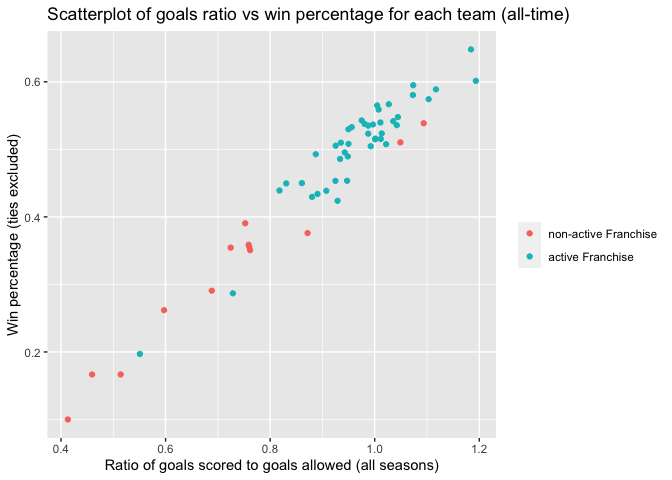
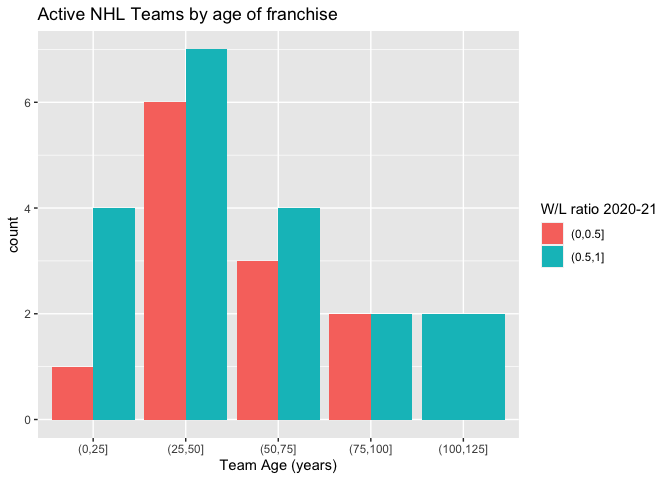
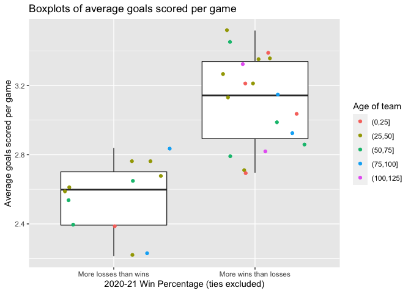
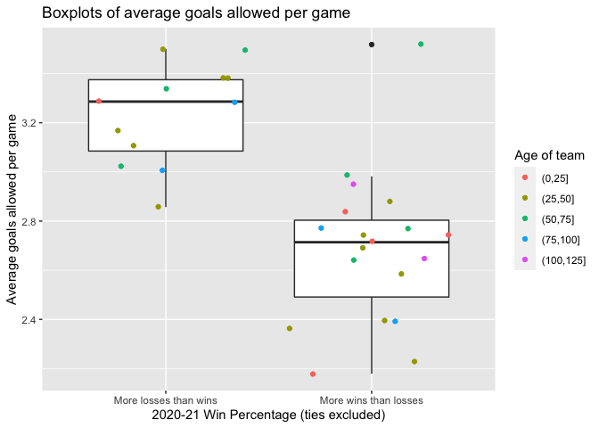
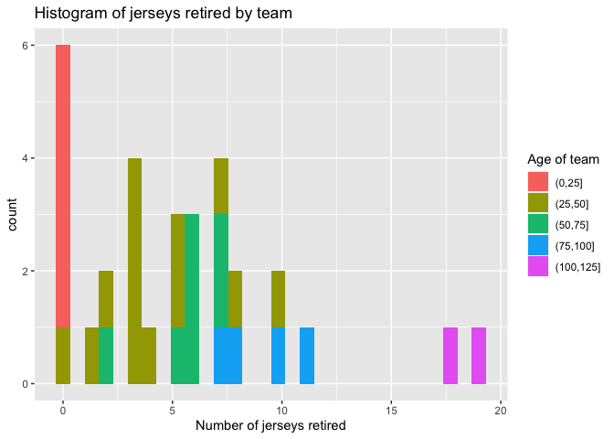
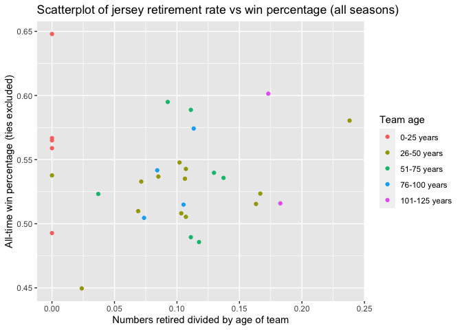

ST558 Project 1
================
David Arthur
6/14/2021

-   [Function to get Team ID when name is
    input](#function-to-get-team-id-when-name-is-input)
    -   [Records API functions](#records-api-functions)
    -   [Wrapper function](#wrapper-function)
    -   [EDA](#eda)

# Function to get Team ID when name is input

``` r
franchiseInfo <- GET("https://records.nhl.com/site/api/franchise") %>% 
  content("text") %>% 
  fromJSON(flatten = TRUE)

teamNameIdMatch <- franchiseInfo$data %>% select(id, mostRecentTeamId, fullName)

getTeamId <- function(team){
  Id <- teamNameIdMatch %>% filter(str_detect(fullName, team)) %>%
    select(id)
  if (nrow(Id) == 1){
    return(as.numeric(Id))
  } else {
    stop("try again entering team name or ID")
  }
}
```

## Records API functions

``` r
recordsBaseURL <- "https://records.nhl.com/site/api"

replaceStrHTML <- function(x){
  for(i in 1:length(x)){
    if(!is.na(x[i])){
      x[i] <- x[i] %>%
        read_xml(as_html = TRUE) %>%
        xml_text() %>%
        str_replace_all(c("\r\n\t" = ";  ", "\r\n" = ""))
    }
  }
return(x)
}

getFranchiseInfo <- function(team = NULL){
  if(is.null(team)){
    fullURL <- paste0(recordsBaseURL, "/franchise")
    franchiseInfo <- GET(fullURL) %>%
      content("text") %>%
      fromJSON(flatten = TRUE)
  } else{
    if(!is.numeric(team)){team <- getTeamId(team)}
    fullURL <- paste0(recordsBaseURL, "/franchise?cayenneExp=id=", team)
    franchiseInfo <- GET(fullURL) %>%
      content("text") %>%
      fromJSON(flatten = TRUE)
  }
  return(as_tibble(franchiseInfo$data))
}

getTeamTotals <- function(team = NULL){
  if(is.null(team)){
    fullURL <- paste0(recordsBaseURL, "/franchise-team-totals")
    teamTotals <- GET(fullURL) %>%
      content("text") %>%
      fromJSON(flatten = TRUE)
  } else{
    if(!is.numeric(team)){team <- getTeamId(team)}
    fullURL <- paste0(recordsBaseURL, "/franchise-team-totals?cayenneExp=franchiseId=", team)
    teamTotals <- GET(fullURL) %>%
      content("text") %>%
      fromJSON(flatten = TRUE)
  }
  teamTotals <- teamTotals$data %>% relocate(teamId, teamName) %>%
    convert(fct(activeFranchise))
  return(as_tibble(teamTotals))
}

getSeasonRecords <- function(team = NULL){
  if(is.null(team)){
    fullURL <- paste0(recordsBaseURL, "/franchise-season-records")
    seasonRecords <- GET(fullURL) %>%
      content("text") %>%
      fromJSON(flatten = TRUE)
  } else{
  if(!is.numeric(team)){team <- getTeamId(team)}
  fullURL <- paste0(recordsBaseURL, "/franchise-season-records?cayenneExp=franchiseId=", team)
  seasonRecords <- GET(fullURL) %>% content("text") %>% fromJSON(flatten = TRUE)
  }
  seasonRecords <- seasonRecords$data %>%
    relocate(starts_with("franchise"), .after = id)
  return(as_tibble(seasonRecords))
}

getGoalieRecords <- function(team = NULL){
  if(is.null(team)){
    fullURL <- paste0(recordsBaseURL, "/franchise-goalie-records")
    goalieRecords <- GET(fullURL) %>%
      content("text") %>%
      fromJSON(flatten = TRUE)
  } else{
  if(!is.numeric(team)){team <- getTeamId(team)}
  fullURL <- paste0(recordsBaseURL, "/franchise-goalie-records?cayenneExp=franchiseId=", team)
  goalieRecords <- GET(fullURL) %>% content("text") %>% fromJSON(flatten = TRUE)
  }
  goalieRecords <- goalieRecords$data %>%
    relocate(firstName, lastName)
  return(as_tibble(goalieRecords))
}

getSkaterRecords<- function(team = NULL){
  if(is.null(team)){
    fullURL <- paste0(recordsBaseURL, "/franchise-skater-records")
    skaterRecords <- GET(fullURL) %>%
      content("text") %>%
      fromJSON(flatten = TRUE)
  } else{
  if(!is.numeric(team)){team <- getTeamId(team)}
  fullURL <- paste0(recordsBaseURL, "/franchise-skater-records?cayenneExp=franchiseId=", team)
  skaterRecords <- GET(fullURL) %>% content("text") %>% fromJSON(flatten = TRUE)
  }
  skaterRecords <- skaterRecords$data %>%
    relocate(firstName, lastName)
  return(as_tibble(skaterRecords))
}

getFranchiseDetail <- function(team = NULL){
  if(is.null(team)){
    fullURL <- paste0(recordsBaseURL, "/franchise-detail")
    franchiseDetail <- GET(fullURL) %>%
      content("text") %>%
      fromJSON(flatten = TRUE)
  } else{
  if(!is.numeric(team)){team <- getTeamId(team)}
  fullURL <- paste0(recordsBaseURL, "/franchise-detail?cayenneExp=id=", team)
  franchiseDetail <- GET(fullURL) %>% content("text") %>% fromJSON(flatten = TRUE)
  }
  columnsHTML <- c("captainHistory", "coachingHistory", "generalManagerHistory", "retiredNumbersSummary")
  for(i in columnsHTML){
    franchiseDetail$data[, i] <- replaceStrHTML(franchiseDetail$data[, i])
  }
  franchiseDetail <- franchiseDetail$data %>%
    mutate(heroImageUrl = str_replace(heroImageUrl, " ", "%20")) %>%
    relocate(teamFullName) %>%
    mutate(dateAwarded = ymd(str_split(dateAwarded, "T", simplify = TRUE)[ ,1]))
  return(as_tibble(franchiseDetail))
}


detail <- getFranchiseDetail()
detail
```

    ## # A tibble: 39 x 13
    ##    teamFullName     id active captainHistory   coachingHistory   dateAwarded directoryUrl
    ##    <chr>         <int> <lgl>  <chr>            <chr>             <date>      <chr>       
    ##  1 Montréal Can…     1 TRUE   Shea Weber: 201… Dominique Duchar… 1917-11-26  https://www…
    ##  2 Montreal Wan…     2 FALSE  <NA>             <NA>              1917-11-26  <NA>        
    ##  3 St. Louis Ea…     3 FALSE  <NA>             <NA>              1917-11-26  <NA>        
    ##  4 Hamilton Tig…     4 FALSE  <NA>             <NA>              1917-11-26  <NA>        
    ##  5 Toronto Mapl…     5 TRUE   John Tavares: 2… Sheldon Keefe: N… 1917-11-26  https://www…
    ##  6 Boston Bruins     6 TRUE   Patrice Bergero… Bruce Cassidy: F… 1924-11-01  https://www…
    ##  7 Montreal Mar…     7 FALSE  <NA>             <NA>              1924-11-01  <NA>        
    ##  8 Brooklyn Ame…     8 FALSE  <NA>             <NA>              1925-09-22  <NA>        
    ##  9 Philadelphia…     9 FALSE  <NA>             <NA>              1925-11-07  <NA>        
    ## 10 New York Ran…    10 TRUE   (No Captain): 2… Gerard Gallant: … 1926-05-15  https://www…
    ## # … with 29 more rows, and 6 more variables: firstSeasonId <int>,
    ## #   generalManagerHistory <chr>, heroImageUrl <chr>, mostRecentTeamId <int>,
    ## #   retiredNumbersSummary <chr>, teamAbbrev <chr>

``` r
franchise <- getFranchiseInfo()
totals <- getTeamTotals()
records <- getSeasonRecords()
# getSeasonRecords("Carolina")
goalie <- getGoalieRecords()
# getGoalieRecords("Hurricanes")
skater <- getSkaterRecords()
# getSkaterRecords(26)
kable(detail)
```

| teamFullName          |  id | active | captainHistory                                                                                                                                                                                                                                                                                                                                                                                                                                                                                                                                                                                                                                                                                                                                                                                                                                                                                                                                                                                                                                                                                                                                                                                                                                                                                                                                                                     | coachingHistory                                                                                                                                                                                                                                                                                                                                                                                                                                                                                                                                                                                                                                                                                                                                                                                                                                                                                                                                                                                                                                                                                                                                                                                                                                                                                                                                                                                                                                                                                                                                                                                                                                                                                                                                                                                                                                                                                                                                                                                                                                                                                                                                                                                                                           | dateAwarded | directoryUrl                                            | firstSeasonId | generalManagerHistory                                                                                                                                                                                                                                                                                                                                                                                                                                                                                                                                                                                                                                                                                                                                                                                                                                                                                                                                                                                                                                           | heroImageUrl                                                                                            | mostRecentTeamId | retiredNumbersSummary                                                                                                                                                                                                                                                                                                                                                                                                                                                                                                                                                                                               | teamAbbrev |
|:----------------------|----:|:-------|:-----------------------------------------------------------------------------------------------------------------------------------------------------------------------------------------------------------------------------------------------------------------------------------------------------------------------------------------------------------------------------------------------------------------------------------------------------------------------------------------------------------------------------------------------------------------------------------------------------------------------------------------------------------------------------------------------------------------------------------------------------------------------------------------------------------------------------------------------------------------------------------------------------------------------------------------------------------------------------------------------------------------------------------------------------------------------------------------------------------------------------------------------------------------------------------------------------------------------------------------------------------------------------------------------------------------------------------------------------------------------------------|:------------------------------------------------------------------------------------------------------------------------------------------------------------------------------------------------------------------------------------------------------------------------------------------------------------------------------------------------------------------------------------------------------------------------------------------------------------------------------------------------------------------------------------------------------------------------------------------------------------------------------------------------------------------------------------------------------------------------------------------------------------------------------------------------------------------------------------------------------------------------------------------------------------------------------------------------------------------------------------------------------------------------------------------------------------------------------------------------------------------------------------------------------------------------------------------------------------------------------------------------------------------------------------------------------------------------------------------------------------------------------------------------------------------------------------------------------------------------------------------------------------------------------------------------------------------------------------------------------------------------------------------------------------------------------------------------------------------------------------------------------------------------------------------------------------------------------------------------------------------------------------------------------------------------------------------------------------------------------------------------------------------------------------------------------------------------------------------------------------------------------------------------------------------------------------------------------------------------------------------|:------------|:--------------------------------------------------------|--------------:|:----------------------------------------------------------------------------------------------------------------------------------------------------------------------------------------------------------------------------------------------------------------------------------------------------------------------------------------------------------------------------------------------------------------------------------------------------------------------------------------------------------------------------------------------------------------------------------------------------------------------------------------------------------------------------------------------------------------------------------------------------------------------------------------------------------------------------------------------------------------------------------------------------------------------------------------------------------------------------------------------------------------------------------------------------------------|:--------------------------------------------------------------------------------------------------------|-----------------:|:--------------------------------------------------------------------------------------------------------------------------------------------------------------------------------------------------------------------------------------------------------------------------------------------------------------------------------------------------------------------------------------------------------------------------------------------------------------------------------------------------------------------------------------------------------------------------------------------------------------------|:-----------|
| Montréal Canadiens    |   1 | TRUE   | Shea Weber: 2018-19 – Present; Max Pacioretty: 2015-16 – 2017-18; (No Captain): 2014-15; Brian Gionta: 2010-11 – 2013-14; (No Captain): 2009-10; Saku Koivu: 1999-00 – 2008-09; Vincent Damphousse: 1997-98 – 1998-99; Pierre Turgeon and Vincent Damphousse: 1996-97; Mike Keane and Pierre Turgeon: 1995-96; Kirk Muller and Mike Keane: 1994-95; Guy Carbonneau: 1990-91 – 1993-94; Guy Carbonneau and Chris Chelios: 1989-90; Bob Gainey: 1981-82 – 1988-89; Serge Savard: 1979-80 – 1980-81; Yvan Cournoyer and Serge Savard: 1978-79; Yvan Cournoyer: 1975-76 – 1977-78; Henri Richard: 1971-72 – 1974-75; Jean Beliveau: 1961-62 – 1970-71; Doug Harvey: 1960-61; Maurice Richard: 1956-57 – 1959-60; Butch Bouchard: 1948-49 – 1955-56; Toe Blake and Bill Durnan: 1947-48; Toe Blake: 1940-41 – 1946-47; Walt Buswell: 1939-40; Babe Siebert: 1936-37 – 1938-39; Sylvio Mantha: 1933-34 – 1935-36; George Hainsworth: 1932-33; Sylvio Mantha: 1926-27 – 1931-32; Bill Coutu: 1925-26; Sprague Cleghorn: 1922-23 – 1924-25; Newsy Lalonde: 1916-17 – 1921-22                                                                                                                                                                                                                                                                                                               | Dominique Ducharme: Feb. 25, 2021 – Present; Claude Julien: Feb. 18, 2017 – Feb. 23, 2021; Michel Therrien: Jan. 19, 2013 – Feb. 12, 2017; Randy Cunneyworth: Dec. 17, 2011 – April 7, 2012; Jacques Martin: Oct. 1, 2009 – Dec. 15, 2011; Bob Gainey: March 10 – April 22, 2009; Guy Carbonneau: Oct. 6, 2006 – March 8, 2009; Bob Gainey: Jan. 14 – May 2, 2006; Claude Julien: Jan. 18, 2003 – Jan. 11, 2006; Michel Therrien: Nov. 21, 2000 – Jan. 16, 2003; Alain Vigneault: Oct. 1, 1997 – Nov. 18, 2000; Mario Tremblay: Oct. 21, 1995 – April 26, 1997; Jacques Laperriere: Oct. 20, 1995; Jacques Demers: Oct. 6, 1992 – Oct. 14, 1995; Pat Burns: Oct. 6, 1988 – May 9, 1992; Jean Perron: Oct. 10, 1985 – April 26, 1988; Jacques Lemaire: Feb. 25, 1984 – May 2, 1985; Bob Berry: Oct. 8, 1981 – Feb. 23, 1984; Claude Ruel: Dec. 14, 1979 – April 11, 1981; Bernie Geoffrion: Oct. 11 – Dec. 11, 1979; Scotty Bowman: Oct. 9, 1971 – May 21, 1979; Al MacNeil: Dec. 3, 1970 – May 18, 1971; Claude Ruel: Oct. 12, 1968 – Dec. 2, 1970; Toe Blake: Oct. 6, 1955 – May 11, 1968; Dick Irvin: Nov. 3, 1940 – April 14, 1955; Pit Lepine: Nov. 5, 1939 – March 17, 1940; Jules Dugal: Jan. 29 – March 26, 1939^; Cecil Hart: Nov. 7, 1936 – Jan. 24, 1939; Sylvio Mantha: Nov. 12, 1935 – March 19, 1936; Leo Dandurand: Jan. 1 – March 26, 1935; Newsy Lalonde: Nov. 12, 1932 – Dec. 29, 1934; Cecil Hart: Nov. 16, 1926 – March 29, 1932; Leo Dandurand: Jan. 11, 1922 – March 16, 1926; Newsy Lalonde: Dec. 19, 1917 – Jan. 7, 1922; \* Date range indicates first and last games coached during tenure (regular season or playoffs); ^ The Canadiens named Babe Siebert head coach in the summer of 1939, but he died before the 1939-40 season began                                                                                                                                                                                                                                                                                                                                                                                                                                                                        | 1917-11-26  | <https://www.nhl.com/canadiens/team/administration>     |      19171918 | Marc Bergevin: May 2, 2012 – Present; Pierre Gauthier: Feb. 8, 2010 – March 29, 2012; Bob Gainey: June 2, 2003 – Feb. 8, 2010; Andre Savard: Nov. 20, 2000 – June 2, 2003; Rejean Houle: Oct. 21, 1995 – Nov. 20, 2000; Serge Savard: April 28, 1983 – Oct. 17, 1995; Irving Grundman: Sept. 4, 1978 – April 14, 1983; Sam Pollock: May 15, 1964 – Sept. 4, 1978; Frank Selke: July 26, 1946 – May 15, 1964; Tommy Gorman: April 8, 1940 – July 26, 1946; Jules Dugal: Jan. 27, 1939 – April 8, 1940; Cecil Hart: July 30, 1936 – Jan. 27, 1939; Ernest Savard: Sept. 17, 1935 – July 30, 1936; Leo Dandurand: Nov. 2, 1921 – Sept. 17, 1935; George Kennedy: 1910 – Oct. 19, 1921; \* Date range indicates first and last days of tenure                                                                                                                                                                                                                                                                                                                       | <https://records.nhl.com/site/asset/public/ext/hero/Team%20Pages/MTL/Price.jpg>                         |                8 | 1 – Jacques Plante (1952-63); 2 – Doug Harvey (1947-61); 3 – Butch Bouchard (1941-56); 4 – Jean Beliveau (1950-71); 5 – Bernie Geoffrion (1950-64); 5 – Guy Lapointe (1968-82); 7 – Howie Morenz (1923-37); 9 – Maurice Richard (1942-60); 10 – Guy Lafleur (1971-84); 12 – Dickie Moore (1951-63); 12 – Yvan Cournoyer (1963-79); 16 – Elmer Lach (1940-54); 16 – Henri Richard (1955-75); 18 – Serge Savard (1966-81); 19 – Larry Robinson (1972-89); 23 – Bob Gainey (1973-89); 29 – Ken Dryden (1970-79); 33 – Patrick Roy (1984-95)                                                                            | MTL        |
| Montreal Wanderers    |   2 | FALSE  | NA                                                                                                                                                                                                                                                                                                                                                                                                                                                                                                                                                                                                                                                                                                                                                                                                                                                                                                                                                                                                                                                                                                                                                                                                                                                                                                                                                                                 | NA                                                                                                                                                                                                                                                                                                                                                                                                                                                                                                                                                                                                                                                                                                                                                                                                                                                                                                                                                                                                                                                                                                                                                                                                                                                                                                                                                                                                                                                                                                                                                                                                                                                                                                                                                                                                                                                                                                                                                                                                                                                                                                                                                                                                                                        | 1917-11-26  | NA                                                      |      19171918 | NA                                                                                                                                                                                                                                                                                                                                                                                                                                                                                                                                                                                                                                                                                                                                                                                                                                                                                                                                                                                                                                                              | <https://records.nhl.com/site/asset/public/images/hero/teams/defunct-franchises/montreal-wanderers.jpg> |               41 | NA                                                                                                                                                                                                                                                                                                                                                                                                                                                                                                                                                                                                                  | MWN        |
| St. Louis Eagles      |   3 | FALSE  | NA                                                                                                                                                                                                                                                                                                                                                                                                                                                                                                                                                                                                                                                                                                                                                                                                                                                                                                                                                                                                                                                                                                                                                                                                                                                                                                                                                                                 | NA                                                                                                                                                                                                                                                                                                                                                                                                                                                                                                                                                                                                                                                                                                                                                                                                                                                                                                                                                                                                                                                                                                                                                                                                                                                                                                                                                                                                                                                                                                                                                                                                                                                                                                                                                                                                                                                                                                                                                                                                                                                                                                                                                                                                                                        | 1917-11-26  | NA                                                      |      19171918 | NA                                                                                                                                                                                                                                                                                                                                                                                                                                                                                                                                                                                                                                                                                                                                                                                                                                                                                                                                                                                                                                                              | <https://records.nhl.com/site/asset/public/ext/hero/Team%20Pages/1927SEN.JPG>                           |               45 | NA                                                                                                                                                                                                                                                                                                                                                                                                                                                                                                                                                                                                                  | SLE        |
| Hamilton Tigers       |   4 | FALSE  | NA                                                                                                                                                                                                                                                                                                                                                                                                                                                                                                                                                                                                                                                                                                                                                                                                                                                                                                                                                                                                                                                                                                                                                                                                                                                                                                                                                                                 | NA                                                                                                                                                                                                                                                                                                                                                                                                                                                                                                                                                                                                                                                                                                                                                                                                                                                                                                                                                                                                                                                                                                                                                                                                                                                                                                                                                                                                                                                                                                                                                                                                                                                                                                                                                                                                                                                                                                                                                                                                                                                                                                                                                                                                                                        | 1917-11-26  | NA                                                      |      19191920 | NA                                                                                                                                                                                                                                                                                                                                                                                                                                                                                                                                                                                                                                                                                                                                                                                                                                                                                                                                                                                                                                                              | <https://records.nhl.com/site/asset/public/images/hero/teams/defunct-franchises/hamilton-tigers.jpg>    |               37 | NA                                                                                                                                                                                                                                                                                                                                                                                                                                                                                                                                                                                                                  | HAM        |
| Toronto Maple Leafs   |   5 | TRUE   | John Tavares: 2019-20 – Present; (No Captain): 2016-17 – 2018-19; Dion Phaneuf and (No Captain): 2015-16; Dion Phaneuf: 2010-11 – 2014-15; (No Captain): 2008-09 – 2009-10; Mats Sundin: 1997-98 – 2007-08; Doug Gilmour: 1994-95 – 1996-97; Wendel Clark: 1991-92 – 1993-94; Rob Ramage: 1989-90 – 1990-91; (No Captain): 1986-87 – 1988-89; Rick Vaive: 1981-82 – 1985-86; Darryl Sittler: 1975-76 – 1980-81; Dave Keon: 1969-70 – 1974-75; George Armstrong: 1957-58 – 1968-69; Jimmy Thomson and Ted Kennedy: 1956-57; Sid Smith: 1955-56; Ted Kennedy: 1948-49 – 1954-55; Syl Apps: 1945-46 – 1947-48; Bob Davidson: 1943-44 – 1944-45; Syl Apps: 1940-41 – 1942-43; Red Horner: 1938-39 – 1939-40; Charlie Conacher: 1937-38; Hap Day: 1927-28 – 1936-37; Bert Corbeau: 1926-27; Babe Dye: 1925-26; John Ross Roach: 1924-25; Jack Adams: 1923-24; Reg Noble and Jack Adams: 1922-23; Reg Noble: 1920-21 – 1921-22; Frank Heffernan: 1919-20; Ken Randall: 1917-18 – 1918-19                                                                                                                                                                                                                                                                                                                                                                                                 | Sheldon Keefe: Nov. 21, 2019 – Present; Mike Babcock: Oct. 7, 2015 – Nov. 19, 2019; Peter Horachek: Jan. 7 – April 11, 2015; Randy Carlyle: March 3, 2012 – Jan. 3, 2015; Ron Wilson: Oct. 9, 2008 – Feb. 29, 2012; Paul Maurice: Oct. 4, 2006 – April 5, 2008; Pat Quinn: Oct. 10, 1998 – April 18, 2006; Mike Murphy: Oct. 5, 1996 – April 19, 1998; Nick Beverley: March 6 – April 27, 1996; Pat Burns: Oct. 7, 1992 – March 3, 1996; Tom Watt: Oct. 27, 1990 – April 15, 1992; Doug Carpenter: Oct. 5, 1989 – Oct. 25, 1990; George Armstrong: Dec. 19, 1988 – April 2, 1989; John Brophy: Oct. 9, 1986 – Dec. 17, 1988; Dan Maloney: Oct. 11, 1984 – April 30, 1986; Mike Nykoluk: Jan. 10, 1981 – April 1, 1984; Joe Crozier: Oct. 11, 1980 – Jan. 7, 1981; Punch Imlach: March 19 – April 11, 1980; Dick Duff: March 15-17, 1980; Floyd Smith: Oct. 10, 1979 – March 12, 1980; Roger Neilson: Oct. 13, 1977 – April 22, 1979; Red Kelly: Oct. 10, 1973 – April 21, 1977; John McLellan: Oct. 11, 1969 – April 1, 1973; Punch Imlach: Nov. 29, 1958 – April 6, 1969; Billy Reay: Oct. 8, 1957 – Nov. 27, 1958; Howie Meeker: Oct. 11, 1956 – March 24, 1957; King Clancy: Oct. 10, 1953 – March 29, 1956; Joe Primeau: Oct. 14, 1950 – March 22, 1953; Hap Day: Nov. 2, 1940 – April 9, 1950; Dick Irvin: Dec. 1, 1931 – April 13, 1940; Conn Smythe: Nov. 28, 1931; Art Duncan: Nov. 18, 1930 – Nov. 26, 1931; Conn Smythe: Nov. 15, 1927 – Nov. 15, 1930; Alex Romeril: Feb. 17 – March 26, 1927; Mike Rodden: Feb. 12-15, 1927; Charles Querrie: Nov. 17, 1926 – Feb. 10, 1927; Eddie Powers: Nov. 29, 1924 – March 17, 1926; Charles Querrie: Jan. 3, 1923 – March 5, 1924; George O’Donoghue: Dec. 17, 1921 – Dec. 30, 1922; Frank Carroll: Dec. 22, 1920 – March 14, 1921; Harvey Sproule: Feb. 4 – March 13, 1920; Frank Heffernan: Dec. 23, 1919 – Jan. 31, 1920; Dick Carroll: Dec. 19, 1917 – Feb. 20, 1919; \* Date range indicates first and last games coached during tenure (regular season or playoffs)                                                                                                                                                                                                              | 1917-11-26  | <https://www.nhl.com/mapleleafs/team/management>        |      19171918 | Kyle Dubas: May 11, 2018 – Present; Lou Lamoriello: July 23, 2015 – April 30, 2018; Dave Nonis: Jan. 9, 2013 – April 12, 2015; Brian Burke: Nov. 29, 2008 – Jan. 9, 2013; Cliff Fletcher: Jan. 22 – Nov. 29, 2008; John Ferguson Jr.: Aug. 29, 2003 – Jan. 22, 2008; Pat Quinn: July 15, 1999 – Aug. 29, 2003; Ken Dryden: Aug. 21, 1997 – July 15, 1999; Bill Watters: May 25 – Aug. 21, 1997; Cliff Fletcher: July 1, 1991 – May 25, 1997; Floyd Smith: Aug. 15, 1989 – July 1, 1991; Gord Stellick: April 28, 1988 – Aug. 11, 1989; John Brophy, Dick Duff and Gord Stellick: Feb. 7 – April 28, 1988; Gerry McNamara: Oct. 26, 1981 – Feb. 7, 1988; Punch Imlach: July 4, 1979 – Oct. 26, 1981; Jim Gregory: April 6, 1969 – July 4, 1979; Punch Imlach: Nov. 21, 1958 – April 6, 1969; Stafford Smythe: Oct. 3, 1957 – Nov. 21, 1958; Howie Meeker: May 13 – Oct. 3, 1957; Hap Day: Oct. 8, 1954 – March 25, 1957; Conn Smythe: Nov. 15, 1927 – Oct. 8, 1954; Charles Querrie: 1917 – Feb. 14, 1927; \* Date range indicates first and last days of tenure | <https://records.nhl.com/site/asset/public/ext/hero/Team%20Pages/TOR/MatthewsMarner.jpg>                |               10 | 1 – Turk Broda (1936-43, 1945-52); 1 – Johnny Bower (1958-70); 4 – Hap Day (1926-37); 4 – Red Kelly (1959-67); 5 – Bill Barilko (1946-51); 6 – Ace Bailey (1926-34); 7 – King Clancy (1930-37); 7 – Tim Horton (1949-50, 1951-70); 9 – Charlie Conacher (1929-38); 9 – Ted Kennedy (1942-55, 1956-57); 10 – Syl Apps (1936-43, 1945-48); 10 – George Armstrong (1949-50, 1951-71); 13 – Mats Sundin (1994-08); 14 – Dave Keon (1960-75); 17 – Wendel Clark (1985-94, 1996-98, 2000); 21 – Borje Salming (1973-89); 27 – Frank Mahovlich (1956-68); 27 – Darryl Sittler (1970-82); 93 – Doug Gilmour (1992-97, 2003) | TOR        |
| Boston Bruins         |   6 | TRUE   | Patrice Bergeron: 2020-21 – Present; Zdeno Chara: 2006-07 – 2019-20; Joe Thornton and (No Captain): 2005-06; Joe Thornton: 2002-03 – 2004-05; (No Captain): 2001-02; Jason Allison: 2000-01; Ray Bourque: 1988-89 – 1999-00; Ray Bourque and Rick Middleton (Co-Captains): 1985-86 – 1987-88; Terry O’Reilly: 1983-84 – 1984-85; Wayne Cashman: 1977-78 – 1982-83; Johnny Bucyk: 1973-74 – 1976-77; (No Captain): 1967-68 – 1972-73; Johnny Bucyk: 1966-67; Leo Boivin: 1963-64 – 1965-66; Don McKenney: 1961-62 – 1962-63; Fern Flaman: 1955-56 – 1960-61; Milt Schmidt and Ed Sanford: 1954-55; Milt Schmidt: 1950-51 – 1953-54; John Crawford: 1947-48 – 1949-50; Dit Clapper and John Crawford: 1946-47; Dit Clapper: 1939-40 – 1945-46; Cooney Weiland: 1938-39; Dit Clapper: 1932-33 – 1937-38; George Owen: 1931-32; Lionel Hitchman: 1927-28 – 1930-31; Sprague Cleghorn: 1925-26 – 1926-27; (No Captain): 1924-25                                                                                                                                                                                                                                                                                                                                                                                                                                                         | Bruce Cassidy: Feb. 9, 2017 – Present; Claude Julien: Oct. 5, 2007 – Feb. 4, 2017; Dave Lewis: Oct. 6, 2006 – April 7, 2007; Mike Sullivan: Oct. 8, 2003 – April 15, 2006; Mike O’Connell: March 21 – April 17, 2003; Robbie Ftorek: Oct. 4, 2001 – March 18, 2003; Mike Keenan: Oct. 26, 2000 – April 7, 2001; Pat Burns: Oct. 2, 1997 – Oct. 20, 2000; Steve Kasper: Oct. 7, 1995 – April 13, 1997; Brian Sutter: Oct. 8, 1992 – May 14, 1995; Rick Bowness: Oct. 3, 1991 – May 23, 1992; Mike Milbury: Oct. 5, 1989 – May 11, 1991; Terry O’Reilly: Nov. 8, 1986 – April 25, 1989; Butch Goring: Oct. 10, 1985 – Nov. 5, 1986; Harry Sinden: Feb. 14 – April 16, 1985; Gerry Cheevers: Oct. 9, 1980 – Feb. 10, 1985; Harry Sinden: March 22 – April 22, 1980; Fred Creighton: Oct. 11, 1979 – March 19, 1980; Don Cherry: Oct. 10, 1974 – May 10, 1979; Bep Guidolin: Feb. 7, 1973 – May 19, 1974; Tom Johnson: Oct. 11, 1970 - Feb. 4, 1973; Harry Sinden: Oct. 19, 1966 – May 10, 1970; Milt Schmidt: Nov. 21, 1962 – April 3, 1966; Phil Watson: Oct. 11, 1961 – Nov. 18, 1962; Milt Schmidt: Dec. 25, 1954 – March 19, 1961; Lynn Patrick: Oct. 14, 1950 – Dec. 19, 1954; George Boucher: Oct. 12, 1949 – March 26, 1950; Dit Clapper: Oct. 24, 1945 – March 30, 1949; Art Ross: Nov. 8, 1941 – April 3, 1945; Cooney Weiland: Nov. 4, 1939 – April 12, 1941; Art Ross: Nov. 7, 1936 – April 16, 1939; Frank Patrick: Nov. 8, 1934 – March 26, 1936; Art Ross: Dec. 1, 1924 – March 18, 1934; \* Date range indicates first and last games coached during tenure (regular season or playoffs)                                                                                                                                                                                                                                                                                                                                                                                                                                                                                                                                                                                                                                      | 1924-11-01  | <https://www.nhl.com/bruins/team/club-directory>        |      19241925 | Don Sweeney: May 20, 2015 – Present; Peter Chiarelli: May 26, 2006 – April 15, 2015; Jeff Gorton: March 25 – May 26, 2006; Mike O’Connell: Nov. 1, 2000 – March 25, 2006; Harry Sinden: Oct. 5, 1972 – Nov. 1, 2000; Milt Schmidt: May 1, 1967 – Oct. 5, 1972; Hap Emms: April 5, 1965 – May 1, 1967; Lynn Patrick: April 1, 1954 – April 5, 1965; Art Ross: Nov. 1, 1924 – April 1, 1954; \* Date range indicates first and last days of tenure                                                                                                                                                                                                                                                                                                                                                                                                                                                                                                                                                                                                                | <https://records.nhl.com/site/asset/public/ext/hero/Team%20Pages/BOS/BergeronPastrnak.jpg>              |                6 | 2 – Eddie Shore (1926-40); 3 – Lionel Hitchman (1925-34); 4 – Bobby Orr (1966-76); 5 – Dit Clapper (1927-47); 7 – Phil Esposito (1967-75); 8 – Cam Neely (1986-96); 9 – Johnny Bucyk (1957-78); 15 – Milt Schmidt (1936-55); 16 – Rick Middleton (1976-88); 24 – Terry O’Reilly (1971-85); 77 – Ray Bourque (1979-00)                                                                                                                                                                                                                                                                                               | BOS        |
| Montreal Maroons      |   7 | FALSE  | NA                                                                                                                                                                                                                                                                                                                                                                                                                                                                                                                                                                                                                                                                                                                                                                                                                                                                                                                                                                                                                                                                                                                                                                                                                                                                                                                                                                                 | NA                                                                                                                                                                                                                                                                                                                                                                                                                                                                                                                                                                                                                                                                                                                                                                                                                                                                                                                                                                                                                                                                                                                                                                                                                                                                                                                                                                                                                                                                                                                                                                                                                                                                                                                                                                                                                                                                                                                                                                                                                                                                                                                                                                                                                                        | 1924-11-01  | NA                                                      |      19241925 | NA                                                                                                                                                                                                                                                                                                                                                                                                                                                                                                                                                                                                                                                                                                                                                                                                                                                                                                                                                                                                                                                              | <https://records.nhl.com/site/asset/public/images/hero/teams/defunct-franchises/montreal-maroons.jpg>   |               43 | NA                                                                                                                                                                                                                                                                                                                                                                                                                                                                                                                                                                                                                  | MMR        |
| Brooklyn Americans    |   8 | FALSE  | NA                                                                                                                                                                                                                                                                                                                                                                                                                                                                                                                                                                                                                                                                                                                                                                                                                                                                                                                                                                                                                                                                                                                                                                                                                                                                                                                                                                                 | NA                                                                                                                                                                                                                                                                                                                                                                                                                                                                                                                                                                                                                                                                                                                                                                                                                                                                                                                                                                                                                                                                                                                                                                                                                                                                                                                                                                                                                                                                                                                                                                                                                                                                                                                                                                                                                                                                                                                                                                                                                                                                                                                                                                                                                                        | 1925-09-22  | NA                                                      |      19251926 | NA                                                                                                                                                                                                                                                                                                                                                                                                                                                                                                                                                                                                                                                                                                                                                                                                                                                                                                                                                                                                                                                              | <https://records.nhl.com/site/asset/public/ext/hero/Team%20Pages/NYAmericans.jpg>                       |               51 | NA                                                                                                                                                                                                                                                                                                                                                                                                                                                                                                                                                                                                                  | BRK        |
| Philadelphia Quakers  |   9 | FALSE  | NA                                                                                                                                                                                                                                                                                                                                                                                                                                                                                                                                                                                                                                                                                                                                                                                                                                                                                                                                                                                                                                                                                                                                                                                                                                                                                                                                                                                 | NA                                                                                                                                                                                                                                                                                                                                                                                                                                                                                                                                                                                                                                                                                                                                                                                                                                                                                                                                                                                                                                                                                                                                                                                                                                                                                                                                                                                                                                                                                                                                                                                                                                                                                                                                                                                                                                                                                                                                                                                                                                                                                                                                                                                                                                        | 1925-11-07  | NA                                                      |      19251926 | NA                                                                                                                                                                                                                                                                                                                                                                                                                                                                                                                                                                                                                                                                                                                                                                                                                                                                                                                                                                                                                                                              | <https://records.nhl.com/site/asset/public/images/hero/teams/defunct-franchises/pittsburgh-pirates.jpg> |               39 | NA                                                                                                                                                                                                                                                                                                                                                                                                                                                                                                                                                                                                                  | QUA        |
| New York Rangers      |  10 | TRUE   | (No Captain): 2018-19 – Present; Ryan McDonagh and (No Captain): 2017-18; Ryan McDonagh: 2014-15 – 2016-17; Ryan Callahan and (No Captain): 2013-14; Ryan Callahan: 2011-12 – 2012-13; Chris Drury: 2008-09 – 2010-11; Jaromir Jagr: 2006-07 – 2007-08; (No Captain): 2005-06; Mark Messier: 2000-01 – 2003-04; Brian Leetch: 1997-98 – 1999-00; Mark Messier: 1991-92 – 1996-97; Kelly Kisio: 1988-89 – 1990-91; Ron Greschner and Kelly Kisio: 1987-88; Ron Greschner: 1986-87; Barry Beck: 1981-82 – 1985-86; Dave Maloney, Walt Tkaczuk and Barry Beck: 1980-81; Dave Maloney: 1978-79 – 1979-80; Phil Esposito: 1976-77 – 1977-78; Brad Park and Phil Esposito: 1975-76; Brad Park: 1974-75; Vic Hadfield: 1971-72 – 1973-74; Bob Nevin: 1965-66 – 1970-71; Camille Henry and Bob Nevin: 1964-65; Andy Bathgate and Camille Henry: 1963-64; Andy Bathgate: 1961-62 – 1962-63; Red Sullivan: 1957-58 – 1960-61; Harry Howell: 1955-56 – 1956-57; Don Raleigh: 1954-55; Allan Stanley and Don Raleigh: 1953-54; Allan Stanley: 1952-53; Frank Eddolls and Allan Stanley: 1951-52; Frank Eddolls: 1950-51; Buddy O’Connor: 1949-50; Neil Colville: 1945-46 – 1948-49; Ott Heller: 1942-43 – 1944-45; Art Coulter: 1937-38 – 1941-42; Bill Cook: 1926-27 – 1936-37                                                                                                                | Gerard Gallant: Present; David Quinn: Oct. 4, 2018 – May 8, 2021; Alain Vigneault: Oct. 3, 2013 – April 7, 2018; John Tortorella: Feb. 25, 2009 – May 25, 2013; Tom Renney: Feb. 26, 2004 – Feb. 22, 2009; Glen Sather: Jan. 30, 2003 – Feb. 23, 2004; Bryan Trottier: Oct. 9, 2002 – Jan. 28, 2003; Ron Low: Oct. 7, 2000 – April 13, 2002; John Tortorella: April 1-9, 2000; John Muckler: Feb. 26, 1998 – March 27, 2000; Colin Campbell: Jan. 20, 1995 – Feb. 7, 1998; Mike Keenan: Oct. 5, 1993 – June 14, 1994; Ron Smith: Jan. 4 – April 16, 1993; Roger Neilson: Oct. 6, 1989 – Jan. 2, 1993; Phil Esposito: April 1-9, 1989; Michel Bergeron: Oct. 8, 1987 – March 29, 1989; Phil Esposito: Jan. 26 – April 16, 1987; Tom Webster: Jan. 19-23, 1987; Phil Esposito: Jan. 14, 1987; Tom Webster: Jan. 5-12, 1987; Phil Esposito: Dec. 21, 1986 – Jan. 3, 1987; Tom Webster: Nov. 29 – Dec. 20, 1986; Phil Esposito: Nov. 21-26, 1986; Ted Sator: Oct. 10, 1985 – Nov. 19, 1986; Craig Patrick: Jan. 24 – April 13, 1985; Herb Brooks: Oct. 6, 1981 – Jan. 19, 1985; Craig Patrick: Nov. 22, 1980 – May 5, 1981; Fred Shero: Oct. 12, 1978 – Nov. 19, 1980; Jean-Guy Talbot: Oct. 12, 1977 – April 15, 1978; John Ferguson Sr.: Jan. 10, 1976 – April 3, 1977; Ron Stewart: Oct. 8, 1975 – Jan. 6, 1976; Emile Francis: Jan. 12, 1974 – April 11, 1975; Larry Popein: Oct. 10, 1973 – Jan. 10, 1974; Emile Francis: Jan. 18, 1969 – April 24, 1973; Bernie Geoffrion: Oct. 13, 1968 – Jan. 17, 1969; Emile Francis: Dec. 8, 1965 – April 16, 1968; Red Sullivan: Dec. 30, 1962 – Dec. 5, 1965; Muzz Patrick: Oct. 11 – Dec. 27, 1962; Doug Harvey: Oct. 11, 1961 – April 7, 1962; Alf Pike: Nov. 18, 1959 – March 19, 1961; Muzz Patrick: Nov. 14-15, 1959; Phil Watson: Oct. 7, 1955 – Nov. 11, 1959; Muzz Patrick: Jan. 13, 1954 – March 20, 1955; Frank Boucher: Oct. 8, 1953 – Jan. 10, 1954; Bill Cook: Dec. 9, 1951 – March 22, 1953; Neil Colville: Oct. 11, 1950 – Dec. 5, 1951; Lynn Patrick: Dec. 23, 1948 – April 23, 1950; Frank Boucher: Nov. 5, 1939 – Dec. 19, 1948; Lester Patrick: Nov. 16, 1926 – April 2, 1939; \* Date range indicates first and last games coached during tenure (regular season or playoffs) | 1926-05-15  | <https://www.nhl.com/rangers/team/front-office>         |      19261927 | Chris Drury: May 5, 2021 – Present; Jeff Gorton: July 1, 2015 – May 5, 2021; Glen Sather: June 1, 2000 – July 1, 2015; Neil Smith: July 17, 1989 – March 28, 2000; Phil Esposito: July 14, 1986 – May 24, 1989; Craig Patrick: Nov. 21, 1980 – July 14, 1986; Fred Shero: June 2, 1978 – Nov. 21, 1980; John Ferguson Sr.: Jan. 7, 1976 – June 2, 1978; Emile Francis: Oct. 30, 1964 – Jan. 6, 1976; Muzz Patrick: April 22, 1955 – Oct. 30, 1964; Frank Boucher: Feb. 21, 1946 – April 22, 1955; Lester Patrick: Oct. 27, 1926 – Feb. 21, 1946^; \* Date range indicates first and last days of tenure; ^ The Rangers hired Conn Smythe as their first GM, but he left the team before the start of their inaugural season                                                                                                                                                                                                                                                                                                                                     | <https://records.nhl.com/site/asset/public/ext/hero/Team%20Pages/NYR/PanarinZibanejad.jpg>              |                3 | 1 – Ed Giacomin (1965-75); 2 – Brian Leetch (1987-04); 3 – Harry Howell (1952-69); 7 – Rod Gilbert (1960-77); 9 – Andy Bathgate (1952-64); 9 – Adam Graves (1991-01); 11 – Vic Hadfield (1961-74); 11 – Mark Messier (1991-97, 2000-04); 19 – Jean Ratelle (1960-76); 35 – Mike Richter (1989-03)                                                                                                                                                                                                                                                                                                                   | NYR        |
| Chicago Blackhawks    |  11 | TRUE   | Jonathan Toews: 2008-09 – Present; (No Captain): 2007-08; Adrian Aucoin and Martin Lapointe: 2005-06 – 2006-07; Alexei Zhamnov: 2002-03 – 2003-04; Tony Amonte: 2000-01 – 2001-02; Doug Gilmour: 1999-00; Chris Chelios: 1995-96 – 1998-99; Dirk Graham: 1989-90 – 1994-95; Denis Savard and Dirk Graham: 1988-89; (No Captain): 1987-88; Darryl Sutter: 1986-87; Darryl Sutter and Bob Murray: 1985-86; Darryl Sutter: 1982-83 – 1984-85; Terry Ruskowski: 1980-81 – 1981-82; Keith Magnuson and Terry Ruskowski: 1979-80; Keith Magnuson: 1977-78 – 1978-79; Stan Mikita, Pit Martin and Keith Magnuson: 1976-77; Stan Mikita and Pit Martin: 1975-76; (No Captain): 1970-71 – 1974-75; Pat Stapleton: 1969-70; (No Captain): 1968-69; Pierre Pilote: 1961-62 – 1967-68; Ed Litzenberger: 1958-59 – 1960-61; (No Captain): 1957-58; Gus Mortson: 1954-55 – 1956-57; Bill Gadsby: 1952-53 – 1953-54; Jack Stewart: 1950-51 – 1951-52; Doug Bentley: 1949-50; Gaye Stewart: 1948-49; John Mariucci: 1947-48; Red Hamill: 1946-47; John Mariucci: 1945-46; Clint Smith: 1944-45; Doug Bentley: 1942-43 – 1943-44; Earl Seibert: 1940-41 – 1941-42; Johnny Gottselig: 1935-36 – 1939-40; (No Captain): 1934-35; Charlie Gardiner: 1933-34; Helge Bostrom and Teddy Graham: 1932-33; Cy Wentworth: 1931-32; Ty Arbour: 1930-31; Duke Dukowski: 1929-30; Dick Irvin: 1926-27 – 1928-29 | Jeremy Colliton: Nov. 8, 2018 – Present; Joel Quenneville: Oct. 18, 2008 – Nov. 3, 2018; Denis Savard: Nov. 29, 2006 – Oct. 15, 2008; Trent Yawney: Oct. 5, 2005 – Nov. 24, 2006; Brian Sutter: Oct. 4, 2001 – April 4, 2004; Alpo Suhonen: Oct. 5, 2000 – April 8, 2001; Bob Pulford: Dec. 3, 1999 – April 9, 2000; Lorne Molleken: Feb. 24 – Nov. 30, 1999; Dirk Graham: Oct. 10, 1998 – Feb. 21, 1999; Craig Hartsburg: Oct. 7, 1995 – April 18, 1998; Darryl Sutter: Oct. 7, 1992 – June 11, 1995; Mike Keenan: Oct. 6, 1988 – June 1, 1992; Bob Murdoch: Oct. 8, 1987 – April 12, 1988; Bob Pulford: Feb. 6, 1985 – April 12, 1987; Orval Tessier: Oct. 6, 1982 – Feb. 3, 1985; Bob Pulford: Feb. 17 – May 6, 1982; Keith Magnuson: Oct. 9, 1980 – Feb. 15, 1982; Eddie Johnston: Oct. 10, 1979 – April 20, 1980; Bob Pulford: Oct. 13, 1977 – April 22, 1979; Bill White: Dec. 22, 1976 – April 7, 1977; Billy Reay: Oct. 9, 1963 – Dec. 21, 1976; Rudy Pilous: Dec. 31, 1957 – April 7, 1963; Tommy Ivan: Oct. 11, 1956 – Dec. 29, 1957; Dick Irvin: Oct. 6, 1955 – March 18, 1956; Frank Eddolls: Oct. 7, 1954 – March 20, 1955; Sid Abel: Oct. 9, 1952 – March 21, 1954; Ebbie Goodfellow: Oct. 12, 1950 – March 23, 1952; Charlie Conacher: Dec. 31, 1947 – March 26, 1950; Johnny Gottselig: Feb. 27, 1945 – Dec. 27, 1947; Paul Thompson: Jan. 5, 1939 – Feb. 25, 1945; Bill Stewart: Nov. 4, 1937 – Jan. 1, 1939; Clem Loughlin: Nov. 8, 1934 – March 21, 1937; Tommy Gorman: Jan. 15, 1933 – April 10, 1934; Emil Iverson: Nov. 12, 1931 – Jan. 12, 1933; Godfrey Matheson^; Dick Irvin: Nov. 16, 1930 – April 14, 1931; Bill Tobin: Jan. 14 – March 26, 1930; Tom Shaughnessy: Nov. 14, 1929 – Jan. 12, 1930; Dick Irvin: Feb. 14 – March 14, 1929; Herb Gardiner: Nov. 15, 1928 – Feb. 9, 1929; Hugh Lehman: Jan. 21 – March 21, 1928; Barney Stanley: Nov. 15, 1927 – Jan. 18, 1928; Pete Muldoon: Nov. 17, 1926 – March 31, 1927; \* Date range indicates first and last games coached during tenure (regular season or playoffs); ^ Named coach Oct. 14, 1931, but replaced after training camp due to health reasons                                                                                                  | 1926-09-25  | <https://www.nhl.com/blackhawks/team/front-office>      |      19261927 | Stan Bowman: July 14, 2009 – Present; Dale Tallon: June 21, 2005 – July 14, 2009; Bob Pulford: Oct. 24, 2003 – June 21, 2005; Mike Smith: Sept. 22, 2000 – Oct. 24, 2003; Bob Pulford: Dec. 2, 1999 – Sept. 22, 2000; Bob Murray: July 3, 1997 – Dec. 2, 1999; Bob Pulford: Nov. 6, 1992 – July 3, 1997; Mike Keenan: June 5, 1990 – Nov. 6, 1992; Bob Pulford: July 6, 1977 – June 5, 1990; Tommy Ivan: July 8, 1954 – July 6, 1977; Bill Tobin: May 26, 1936 – July 7, 1954; Clem Loughlin: May 11, 1934 – May 26, 1936; Tommy Gorman: Jan. 14, 1933 – May 11, 1934; Frederic McLaughlin: Sept. 25, 1926 – Jan. 14, 1933; \* Date range indicates first and last days of tenure                                                                                                                                                                                                                                                                                                                                                                               | <https://records.nhl.com/site/asset/public/ext/hero/Team%20Pages/ToewsKane.jpg>                         |               16 | 1 – Glenn Hall (1957-67); 3 – Pierre Pilote (1955-68); 3 – Keith Magnuson (1969-80); 9 – Bobby Hull (1957-72); 18 – Denis Savard (1980-90, 1995-97); 21 – Stan Mikita (1958-80); 35 – Tony Esposito (1969-84)                                                                                                                                                                                                                                                                                                                                                                                                       | CHI        |
| Detroit Red Wings     |  12 | TRUE   | Dylan Larkin: 2020-21 – Present; (No Captain): 2018-19 – 2019-20; Henrik Zetterberg: 2012-13 – 2017-18; Nicklas Lidstrom: 2006-07 – 2011-12; Steve Yzerman: 1986-87 – 2005-06; Danny Gare: 1982-83 – 1985-86; Reed Larson: 1981-82; Errol Thompson and Reed Larson: 1980-81; Dale McCourt: 1979-80; Dennis Hextall, Nick Libett and Paul Woods: 1978-79; Dan Maloney and Dennis Hextall: 1977-78; Danny Grant and Dennis Polonich: 1976-77; Danny Grant and Terry Harper: 1975-76; Marcel Dionne: 1974-75; Alex Delvecchio, Nick Libett, Red Berenson, Gary Bergman, Ted Harris, Mickey Redmond and Larry Johnston: 1973-74; Alex Delvecchio: 1962-63 – 1972-73; Gordie Howe: 1958-59 – 1961-62; Red Kelly: 1956-57 – 1957-58; Ted Lindsay: 1952-53 – 1955-56; Sid Abel: 1946-47 – 1951-52; Flash Hollett and Sid Abel: 1945-46; Flash Hollett: 1944-45; Mud Bruneteau and Flash Hollett: 1943-44; Sid Abel: 1942-43; Ebbie Goodfellow and Syd Howe: 1941-42; Ebbie Goodfellow: 1938-39 – 1940-41; Doug Young: 1935-36 – 1937-38; Ebbie Goodfellow: 1934-35; Herbie Lewis: 1933-34; Larry Aurie: 1932-33; Carson Cooper: 1931-32; George Hay: 1930-31; Reg Noble: 1927-28 – 1929-30; Art Duncan: 1926-27                                                                                                                                                                           | Jeff Blashill: Oct. 9, 2015 – Present; Mike Babcock: Oct. 5, 2005 – April 29, 2015; Dave Lewis: Oct. 10, 2002 – May 3, 2004; Scotty Bowman: Oct. 23, 1998 – June 13, 2002; Dave Lewis and Barry Smith (Co-Coaches): Oct. 10-21, 1998; Scotty Bowman: Oct. 5, 1993 – June 16, 1998; Bryan Murray: Oct. 4, 1990 – May 1, 1993; Jacques Demers: Oct. 9, 1986 – April 1, 1990; Brad Park: Dec. 31, 1985 – April 6, 1986; Harry Neale: Oct 10 – Dec. 29, 1985; Nick Polano: Oct. 6, 1982 – April 13, 1985; Billy Dea: March 11 – April 4, 1982; Wayne Maxner: Nov. 26, 1980 – March 8, 1982; Ted Lindsay: March 21 – Nov. 22, 1980; Bobby Kromm: Oct. 13, 1977 – March 19, 1980; Larry Wilson: Jan. 20 – April 3, 1977; Alex Delvecchio: Dec. 5, 1975 – Jan. 15, 1977; Doug Barkley: Oct. 8 – Dec. 3, 1975; Alex Delvecchio: Nov. 7, 1973 – April 6, 1975; Ted Garvin: Oct. 10 – Nov. 4, 1973; Johnny Wilson: Nov. 1, 1971 – April 1, 1973; Doug Barkley: Jan. 9 – Oct. 31, 1971; Ned Harkness: Oct. 10, 1970 – Jan. 7, 1971; Sid Abel: Oct. 16, 1969 – April 12, 1970; Bill Gadsby: Oct. 11, 1968 – Oct. 15, 1969; Sid Abel: Jan. 4, 1958 – March 31, 1968; Jimmy Skinner: Oct. 7, 1954 – Jan. 1, 1958; Tommy Ivan: Oct. 15, 1947 – April 16, 1954; Jack Adams: Nov. 15, 1927 – April 5, 1947; Duke Keats: Feb. 24 – March 26, 1927; Art Duncan: Nov. 18, 1926 – Feb. 22, 1927; \* Date range indicates first and last games coached during tenure (regular season or playoffs)                                                                                                                                                                                                                                                                                                                                                                                                                                                                                                                                                                                                                                                                                                                                                               | 1926-09-25  | <https://www.nhl.com/redwings/team/business-operations> |      19261927 | Steve Yzerman: April 19, 2019 – Present; Ken Holland: July 18, 1997 – April 19, 2019; Jim Devellano: June 3, 1994 – July 18, 1997; Bryan Murray: July 13, 1990 – June 3, 1994; Jim Devellano: July 12, 1982 – July 11, 1990; Jimmy Skinner: April 11, 1980 – July 12, 1982; Ted Lindsay: March 16, 1977 – April 11, 1980; Alex Delvecchio: May 21, 1974 – March 16, 1977; Jimmy Skinner: Feb. 6 – May 21, 1974; Ned Harkness: Jan. 8, 1971 – Feb. 6, 1974; Sid Abel: April 26, 1962 – Jan. 6, 1971; Jack Adams: May 14, 1927 – April 26, 1962; Art Duncan: Oct. 18, 1926 – May 14, 1927; \* Date range indicates first and last days of tenure                                                                                                                                                                                                                                                                                                                                                                                                                  | <https://records.nhl.com/site/asset/public/ext/hero/Team%20Pages/DET/WingsWin.jpg>                      |               17 | 1 – Terry Sawchuk (1949-55, 1957-64, 1968-69); 4 – Red Kelly (1947-60); 5 – Nicklas Lidstrom (1991-12); 7 – Ted Lindsay (1947-57, 1964-65); 9 – Gordie Howe (1946-71); 10 – Alex Delvecchio (1951-73); 12 – Sid Abel (1938-43, 1945-52); 19 – Steve Yzerman (1983-06)                                                                                                                                                                                                                                                                                                                                               | DET        |
| Cleveland Barons      |  13 | FALSE  | NA                                                                                                                                                                                                                                                                                                                                                                                                                                                                                                                                                                                                                                                                                                                                                                                                                                                                                                                                                                                                                                                                                                                                                                                                                                                                                                                                                                                 | NA                                                                                                                                                                                                                                                                                                                                                                                                                                                                                                                                                                                                                                                                                                                                                                                                                                                                                                                                                                                                                                                                                                                                                                                                                                                                                                                                                                                                                                                                                                                                                                                                                                                                                                                                                                                                                                                                                                                                                                                                                                                                                                                                                                                                                                        | 1967-06-05  | NA                                                      |      19671968 | NA                                                                                                                                                                                                                                                                                                                                                                                                                                                                                                                                                                                                                                                                                                                                                                                                                                                                                                                                                                                                                                                              | <https://records.nhl.com/site/asset/public/ext/hero/Team%20Pages/Seals.jpg>                             |               49 | NA                                                                                                                                                                                                                                                                                                                                                                                                                                                                                                                                                                                                                  | CLE        |
| Los Angeles Kings     |  14 | TRUE   | Anze Kopitar: 2016-17 – Present; Dustin Brown: 2008-09 – 2015-16; Rob Blake: 2007-08; Mattias Norstrom: 2001-02 – 2006-07; Rob Blake: 1996-97 – 2000-01; Wayne Gretzky and Rob Blake: 1995-96; Wayne Gretzky: 1993-94 – 1994-95; Wayne Gretzky and Luc Robitaille: 1992-93; Wayne Gretzky: 1989-90 – 1991-92; Dave Taylor: 1985-86 – 1988-89; Terry Ruskowski: 1983-84 – 1984-85; Dave Lewis: 1981-82 – 1982-83; Mike Murphy: 1975-76 – 1980-81; Terry Harper: 1973-74 – 1974-75; Bob Pulford: 1971-72 – 1972-73; Larry Cahan: 1969-70 – 1970-71; Bob Wall: 1967-68 – 1968-69                                                                                                                                                                                                                                                                                                                                                                                                                                                                                                                                                                                                                                                                                                                                                                                                      | Todd McLellan: Oct. 5, 2019 – Present; Willie Desjardins: Nov. 6, 2018 – April 6, 2019; John Stevens: Oct. 5, 2017 – Nov. 3, 2018; Darryl Sutter: Dec. 22, 2011 – April 9, 2017; John Stevens: Dec. 13-19, 2011; Terry Murray: Oct. 11, 2008 – Dec. 10, 2011; Marc Crawford: Oct. 6, 2006 – April 5, 2008; John Torchetti: March 25 – April 17, 2006; Andy Murray: Oct. 2, 1999 – March 20, 2006; Larry Robinson: Oct. 7, 1995 – April 18, 1999; Rogie Vachon: April 21 – May 3, 1995; Barry Melrose: Oct. 6, 1992 – April 19, 1995; Tom Webster: Oct. 5, 1989 – April 28, 1992; Robbie Ftorek: Dec. 9, 1987 – April 24, 1989; Rogie Vachon: Dec. 6, 1987; Mike Murphy: Jan. 10 – Dec. 5, 1987; Pat Quinn: Oct. 11, 1984 – Jan. 8, 1987; Roger Neilson: Feb. 2 – March 31, 1984; Rogie Vachon: Jan. 27-28, 1984; Don Perry: Jan. 12, 1982 – Jan. 25, 1984; Parker MacDonald: Oct. 7, 1981 – Jan. 10, 1982; Bob Berry: Oct. 11, 1978 – April 12, 1981; Ron Stewart: Oct. 12, 1977 – April 13, 1978; Bob Pulford: Oct. 7, 1972 – April 21, 1977; Fred Glover: Oct. 30, 1971 – April 1, 1972; Larry Regan: Oct. 9, 1970 – Oct. 27, 1971; Johnny Wilson: Dec. 15, 1969 – April 4, 1970; Hal Laycoe: Oct. 11 – Dec. 13, 1969; Red Kelly: Oct. 14, 1967 – April 20, 1969; \* Date range indicates first and last games coached during tenure (regular season or playoffs)                                                                                                                                                                                                                                                                                                                                                                                                                                                                                                                                                                                                                                                                                                                                                                                                                                                                       | 1967-06-05  | <https://www.nhl.com/kings/team/staff-directory>        |      19671968 | Rob Blake: April 10, 2017 – Present; Dean Lombardi: April 21, 2006 – April 10, 2017; Dave Taylor: April 22, 1997 – April 18, 2006; Sam McMaster: May 24, 1994 – April 22, 1997; Nick Beverley: June 25, 1992 – May 18, 1994; Rogie Vachon: Jan. 30, 1984 – June 25, 1992; George Maguire: May 28, 1977 – Jan. 30, 1984; Jake Milford: Dec. 17, 1973 – May 26, 1977; Larry Regan: May 17, 1967 – Dec. 17, 1973; \* Date range indicates first and last days of tenure                                                                                                                                                                                                                                                                                                                                                                                                                                                                                                                                                                                            | <https://records.nhl.com/site/asset/public/ext/hero/Team%20Pages/Kings.jpg>                             |               26 | 4 – Rob Blake (1990-01, 2006-08); 16 – Marcel Dionne (1975-87); 18 – Dave Taylor (1977-94); 20 – Luc Robitaille (1986-94, 1997-01, 2003-06); 30 – Rogie Vachon (1971-78); 99 – Wayne Gretzky (1988-96)                                                                                                                                                                                                                                                                                                                                                                                                              | LAK        |
| Dallas Stars          |  15 | TRUE   | Jamie Benn: 2013-14 – Present; Brenden Morrow: 2006-07 – 2012-13; Mike Modano: 2003-04 – 2005-06; Derian Hatcher: 1995-96 – 2002-03; Neal Broten and Derian Hatcher: 1994-95; Mark Tinordi: 1991-92 – 1993-94; Curt Giles: 1989-90 – 1990-91; Curt Fraser, Bob Rouse and Curt Giles: 1988-89; Craig Hartsburg: 1984-85 – 1987-88; Craig Hartsburg and Brian Bellows: 1983-84; Craig Hartsburg: 1982-83; Tim Young: 1981-82; Paul Shmyr: 1979-80 – 1980-81; J.P. Parise: 1978-79; Nick Beverley: 1977-78; Bill Hogaboam: 1976-77; Bill Goldsworthy: 1974-75 – 1975-76; Ted Harris: 1970-71 – 1973-74; Claude Larose: 1969-70; Moose Vasko: 1968-69; Bob Woytowich: 1967-68                                                                                                                                                                                                                                                                                                                                                                                                                                                                                                                                                                                                                                                                                                          | Rick Bowness: Dec. 10, 2019 – Present; Jim Montgomery: Oct. 4, 2018 – Dec. 7, 2019; Ken Hitchcock: Oct. 6, 2017 – April 7, 2018; Lindy Ruff: Oct. 3, 2013 – April 8, 2017; Glen Gulutzan: Oct. 7, 2011 – April 27, 2013; Marc Crawford: Oct. 3, 2009 – April 10, 2011; Dave Tippett: Oct. 9, 2002 – April 10, 2009; Rick Wilson: Jan. 25 – April 14, 2002; Ken Hitchcock: Jan. 10, 1996 – Jan. 23, 2002; Bob Gainey: Oct. 4, 1990 – Jan. 8, 1996; Pierre Page: Oct. 6, 1988 – April 16, 1990; Herb Brooks: Oct. 8, 1987 – April 3, 1988; Glen Sonmor: April 1-4, 1987; Lorne Henning: Oct. 10, 1985 – March 30, 1987; Glen Sonmor: Nov. 10, 1984 – April 30, 1985; Bill Mahoney: Oct. 5, 1983 – Nov. 7, 1984; Murray Oliver: Jan. 13 – April 20, 1983; Glen Sonmor: Nov. 8, 1978 – Jan. 12, 1983; Harry Howell: Oct. 11 – Nov. 7, 1978; Lou Nanne: Feb. 11 – April 9, 1978; Andre Beaulieu: Nov. 26, 1977 – Feb. 8, 1978; Ted Harris: Oct. 8, 1975 – Nov. 23, 1977; Charlie Burns: Jan. 6 – April 6, 1975; Jack Gordon: Oct. 9, 1974 – Jan. 4, 1975; Parker MacDonald: Nov. 21, 1973 – April 7, 1974; Jack Gordon: Oct. 10, 1970 – Nov. 17, 1973; Charlie Burns: Dec. 30, 1969 – April 16, 1970; Wren Blair: Jan. 23 – Dec. 27, 1969; John Muckler: Nov. 6, 1968 – Jan. 19, 1969; Wren Blair: Oct. 11, 1967 – Nov. 3, 1968; \* Date range indicates first and last games coached during tenure (regular season or playoffs)                                                                                                                                                                                                                                                                                                                                                                                                                                                                                                                                                                                                                                                                                                                                                                                                               | 1967-06-05  | <https://www.nhl.com/stars/team/front-office>           |      19671968 | Jim Nill: April 29, 2013 – Present; Joe Nieuwendyk: May 31, 2009 – April 28, 2013; Brett Hull and Les Jackson (Co-GMs): Nov. 13, 2007 – May 31, 2009; Doug Armstrong: Jan. 25, 2002 – Nov. 13, 2007; Bob Gainey: June 9, 1992 – Jan. 25, 2002; Bobby Clarke: June 8, 1990 – June 9, 1992; Jack Ferreira: June 14, 1988 – May 10, 1990; Lou Nanne: Feb. 10, 1978 – June 14, 1988; Jack Gordon: April 25, 1974 – Feb. 10, 1978; Wren Blair: May 20, 1966 – April 19, 1974; \* Date range indicates first and last days of tenure                                                                                                                                                                                                                                                                                                                                                                                                                                                                                                                                  | <https://records.nhl.com/site/asset/public/ext/hero/Team%20Pages/Stars.jpg>                             |               25 | 7 – Neal Broten (1980-95, 1996-97); 8 – Bill Goldsworthy (1967-76); 9 – Mike Modano (1989-10); 19 – Bill Masterton (1967-68); 26 – Jere Lehtinen (1995-10)                                                                                                                                                                                                                                                                                                                                                                                                                                                          | DAL        |
| Philadelphia Flyers   |  16 | TRUE   | Claude Giroux: 2012-13 – Present; Chris Pronger: 2011-12; Mike Richards: 2008-09 – 2010-11; Jason Smith: 2007-08; Peter Forsberg: 2006-07; Keith Primeau and Derian Hatcher: 2005-06; Keith Primeau: 2002-03 – 2003-04; Eric Desjardins and Keith Primeau: 2001-02; Eric Desjardins: 2000-01; Eric Lindros and Eric Desjardins: 1999-00; Eric Lindros: 1994-95 – 1998-99; Kevin Dineen: 1993-94; (No Captain): 1992-93; Rick Tocchet: 1991-92; Ron Sutter: 1990-91; Dave Poulin and Ron Sutter: 1989-90; Dave Poulin: 1984-85 – 1988-89; Bobby Clarke: 1983-84; Bill Barber and Bobby Clarke: 1982-83; Bill Barber: 1981-82; Mel Bridgman: 1979-80 – 1980-81; Bobby Clarke: 1973-74 – 1978-79; Ed Van Impe and Bobby Clarke: 1972-73; Ed Van Impe: 1968-69 – 1971-72; Lou Angotti: 1967-68                                                                                                                                                                                                                                                                                                                                                                                                                                                                                                                                                                                         | Alain Vigneault: Oct. 4, 2019 – Present; Scott Gordon: Dec. 18, 2018 – April 6, 2019; Dave Hakstol: Oct. 8, 2015 – Dec. 15, 2018; Craig Berube: Oct. 8, 2013 – April 11, 2015; Peter Laviolette: Dec. 5, 2009 – Oct. 6, 2013; John Stevens: Oct. 26, 2006 – Dec. 3, 2009; Ken Hitchcock: Oct. 10, 2002 – Oct. 20, 2006; Bill Barber: Dec. 10, 2000 – April 26, 2002; Craig Ramsay: Oct. 5 – Dec. 8, 2000; Roger Neilson: March 10, 1998 – May 26, 2000; Wayne Cashman: Oct. 1, 1997 – March 8, 1998; Terry Murray: Jan. 21, 1995 – June 7, 1997; Terry Simpson: Oct. 5, 1993 – April 14, 1994; Bill Dineen: Dec. 5, 1991 – April 16, 1993; Paul Holmgren: Oct. 6, 1988 – Dec. 2, 1991; Mike Keenan: Oct. 11, 1984 – April 16, 1988; Bob McCammon: March 20, 1982 – April 7, 1984; Pat Quinn: Feb. 1, 1979 – March 18, 1982; Bob McCammon: Oct. 12, 1978 – Jan. 29, 1979; Fred Shero: Oct. 9, 1971 – May 11, 1978; Vic Stasiuk: Oct. 11, 1969 – April 11, 1971; Keith Allen: Oct. 11, 1967 – April 6, 1969; \* Date range indicates first and last games coached during tenure (regular season or playoffs)                                                                                                                                                                                                                                                                                                                                                                                                                                                                                                                                                                                                                                                                                                                                                                                                                                                                                                                                                                                                                                                                                                                                | 1967-06-05  | <https://www.nhl.com/flyers/team/front-office>          |      19671968 | Chuck Fletcher: Dec. 3, 2018 – Present; Ron Hextall: May 7, 2014 – Nov. 26, 2018; Paul Holmgren: Oct. 22, 2006 – May 7, 2014; Bobby Clarke: June 15, 1994 – Oct. 22, 2006; Russ Farwell: June 6, 1990 – June 15, 1994; Bobby Clarke: May 15, 1984 – April 16, 1990; Bob McCammon: May 28, 1983 – April 25, 1984; Keith Allen: Dec. 22, 1969 – May 28, 1983; Bud Poile: May 31, 1966 – Dec. 19, 1969; \* Date range indicates first and last days of tenure                                                                                                                                                                                                                                                                                                                                                                                                                                                                                                                                                                                                      | <https://records.nhl.com/site/asset/public/ext/hero/Team%20Pages/Giroux.jpg>                            |                4 | 1 – Bernie Parent (1967-71, 1973-79); 2 – Mark Howe (1982-92); 4 – Barry Ashbee (1970-74); 7 – Bill Barber (1972-85); 16 – Bobby Clarke (1969-84); 88 – Eric Lindros (1992-00)                                                                                                                                                                                                                                                                                                                                                                                                                                      | PHI        |
| Pittsburgh Penguins   |  17 | TRUE   | Sidney Crosby: 2007-08 – Present; (No Captain): 2006-07; Mario Lemieux and (No Captain): 2005-06; Mario Lemieux: 2001-02 – 2004-05; Jaromir Jagr: 1998-99 – 2000-01; Ron Francis: 1997-98; Mario Lemieux: 1995-96 – 1996-97; Ron Francis: 1994-95; Mario Lemieux: 1988-89 – 1993-94; Dan Frawley and Mario Lemieux: 1987-88; Mike Bullard and Terry Ruskowski: 1986-87; Mike Bullard: 1984-85 – 1985-86; Randy Carlyle: 1981-82 – 1983-84; Orest Kindrachuk: 1978-79 – 1980-81; Jean Pronovost: 1977-78; Ron Schock: 1973-74 – 1976-77; (No Captain): 1969-70 – 1972-73; Earl Ingarfield and (No Captain): 1968-69; Ab McDonald: 1967-68                                                                                                                                                                                                                                                                                                                                                                                                                                                                                                                                                                                                                                                                                                                                           | Mike Sullivan: Dec. 14, 2015 – Present; Mike Johnston: Oct. 9, 2014 – Dec. 11, 2015; Dan Bylsma: Feb. 16, 2009 – May 13, 2014; Michel Therrien: Dec. 16, 2005 – Feb. 14, 2009; Eddie Olczyk: Oct. 10, 2003 – Dec. 13, 2005; Rick Kehoe: Oct. 16, 2001 – April 5, 2003; Ivan Hlinka: Oct. 6, 2000 – Oct. 14, 2001; Herb Brooks: Dec. 9, 1999 – May 9, 2000; Kevin Constantine: Oct. 1, 1997 – Dec. 7, 1999; Craig Patrick: March 4 – April 26, 1997; Eddie Johnston: Oct. 5, 1993 – March 1, 1997; Scotty Bowman: Oct. 4, 1991 – May 14, 1993; Bob Johnson: Oct. 5, 1990 – May 25, 1991; Craig Patrick: Dec. 6, 1989 – March 31, 1990; Gene Ubriaco: Oct. 7, 1988 – Dec. 2, 1989; Pierre Creamer: Oct. 8, 1987 – April 3, 1988; Bob Berry: Oct. 11, 1984 – April 4, 1987; Lou Angotti: Oct. 4, 1983 – April 1, 1984; Eddie Johnston: Oct. 9, 1980 – April 3, 1983; Johnny Wilson: Oct. 12, 1977 – April 14, 1980; Ken Schinkel: Jan. 17, 1976 – April 9, 1977; Marc Boileau: Feb. 7, 1974 – Jan. 15, 1976; Ken Schinkel: Jan. 13, 1973 – Feb. 3, 1974; Red Kelly: Oct. 11, 1969 – Jan. 10, 1973; Red Sullivan: Oct. 11, 1967 – March 30, 1969; \* Date range indicates first and last games coached during tenure (regular season or playoffs)                                                                                                                                                                                                                                                                                                                                                                                                                                                                                                                                                                                                                                                                                                                                                                                                                                                                                                                                                                                             | 1967-06-05  | <https://www.nhl.com/penguins/team/staff>               |      19671968 | Ron Hextall: Feb. 9, 2021 – Present; Patrik Allvin: Jan. 27 – Feb. 9, 2021; Jim Rutherford: June 6, 2014 – Jan. 27, 2021; Jason Botterill: May 16 – June 6, 2014; Ray Shero: May 25, 2006 – May 16, 2014; Craig Patrick: Dec. 5, 1989 – April 20, 2006; Tony Esposito: April 14, 1988 – Dec. 5, 1989; Eddie Johnston: May 27, 1983 – April 14, 1988; Baz Bastien: Dec. 3, 1976 – March 15, 1983; Wren Blair: July 1, 1975 – Dec. 3, 1976; Jack Button: Jan. 13, 1974 – July 1, 1975; Jack Riley: Jan. 29, 1972 – Jan. 13, 1974; Red Kelly: May 1, 1970 – Jan. 29, 1972; Jack Riley: June 6, 1967 – May 1, 1970; \* Date range indicates first and last days of tenure                                                                                                                                                                                                                                                                                                                                                                                           | <https://records.nhl.com/site/asset/public/ext/hero/Team%20Pages/Penguins.jpg>                          |                5 | 21 – Michel Briere (1969-70); 66 – Mario Lemieux (1984-97, 2000-06)                                                                                                                                                                                                                                                                                                                                                                                                                                                                                                                                                 | PIT        |
| St. Louis Blues       |  18 | TRUE   | Ryan O’Reilly: 2020-21 – Present; Alex Pietrangelo: 2016-17 – 2019-20; David Backes: 2011-12 – 2015-16; Eric Brewer: 2007-08 – 2010-11; Dallas Drake: 2005-06 – 2006-07; Al MacInnis: 2002-03 – 2003-04; Chris Pronger: 1997-98 – 2001-02; (No Captain): 1996-97; Brett Hull, Shayne Corson and Wayne Gretzky: 1995-96; Brett Hull: 1992-93 – 1994-95; Garth Butcher: 1991-92; Scott Stevens: 1990-91; Rick Meagher: 1989-90; Bernie Federko: 1988-89; Brian Sutter: 1979-80 – 1987-88; Barry Gibbs: 1978-79; Red Berenson: 1977-78; (Captain Appointed on a Game-by-Game Basis): 1976-77; Barclay Plager: 1972-73 – 1975-76; Barclay Plager and Jim Roberts: 1971-72; Red Berenson and Barclay Plager: 1970-71; Al Arbour: 1967-68 – 1969-70                                                                                                                                                                                                                                                                                                                                                                                                                                                                                                                                                                                                                                      | Craig Berube: Nov. 21, 2018 – Present; Mike Yeo: Feb. 2, 2017 – Nov. 19, 2018; Ken Hitchcock: Nov. 8, 2011 – Jan. 31, 2017; Davis Payne: Jan. 2, 2010 – Nov. 5, 2011; Andy Murray: Dec. 12, 2006 – Dec. 31, 2009; Mike Kitchen: Feb. 26, 2004 – Dec. 9, 2006; Joel Quenneville: Jan. 7, 1997 – Feb. 22, 2004; Jim Roberts: Dec. 19, 1996 – Jan. 5, 1997; Mike Keenan: Jan. 20, 1995 – Dec. 17, 1996; Bob Berry: Oct. 31, 1992 – April 24, 1994; Bob Plager: Oct. 6-29, 1992; Brian Sutter: Oct. 6, 1988 – April 28, 1992; Jacques Martin: Oct. 9, 1986 – April 27, 1988; Jacques Demers: Oct. 4, 1983 – May 14, 1986; Barclay Plager: Dec. 14, 1982 – April 10, 1983; Emile Francis: March 9 – Dec. 11, 1982; Red Berenson: Dec. 11, 1979 – March 8, 1982; Barclay Plager: Feb. 18, 1978 – Dec. 8, 1979; Leo Boivin: Oct. 12, 1977 – Feb. 15, 1978; Emile Francis: Oct. 7, 1976 – April 17, 1977; Leo Boivin: Jan. 6 – April 9, 1976; Lynn Patrick: Dec. 14, 1975 – Jan. 3, 1976; Garry Young: Nov. 5, 1974 – Dec. 12, 1975; Lynn Patrick: Oct. 31 – Nov. 2, 1974; Lou Angotti: Feb. 16 – Oct. 27, 1974; Jean-Guy Talbot: Nov. 11, 1972 – Feb. 14, 1974; Al Arbour: Dec. 25, 1971 – Nov. 7, 1972; Bill McCreary: Nov. 3 – Dec. 22, 1971; Sid Abel: Oct. 9-30, 1971; Scotty Bowman: Feb. 7 – April 15, 1971; Al Arbour: Oct. 10, 1970 – Feb. 5, 1971; Scotty Bowman: Nov. 22, 1967 – May 10, 1970; Lynn Patrick: Oct. 11 – Nov. 19, 1967; \* Date range indicates first and last games coached during tenure (regular season or playoffs)                                                                                                                                                                                                                                                                                                                                                                                                                                                                                                                                                                                                                                                                                                  | 1967-06-05  | <https://www.nhl.com/blues/team/front-office>           |      19671968 | Doug Armstrong: July 1, 2010 – Present; Larry Pleau: June 9, 1997 – June 30, 2010; Ron Caron: Dec. 19, 1996 – June 9, 1997; Mike Keenan: July 17, 1994 – Dec. 19, 1996; Ron Caron: Aug. 13, 1983 – July 17, 1994; Emile Francis: April 12, 1976 – May 2, 1983; Sid Salomon III: Aug. 24, 1974 – April 12, 1976; Lou Angotti: April 7 – Aug. 24, 1974; Charles Catto: May 7, 1973 – April 7, 1974; Sid Abel: Oct. 30, 1971 – April 17, 1973; Lynn Patrick: May 7 – Oct. 30, 1971; Scotty Bowman: May 29, 1968 – April 30, 1971; Lynn Patrick: May 5, 1966 – May 29, 1968; \* Date range indicates first and last days of tenure                                                                                                                                                                                                                                                                                                                                                                                                                                  | <https://records.nhl.com/site/asset/public/ext/hero/Team%20Pages/STL/PerronCelebrates.jpg>              |               19 | 2 – Al MacInnis (1994-04); 3 – Bob Gassoff (1973-77); 5 – Bob Plager (1967-78); 8 – Barclay Plager (1967-77); 11 – Brian Sutter (1976-88); 16 – Brett Hull (1987-98); 24 – Bernie Federko (1976-89)                                                                                                                                                                                                                                                                                                                                                                                                                 | STL        |
| Buffalo Sabres        |  19 | TRUE   | Jack Eichel: 2018-19 – Present; (No Captain): 2017-18; Brian Gionta: 2014-15 – 2016-17; (No Captain): 2013-14; Jason Pominville: 2011-12 – 2012-13; Craig Rivet: 2008-09 – 2010-11; Jochen Hecht, Toni Lydman, Brian Campbell, Jaroslav Spacek and Jason Pominville: 2007-08; Daniel Briere and Chris Drury: 2005-06 – 2006-07; Miroslav Satan, Chris Drury, James Patrick, J.P. Dumont and Daniel Briere: 2003-04; Stu Barnes: 2001-02 – 2002-03; (No Captain): 2000-01; Michael Peca: 1998-99 – 1999-00; Donald Audette and Michael Peca: 1997-98; Pat LaFontaine: 1994-95 – 1996-97; Pat LaFontaine and Alexander Mogilny: 1993-94; Mike Ramsey and Pat LaFontaine: 1992-93; Mike Ramsey: 1991-92; Mike Foligno and Mike Ramsey: 1990-91; Mike Foligno: 1989-90; Lindy Ruff and Mike Foligno: 1988-89; Lindy Ruff: 1987-88; Gilbert Perreault and Lindy Ruff: 1986-87; Gilbert Perreault: 1982-83 – 1985-86; Danny Gare and Gilbert Perreault: 1981-82; Danny Gare: 1977-78 – 1980-81; Jim Schoenfeld: 1975-76 – 1976-77; Gerry Meehan and Jim Schoenfeld: 1974-75; Gerry Meehan: 1971-72 – 1973-74; Floyd Smith: 1970-71                                                                                                                                                                                                                                                       | Don Granato: March 18, 2021 – Present; Ralph Krueger: Oct. 3, 2019 – March 16, 2021; Phil Housley: Oct. 5, 2017 – April 6, 2019; Dan Bylsma: Oct. 8, 2015 – April 9, 2017; Ted Nolan: Nov. 15, 2013 – April 11, 2015; Ron Rolston: Feb. 21 – Nov. 12, 2013; Lindy Ruff: Oct. 1, 1997 – Feb. 19, 2013; Ted Nolan: Oct. 7, 1995 – May 11, 1997; John Muckler: Dec. 13, 1991 – May 14, 1995; Rick Dudley: Oct. 5, 1989 – Dec. 11, 1991; Ted Sator: Dec. 23, 1986 – April 11, 1989; Craig Ramsay: Nov. 5 – Dec. 20, 1986; Scotty Bowman: Jan. 17 – Nov. 2, 1986; Jim Schoenfeld: Oct. 10, 1985 – Jan. 15, 1986; Scotty Bowman: March 20, 1982 – April 16, 1985; Jim Roberts: Dec. 9, 1981 – March 18, 1982; Scotty Bowman: Oct. 7 – Dec. 6, 1981; Roger Neilson: Oct. 9, 1980 – April 22, 1981; Scotty Bowman: Oct. 11, 1979 – May 10, 1980; Billy Inglis: Dec. 7, 1978 – April 14, 1979; Marcel Pronovost: Oct. 13, 1977 – Dec. 3, 1978; Floyd Smith: Oct. 10, 1974 – April 17, 1977; Joe Crozier: Jan. 13, 1972 – April 7, 1974; Floyd Smith: Jan. 9, 1972; Punch Imlach: Oct. 10, 1970 – Jan. 6, 1972; \* Date range indicates first and last games coached during tenure (regular season or playoffs)                                                                                                                                                                                                                                                                                                                                                                                                                                                                                                                                                                                                                                                                                                                                                                                                                                                                                                                                                                                                                                     | 1970-05-22  | <https://www.nhl.com/sabres/team/staff>                 |      19701971 | Kevyn Adams: June 16, 2020 – Present; Jason Botterill: May 11, 2017 – June 16, 2020; Tim Murray: Jan. 9, 2014 – April 20, 2017; Darcy Regier: June 11, 1997 – Nov. 13, 2013; John Muckler: July 31, 1993 – May 14, 1997; Gerry Meehan: Dec. 2, 1986 – July 31, 1993; Scotty Bowman: June 11, 1979 – Dec. 2, 1986; John Andersen: Dec. 4, 1978 – June 11, 1979; Punch Imlach: Jan. 16, 1970 – Dec. 4, 1978; \* Date range indicates first and last days of tenure                                                                                                                                                                                                                                                                                                                                                                                                                                                                                                                                                                                                | <https://records.nhl.com/site/asset/public/ext/hero/Team%20Pages/Sabres.jpg>                            |                7 | 2 – Tim Horton (1972-74); 7 – Rick Martin (1971-81); 11 – Gilbert Perreault (1970-87); 14 – Rene Robert (1971-79); 16 – Pat LaFontaine (1991-96); 18 – Danny Gare (1974-81); 39 – Dominik Hasek (1992-01)                                                                                                                                                                                                                                                                                                                                                                                                           | BUF        |
| Vancouver Canucks     |  20 | TRUE   | (No Captain) and Bo Horvat: 2019-20; (No Captain): 2018-19; Henrik Sedin: 2010-11 – 2017-18; Roberto Luongo: 2008-09 – 2009-10; Markus Naslund: 2000-01 – 2007-08; Mark Messier: 1997-98 – 1999-00; Trevor Linden: 1991-92 – 1996-97; Dan Quinn, Doug Lidster and Trevor Linden: 1990-91; Stan Smyl: 1982-83 – 1989-90; Kevin McCarthy: 1979-80 – 1981-82; Don Lever: 1977-78 – 1978-79; Chris Oddleifson: 1976-77; Andre Boudrias: 1975-76; (No Captain): 1974-75; Orland Kurtenbach: 1970-71 – 1973-74                                                                                                                                                                                                                                                                                                                                                                                                                                                                                                                                                                                                                                                                                                                                                                                                                                                                           | Travis Green: Oct. 7, 2017 – Present; Willie Desjardins: Oct. 8, 2014 – April 9, 2017; John Tortorella: Oct. 3, 2013 – April 13, 2014; Alain Vigneault: Oct. 5, 2006 – May 7, 2013; Marc Crawford: Jan. 28, 1999 – April 15, 2006; Mike Keenan: Nov. 14, 1997 – Jan. 19, 1999; Tom Renney: Oct. 5, 1996 – Nov. 12, 1997; Pat Quinn: March 29 – April 27, 1996; Rick Ley: Jan. 20, 1995 – March 27, 1996; Pat Quinn: Feb. 2, 1991 – June 14, 1994; Bob McCammon: Oct. 8, 1987 – Jan. 31, 1991; Tom Watt: Oct. 10, 1985 – April 5, 1987; Harry Neale: Nov. 21, 1984 – April 6, 1985; Bill LaForge: Oct. 11 – Nov. 20, 1984; Harry Neale: Jan. 20 – April 8, 1984; Roger Neilson: March 27, 1982 – Jan. 18, 1984; Harry Neale: Oct. 11, 1978 – March 24, 1982; Orland Kurtenbach: Dec. 22, 1976 – April 8, 1978; Phil Maloney: Jan. 15, 1974 – Dec. 20, 1976; Bill McCreary: Oct. 10, 1973 – Jan. 12, 1974; Vic Stasiuk: Oct. 7, 1972 – March 31, 1973; Hal Laycoe: Oct. 9, 1970 – April 2, 1972; \* Date range indicates first and last games coached during tenure (regular season or playoffs)                                                                                                                                                                                                                                                                                                                                                                                                                                                                                                                                                                                                                                                                                                                                                                                                                                                                                                                                                                                                                                                                                                                                            | 1970-05-22  | <https://www.nhl.com/canucks/team/front-office>         |      19701971 | Jim Benning: May 21, 2014 – Present; Mike Gillis: April 23, 2008 – April 8, 2014; Dave Nonis: May 6, 2004 – April 14, 2008; Brian Burke: June 22, 1998 – May 3, 2004; Mike Keenan: Jan. 25 – June 22, 1998; Pat Quinn: May 1, 1987 – Nov. 4, 1997; Jack Gordon: June 4, 1985 – June 1, 1987; Harry Neale: June 1, 1982 – May 23, 1985; Jake Milford: May 31, 1977 – June 1, 1982; Phil Maloney: Feb. 1, 1974 – May 31, 1977; Hal Laycoe: Dec. 16, 1972 – Jan. 31, 1974; Bud Poile: Feb. 25, 1970 – Dec. 16, 1972; \* Date range indicates first and last days of tenure                                                                                                                                                                                                                                                                                                                                                                                                                                                                                         | <https://records.nhl.com/site/asset/public/ext/hero/Team%20Pages/Canucks.jpg>                           |               23 | 10 – Pavel Bure (1991-98); 12 – Stan Smyl (1978-91); 16 – Trevor Linden (1988-98, 2001-08); 19 – Markus Naslund (1996-08); 22 – Daniel Sedin (2000-18); 33 – Henrik Sedin (2000-18)                                                                                                                                                                                                                                                                                                                                                                                                                                 | VAN        |
| Calgary Flames        |  21 | TRUE   | Mark Giordano: 2013-14 – Present; Jarome Iginla: 2003-04 – 2012-13; Bob Boughner and Craig Conroy: 2002-03; Dave Lowry, Bob Boughner and Craig Conroy: 2001-02; Steve Smith and Dave Lowry: 2000-01; Steve Smith: 1999-00; Todd Simpson: 1997-98 – 1998-99; Theo Fleury: 1995-96 – 1996-97; Joe Nieuwendyk: 1991-92 – 1994-95; Alternating Captains: 1990-91; Brad McCrimmon: 1989-90; Lanny McDonald, Jim Peplinski and Tim Hunter: 1988-89; Lanny McDonald and Jim Peplinski: 1987-88; Lanny McDonald, Doug Risebrough and Jim Peplinski: 1984-85 – 1986-87; Lanny McDonald and Doug Risebrough: 1983-84; Phil Russell: 1981-82 – 1982-83; Brad Marsh: 1980-81; Jean Pronovost: 1979-80; Tom Lysiak: 1977-78 – 1978-79; Pat Quinn: 1975-76 – 1976-77; Keith McCreary: 1972-73 – 1974-75                                                                                                                                                                                                                                                                                                                                                                                                                                                                                                                                                                                          | Darryl Sutter: March 11, 2021 – Present; Ryan Huska: March 6-7, 2021; Geoff Ward: Nov. 27, 2019 – March 4, 2021; Bill Peters: Oct. 3, 2018 – Nov. 25, 2019; Glen Gulutzan: Oct. 12, 2016 – April 7, 2018; Bob Hartley: Jan. 20, 2013 – April 9, 2016; Brent Sutter: Oct. 1, 2009 – April 7, 2012; Mike Keenan: Oct. 4, 2007 – April 27, 2009; Jim Playfair: Oct. 5, 2006 – April 22, 2007; Darryl Sutter: Dec. 29, 2002 – May 3, 2006; Al MacNeil: Dec. 3-27, 2002; Greg Gilbert: March 14, 2001 – Dec. 1, 2002; Don Hay: Oct. 5, 2000 – March 11, 2001; Brian Sutter: Oct. 1, 1997 – April 8, 2000; Pierre Page: Oct. 7, 1995 – April 12, 1997; Dave King: Oct. 6, 1992 – May 19, 1995; Guy Charron: March 3 – April 16, 1992; Doug Risebrough: Oct. 4, 1990 – March 1, 1992; Terry Crisp: Oct. 8, 1987 – April 14, 1990; Bob Johnson: Oct. 5, 1982 – April 16, 1987; Al MacNeil: Oct. 10, 1979 – April 10, 1982; Fred Creighton: Feb. 5, 1975 – April 12, 1979; Bernie Geoffrion: Oct. 7, 1972 – Feb. 2, 1975; \* Date range indicates first and last games coached during tenure (regular season or playoffs)                                                                                                                                                                                                                                                                                                                                                                                                                                                                                                                                                                                                                                                                                                                                                                                                                                                                                                                                                                                                                                                                                                                          | 1972-06-06  | <https://www.nhl.com/flames/team/staff-directory>       |      19721973 | Brad Treliving: April 28, 2014 – Present; Brian Burke: Dec. 12, 2013 – April 28, 2014; Jay Feaster: Dec. 28, 2010 – Dec. 12, 2013; Darryl Sutter: April 11, 2003 – Dec. 28, 2010; Craig Button: June 6, 2000 – April 11, 2003; Al Coates: Nov. 3, 1995 – April 11, 2000; Doug Risebrough: May 16, 1991 – Nov. 3, 1995; Cliff Fletcher: Jan. 12, 1972 – May 16, 1991; \* Date range indicates first and last days of tenure                                                                                                                                                                                                                                                                                                                                                                                                                                                                                                                                                                                                                                      | <https://records.nhl.com/site/asset/public/ext/hero/Team%20Pages/Flames.jpg>                            |               20 | 9 – Lanny McDonald (1981-89); 12 – Jarome Iginla (1996-13); 30 – Mike Vernon (1982-94, 2000-02)Honored Numbers2 – Al MacInnis (1981-94); 25 – Joe Nieuwendyk (1986-95)                                                                                                                                                                                                                                                                                                                                                                                                                                              | CGY        |
| New York Islanders    |  22 | TRUE   | Anders Lee: 2018-19 – Present; John Tavares: 2013-14 – 2017-18; Mark Streit: 2011-12 – 2012-13; Doug Weight: 2009-10 – 2010-11; Bill Guerin and (No Captain): 2008-09; Bill Guerin: 2007-08; Alexei Yashin: 2005-06 – 2006-07; Michael Peca: 2001-02 – 2003-04; Kenny Jonsson: 1999-00 – 2000-01; Trevor Linden: 1998-99; Bryan McCabe and Trevor Linden: 1997-98; (No Captain): 1996-97; Patrick Flatley: 1992-93 – 1995-96; Brent Sutter and Patrick Flatley: 1991-92; Brent Sutter: 1987-88 – 1990-91; Denis Potvin: 1979-80 – 1986-87; Clark Gillies: 1977-78 – 1978-79; Ed Westfall and Clark Gillies: 1976-77; Ed Westfall: 1972-73 – 1975-76                                                                                                                                                                                                                                                                                                                                                                                                                                                                                                                                                                                                                                                                                                                                | Barry Trotz: Oct. 4, 2018 – Present; Doug Weight: Jan. 19, 2017 – April 7, 2018; Jack Capuano: Nov. 17, 2010 – Jan. 16, 2017; Scott Gordon: Oct. 10, 2008 – Nov. 13, 2010; Ted Nolan: Nov. 3, 2007 – April 4, 2008; Al Arbour: Nov. 1, 2007; Ted Nolan: Oct. 5, 2006 – Oct. 27, 2007; Brad Shaw: Jan. 12 – April 18, 2006; Steve Stirling: Oct. 9, 2003 – Jan. 10, 2006; Peter Laviolette: Oct. 5, 2001 – April 17, 2003; Lorne Henning: March 5 – April 7, 2001; Butch Goring: Oct. 2, 1999 – March 3, 2001; Bill Stewart: Jan. 21 – April 17, 1999; Mike Milbury: March 12, 1998 – Jan. 20, 1999; Rick Bowness: Jan. 24, 1997 – March 10, 1998; Mike Milbury: Oct. 7, 1995 – Jan. 22, 1997; Lorne Henning: Jan. 21 – May 2, 1995; Al Arbour: Dec. 9, 1988 – April 24, 1994; Terry Simpson: Oct. 9, 1986 – Dec. 6, 1988; Al Arbour: Oct. 10, 1973 – April 12, 1986; Earl Ingarfield: Jan. 31 – April 1, 1973; Phil Goyette: Oct. 7, 1972 – Jan. 26, 1973; \* Date range indicates first and last games coached during tenure (regular season or playoffs)                                                                                                                                                                                                                                                                                                                                                                                                                                                                                                                                                                                                                                                                                                                                                                                                                                                                                                                                                                                                                                                                                                                                                                                | 1972-06-06  | <https://www.nhl.com/islanders/team/business-directory> |      19721973 | Lou Lamoriello: June 5, 2018 – Present; Garth Snow: July 18, 2006 – June 5, 2018; Neil Smith: June 6 – July 18, 2006; Mike Milbury: Dec. 12, 1995 – June 6, 2006; Darcy Regier: Dec. 2-12, 1995; Don Maloney: Aug. 17, 1992 – Dec. 2, 1995; Bill Torrey: Feb. 14, 1972 – Aug. 17, 1992; \* Date range indicates first and last days of tenure                                                                                                                                                                                                                                                                                                                                                                                                                                                                                                                                                                                                                                                                                                                   | <https://records.nhl.com/site/asset/public/ext/hero/Team%20Pages/NYI/Barzal.jpg>                        |                2 | 5 – Denis Potvin (1973-88); 9 – Clark Gillies (1974-86); 19 – Bryan Trottier (1975-90); 22 – Mike Bossy (1977-87); 23 – Bobby Nystrom (1972-86); 27 – John Tonelli (1978-86); 31 – Billy Smith (1972-89); 91 – Butch Goring (1980-84)                                                                                                                                                                                                                                                                                                                                                                               | NYI        |
| New Jersey Devils     |  23 | TRUE   | (No Captain) and Nico Hischier: 2020-21; Andy Greene and (No Captain): 2019-20; Andy Greene: 2015-16 – 2018-19; Bryce Salvador: 2012-13 – 2014-15; Zach Parise: 2011-12; Jamie Langenbrunner: 2008-09 – 2010-11; Patrik Elias and Jamie Langenbrunner: 2007-08; Patrik Elias: 2006-07; (No Captain): 2005-06; Scott Stevens and Scott Niedermayer: 2003-04; Scott Stevens: 1992-93 – 2002-03; Bruce Driver: 1991-92; Kirk Muller: 1987-88 – 1990-91; Mel Bridgman: 1984-85 – 1986-87; Don Lever and Mel Bridgman: 1983-84; Don Lever: 1982-83; Lanny McDonald and Rob Ramage: 1981-82; Lanny McDonald: 1980-81; Mike Christie, Rene Robert and Lanny McDonald: 1979-80; Gary Croteau: 1978-79; Wilf Paiement: 1977-78; Simon Nolet: 1974-75 – 1976-77                                                                                                                                                                                                                                                                                                                                                                                                                                                                                                                                                                                                                              | Lindy Ruff: Present; Alain Nasreddine: Dec. 3, 2019 – March 10, 2020; John Hynes: Oct. 9, 2015 – Dec. 2, 2019; Peter DeBoer: Oct. 8, 2011 – Dec. 23, 2014; Jacques Lemaire: Dec. 23, 2010 – April 10, 2011; John MacLean: Oct. 8 – Dec. 21, 2010; Jacques Lemaire: Oct. 3, 2009 – April 22, 2010; Brent Sutter: Oct. 4, 2007 – April 28, 2009; Lou Lamoriello: April 3 – May 5, 2007; Claude Julien: Oct. 6, 2006 – April 1, 2007; Lou Lamoriello: Dec. 20, 2005 – May 14, 2006; Larry Robinson: Oct. 5 – Dec. 17, 2005; Pat Burns: Oct. 10, 2002 – April 17, 2004; Kevin Constantine: Jan. 29 – April 27, 2002; Larry Robinson: March 24, 2000 – Jan. 26, 2002; Robbie Ftorek: Oct. 10, 1998 – March 21, 2000; Jacques Lemaire: Oct. 6, 1993 – May 2, 1998; Herb Brooks: Oct. 6, 1992 – April 26, 1993; Tom McVie: March 5, 1991 – May 1, 1992; John Cunniff: Nov. 8, 1989 – March 3, 1991; Jim Schoenfeld: Jan. 28, 1988 – Nov. 4, 1989; Doug Carpenter: Oct. 12, 1984 – Jan. 25, 1988; Tom McVie: Nov. 23, 1983 – April 1, 1984; Bill MacMillan: Oct. 5, 1982 – Nov. 19, 1983; Marshall Johnston: Nov. 30, 1981 – April 3, 1982; Bert Marshall: Oct. 6 – Nov. 28, 1981; Bill MacMillan: Oct. 11, 1980 – April 4, 1981; Don Cherry: Oct. 11, 1979 – April 6, 1980; Aldo Guidolin: Nov. 25, 1978 – April 8, 1979; Pat Kelly: Oct. 14, 1977 – Nov. 23, 1978; Johnny Wilson: Oct. 5, 1976 – April 3, 1977; Eddie Bush: Jan. 28 – April 4, 1976; Sid Abel: Jan. 21-25, 1976; Bep Guidolin: Oct. 9, 1974 – Jan. 17, 1976; \* Date range indicates first and last games coached during tenure (regular season or playoffs)                                                                                                                                                                                                                                                                                                                                                                                                                                                                                                                                                                                                                    | 1974-06-11  | <https://www.nhl.com/devils/team/staff-directory>       |      19741975 | Tom Fitzgerald: Jan. 12, 2020 – Present; Ray Shero: May 4, 2015 – Jan. 12, 2020; Lou Lamoriello: Sept. 10, 1987 – May 4, 2015; Max McNab: Nov. 22, 1983 – Sept. 10, 1987; Bill MacMillan: May 4, 1981 – Nov. 22, 1983; Ray Miron: Aug. 23, 1976 – May 1, 1981; Baz Bastien: Feb. 14 – April 5, 1976; Sid Abel: June 1, 1973 – Feb. 13, 1976; \* Date range indicates first and last days of tenure                                                                                                                                                                                                                                                                                                                                                                                                                                                                                                                                                                                                                                                              | <https://records.nhl.com/site/asset/public/ext/hero/Team%20Pages/NJD/Subban.jpg>                        |                1 | 3 – Ken Daneyko (1982-03); 4 – Scott Stevens (1991-05); 26 – Patrik Elias (1996-16); 27 – Scott Niedermayer (1991-04); 30 – Martin Brodeur (1992-14)                                                                                                                                                                                                                                                                                                                                                                                                                                                                | NJD        |
| Washington Capitals   |  24 | TRUE   | Alex Ovechkin: 2010-11 – Present; Chris Clark and Alex Ovechkin: 2009-10; Chris Clark: 2006-07 – 2008-09; Jeff Halpern: 2005-06; Steve Konowalchuk and (No Captain): 2003-04; Steve Konowalchuk: 2002-03; Brendan Witt and Steve Konowalchuk: 2001-02; Adam Oates: 1999-00 – 2000-01; Dale Hunter: 1994-95 – 1998-99; Kevin Hatcher: 1993-94; Rod Langway and Kevin Hatcher: 1992-93; Rod Langway: 1982-83 – 1991-92; Ryan Walter: 1979-80 – 1981-82; Guy Charron: 1978-79; Yvon Labre: 1976-77 – 1977-78; Bill Clement and Yvon Labre: 1975-76; Doug Mohns: 1974-75                                                                                                                                                                                                                                                                                                                                                                                                                                                                                                                                                                                                                                                                                                                                                                                                               | Peter Laviolette: Present; Todd Reirden: Oct. 3, 2018 – Aug. 20, 2020; Barry Trotz: Oct. 9, 2014 – June 7, 2018; Adam Oates: Jan. 19, 2013 – April 13, 2014; Dale Hunter: Nov. 29, 2011 – May 12, 2012; Bruce Boudreau: Nov. 23, 2007 – Nov. 26, 2011; Glen Hanlon: Dec. 11, 2003 – Nov. 21, 2007; Bruce Cassidy: Oct. 11, 2002 – Dec. 8, 2003; Ron Wilson: Oct. 1, 1997 – April 13, 2002; Jim Schoenfeld: Jan. 27, 1994 – April 13, 1997; Terry Murray: Jan. 16, 1990 – Jan. 25, 1994; Bryan Murray: Nov. 11, 1981 – Jan. 13, 1990; Roger Crozier: Nov. 7, 1981; Gary Green: Nov. 15, 1979 – Nov. 4, 1981; Danny Belisle: Oct. 11, 1978 – Nov. 13, 1979; Tom McVie: Dec. 31, 1975 – April 9, 1978; Milt Schmidt: March 22 – Dec. 29, 1975; Red Sullivan: Feb. 11 – March 20, 1975; Jim Anderson: Oct. 9, 1974 – Feb. 9, 1975; \* Date range indicates first and last games coached during tenure (regular season or playoffs)                                                                                                                                                                                                                                                                                                                                                                                                                                                                                                                                                                                                                                                                                                                                                                                                                                                                                                                                                                                                                                                                                                                                                                                                                                                                                                            | 1974-06-11  | <https://www.nhl.com/capitals/team/staff>               |      19741975 | Brian MacLellan: May 26, 2014 – Present; George McPhee: June 9, 1997 – May 26, 2014; David Poile: Aug. 30, 1982 – June 9, 1997; Roger Crozier: Nov. 5, 1981 – Aug. 30, 1982; Max McNab: Dec. 31, 1975 – Nov. 5, 1981; Milt Schmidt: April 20, 1973 – Dec. 29, 1975; \* Date range indicates first and last days of tenure                                                                                                                                                                                                                                                                                                                                                                                                                                                                                                                                                                                                                                                                                                                                       | <https://records.nhl.com/site/asset/public/ext/hero/Team%20Pages/Capitals.jpg>                          |               15 | 5 – Rod Langway (1982-93); 7 – Yvon Labre (1974-81); 11 – Mike Gartner (1979-89); 32 – Dale Hunter (1987-99)                                                                                                                                                                                                                                                                                                                                                                                                                                                                                                        | WSH        |
| Edmonton Oilers       |  25 | TRUE   | Connor McDavid: 2016-17 – Present; (No Captain): 2015-16; Andrew Ference: 2013-14 – 2014-15; Shawn Horcoff: 2010-11 – 2012-13; Ethan Moreau: 2007-08 – 2009-10; Jason Smith: 2001-02 – 2006-07; Doug Weight: 1999-00 – 2000-01; Kelly Buchberger: 1995-96 – 1998-99; Shayne Corson: 1994-95; Craig MacTavish: 1992-93 – 1993-94; Kevin Lowe: 1991-92; Mark Messier: 1988-89 – 1990-91; Wayne Gretzky: 1983-84 – 1987-88; Lee Fogolin Jr.: 1981-82 – 1982-83; Blair MacDonald and Lee Fogolin Jr.: 1980-81; Ron Chipperfield: 1979-80                                                                                                                                                                                                                                                                                                                                                                                                                                                                                                                                                                                                                                                                                                                                                                                                                                               | Dave Tippett: Oct. 2, 2019 – Present; Ken Hitchcock: Nov. 20, 2018 – April 6, 2019; Todd McLellan: Oct. 8, 2015 – Nov. 18, 2018; Todd Nelson: Dec. 30, 2014 – April 11, 2015; Craig MacTavish: Dec. 16-27, 2014; Dallas Eakins: Oct. 1, 2013 – Dec. 14, 2014; Ralph Krueger: Jan. 20 – April 27, 2013; Tom Renney: Oct. 7, 2010 – April 7, 2012; Pat Quinn: Oct. 3, 2009 – April 11, 2010; Craig MacTavish: Oct. 6, 2000 – April 11, 2009; Kevin Lowe: Oct. 1, 1999 – April 21, 2000; Ron Low: April 7, 1995 – April 27, 1999; George Burnett: Jan. 20 – April 5, 1995; Glen Sather: Nov. 27, 1993 – April 14, 1994; Ted Green: Oct. 4, 1991 – Nov. 24, 1993; John Muckler: Oct. 5, 1989 – May 10, 1991; Glen Sather: Nov. 23, 1980 – April 15, 1989; Bryan Watson: Oct. 10 – Nov. 19, 1980; Glen Sather: Oct. 10, 1979 – April 11, 1980; \* Date range indicates first and last games coached during tenure (regular season or playoffs)                                                                                                                                                                                                                                                                                                                                                                                                                                                                                                                                                                                                                                                                                                                                                                                                                                                                                                                                                                                                                                                                                                                                                                                                                                                                                                 | 1979-06-22  | <https://www.nhl.com/oilers/team/front-office>          |      19791980 | Ken Holland: May 7, 2019 – Present; Keith Gretzky: Jan. 23 – May 7, 2019; Peter Chiarelli: April 23, 2015 – Jan. 22, 2019; Craig MacTavish: April 15, 2013 – April 23, 2015; Steve Tambellini: July 31, 2008 – April 15, 2013; Kevin Lowe: June 9, 2000 – July 31, 2008; Glen Sather: May 1980 – June 1, 2000; Larry Gordon: April 26, 1978 – May 1980; \* Date range indicates first and last days of tenure                                                                                                                                                                                                                                                                                                                                                                                                                                                                                                                                                                                                                                                   | <https://records.nhl.com/site/asset/public/ext/hero/Team%20Pages/Oilers.jpg>                            |               22 | 3 – Al Hamilton (1972-80)*; 7 – Paul Coffey (1980-87); 9 – Glenn Anderson (1980-91, 1996); 11 – Mark Messier (1980-91); 17 – Jari Kurri (1980-90); 31 – Grant Fuhr (1981-91); 99 – Wayne Gretzky (1979-88); * Includes time with WHA’s Edmonton Oilers                                                                                                                                                                                                                                                                                                                                                              | EDM        |
| Carolina Hurricanes   |  26 | TRUE   | Jordan Staal: 2019-20 – Present; Justin Williams: 2018-19; Justin Faulk and Jordan Staal: 2017-18; (No Captain): 2016-17; Eric Staal: 2010-11 – 2015-16; Rod Brind’Amour and Eric Staal: 2009-10; Rod Brind’Amour: 2005-06 – 2008-09; Ron Francis: 2000-01 – 2003-04; Keith Primeau and Ron Francis: 1999-00; Keith Primeau: 1998-99; Kevin Dineen: 1996-97 – 1997-98; Brendan Shanahan: 1995-96; Pat Verbeek: 1992-93 – 1994-95; Randy Ladouceur: 1991-92; Ron Francis: 1985-86 – 1990-91; Mark Johnson and Ron Francis: 1984-85; Mark Johnson: 1983-84; Russ Anderson: 1982-83; Dave Keon: 1981-82; Rick Ley and Mike Rogers: 1980-81; Rick Ley: 1979-80                                                                                                                                                                                                                                                                                                                                                                                                                                                                                                                                                                                                                                                                                                                         | Rod Brind’Amour: Oct. 4, 2018 – Present; Bill Peters: Oct. 10, 2014 – April 7, 2018; Kirk Muller: Nov. 29, 2011 – April 13, 2014; Paul Maurice: Dec. 4, 2008 – Nov. 27, 2011; Peter Laviolette: Dec. 18, 2003 – Nov. 30, 2008; Paul Maurice: Nov. 7, 1995 – Dec. 14, 2003; Paul Holmgren: Jan. 21 – Nov. 5, 1995; Pierre McGuire: Nov. 17, 1993 – April 14, 1994; Paul Holmgren: Oct. 6, 1992 – Nov. 13, 1993; Jim Roberts:  Oct. 5, 1991 – May 1, 1992; Rick Ley: Oct. 5, 1989 – April 13, 1991; Larry Pleau: Feb. 7, 1988 – April 9, 1989; Jack Evans: Oct. 5, 1983 – Feb. 6, 1988; John Cunniff: March 8 – April 3, 1983; Larry Pleau: Jan. 27 – March 6, 1983; Larry Kish: Oct. 6, 1982 – Jan. 23, 1983; Larry Pleau: Feb. 22, 1981 – April 4, 1982; Don Blackburn: Oct. 11, 1979 – Feb. 19, 1981; \* Date range indicates first and last games coached during tenure (regular season or playoffs)                                                                                                                                                                                                                                                                                                                                                                                                                                                                                                                                                                                                                                                                                                                                                                                                                                                                                                                                                                                                                                                                                                                                                                                                                                                                                                                                    | 1979-06-22  | <https://www.nhl.com/hurricanes/team/staff>             |      19791980 | Don Waddell: May 8, 2018 – Present; Ron Francis: April 28, 2014 – March 7, 2018; Jim Rutherford: June 28, 1994 – April 28, 2014; Paul Holmgren: Sept. 8, 1993 – June 28, 1994; Brian Burke: May 26, 1992 – Sept. 1, 1993; Eddie Johnston: May 11, 1989 – May 12, 1992; Emile Francis: May 2, 1983 – May 11, 1989; Larry Pleau: April 2, 1981 – May 2, 1983; Jack Kelley: May 6, 1977 – April 2, 1981; \* Date range indicates first and last days of tenure                                                                                                                                                                                                                                                                                                                                                                                                                                                                                                                                                                                                     | <https://records.nhl.com/site/asset/public/ext/hero/Team%20Pages/Aho.jpg>                               |               12 | 2 – Glen Wesley (1994-08); 10 – Ron Francis (1981-91, 1998-04); 17 – Rod Brind’Amour (2000-10)                                                                                                                                                                                                                                                                                                                                                                                                                                                                                                                      | CAR        |
| Colorado Avalanche    |  27 | TRUE   | Gabriel Landeskog: 2012-13 – Present; Milan Hejduk: 2011-12; Adam Foote: 2009-10 – 2010-11; Joe Sakic: 1992-93 – 2008-09; Mike Hough: 1991-92; Joe Sakic and Steven Finn: 1990-91; Peter Stastny: 1986-87 – 1989-90; Mario Marois and Peter Stastny: 1985-86; Mario Marois: 1982-83 – 1984-85; Robbie Ftorek and Andre Dupont: 1981-82; Marc Tardif: 1979-80 – 1980-81                                                                                                                                                                                                                                                                                                                                                                                                                                                                                                                                                                                                                                                                                                                                                                                                                                                                                                                                                                                                             | Jared Bednar: Oct. 15, 2016 – Present; Patrick Roy: Oct. 2, 2013 – April 9, 2016; Joe Sacco: Oct. 1, 2009 – April 27, 2013; Tony Granato: Oct. 9, 2008 – April 12, 2009; Joel Quenneville: Oct. 5, 2005 – May 1, 2008; Tony Granato: Dec. 19, 2002 – May 4, 2004; Bob Hartley: Oct. 10, 1998 – Dec. 16, 2002; Marc Crawford: Jan. 21, 1995 – May 4, 1998; Pierre Page: Nov. 18, 1991 – April 14, 1994; Dave Chambers: Oct. 4, 1990 – Nov. 16, 1991; Michel Bergeron: Oct. 5, 1989 – April 1, 1990; Jean Perron: Dec. 17, 1988 – April 2, 1989; Ron Lapointe: Dec. 5, 1987 – Dec. 15, 1988; Andre Savard: Oct. 8 – Dec. 3, 1987; Michel Bergeron: Oct. 22, 1980 – May 2, 1987; Maurice Filion: Oct. 9-19, 1980; Jacques Demers: Oct. 10, 1979 – April 6, 1980; \* Date range indicates first and last games coached during tenure (regular season or playoffs)                                                                                                                                                                                                                                                                                                                                                                                                                                                                                                                                                                                                                                                                                                                                                                                                                                                                                                                                                                                                                                                                                                                                                                                                                                                                                                                                                                             | 1979-06-22  | <http://www.pepsicenter.com/kse/company/executive-team> |      19791980 | Joe Sakic: Sept. 19, 2014 – Present; Greg Sherman: June 3, 2009 – Sept. 19, 2014; Francois Giguere: May 25, 2006 – April 13, 2009; Pierre Lacroix: May 24, 1994 – May 25, 2006; Pierre Page: May 4, 1990 – May 24, 1994; Maurice Filion: Feb. 2 – May 4, 1990; Martin Madden: June 27, 1988 – Feb. 2, 1990; Maurice Filion: May 7, 1974 – April 19, 1988; \* Date range indicates first and last days of tenure                                                                                                                                                                                                                                                                                                                                                                                                                                                                                                                                                                                                                                                 | <https://records.nhl.com/site/asset/public/ext/hero/Team%20Pages/MacKinnonLandeskog.jpg>                |               21 | 3 – J.C. Tremblay (1972-79)*; 8 – Marc Tardif (1974-83)*; 16 – Michel Goulet (1979-90); 19 – Joe Sakic (1988-08); 21 – Peter Forsberg (1994-04, 2008, 2011); 23 – Milan Hejduk (1998-13); 26 – Peter Stastny (1980-90); 33 – Patrick Roy (1995-03); 52 – Adam Foote (1991-04, 2008-11); 77 – Ray Bourque (2000-01); \* Includes time with WHA’s Quebec Nordiques                                                                                                                                                                                                                                                    | COL        |
| Arizona Coyotes       |  28 | TRUE   | Oliver Ekman-Larsson: 2018-19 – Present; (No Captain): 2017-18; Shane Doan: 2003-04 – 2016-17; Teppo Numminen: 2001-02 – 2002-03; Keith Tkachuk: 1996-97 – 2000-01; Kris King: 1995-96; Keith Tkachuk: 1994-95; Dean Kennedy and Keith Tkachuk: 1993-94; Troy Murray and Dean Kennedy: 1992-93; Troy Murray: 1991-92; Randy Carlyle and Thomas Steen (Co-Captains): 1990-91; Randy Carlyle, Dale Hawerchuk and Thomas Steen (Tri-Captains): 1989-90; Dale Hawerchuk: 1984-85 – 1988-89; Lucien DeBlois: 1983-84; Dave Christian and Lucien DeBlois: 1982-83; Dave Christian and Barry Long: 1981-82; Morris Lukowich and Scott Campbell: 1980-81; Lars-Erik Sjoberg: 1979-80                                                                                                                                                                                                                                                                                                                                                                                                                                                                                                                                                                                                                                                                                                       | Rick Tocchet: Oct. 5, 2017 – May 8, 2021; Dave Tippett: Oct. 3, 2009 – April 8, 2017; Wayne Gretzky: Oct. 5, 2005 – April 11, 2009; Rick Bowness: Feb. 25 – April 3, 2004; Bob Francis: Oct. 2, 1999 – Feb. 23, 2004; Jim Schoenfeld: Oct. 1, 1997 – May 4, 1999; Don Hay: Oct. 5, 1996 – April 29, 1997; Terry Simpson: April 5, 1995 – April 28, 1996; John Paddock: Oct. 4, 1991 – April 1, 1995; Bob Murdoch: Oct. 6, 1989 – March 31, 1991; Rick Bowness: Feb. 9 – April 2, 1989; Dan Maloney: Oct. 9, 1986 – Feb. 5, 1989; John Ferguson Sr.: March 5 – April 12, 1986; Barry Long: Nov. 23, 1983 – March 3, 1986; Tom Watt: Oct. 6, 1981 – Nov. 21, 1983; Mike Smith: Feb. 17 – April 5, 1981; Bill Sutherland: Dec. 13, 1980 – Feb. 15, 1981; Tom McVie: Nov. 18, 1979 – Dec. 10, 1980; Bill Sutherland: Nov. 10-16, 1979; Tom McVie: Oct. 10 – Nov. 7, 1979; \* Date range indicates first and last games coached during tenure (regular season or playoffs)                                                                                                                                                                                                                                                                                                                                                                                                                                                                                                                                                                                                                                                                                                                                                                                                                                                                                                                                                                                                                                                                                                                                                                                                                                                                     | 1979-06-22  | <https://www.nhl.com/coyotes/team/staff>                |      19791980 | Bill Armstrong: Sept. 17, 2020 – Present; Steve Sullivan: July 26 – Sept. 17, 2020; John Chayka: May 5, 2016 – July 26, 2020; Don Maloney: May 29, 2007 – April 11, 2016; Mike Barnett: Aug. 28, 2001 – April 11, 2007; Cliff Fletcher: Feb. 17 – Aug. 28, 2001; Bobby Smith: Dec. 11, 1996 – Feb. 17, 2001; John Paddock: Jan. 19, 1994 – Dec. 11, 1996; Mike Smith: Oct. 31, 1988 – Jan. 19, 1994; John Ferguson Sr.: Nov. 22, 1978 – Oct. 31, 1988; \* Date range indicates first and last days of tenure                                                                                                                                                                                                                                                                                                                                                                                                                                                                                                                                                    | <https://records.nhl.com/site/asset/public/ext/hero/Team%20Pages/ARI/OELKuemper.jpg>                    |               53 | 19 – Shane Doan (1995-17)                                                                                                                                                                                                                                                                                                                                                                                                                                                                                                                                                                                           | ARI        |
| San Jose Sharks       |  29 | TRUE   | Logan Couture: 2019-20 – Present; Joe Pavelski: 2015-16 – 2018-19; (No Captain): 2014-15; Joe Thornton: 2010-11 – 2013-14; Rob Blake: 2009-10; Patrick Marleau: 2005-06 – 2008-09; Mike Ricci, Vincent Damphousse, Alyn McCauley and Patrick Marleau: 2003-04; Owen Nolan: 1998-99 – 2002-03; Todd Gill: 1996-97 – 1997-98; Jeff Odgers: 1995-96; Bob Errey and Jeff Odgers: 1994-95; Bob Errey: 1993-94; Doug Wilson: 1991-92 – 1992-93                                                                                                                                                                                                                                                                                                                                                                                                                                                                                                                                                                                                                                                                                                                                                                                                                                                                                                                                           | Bob Boughner: Dec. 12, 2019 – Present; Peter DeBoer: Oct. 7, 2015 – Dec. 10, 2019; Todd McLellan: Oct. 9, 2008 – April 11, 2015; Ron Wilson: Dec. 6, 2002 – May 4, 2008; Cap Raeder: Dec. 3, 2002; Darryl Sutter: Oct. 1, 1997 – Nov. 30, 2002; Al Sims: Oct. 5, 1996 – April 12, 1997; Jim Wiley: Dec. 2, 1995 – April 12, 1996; Kevin Constantine: Oct. 6, 1993 – Dec. 1, 1995; George Kingston: Oct. 4, 1991 – April 15, 1993; \* Date range indicates first and last games coached during tenure (regular season or playoffs)                                                                                                                                                                                                                                                                                                                                                                                                                                                                                                                                                                                                                                                                                                                                                                                                                                                                                                                                                                                                                                                                                                                                                                                                                                                                                                                                                                                                                                                                                                                                                                                                                                                                                                         | 1990-05-09  | <https://www.nhl.com/sharks/team/front-office>          |      19911992 | Doug Wilson: May 13, 2003 – Present; Dean Lombardi: March 6, 1996 – March 18, 2003; Chuck Grillo and Dean Lombardi (Co-GMs): June 26, 1992 – March 6, 1996; Jack Ferreira: May 9, 1990 – June 26, 1992; \* Date range indicates first and last days of tenure                                                                                                                                                                                                                                                                                                                                                                                                                                                                                                                                                                                                                                                                                                                                                                                                   | <https://records.nhl.com/site/asset/public/ext/hero/Team%20Pages/SJS/SharksGoal.jpg>                    |               28 | None                                                                                                                                                                                                                                                                                                                                                                                                                                                                                                                                                                                                                | SJS        |
| Ottawa Senators       |  30 | TRUE   | (No Captain): 2018-19 – Present; Erik Karlsson: 2014-15 – 2017-18; Jason Spezza: 2013-14; Daniel Alfredsson: 1999-00 – 2012-13; Alexei Yashin: 1998-99; Randy Cunneyworth: 1994-95 – 1997-98; Brad Shaw, Mark Lamb and Gord Dineen: 1993-94; Laurie Boschman: 1992-93                                                                                                                                                                                                                                                                                                                                                                                                                                                                                                                                                                                                                                                                                                                                                                                                                                                                                                                                                                                                                                                                                                              | D.J. Smith: Oct. 2, 2019 – Present; Marc Crawford: March 2 – April 6, 2019; Guy Boucher: Oct. 12, 2016 – Feb. 28, 2019; Dave Cameron: Dec. 11, 2014 – April 9, 2016; Paul MacLean: Oct. 7, 2011 – Dec. 7, 2014; Cory Clouston: Feb. 3, 2009 – April 9, 2011; Craig Hartsburg: Oct. 4, 2008 – Feb. 1, 2009; Bryan Murray: Feb. 28 – April 16, 2008; John Paddock: Oct. 3, 2007 – Feb. 26, 2008; Bryan Murray: Oct. 5, 2005 – June 6, 2007; Jacques Martin: April 17, 2002 – April 20, 2004; Roger Neilson: April 11-13, 2002; Jacques Martin: Jan. 24, 1996 – April 9, 2002; Dave Allison: Nov. 22, 1995 – Jan. 22, 1996; Rick Bowness: Oct. 8, 1992 – Nov. 19, 1995; \* Date range indicates first and last games coached during tenure (regular season or playoffs)                                                                                                                                                                                                                                                                                                                                                                                                                                                                                                                                                                                                                                                                                                                                                                                                                                                                                                                                                                                                                                                                                                                                                                                                                                                                                                                                                                                                                                                                      | 1991-12-16  | <https://www.nhl.com/senators/team/front-office>        |      19921993 | Pierre Dorion: April 10, 2016 – Present; Bryan Murray: June 18, 2007 – April 10, 2016; John Muckler: July 1, 2002 – June 18, 2007; Marshall Johnston: June 8, 1999 – June 30, 2002; Rick Dudley: June 30, 1998 – June 8, 1999; Pierre Gauthier: Dec. 11, 1995 – June 29, 1998; Randy Sexton: April 15, 1993 – Dec. 11, 1995; Mel Bridgman: Aug. 30, 1991 – April 15, 1993; \* Date range indicates first and last days of tenure                                                                                                                                                                                                                                                                                                                                                                                                                                                                                                                                                                                                                                | <https://records.nhl.com/site/asset/public/ext/hero/Team%20Pages/Senators.jpg>                          |                9 | 4 – Chris Phillips (1997-2015); 8 – Frank Finnigan (1924-34)*; 11 – Daniel Alfredsson (1995-13); * Played for original Ottawa Senators (1917-34)                                                                                                                                                                                                                                                                                                                                                                                                                                                                    | OTT        |
| Tampa Bay Lightning   |  31 | TRUE   | Steven Stamkos: 2014-15 – Present; Martin St. Louis and Steven Stamkos: 2013-14; Vincent Lecavalier: 2008-09 – 2012-13; Tim Taylor: 2006-07 – 2007-08; Dave Andreychuk and (No Captain): 2005-06; Dave Andreychuk: 2002-03 – 2004-05; (No Captain): 2001-02; Vincent Lecavalier: 2000-01; Bill Houlder, Chris Gratton and Vincent Lecavalier: 1999-00; Rob Zamuner: 1998-99; Paul Ysebaert and Mikael Renberg: 1997-98; Paul Ysebaert: 1995-96 – 1996-97; (No Captain): 1992-93 – 1994-95                                                                                                                                                                                                                                                                                                                                                                                                                                                                                                                                                                                                                                                                                                                                                                                                                                                                                          | Jon Cooper: March 29, 2013^ – Present; Guy Boucher: Oct. 9, 2010 – March 23, 2013; Rick Tocchet: Nov. 16, 2008 – April 11, 2010; Barry Melrose: Oct. 4 – Nov. 13, 2008; John Tortorella: Jan. 7, 2001 – April 5, 2008; Steve Ludzik: Oct. 2, 1999 – Jan. 4, 2001; Jacques Demers: Nov. 14, 1997 – April 17, 1999; Rick Paterson: Oct. 26 – Nov. 11, 1997; Terry Crisp: Oct. 7, 1992 – Oct. 24, 1997; \* Date range indicates first and last games coached during tenure (regular season or playoffs); ^ The Lightning hired Cooper on March 25, 2013, but he did not coach his first game until March 29. No interim head coach was used for games on March 24 or March 26.                                                                                                                                                                                                                                                                                                                                                                                                                                                                                                                                                                                                                                                                                                                                                                                                                                                                                                                                                                                                                                                                                                                                                                                                                                                                                                                                                                                                                                                                                                                                                               | 1991-12-16  | <https://www.nhl.com/lightning/team/front-office>       |      19921993 | Julien BriseBois: Sept. 11, 2018 – Present; Steve Yzerman: May 25, 2010 – Sept. 11, 2018; Tom Kurvers: April 12 – May 25, 2010; Brian Lawton: Oct. 22, 2008 – April 12, 2010; Jay Feaster: Feb. 10, 2002 – July 11, 2008; Rick Dudley: June 28, 1999 – Feb. 10, 2002; Jacques Demers: Oct. 13, 1998 – July 14, 1999; Phil Esposito: April 4, 1991 – Oct. 13, 1998; \* Date range indicates first and last days of tenure                                                                                                                                                                                                                                                                                                                                                                                                                                                                                                                                                                                                                                        | <https://records.nhl.com/site/asset/public/ext/hero/LightningCupTeamPhoto.jpg>                          |               14 | 4 – Vincent Lecavalier (1998-13); 26 – Martin St. Louis (2000-14)                                                                                                                                                                                                                                                                                                                                                                                                                                                                                                                                                   | TBL        |
| Anaheim Ducks         |  32 | TRUE   | Ryan Getzlaf: 2010-11 – Present; Scott Niedermayer: 2008-09 – 2009-10; Chris Pronger: 2007-08; Scott Niedermayer: 2005-06 – 2006-07; Steve Rucchin: 2003-04; Paul Kariya: 1998-99 – 2002-03; Paul Kariya and Teemu Selanne: 1997-98; Paul Kariya: 1996-97; Randy Ladouceur: 1994-95 – 1995-96; Troy Loney: 1993-94                                                                                                                                                                                                                                                                                                                                                                                                                                                                                                                                                                                                                                                                                                                                                                                                                                                                                                                                                                                                                                                                 | Dallas Eakins: Oct. 3, 2019 – Present; Bob Murray: Feb. 13 – April 5, 2019; Randy Carlyle: Oct. 13, 2016 – Feb. 9, 2019; Bruce Boudreau: Dec. 2, 2011 – April 27, 2016; Randy Carlyle: Oct. 5, 2005 – Nov. 30, 2011; Mike Babcock: Oct. 10, 2002 – April 4, 2004; Bryan Murray: Oct. 4, 2001 – April 14, 2002; Guy Charron: Dec. 15, 2000 – April 8, 2001; Craig Hartsburg: Oct. 10, 1998 – Dec. 13, 2000; Pierre Page: Oct. 3, 1997 – April 19, 1998; Ron Wilson: Oct. 8, 1993 – May 8, 1997; \* Date range indicates first and last games coached during tenure (regular season or playoffs)                                                                                                                                                                                                                                                                                                                                                                                                                                                                                                                                                                                                                                                                                                                                                                                                                                                                                                                                                                                                                                                                                                                                                                                                                                                                                                                                                                                                                                                                                                                                                                                                                                            | 1993-02-15  | <https://www.nhl.com/ducks/team/staff-directory>        |      19931994 | Bob Murray: Nov. 12, 2008 – Present; Brian Burke: June 20, 2005 – Nov. 12, 2008; Al Coates: June 8, 2004 – June 20, 2005; Bryan Murray: May 2, 2002 – June 8, 2004; Pierre Gauthier: Aug. 6, 1998 – April 19, 2002; Jack Ferreira: March 23, 1993 – Aug. 6, 1998; \* Date range indicates first and last days of tenure                                                                                                                                                                                                                                                                                                                                                                                                                                                                                                                                                                                                                                                                                                                                         | <https://records.nhl.com/site/asset/public/ext/hero/Team%20Pages/Getzlaf.jpg>                           |               24 | 8 – Teemu Selanne (1996-01, 2005-14); 9 – Paul Kariya (1994-03); 27 – Scott Niedermayer (2005-10)                                                                                                                                                                                                                                                                                                                                                                                                                                                                                                                   | ANA        |
| Florida Panthers      |  33 | TRUE   | Aleksander Barkov: 2018-19 – Present; Derek MacKenzie: 2016-17 – 2017-18; Willie Mitchell: 2014-15 – 2015-16; Ed Jovanovski: 2012-13 – 2013-14; (No Captain): 2011-12; Bryan McCabe: 2009-10 – 2010-11; (No Captain): 2008-09; Olli Jokinen: 2003-04 – 2007-08; (No Captain): 2002-03; Pavel Bure: 2001-02; Scott Mellanby: 1997-98 – 2000-01; Brian Skrudland: 1993-94 – 1996-97                                                                                                                                                                                                                                                                                                                                                                                                                                                                                                                                                                                                                                                                                                                                                                                                                                                                                                                                                                                                  | Joel Quenneville: Oct. 3, 2019 – Present; Bob Boughner: Oct. 6, 2017 – April 6, 2019; Tom Rowe: Nov. 29, 2016 – April 9, 2017; Gerard Gallant: Oct. 9, 2014 – Nov. 27, 2016; Peter Horachek: Nov. 9, 2013 – April 12, 2014; Kevin Dineen: Oct. 8, 2011 – Nov. 7, 2013; Peter DeBoer: Oct. 10, 2008 – April 9, 2011; Jacques Martin: Oct. 5, 2005 – April 5, 2008; John Torchetti: Feb. 10 – April 4, 2004; Rick Dudley: Nov. 11, 2003 – Feb. 4, 2004; Mike Keenan: Dec. 5, 2001 – Nov. 8, 2003; Duane Sutter: Dec. 29, 2000 – Dec. 1, 2001; Terry Murray: Oct. 9, 1998 – Dec. 27, 2000; Bryan Murray: Nov. 26, 1997 – April 18, 1998; Doug MacLean: Oct. 7, 1995 – Nov. 23, 1997; Roger Neilson: Oct. 6, 1993 – May 3, 1995; \* Date range indicates first and last games coached during tenure (regular season or playoffs)                                                                                                                                                                                                                                                                                                                                                                                                                                                                                                                                                                                                                                                                                                                                                                                                                                                                                                                                                                                                                                                                                                                                                                                                                                                                                                                                                                                                              | 1993-06-14  | <https://www.nhl.com/panthers/team/directory>           |      19931994 | Bill Zito: Sept. 2, 2020 – Present; Dale Tallon: April 10, 2017 – Aug. 10, 2020; Tom Rowe: May 16, 2016 – April 10, 2017; Dale Tallon: May 17, 2010 – May 16, 2016; Randy Sexton: Oct. 2, 2009 – May 17, 2010; Jacques Martin: Sept. 3, 2006 – June 1, 2009; Mike Keenan: May 26, 2004 – Sept. 3, 2006; Rick Dudley: May 10, 2002 – May 24, 2004; Chuck Fletcher: Dec. 3, 2001 – May 10, 2002; Bill Torrey: Dec. 28, 2000 – Dec. 3, 2001; Bryan Murray: Aug. 1, 1994 – Dec. 28, 2000; Bobby Clarke: March 1, 1993 – June 15, 1994; \* Date range indicates first and last days of tenure                                                                                                                                                                                                                                                                                                                                                                                                                                                                        | <https://records.nhl.com/site/asset/public/ext/hero/Team%20Pages/FLA/PanthersCelebrate.jpg>             |               13 | 1 – Roberto Luongo (2000-06, 2014-19); 37 – H. Wayne Huizenga (Owner: 1993-01); 93 – William A. Torrey (President/Governor/Alternate Governor: 1993-18)                                                                                                                                                                                                                                                                                                                                                                                                                                                             | FLA        |
| Nashville Predators   |  34 | TRUE   | Roman Josi: 2017-18 – Present; Mike Fisher: 2016-17; Shea Weber: 2010-11 – 2015-16; Jason Arnott: 2007-08 – 2009-10; Kimmo Timonen: 2006-07; Greg Johnson: 2002-03 – 2005-06; Tom Fitzgerald: 1998-99 – 2001-02                                                                                                                                                                                                                                                                                                                                                                                                                                                                                                                                                                                                                                                                                                                                                                                                                                                                                                                                                                                                                                                                                                                                                                    | John Hynes: Jan. 7, 2019 – Present; Peter Laviolette: Oct. 9, 2014 – Jan. 5, 2019; Barry Trotz: Oct. 10, 1998 – April 13, 2014; \* Date range indicates first and last games coached during tenure (regular season or playoffs)                                                                                                                                                                                                                                                                                                                                                                                                                                                                                                                                                                                                                                                                                                                                                                                                                                                                                                                                                                                                                                                                                                                                                                                                                                                                                                                                                                                                                                                                                                                                                                                                                                                                                                                                                                                                                                                                                                                                                                                                           | 1997-06-25  | <https://www.nhl.com/predators/team/staff-listing>      |      19981999 | David Poile: July 9, 1997 – Present; \* Date range indicates first and last days of tenure                                                                                                                                                                                                                                                                                                                                                                                                                                                                                                                                                                                                                                                                                                                                                                                                                                                                                                                                                                      | <https://records.nhl.com/site/asset/public/ext/hero/Team%20Pages/PredatorsGoal.jpg>                     |               18 | None                                                                                                                                                                                                                                                                                                                                                                                                                                                                                                                                                                                                                | NSH        |
| Winnipeg Jets         |  35 | TRUE   | Blake Wheeler: 2016-17 – Present; Andrew Ladd: 2010-11 – 2015-16; Ilya Kovalchuk: 2009-10; (No Captain) and Ilya Kovalchuk: 2008-09; Bobby Holik: 2007-08; Scott Mellanby: 2005-06 – 2006-07; Shawn McEachern: 2002-03 – 2003-04; Ray Ferraro: 2001-02; Steve Staios: 2000-01; Kelly Buchberger: 1999-00                                                                                                                                                                                                                                                                                                                                                                                                                                                                                                                                                                                                                                                                                                                                                                                                                                                                                                                                                                                                                                                                           | Paul Maurice: Jan. 13, 2014 – Present; Claude Noel: Oct. 9, 2011 – Jan. 11, 2014; Craig Ramsay: Oct. 8, 2010 – April 10, 2011; John Anderson: Oct. 10, 2008 – April 10, 2010; Don Waddell: Oct. 18, 2007 – April 5, 2008; Bob Hartley: Jan. 15, 2003 – Oct. 16, 2007; Don Waddell: Dec. 27, 2002 – Jan. 13, 2003; Curt Fraser: Oct. 2, 1999 – Dec. 23, 2002; \* Date range indicates first and last games coached during tenure (regular season or playoffs)                                                                                                                                                                                                                                                                                                                                                                                                                                                                                                                                                                                                                                                                                                                                                                                                                                                                                                                                                                                                                                                                                                                                                                                                                                                                                                                                                                                                                                                                                                                                                                                                                                                                                                                                                                              | 1997-06-25  | <https://www.nhl.com/jets/team/frontoffice>             |      19992000 | Kevin Cheveldayoff: June 8, 2011 – Present; Rick Dudley: April 14, 2010 – June 5, 2011; Don Waddell: June 23, 1998 – April 14, 2010; \* Date range indicates first and last days of tenure                                                                                                                                                                                                                                                                                                                                                                                                                                                                                                                                                                                                                                                                                                                                                                                                                                                                      | <https://records.nhl.com/site/asset/public/ext/hero/Team%20Pages/Jets.jpg>                              |               52 | None                                                                                                                                                                                                                                                                                                                                                                                                                                                                                                                                                                                                                | WPG        |
| Columbus Blue Jackets |  36 | TRUE   | Nick Foligno and (No Captain): 2020-21; Nick Foligno: 2015-16 – 2019-20; (No Captain): 2012-13 – 2014-15; Rick Nash: 2008-09 – 2011-12; Adam Foote and Rick Nash: 2007-08; Adam Foote: 2006-07; Luke Richardson and Adam Foote: 2005-06; Luke Richardson: 2003-04; Ray Whitney: 2002-03; Lyle Odelein: 2000-01 – 2001-02                                                                                                                                                                                                                                                                                                                                                                                                                                                                                                                                                                                                                                                                                                                                                                                                                                                                                                                                                                                                                                                           | Brad Larsen: Present; John Tortorella: Oct. 22, 2015 – May 8, 2021; Todd Richards: Jan. 10, 2012 – Oct. 20, 2015; Scott Arniel: Oct. 8, 2010 – Jan. 8, 2012; Claude Noel: Feb. 4 – April 9, 2010; Ken Hitchcock: Nov. 24, 2006 – Feb. 2, 2010; Gary Agnew: Nov. 15-22, 2006; Gerard Gallant: Jan. 2, 2004 – Nov. 12, 2006; Doug MacLean: Jan. 8 – Dec. 31, 2003; Dave King: Oct. 7, 2000 – Jan. 6, 2003; \* Date range indicates first and last games coached during tenure (regular season or playoffs)                                                                                                                                                                                                                                                                                                                                                                                                                                                                                                                                                                                                                                                                                                                                                                                                                                                                                                                                                                                                                                                                                                                                                                                                                                                                                                                                                                                                                                                                                                                                                                                                                                                                                                                                  | 1997-06-25  | <https://www.nhl.com/bluejackets/team/staff-directory>  |      20002001 | Jarmo Kekalainen: Feb. 13, 2013 – Present; Scott Howson: June 15, 2007 – Feb. 12, 2013; Jim Clark: April 19 – June 15, 2007; Doug MacLean: Feb. 11, 1998 – April 19, 2007; \* Date range indicates first and last days of tenure                                                                                                                                                                                                                                                                                                                                                                                                                                                                                                                                                                                                                                                                                                                                                                                                                                | <https://records.nhl.com/site/asset/public/ext/hero/Team%20Pages/BlueJackets.jpg>                       |               29 | None                                                                                                                                                                                                                                                                                                                                                                                                                                                                                                                                                                                                                | CBJ        |
| Minnesota Wild        |  37 | TRUE   | Jared Spurgeon: 2020-21 – Present; Mikko Koivu: 2009-10 – 2019-20; Mikko Koivu, Kim Johnsson and Andrew Brunette: 2008-09; Pavol Demitra, Brian Rolston, Mark Parrish, Nick Schultz and Marian Gaborik: 2007-08; Brian Rolston, Keith Carney and Mark Parrish: 2006-07; Alex Henry, Filip Kuba, Willie Mitchell, Brian Rolston and Wes Walz: 2005-06; Brad Brown, Andrew Brunette, Richard Park, Brad Bombardir and Jim Dowd: 2003-04; Brad Bombardir, Matt Johnson and Sergei Zholtok: 2002-03; Jim Dowd, Filip Kuba, Brad Brown and Andrew Brunette: 2001-02; Sean O’Donnell, Scott Pellerin, Wes Walz, Brad Bombardir and Darby Hendrickson: 2000-01                                                                                                                                                                                                                                                                                                                                                                                                                                                                                                                                                                                                                                                                                                                            | Dean Evason: Feb. 15, 2020 – Present; Bruce Boudreau: Oct. 13, 2016 – Feb. 13, 2020; John Torchetti: Feb. 15 – April 24, 2016; Mike Yeo: Oct. 8, 2011 – Feb. 13, 2016; Todd Richards: Oct. 3, 2009 – April 10, 2011; Jacques Lemaire: Oct. 6, 2000 – April 11, 2009; \* Date range indicates first and last games coached during tenure (regular season or playoffs)                                                                                                                                                                                                                                                                                                                                                                                                                                                                                                                                                                                                                                                                                                                                                                                                                                                                                                                                                                                                                                                                                                                                                                                                                                                                                                                                                                                                                                                                                                                                                                                                                                                                                                                                                                                                                                                                      | 1997-06-25  | <https://www.nhl.com/wild/team/business-staff>          |      20002001 | Bill Guerin: Aug. 21, 2019 – Present; Tom Kurvers: July 30 – Aug. 21, 2019; Paul Fenton: May 21, 2018 – July 30, 2019; Chuck Fletcher: May 22, 2009 – April 23, 2018; Doug Risebrough: Sept. 2, 1999 – April 16, 2009; \* Date range indicates first and last days of tenure                                                                                                                                                                                                                                                                                                                                                                                                                                                                                                                                                                                                                                                                                                                                                                                    | <https://records.nhl.com/site/asset/public/ext/hero/Team%20Pages/MIN/WildTrio.jpg>                      |               30 | 1 – In Honor of Wild Fans                                                                                                                                                                                                                                                                                                                                                                                                                                                                                                                                                                                           | MIN        |
| Vegas Golden Knights  |  38 | TRUE   | Mark Stone: 2020-21 – Present; (No Captain): 2017-18 – 2019-20                                                                                                                                                                                                                                                                                                                                                                                                                                                                                                                                                                                                                                                                                                                                                                                                                                                                                                                                                                                                                                                                                                                                                                                                                                                                                                                     | Peter DeBoer: Jan. 16, 2020 – Present; Gerard Gallant: Oct. 6, 2017 – Jan. 14, 2020; \* Date range indicates first and last games coached during tenure (regular season or playoffs)                                                                                                                                                                                                                                                                                                                                                                                                                                                                                                                                                                                                                                                                                                                                                                                                                                                                                                                                                                                                                                                                                                                                                                                                                                                                                                                                                                                                                                                                                                                                                                                                                                                                                                                                                                                                                                                                                                                                                                                                                                                      | 2017-03-01  | <https://www.nhl.com/goldenknights/team/front-office>   |      20172018 | Kelly McCrimmon: Sept. 1, 2019 – Present; George McPhee: July 13, 2016 – Sept. 1, 2019; \* Date range indicates first and last days of tenure                                                                                                                                                                                                                                                                                                                                                                                                                                                                                                                                                                                                                                                                                                                                                                                                                                                                                                                   | <https://records.nhl.com/site/asset/public/ext/hero/Team%20Pages/VGK/StonePacioretty.jpg>               |               54 | 58 – In Honor of the Victims of the Oct. 1, 2017, Las Vegas Shooting                                                                                                                                                                                                                                                                                                                                                                                                                                                                                                                                                | VGK        |
| Seattle Kraken        |  39 | TRUE   | NA                                                                                                                                                                                                                                                                                                                                                                                                                                                                                                                                                                                                                                                                                                                                                                                                                                                                                                                                                                                                                                                                                                                                                                                                                                                                                                                                                                                 | NA                                                                                                                                                                                                                                                                                                                                                                                                                                                                                                                                                                                                                                                                                                                                                                                                                                                                                                                                                                                                                                                                                                                                                                                                                                                                                                                                                                                                                                                                                                                                                                                                                                                                                                                                                                                                                                                                                                                                                                                                                                                                                                                                                                                                                                        | NA          |                                                         |      20212022 | NA                                                                                                                                                                                                                                                                                                                                                                                                                                                                                                                                                                                                                                                                                                                                                                                                                                                                                                                                                                                                                                                              | NA                                                                                                      |               55 | NA                                                                                                                                                                                                                                                                                                                                                                                                                                                                                                                                                                                                                  | SEA        |

``` r
kable(franchise)
```

|  id | firstSeasonId | fullName              | lastSeasonId | mostRecentTeamId | teamAbbrev | teamCommonName | teamPlaceName |
|----:|--------------:|:----------------------|-------------:|-----------------:|:-----------|:---------------|:--------------|
|   1 |      19171918 | Montréal Canadiens    |           NA |                8 | MTL        | Canadiens      | Montréal      |
|   2 |      19171918 | Montreal Wanderers    |     19171918 |               41 | MWN        | Wanderers      | Montreal      |
|   3 |      19171918 | St. Louis Eagles      |     19341935 |               45 | SLE        | Eagles         | St. Louis     |
|   4 |      19191920 | Hamilton Tigers       |     19241925 |               37 | HAM        | Tigers         | Hamilton      |
|   5 |      19171918 | Toronto Maple Leafs   |           NA |               10 | TOR        | Maple Leafs    | Toronto       |
|   6 |      19241925 | Boston Bruins         |           NA |                6 | BOS        | Bruins         | Boston        |
|   7 |      19241925 | Montreal Maroons      |     19371938 |               43 | MMR        | Maroons        | Montreal      |
|   8 |      19251926 | Brooklyn Americans    |     19411942 |               51 | BRK        | Americans      | Brooklyn      |
|   9 |      19251926 | Philadelphia Quakers  |     19301931 |               39 | QUA        | Quakers        | Philadelphia  |
|  10 |      19261927 | New York Rangers      |           NA |                3 | NYR        | Rangers        | New York      |
|  11 |      19261927 | Chicago Blackhawks    |           NA |               16 | CHI        | Blackhawks     | Chicago       |
|  12 |      19261927 | Detroit Red Wings     |           NA |               17 | DET        | Red Wings      | Detroit       |
|  13 |      19671968 | Cleveland Barons      |     19771978 |               49 | CLE        | Barons         | Cleveland     |
|  14 |      19671968 | Los Angeles Kings     |           NA |               26 | LAK        | Kings          | Los Angeles   |
|  15 |      19671968 | Dallas Stars          |           NA |               25 | DAL        | Stars          | Dallas        |
|  16 |      19671968 | Philadelphia Flyers   |           NA |                4 | PHI        | Flyers         | Philadelphia  |
|  17 |      19671968 | Pittsburgh Penguins   |           NA |                5 | PIT        | Penguins       | Pittsburgh    |
|  18 |      19671968 | St. Louis Blues       |           NA |               19 | STL        | Blues          | St. Louis     |
|  19 |      19701971 | Buffalo Sabres        |           NA |                7 | BUF        | Sabres         | Buffalo       |
|  20 |      19701971 | Vancouver Canucks     |           NA |               23 | VAN        | Canucks        | Vancouver     |
|  21 |      19721973 | Calgary Flames        |           NA |               20 | CGY        | Flames         | Calgary       |
|  22 |      19721973 | New York Islanders    |           NA |                2 | NYI        | Islanders      | New York      |
|  23 |      19741975 | New Jersey Devils     |           NA |                1 | NJD        | Devils         | New Jersey    |
|  24 |      19741975 | Washington Capitals   |           NA |               15 | WSH        | Capitals       | Washington    |
|  25 |      19791980 | Edmonton Oilers       |           NA |               22 | EDM        | Oilers         | Edmonton      |
|  26 |      19791980 | Carolina Hurricanes   |           NA |               12 | CAR        | Hurricanes     | Carolina      |
|  27 |      19791980 | Colorado Avalanche    |           NA |               21 | COL        | Avalanche      | Colorado      |
|  28 |      19791980 | Arizona Coyotes       |           NA |               53 | ARI        | Coyotes        | Arizona       |
|  29 |      19911992 | San Jose Sharks       |           NA |               28 | SJS        | Sharks         | San Jose      |
|  30 |      19921993 | Ottawa Senators       |           NA |                9 | OTT        | Senators       | Ottawa        |
|  31 |      19921993 | Tampa Bay Lightning   |           NA |               14 | TBL        | Lightning      | Tampa Bay     |
|  32 |      19931994 | Anaheim Ducks         |           NA |               24 | ANA        | Ducks          | Anaheim       |
|  33 |      19931994 | Florida Panthers      |           NA |               13 | FLA        | Panthers       | Florida       |
|  34 |      19981999 | Nashville Predators   |           NA |               18 | NSH        | Predators      | Nashville     |
|  35 |      19992000 | Winnipeg Jets         |           NA |               52 | WPG        | Jets           | Winnipeg      |
|  36 |      20002001 | Columbus Blue Jackets |           NA |               29 | CBJ        | Blue Jackets   | Columbus      |
|  37 |      20002001 | Minnesota Wild        |           NA |               30 | MIN        | Wild           | Minnesota     |
|  38 |      20172018 | Vegas Golden Knights  |           NA |               54 | VGK        | Golden Knights | Vegas         |
|  39 |      20212022 | Seattle Kraken        |           NA |               55 | SEA        | Kraken         | Seattle       |

``` r
kable(totals)
```

| teamId | teamName                |  id | activeFranchise | firstSeasonId | franchiseId | gameTypeId | gamesPlayed | goalsAgainst | goalsFor | homeLosses | homeOvertimeLosses | homeTies | homeWins | lastSeasonId | losses | overtimeLosses | penaltyMinutes | pointPctg | points | roadLosses | roadOvertimeLosses | roadTies | roadWins | shootoutLosses | shootoutWins | shutouts | ties | triCode | wins |
|-------:|:------------------------|----:|:----------------|--------------:|------------:|-----------:|------------:|-------------:|---------:|-----------:|-------------------:|---------:|---------:|-------------:|-------:|---------------:|---------------:|----------:|-------:|-----------:|-------------------:|---------:|---------:|---------------:|-------------:|---------:|-----:|:--------|-----:|
|      1 | New Jersey Devils       |   1 | 1               |      19821983 |          23 |          2 |        2993 |         8902 |     8792 |        525 |                 85 |       96 |      790 |           NA |   1211 |            169 |          44773 |    0.5306 |   3176 |        686 |                 84 |      123 |      604 |             84 |           78 |      196 |  219 | NJD     | 1394 |
|      1 | New Jersey Devils       |   2 | 1               |      19821983 |          23 |          3 |         257 |          634 |      697 |         53 |                  0 |       NA |       74 |           NA |    120 |              0 |           4266 |    0.0039 |      2 |         67 |                  0 |       NA |       63 |              0 |            0 |       25 |   NA | NJD     |  137 |
|      2 | New York Islanders      |   3 | 1               |      19721973 |          22 |          2 |        3788 |        11907 |    12045 |        678 |                 84 |      170 |      963 |           NA |   1587 |            166 |          57792 |    0.5133 |   3889 |        909 |                 82 |      177 |      725 |             70 |           86 |      177 |  347 | NYI     | 1688 |
|      2 | New York Islanders      |   4 | 1               |      19721973 |          22 |          3 |         310 |          899 |      986 |         53 |                  1 |       NA |       95 |           NA |    139 |              0 |           5693 |    0.0129 |      8 |         86 |                  2 |       NA |       76 |              0 |            0 |       12 |   NA | NYI     |  171 |
|      3 | New York Rangers        |   5 | 1               |      19261927 |          10 |          2 |        6560 |        20020 |    20041 |       1143 |                 76 |      448 |     1614 |           NA |   2716 |            153 |          86129 |    0.5127 |   6727 |       1573 |                 77 |      360 |     1269 |             68 |           79 |      408 |  808 | NYR     | 2883 |
|      3 | New York Rangers        |   6 | 1               |      19261927 |          10 |          3 |         518 |         1447 |     1404 |        104 |                  0 |        1 |      137 |           NA |    266 |              0 |           8181 |    0.0000 |      0 |        162 |                  0 |        7 |      107 |              0 |            0 |       44 |    8 | NYR     |  244 |
|      4 | Philadelphia Flyers     |   7 | 1               |      19671968 |          16 |          3 |         449 |         1332 |     1335 |         97 |                  0 |       NA |      135 |           NA |    218 |              0 |           9104 |    0.0045 |      4 |        121 |                  0 |       NA |       96 |              0 |            0 |       33 |   NA | PHI     |  231 |
|      4 | Philadelphia Flyers     |   8 | 1               |      19671968 |          16 |          2 |        4171 |        12255 |    13690 |        584 |                 93 |      193 |     1216 |           NA |   1452 |            183 |          76208 |    0.5752 |   4798 |        868 |                 90 |      264 |      863 |             92 |           53 |      248 |  457 | PHI     | 2079 |
|      5 | Pittsburgh Penguins     |   9 | 1               |      19671968 |          17 |          2 |        4171 |        14049 |    13874 |        683 |                 60 |      205 |     1138 |           NA |   1734 |            151 |          66221 |    0.5203 |   4340 |       1051 |                 91 |      178 |      765 |             54 |           83 |      189 |  383 | PIT     | 1903 |
|      5 | Pittsburgh Penguins     |  10 | 1               |      19671968 |          17 |          3 |         391 |         1131 |     1190 |         85 |                  0 |       NA |      113 |           NA |    182 |              0 |           6106 |    0.0153 |     12 |         97 |                  1 |       NA |       96 |              0 |            0 |       30 |   NA | PIT     |  209 |
|      6 | Boston Bruins           |  11 | 1               |      19241925 |           6 |          2 |        6626 |        19137 |    21112 |        960 |                 92 |      376 |     1885 |           NA |   2403 |            191 |          88570 |    0.5632 |   7464 |       1443 |                 99 |      415 |     1356 |             82 |           68 |      506 |  791 | BOS     | 3241 |
|      6 | Boston Bruins           |  12 | 1               |      19241925 |           6 |          3 |         675 |         1907 |     1956 |        151 |                  2 |        3 |      194 |           NA |    337 |              0 |          10607 |    0.0296 |     40 |        186 |                  2 |        3 |      138 |              0 |            0 |       49 |    6 | BOS     |  332 |
|      7 | Buffalo Sabres          |  13 | 1               |      19701971 |          19 |          2 |        3945 |        11966 |    12471 |        639 |                 84 |      197 |     1053 |           NA |   1564 |            167 |          60671 |    0.5305 |   4186 |        925 |                 83 |      212 |      752 |             74 |           81 |      194 |  409 | BUF     | 1805 |
|      7 | Buffalo Sabres          |  14 | 1               |      19701971 |          19 |          3 |         256 |          765 |      763 |         54 |                  0 |       NA |       73 |           NA |    132 |              0 |           4692 |    0.0000 |      0 |         78 |                  0 |       NA |       51 |              0 |            0 |       18 |   NA | BUF     |  124 |
|      8 | Montréal Canadiens      |  15 | 1               |      19171918 |           1 |          3 |         773 |         1959 |     2306 |        133 |                  0 |        3 |      258 |           NA |    321 |              0 |          12150 |    0.0000 |      0 |        188 |                  0 |        5 |      186 |              0 |            0 |       68 |    8 | MTL     |  444 |
|      8 | Montréal Canadiens      |  16 | 1               |      19171918 |           1 |          2 |        6787 |        18260 |    21791 |        881 |                 95 |      381 |     2038 |           NA |   2302 |            175 |          87484 |    0.5863 |   7958 |       1421 |                 80 |      456 |     1435 |             66 |           69 |      543 |  837 | MTL     | 3473 |
|      9 | Ottawa Senators         |  17 | 1               |      19921993 |          30 |          2 |        2195 |         6580 |     6250 |        413 |                 93 |       60 |      533 |           NA |    940 |            169 |          29684 |    0.5071 |   2226 |        527 |                 76 |       55 |      438 |             79 |           58 |      137 |  115 | OTT     |  971 |
|      9 | Ottawa Senators         |  18 | 1               |      19921993 |          30 |          3 |         151 |          372 |      357 |         35 |                  0 |       NA |       37 |           NA |     79 |              0 |           2102 |    0.0000 |      0 |         44 |                  0 |       NA |       35 |              0 |            0 |       12 |   NA | OTT     |   72 |
|     10 | Toronto Maple Leafs     |  19 | 1               |      19271928 |           5 |          2 |        6516 |        19953 |    19980 |       1082 |                 85 |      388 |     1702 |           NA |   2696 |            174 |          92331 |    0.5136 |   6693 |       1614 |                 89 |      385 |     1171 |             77 |           59 |      422 |  773 | TOR     | 2873 |
|     10 | Toronto Maple Leafs     |  20 | 1               |      19271928 |           5 |          3 |         545 |         1491 |     1398 |        120 |                  0 |        2 |      149 |           NA |    283 |              0 |           8550 |    0.0110 |     12 |        163 |                  1 |        1 |      110 |              0 |            0 |       50 |    3 | TOR     |  259 |
|     11 | Atlanta Thrashers       |  21 | 1               |      19992000 |          35 |          2 |         902 |         3014 |     2465 |        204 |                 38 |       26 |      183 |     20102011 |    437 |             78 |          13727 |    0.4473 |    807 |        233 |                 40 |       19 |      159 |             29 |           37 |       41 |   45 | ATL     |  342 |
|     11 | Atlanta Thrashers       |  22 | 1               |      19992000 |          35 |          3 |           4 |           17 |        6 |          2 |                  0 |       NA |        0 |     20102011 |      4 |              0 |            115 |    0.0000 |      0 |          2 |                  0 |       NA |        0 |              0 |            0 |        0 |   NA | ATL     |    0 |
|     12 | Carolina Hurricanes     |  23 | 1               |      19971998 |          26 |          3 |         112 |          282 |      272 |         24 |                  0 |       NA |       32 |           NA |     54 |              0 |           1310 |    0.0714 |     16 |         30 |                  2 |       NA |       26 |              0 |            0 |       11 |   NA | CAR     |   58 |
|     12 | Carolina Hurricanes     |  24 | 1               |      19971998 |          26 |          2 |        1812 |         5140 |     4914 |        323 |                 77 |       52 |      453 |           NA |    725 |            174 |          19429 |    0.5281 |   1914 |        402 |                 97 |       34 |      374 |             61 |           50 |       99 |   86 | CAR     |  827 |
|     13 | Florida Panthers        |  25 | 1               |      19931994 |          33 |          2 |        2109 |         6122 |     5665 |        390 |                115 |       65 |      485 |           NA |    870 |            208 |          29171 |    0.5045 |   2128 |        480 |                 93 |       77 |      404 |             97 |           71 |      115 |  142 | FLA     |  889 |
|     13 | Florida Panthers        |  26 | 1               |      19931994 |          33 |          3 |          54 |          152 |      132 |         15 |                  0 |       NA |       13 |           NA |     33 |              0 |            775 |    0.0000 |      0 |         18 |                  0 |       NA |        8 |              0 |            0 |        3 |   NA | FLA     |   21 |
|     14 | Tampa Bay Lightning     |  27 | 1               |      19921993 |          31 |          2 |        2194 |         6646 |     6216 |        414 |                 67 |       56 |      559 |           NA |    947 |            150 |          31086 |    0.5087 |   2232 |        533 |                 83 |       56 |      426 |             59 |           68 |      124 |  112 | TBL     |  985 |
|     14 | Tampa Bay Lightning     |  28 | 1               |      19921993 |          31 |          3 |         177 |          461 |      487 |         43 |                  0 |       NA |       48 |           NA |     76 |              0 |           2452 |    0.0621 |     22 |         33 |                  0 |       NA |       53 |              0 |            1 |       14 |   NA | TBL     |  101 |
|     15 | Washington Capitals     |  29 | 1               |      19741975 |          24 |          2 |        3633 |        11553 |    11516 |        620 |                 83 |      153 |      959 |           NA |   1467 |            163 |          57455 |    0.5321 |   3866 |        847 |                 80 |      150 |      741 |             71 |           68 |      178 |  303 | WSH     | 1700 |
|     15 | Washington Capitals     |  30 | 1               |      19741975 |          24 |          3 |         295 |          837 |      836 |         77 |                  1 |       NA |       75 |           NA |    156 |              1 |           5152 |    0.0644 |     38 |         79 |                  2 |       NA |       63 |              1 |            0 |       19 |   NA | WSH     |  138 |
|     16 | Chicago Blackhawks      |  31 | 1               |      19261927 |          11 |          3 |         548 |         1669 |     1566 |        104 |                  0 |        1 |      166 |           NA |    275 |              0 |           8855 |    0.0000 |      0 |        171 |                  1 |        4 |      102 |              0 |            0 |       32 |    5 | CHI     |  268 |
|     16 | Chicago Blackhawks      |  32 | 1               |      19261927 |          11 |          2 |        6560 |        19687 |    19537 |       1128 |                 86 |      410 |     1655 |           NA |   2761 |            173 |          92285 |    0.5039 |   6611 |       1633 |                 87 |      404 |     1157 |             70 |           75 |      439 |  814 | CHI     | 2812 |
|     17 | Detroit Red Wings       |  33 | 1               |      19321933 |          12 |          2 |        6293 |        18881 |    19550 |        940 |                 99 |      368 |     1741 |           NA |   2446 |            183 |          84403 |    0.5354 |   6738 |       1506 |                 84 |      405 |     1150 |             76 |           71 |      423 |  773 | DET     | 2891 |
|     17 | Detroit Red Wings       |  34 | 1               |      19321933 |          12 |          3 |         618 |         1565 |     1745 |        126 |                  0 |        0 |      188 |           NA |    293 |              0 |           8735 |    0.0000 |      0 |        167 |                  0 |        0 |      137 |              0 |            0 |       66 |    0 | DET     |  325 |
|     18 | Nashville Predators     |  35 | 1               |      19981999 |          34 |          2 |        1731 |         4708 |     4730 |        282 |                 73 |       34 |      477 |           NA |    656 |            163 |          19933 |    0.5566 |   1927 |        374 |                 90 |       26 |      375 |             70 |           74 |      134 |   60 | NSH     |  852 |
|     18 | Nashville Predators     |  36 | 1               |      19981999 |          34 |          3 |         121 |          340 |      307 |         27 |                  0 |       NA |       34 |           NA |     67 |              0 |           1377 |    0.0744 |     18 |         40 |                  2 |       NA |       20 |              0 |            0 |        6 |   NA | NSH     |   54 |
|     19 | St. Louis Blues         |  37 | 1               |      19671968 |          18 |          2 |        4173 |        12688 |    12827 |        674 |                 72 |      218 |     1122 |           NA |   1645 |            167 |          65608 |    0.5340 |   4457 |        971 |                 95 |      214 |      807 |             69 |           74 |      252 |  432 | STL     | 1929 |
|     19 | St. Louis Blues         |  38 | 1               |      19671968 |          18 |          3 |         404 |         1227 |     1103 |         92 |                  3 |       NA |      108 |           NA |    221 |              1 |           7730 |    0.0396 |     32 |        129 |                  0 |       NA |       74 |              1 |            0 |       21 |   NA | STL     |  182 |
|     20 | Calgary Flames          |  39 | 1               |      19801981 |          21 |          3 |         221 |          730 |      696 |         52 |                  1 |       NA |       60 |           NA |    118 |              0 |           5118 |    0.0045 |      2 |         66 |                  1 |       NA |       43 |              0 |            0 |       14 |   NA | CGY     |  103 |
|     20 | Calgary Flames          |  40 | 1               |      19801981 |          21 |          2 |        3154 |         9821 |    10257 |        508 |                 69 |      135 |      863 |           NA |   1236 |            150 |          55423 |    0.5414 |   3415 |        728 |                 81 |      136 |      634 |             65 |           52 |      144 |  271 | CGY     | 1497 |
|     21 | Colorado Avalanche      |  41 | 1               |      19951996 |          27 |          2 |        1978 |         5458 |     5857 |        327 |                 62 |       55 |      543 |           NA |    728 |            142 |          25410 |    0.5705 |   2257 |        401 |                 80 |       46 |      464 |             42 |           73 |      124 |  101 | COL     | 1007 |
|     21 | Colorado Avalanche      |  42 | 1               |      19951996 |          27 |          3 |         219 |          560 |      647 |         44 |                  1 |       NA |       69 |           NA |     94 |              1 |           2970 |    0.0411 |     18 |         50 |                  0 |       NA |       55 |              0 |            0 |       23 |   NA | COL     |  124 |
|     22 | Edmonton Oilers         |  43 | 1               |      19791980 |          25 |          2 |        3235 |        10633 |    10776 |        587 |                 74 |      125 |      830 |           NA |   1337 |            167 |          55008 |    0.5204 |   3367 |        750 |                 93 |      137 |      639 |             69 |           75 |      122 |  262 | EDM     | 1469 |
|     22 | Edmonton Oilers         |  44 | 1               |      19791980 |          25 |          3 |         272 |          825 |      994 |         48 |                  0 |       NA |       91 |           NA |    112 |              0 |           5756 |    0.0000 |      0 |         64 |                  0 |       NA |       69 |              0 |            0 |       14 |   NA | EDM     |  160 |
|     23 | Vancouver Canucks       |  45 | 1               |      19701971 |          20 |          2 |        3945 |        12999 |    12138 |        736 |                 84 |      210 |      943 |           NA |   1746 |            159 |          66856 |    0.4877 |   3848 |       1010 |                 75 |      181 |      706 |             76 |           72 |      169 |  391 | VAN     | 1649 |
|     23 | Vancouver Canucks       |  46 | 1               |      19701971 |          20 |          3 |         246 |          780 |      682 |         68 |                  0 |       NA |       56 |           NA |    135 |              0 |           4755 |    0.0000 |      0 |         67 |                  0 |       NA |       55 |              0 |            0 |       14 |   NA | VAN     |  111 |
|     24 | Anaheim Ducks           |  47 | 1               |      19931994 |          32 |          3 |         162 |          421 |      433 |         34 |                  0 |       NA |       51 |           NA |     73 |              0 |           2302 |    0.0000 |      0 |         39 |                  0 |       NA |       38 |              0 |            0 |       16 |   NA | ANA     |   89 |
|     24 | Anaheim Ducks           |  48 | 1               |      19931994 |          32 |          2 |        2111 |         5838 |     5693 |        359 |                 82 |       58 |      557 |           NA |    834 |            180 |          30579 |    0.5369 |   2267 |        475 |                 98 |       49 |      433 |             78 |           71 |      137 |  107 | ANA     |  990 |
|     25 | Dallas Stars            |  49 | 1               |      19931994 |          15 |          2 |        2109 |         5609 |     6022 |        314 |                 81 |       65 |      594 |           NA |    738 |            162 |          28050 |    0.5820 |   2455 |        424 |                 81 |       60 |      490 |             62 |           73 |      150 |  125 | DAL     | 1084 |
|     25 | Dallas Stars            |  50 | 1               |      19931994 |          15 |          3 |         200 |          504 |      511 |         46 |                  0 |       NA |       54 |           NA |     95 |              0 |           2619 |    0.0350 |     14 |         49 |                  2 |       NA |       51 |              0 |            1 |       15 |   NA | DAL     |  105 |
|     26 | Los Angeles Kings       |  51 | 1               |      19671968 |          14 |          2 |        4172 |        13761 |    13053 |        776 |                 71 |      211 |     1027 |           NA |   1829 |            165 |          65875 |    0.4910 |   4097 |       1053 |                 94 |      213 |      727 |             71 |           69 |      234 |  424 | LAK     | 1754 |
|     26 | Los Angeles Kings       |  52 | 1               |      19671968 |          14 |          3 |         255 |          851 |      745 |         60 |                  0 |       NA |       62 |           NA |    144 |              0 |           4399 |    0.0000 |      0 |         84 |                  0 |       NA |       49 |              0 |            0 |       14 |   NA | LAK     |  111 |
|     27 | Phoenix Coyotes         |  53 | 1               |      19961997 |          28 |          2 |        1360 |         3824 |     3632 |        249 |                 48 |       43 |      340 |     20132014 |    546 |            105 |          19860 |    0.5254 |   1429 |        297 |                 57 |       51 |      275 |             49 |           52 |      105 |   94 | PHX     |  615 |
|     27 | Phoenix Coyotes         |  54 | 1               |      19961997 |          28 |          3 |          57 |          169 |      133 |         19 |                  0 |       NA |       10 |     20132014 |     35 |              0 |            837 |    0.0000 |      0 |         16 |                  0 |       NA |       12 |              0 |            0 |        4 |   NA | PHX     |   22 |
|     28 | San Jose Sharks         |  55 | 1               |      19911992 |          29 |          3 |         241 |          691 |      631 |         52 |                  0 |       NA |       67 |           NA |    122 |              0 |           3034 |    0.0664 |     32 |         70 |                  1 |       NA |       52 |              0 |            0 |       15 |   NA | SJS     |  119 |
|     28 | San Jose Sharks         |  56 | 1               |      19911992 |          29 |          2 |        2274 |         6618 |     6490 |        407 |                 84 |       58 |      589 |           NA |    920 |            163 |          31739 |    0.5330 |   2424 |        513 |                 79 |       63 |      481 |             67 |           76 |      157 |  121 | SJS     | 1070 |
|     29 | Columbus Blue Jackets   |  57 | 1               |      20002001 |          36 |          2 |        1568 |         4612 |     4092 |        300 |                 77 |       18 |      390 |           NA |    698 |            159 |          19835 |    0.4936 |   1548 |        398 |                 82 |       15 |      288 |             72 |           71 |      105 |   33 | CBJ     |  678 |
|     29 | Columbus Blue Jackets   |  58 | 1               |      20002001 |          36 |          3 |          41 |          133 |      110 |         13 |                  0 |       NA |        6 |           NA |     26 |              0 |            387 |    0.1951 |     16 |         13 |                  3 |       NA |        9 |              0 |            0 |        2 |   NA | CBJ     |   15 |
|     30 | Minnesota Wild          |  59 | 1               |      20002001 |          37 |          2 |        1567 |         4135 |     4166 |        243 |                 84 |       28 |      429 |           NA |    599 |            154 |          17134 |    0.5511 |   1727 |        356 |                 70 |       27 |      330 |             70 |           71 |      113 |   55 | MIN     |  759 |
|     30 | Minnesota Wild          |  60 | 1               |      20002001 |          37 |          3 |          84 |          231 |      187 |         24 |                  0 |       NA |       15 |           NA |     54 |              0 |            882 |    0.0119 |      2 |         30 |                  0 |       NA |       15 |              0 |            0 |        7 |   NA | MIN     |   30 |
|     31 | Minnesota North Stars   |  61 | 1               |      19671968 |          15 |          2 |        2062 |         7373 |     6690 |        391 |                 NA |      163 |      477 |     19921993 |    970 |             NA |          36310 |    0.4486 |   1850 |        579 |                 NA |      171 |      281 |              0 |            0 |       70 |  334 | MNS     |  758 |
|     31 | Minnesota North Stars   |  62 | 1               |      19671968 |          15 |          3 |         166 |          580 |      552 |         33 |                 NA |       NA |       45 |     19921993 |     86 |             NA |           3468 |    0.0000 |      0 |         53 |                 NA |       NA |       35 |              0 |            0 |        9 |   NA | MNS     |   80 |
|     32 | Quebec Nordiques        |  63 | 1               |      19791980 |          27 |          3 |          80 |          286 |      247 |         17 |                 NA |       NA |       21 |     19941995 |     45 |             NA |           2434 |    0.0000 |      0 |         28 |                 NA |       NA |       14 |              0 |            0 |        1 |   NA | QUE     |   35 |
|     32 | Quebec Nordiques        |  64 | 1               |      19791980 |          27 |          2 |        1256 |         4883 |     4625 |        245 |                 NA |       83 |      300 |     19941995 |    599 |             NA |          27013 |    0.4594 |   1154 |        354 |                 NA |       77 |      197 |              0 |            0 |       28 |  160 | QUE     |  497 |
|     33 | Winnipeg Jets (1979)    |  65 | 1               |      19791980 |          28 |          2 |        1338 |         5347 |     4762 |        274 |                 NA |       88 |      307 |     19951996 |    660 |             NA |          27371 |    0.4425 |   1184 |        386 |                 NA |       84 |      199 |              0 |            0 |       37 |  172 | WIN     |  506 |
|     33 | Winnipeg Jets (1979)    |  66 | 1               |      19791980 |          28 |          3 |          62 |          253 |      177 |         16 |                 NA |       NA |       12 |     19951996 |     43 |             NA |           1546 |    0.0000 |      0 |         27 |                 NA |       NA |        7 |              0 |            0 |        0 |   NA | WIN     |   19 |
|     34 | Hartford Whalers        |  67 | 1               |      19791980 |          26 |          2 |        1420 |         5345 |     4704 |        297 |                 NA |       95 |      318 |     19961997 |    709 |             NA |          29656 |    0.4384 |   1245 |        412 |                 NA |       82 |      216 |              0 |            0 |       50 |  177 | HFD     |  534 |
|     34 | Hartford Whalers        |  68 | 1               |      19791980 |          26 |          3 |          49 |          177 |      143 |         10 |                 NA |       NA |       12 |     19961997 |     31 |             NA |           1273 |    0.0000 |      0 |         21 |                 NA |       NA |        6 |              0 |            0 |        1 |   NA | HFD     |   18 |
|     35 | Colorado Rockies        |  69 | 1               |      19761977 |          23 |          2 |         480 |         1957 |     1426 |        115 |                 NA |       47 |       78 |     19811982 |    281 |             NA |           6216 |    0.3250 |    312 |        166 |                 NA |       39 |       35 |              0 |            0 |        3 |   86 | CLR     |  113 |
|     35 | Colorado Rockies        |  70 | 1               |      19761977 |          23 |          3 |           2 |            6 |        3 |          1 |                 NA |       NA |        0 |     19811982 |      2 |             NA |             25 |    0.0000 |      0 |          1 |                 NA |       NA |        0 |              0 |            0 |        0 |   NA | CLR     |    0 |
|     36 | Ottawa Senators (1917)  |  71 | 0               |      19171918 |           3 |          3 |          41 |           84 |       91 |          7 |                 NA |        4 |        6 |     19331934 |     17 |             NA |            497 |    0.0000 |      0 |         10 |                 NA |        2 |       12 |              0 |            0 |        9 |    6 | SEN     |   18 |
|     36 | Ottawa Senators (1917)  |  72 | 0               |      19171918 |           3 |          2 |         542 |         1333 |     1458 |         81 |                 NA |       30 |      160 |     19331934 |    221 |             NA |           5667 |    0.5341 |    579 |        140 |                 NA |       33 |       98 |              0 |            0 |       91 |   63 | SEN     |  258 |
|     37 | Hamilton Tigers         |  73 | 0               |      19201921 |           4 |          2 |         126 |          475 |      414 |         30 |                 NA |        0 |       33 |     19241925 |     78 |             NA |           1042 |    0.3770 |     95 |         48 |                 NA |        1 |       14 |              0 |            0 |        8 |    1 | HAM     |   47 |
|     38 | Pittsburgh Pirates      |  74 | 0               |      19251926 |           9 |          2 |         212 |          519 |      376 |         55 |                 NA |       10 |       41 |     19291930 |    122 |             NA |           1620 |    0.3703 |    157 |         67 |                 NA |       13 |       26 |              0 |            0 |       33 |   23 | PIR     |   67 |
|     38 | Pittsburgh Pirates      |  75 | 0               |      19251926 |           9 |          3 |           4 |           12 |        8 |          1 |                 NA |        0 |        0 |     19291930 |      2 |             NA |             20 |    0.0000 |      0 |          1 |                 NA |        1 |        1 |              0 |            0 |        0 |    1 | PIR     |    1 |
|     39 | Philadelphia Quakers    |  76 | 0               |      19301931 |           9 |          2 |          44 |          184 |       76 |         17 |                 NA |        2 |        3 |     19301931 |     36 |             NA |            503 |    0.1364 |     12 |         19 |                 NA |        2 |        1 |              0 |            0 |        1 |    4 | QUA     |    4 |
|     40 | Detroit Cougars         |  77 | 1               |      19261927 |          12 |          2 |         176 |          380 |      353 |         42 |                 NA |       11 |       35 |     19291930 |     87 |             NA |           1718 |    0.4347 |    153 |         45 |                 NA |       14 |       29 |              0 |            0 |       29 |   25 | DCG     |   64 |
|     40 | Detroit Cougars         |  78 | 1               |      19261927 |          12 |          3 |           2 |            7 |        2 |          1 |                 NA |        0 |        0 |     19291930 |      2 |             NA |             24 |    0.0000 |      0 |          1 |                 NA |        0 |        0 |              0 |            0 |        0 |    0 | DCG     |    0 |
|     41 | Montreal Wanderers      |  79 | 0               |      19171918 |           2 |          2 |           6 |           37 |       17 |          2 |                 NA |        0 |        1 |     19171918 |      5 |             NA |             27 |    0.1667 |      2 |          3 |                 NA |        0 |        0 |              0 |            0 |        0 |    0 | MWN     |    1 |
|     42 | Quebec Bulldogs         |  80 | 0               |      19191920 |           4 |          2 |          24 |          177 |       91 |          8 |                 NA |        0 |        4 |     19191920 |     20 |             NA |            119 |    0.1667 |      8 |         12 |                 NA |        0 |        0 |              0 |            0 |        0 |    0 | QBD     |    4 |
|     43 | Montreal Maroons        |  81 | 0               |      19241925 |           7 |          2 |         622 |         1405 |     1474 |        107 |                 NA |       48 |      156 |     19371938 |    260 |             NA |           7330 |    0.5088 |    633 |        153 |                 NA |       43 |      115 |              0 |            0 |       75 |   91 | MMR     |  271 |
|     43 | Montreal Maroons        |  82 | 0               |      19241925 |           7 |          3 |          50 |           79 |       74 |         12 |                 NA |        8 |        9 |     19371938 |     21 |             NA |            535 |    0.0000 |      0 |          9 |                 NA |        1 |       11 |              0 |            0 |       13 |    9 | MMR     |   20 |
|     44 | New York Americans      |  83 | 0               |      19251926 |           8 |          2 |         736 |         2007 |     1510 |        154 |                 NA |       67 |      147 |     19401941 |    373 |             NA |           6348 |    0.4090 |    602 |        219 |                 NA |       57 |       92 |              0 |            0 |       84 |  124 | NYA     |  239 |
|     44 | New York Americans      |  84 | 0               |      19251926 |           8 |          3 |          18 |           42 |       32 |          3 |                 NA |        1 |        4 |     19401941 |     11 |             NA |            155 |    0.0000 |      0 |          8 |                 NA |        0 |        2 |              0 |            0 |        3 |    1 | NYA     |    6 |
|     45 | St. Louis Eagles        |  85 | 0               |      19341935 |           3 |          2 |          48 |          144 |       86 |         14 |                 NA |        3 |        7 |     19341935 |     31 |             NA |            408 |    0.2917 |     28 |         17 |                 NA |        3 |        4 |              0 |            0 |        3 |    6 | SLE     |   11 |
|     46 | Oakland Seals           |  86 | 0               |      19671968 |          13 |          2 |         226 |          713 |      541 |         46 |                 NA |       23 |       44 |     19691970 |    118 |             NA |           2443 |    0.3850 |    174 |         72 |                 NA |       19 |       22 |              0 |            0 |       11 |   42 | OAK     |   66 |
|     46 | Oakland Seals           |  87 | 0               |      19671968 |          13 |          3 |          11 |           36 |       31 |          4 |                 NA |       NA |        2 |     19691970 |      8 |             NA |            152 |    0.0000 |      0 |          4 |                 NA |       NA |        1 |              0 |            0 |        0 |   NA | OAK     |    3 |
|     47 | Atlanta Flames          |  88 | 1               |      19721973 |          21 |          2 |         636 |         2013 |     2057 |        104 |                 NA |       53 |      161 |     19791980 |    260 |             NA |           7608 |    0.5063 |    644 |        156 |                 NA |       55 |      107 |              0 |            0 |       34 |  108 | AFM     |  268 |
|     47 | Atlanta Flames          |  89 | 1               |      19721973 |          21 |          3 |          17 |           62 |       32 |          6 |                 NA |       NA |        2 |     19791980 |     15 |             NA |            461 |    0.0000 |      0 |          9 |                 NA |       NA |        0 |              0 |            0 |        0 |   NA | AFM     |    2 |
|     48 | Kansas City Scouts      |  90 | 1               |      19741975 |          23 |          2 |         160 |          679 |      374 |         44 |                 NA |       16 |       20 |     19751976 |    110 |             NA |           1726 |    0.2406 |     77 |         66 |                 NA |        7 |        7 |              0 |            0 |        0 |   23 | KCS     |   27 |
|     49 | Cleveland Barons        |  91 | 0               |      19761977 |          13 |          2 |         160 |          617 |      470 |         34 |                 NA |       18 |       28 |     19771978 |     87 |             NA |           2021 |    0.3750 |    120 |         53 |                 NA |        8 |       19 |              0 |            0 |        6 |   26 | CLE     |   47 |
|     50 | Detroit Falcons         |  92 | 1               |      19301931 |          12 |          2 |          92 |          213 |      197 |         10 |                 NA |       11 |       25 |     19311932 |     41 |             NA |            858 |    0.4620 |     85 |         31 |                 NA |        6 |        9 |              0 |            0 |       12 |   17 | DFL     |   34 |
|     50 | Detroit Falcons         |  93 | 1               |      19301931 |          12 |          3 |           2 |            3 |        1 |          0 |                 NA |        1 |        0 |     19311932 |      1 |             NA |             12 |    0.0000 |      0 |          1 |                 NA |        0 |        0 |              0 |            0 |        0 |    1 | DFL     |    0 |
|     51 | Brooklyn Americans      |  94 | 0               |      19411942 |           8 |          2 |          48 |          175 |      133 |         12 |                 NA |        2 |       10 |     19411942 |     29 |             NA |            425 |    0.3646 |     35 |         17 |                 NA |        1 |        6 |              0 |            0 |        1 |    3 | BRK     |   16 |
|     52 | Winnipeg Jets           |  95 | 1               |      20112012 |          35 |          3 |          39 |          112 |      104 |         13 |                  0 |       NA |        7 |           NA |     23 |              0 |            330 |    0.2821 |     22 |         10 |                  0 |       NA |        9 |              0 |            0 |        3 |   NA | WPG     |   16 |
|     52 | Winnipeg Jets           |  96 | 1               |      20112012 |          35 |          2 |         749 |         2151 |     2209 |        136 |                 33 |       NA |      207 |           NA |    292 |             75 |           7621 |    0.5601 |    839 |        156 |                 42 |       NA |      175 |             30 |           36 |       46 |   NA | WPG     |  382 |
|     53 | Arizona Coyotes         |  97 | 1               |      20142015 |          28 |          2 |         536 |         1619 |     1345 |        120 |                 30 |       NA |      116 |           NA |    262 |             60 |           4715 |    0.4552 |    488 |        142 |                 30 |       NA |       98 |             22 |           26 |       28 |   NA | ARI     |  214 |
|     54 | Vegas Golden Knights    |  98 | 1               |      20172018 |          38 |          2 |         291 |          793 |      939 |         38 |                 13 |       NA |       96 |           NA |     94 |             24 |           2117 |    0.6357 |    370 |         56 |                 11 |       NA |       77 |              9 |           11 |       27 |   NA | VGK     |  173 |
|     54 | Vegas Golden Knights    |  99 | 1               |      20172018 |          38 |          3 |          63 |          152 |      187 |         11 |                  1 |       NA |       22 |           NA |     26 |              0 |            632 |    0.2540 |     32 |         15 |                  2 |       NA |       15 |              0 |            0 |       10 |   NA | VGK     |   37 |
|     56 | California Golden Seals | 100 | 0               |      19701971 |          13 |          2 |         472 |         1867 |     1285 |        100 |                 NA |       52 |       84 |     19751976 |    283 |             NA |           5594 |    0.3231 |    305 |        183 |                 NA |       21 |       32 |              0 |            0 |       15 |   73 | CGS     |  116 |
|     57 | Toronto Arenas          | 101 | 1               |      19171918 |           5 |          2 |          40 |          201 |      173 |          5 |                 NA |        0 |       15 |     19181919 |     22 |             NA |            696 |    0.4500 |     36 |         17 |                 NA |        0 |        3 |              0 |            0 |        0 |    0 | TAN     |   18 |
|     57 | Toronto Arenas          | 102 | 1               |      19171918 |           5 |          3 |           7 |           28 |       28 |          2 |                 NA |        0 |        4 |     19181919 |      3 |             NA |            176 |    0.0000 |      0 |          1 |                 NA |        0 |        0 |              0 |            0 |        0 |    0 | TAN     |    4 |
|     58 | Toronto St. Patricks    | 103 | 1               |      19191920 |           5 |          3 |          11 |           25 |       23 |          4 |                 NA |        0 |        4 |     19261927 |      6 |             NA |            123 |    0.0000 |      0 |          2 |                 NA |        1 |        0 |              0 |            0 |        2 |    1 | TSP     |    4 |
|     58 | Toronto St. Patricks    | 104 | 1               |      19191920 |           5 |          2 |         230 |          768 |      724 |         37 |                 NA |        5 |       73 |     19261927 |    111 |             NA |           2339 |    0.4957 |    228 |         74 |                 NA |        5 |       36 |              0 |            0 |        9 |   10 | TSP     |  109 |
|     53 | Arizona Coyotes         | 105 | 1               |      20142015 |          28 |          3 |           9 |           33 |       22 |          1 |                  0 |       NA |        3 |           NA |      5 |              0 |             80 |        NA |     NA |          4 |                  0 |       NA |        1 |              0 |            0 |        0 |   NA | ARI     |    4 |

``` r
kable(records)
```

|  id | franchiseId | franchiseName         | fewestGoals | fewestGoalsAgainst | fewestGoalsAgainstSeasons | fewestGoalsSeasons         | fewestLosses | fewestLossesSeasons                      | fewestPoints | fewestPointsSeasons | fewestTies | fewestTiesSeasons                        | fewestWins | fewestWinsSeasons                        | homeLossStreak | homeLossStreakDates                                                             | homePointStreak | homePointStreakDates                                                            | homeWinStreak | homeWinStreakDates                                                              | homeWinlessStreak | homeWinlessStreakDates                               | lossStreak | lossStreakDates                                                                                            | mostGameGoals | mostGameGoalsDates                                                                                                                                                                                                                                                  | mostGoals | mostGoalsAgainst | mostGoalsAgainstSeasons | mostGoalsSeasons | mostLosses | mostLossesSeasons                                      | mostPenaltyMinutes | mostPenaltyMinutesSeasons  | mostPoints | mostPointsSeasons          | mostShutouts | mostShutoutsSeasons                                                  | mostTies | mostTiesSeasons                          | mostWins | mostWinsSeasons            | pointStreak | pointStreakDates                                                                                                                      | roadLossStreak | roadLossStreakDates                                                                                                                                                                         | roadPointStreak | roadPointStreakDates                                                                                       | roadWinStreak | roadWinStreakDates                                                              | roadWinlessStreak | roadWinlessStreakDates                                                          | winStreak | winStreakDates                                                                                                                                                                                                         | winlessStreak | winlessStreakDates                                                                                         |
|----:|------------:|:----------------------|------------:|-------------------:|:--------------------------|:---------------------------|-------------:|:-----------------------------------------|-------------:|:--------------------|-----------:|:-----------------------------------------|-----------:|:-----------------------------------------|---------------:|:--------------------------------------------------------------------------------|----------------:|:--------------------------------------------------------------------------------|--------------:|:--------------------------------------------------------------------------------|------------------:|:-----------------------------------------------------|-----------:|:-----------------------------------------------------------------------------------------------------------|--------------:|:--------------------------------------------------------------------------------------------------------------------------------------------------------------------------------------------------------------------------------------------------------------------|----------:|-----------------:|:------------------------|:-----------------|-----------:|:-------------------------------------------------------|-------------------:|:---------------------------|-----------:|:---------------------------|-------------:|:---------------------------------------------------------------------|---------:|:-----------------------------------------|---------:|:---------------------------|------------:|:--------------------------------------------------------------------------------------------------------------------------------------|---------------:|:--------------------------------------------------------------------------------------------------------------------------------------------------------------------------------------------|----------------:|:-----------------------------------------------------------------------------------------------------------|--------------:|:--------------------------------------------------------------------------------|------------------:|:--------------------------------------------------------------------------------|----------:|:-----------------------------------------------------------------------------------------------------------------------------------------------------------------------------------------------------------------------|--------------:|:-----------------------------------------------------------------------------------------------------------|
|   1 |          23 | New Jersey Devils     |         174 |                164 | 2003-04 (82)              | 2010-11 (82)               |           19 | 2000-01 (82)                             |           36 | 1975-76 (80)        |          3 | 1985-86 (80)                             |         12 | 1975-76 (80)                             |             10 | Jan 26 2021 - Mar 13 2021                                                       |              15 | Jan 08 1997 - Mar 15 1997, Dec 14 1999 - Feb 17 2000                            |            11 | Feb 09 2009 - Mar 20 2009                                                       |                14 | Feb 12 1976 - Mar 30 1976, Feb 04 1979 - Mar 31 1979 |         14 | Dec 30 1975 - Jan 29 1976                                                                                  |             9 | Apr 01 1979 - STL 5 @ CLR 9, Feb 12 1982 - QUE 2 @ CLR 9, Apr 06 1986 - NYI 7 @ NJD 9, Mar 10 1990 - QUE 3 @ NJD 9, Dec 05 1990 - VAN 4 @ NJD 9, Oct 26 1991 - SJS 0 @ NJD 9, Mar 23 1993 - TBL 3 @ NJD 9, Mar 10 2000 - NJD 9 @ ATL 0, Oct 28 2000 - NJD 9 @ PIT 0 |       308 |              374 | 1985-86 (80)            | 1992-93 (84)     |         56 | 1975-76 (80), 1983-84 (80)                             |               2494 | 1988-89 (80)               |        111 | 2000-01 (82)               |           14 | 2003-04 (82)                                                         |       21 | 1977-78 (80)                             |       51 | 2008-09 (82)               |          16 | Dec 26 1999 - Jan 28 2000                                                                                                             |             12 | Oct 19 1983 - Dec 01 1983                                                                                                                                                                   |              10 | Feb 27 2001 - Apr 07 2001, Jan 30 2007 - Mar 15 2007                                                       |            10 | Feb 27 2001 - Apr 07 2001                                                       |                32 | Nov 12 1977 - Mar 15 1978                                                       |        13 | Feb 26 2001 - Mar 23 2001                                                                                                                                                                                              |            27 | Feb 12 1976 - Apr 04 1976                                                                                  |
|   2 |          22 | New York Islanders    |         170 |                190 | 1975-76 (80)              | 1972-73 (78)               |           15 | 1978-79 (80)                             |           30 | 1972-73 (78)        |          4 | 1983-84 (80)                             |         12 | 1972-73 (78)                             |              7 | Nov 13 1999 - Dec 14 1999, Feb 27 2001 - Mar 29 2001                            |              23 | Oct 17 1978 - Jan 20 1979, Jan 02 1982 - Apr 03 1982                            |            14 | Jan 02 1982 - Feb 25 1982                                                       |                 9 | Mar 02 1999 - Apr 06 1999                            |         12 | Dec 27 1972 - Jan 16 1973, Nov 22 1988 - Dec 15 1988                                                       |            11 | Dec 20 1983 - PIT 3 @ NYI 11, Mar 03 1984 - NYI 11 @ TOR 6                                                                                                                                                                                                          |       385 |              347 | 1972-73 (78)            | 1981-82 (80)     |         60 | 1972-73 (78)                                           |               1857 | 1986-87 (80)               |        118 | 1981-82 (80)               |           11 | 2018-19 (82)                                                         |       22 | 1974-75 (80)                             |       54 | 1981-82 (80)               |          17 | Oct 12 2019 - Nov 23 2019                                                                                                             |             15 | Jan 20 1973 - Mar 31 1973                                                                                                                                                                   |               8 | Feb 12 1976 - Mar 14 1976, Nov 12 1978 - Dec 09 1978, Feb 27 1981 - Mar 29 1981, Oct 07 1981 - Nov 11 1981 |             8 | Feb 27 1981 - Mar 29 1981                                                       |                20 | Nov 03 1972 - Jan 13 1973                                                       |        15 | Jan 21 1982 - Feb 20 1982                                                                                                                                                                                              |            15 | Nov 22 1972 - Dec 21 1972                                                                                  |
|   3 |          10 | New York Rangers      |         150 |                177 | 1970-71 (78)              | 1954-55 (70)               |           17 | 1971-72 (78)                             |           47 | 1965-66 (70)        |          4 | 2001-02 (82)                             |         17 | 1952-53 (70), 1954-55 (70), 1959-60 (70) |              7 | Oct 20 1976 - Nov 14 1976, Mar 24 1993 - Apr 14 1993                            |              24 | Oct 14 1970 - Jan 31 1971, Oct 24 1995 - Feb 15 1996                            |            14 | Dec 19 1939 - Feb 25 1940                                                       |                10 | Jan 30 1944 - Mar 19 1944                            |         11 | Oct 30 1943 - Nov 27 1943                                                                                  |            12 | Nov 21 1971 - CGS 1 @ NYR 12                                                                                                                                                                                                                                        |       321 |              345 | 1984-85 (80)            | 1991-92 (80)     |         44 | 1984-85 (80)                                           |               2021 | 1989-90 (80)               |        113 | 2014-15 (82)               |           13 | 1928-29 (44)                                                         |       21 | 1950-51 (70)                             |       53 | 2014-15 (82)               |          19 | Nov 23 1939 - Jan 13 1940                                                                                                             |             10 | Oct 30 1943 - Dec 23 1943, Feb 08 1961 - Mar 15 1961                                                                                                                                        |              11 | Nov 05 1939 - Jan 13 1940                                                                                  |             9 | Jan 16 2020 - Feb 27 2020                                                       |                16 | Oct 09 1952 - Dec 20 1952                                                       |        10 | Dec 19 1939 - Jan 13 1940, Jan 19 1973 - Feb 10 1973                                                                                                                                                                   |            21 | Jan 23 1944 - Mar 19 1944                                                                                  |
|   4 |          16 | Philadelphia Flyers   |         173 |                164 | 1973-74 (78)              | 1967-68 (74)               |           12 | 1979-80 (80)                             |           56 | 2006-07 (82)        |          4 | 1985-86 (80)                             |         17 | 1969-70 (76)                             |              8 | Dec 09 2006 - Jan 27 2007                                                       |              26 | Oct 11 1979 - Feb 03 1980                                                       |            20 | Jan 04 1976 - Apr 03 1976                                                       |                13 | Nov 29 2006 - Feb 08 2007                            |          9 | Dec 08 2006 - Dec 27 2006                                                                                  |            13 | Mar 22 1984 - PIT 4 @ PHI 13, Oct 18 1984 - VAN 2 @ PHI 13                                                                                                                                                                                                          |       350 |              319 | 1992-93 (84)            | 1983-84 (80)     |         48 | 2006-07 (82)                                           |               2621 | 1980-81 (80)               |        118 | 1975-76 (80)               |           13 | 1974-75 (80)                                                         |       24 | 1969-70 (76)                             |       53 | 1984-85 (80), 1985-86 (80) |          35 | Oct 14 1979 - Jan 06 1980                                                                                                             |              8 | Oct 25 1972 - Nov 26 1972, Mar 03 1988 - Mar 29 1988                                                                                                                                        |              16 | Oct 20 1979 - Jan 06 1980                                                                                  |             8 | Dec 22 1982 - Jan 16 1983                                                       |                19 | Oct 23 1971 - Jan 27 1972                                                       |        13 | Oct 19 1985 - Nov 17 1985                                                                                                                                                                                              |            12 | Feb 24 1999 - Mar 16 1999                                                                                  |
|   5 |          17 | Pittsburgh Penguins   |         182 |                188 | 1997-98 (82)              | 1969-70 (76)               |           21 | 1992-93 (84), 2016-17 (82)               |           38 | 1983-84 (80)        |          4 | 1995-96 (82)                             |         16 | 1983-84 (80)                             |             14 | Dec 31 2003 - Feb 22 2004                                                       |              20 | Nov 30 1974 - Feb 22 1975                                                       |            13 | Nov 15 2013 - Jan 15 2014                                                       |                16 | Dec 31 2003 - Mar 04 2004                            |         13 | Jan 13 2004 - Feb 12 2004                                                                                  |            12 | Mar 15 1975 - WSH 1 @ PIT 12, Dec 26 1991 - TOR 1 @ PIT 12                                                                                                                                                                                                          |       367 |              394 | 1982-83 (80)            | 1992-93 (84)     |         58 | 1983-84 (80)                                           |               2674 | 1988-89 (80)               |        119 | 1992-93 (84)               |           10 | 2014-15 (82)                                                         |       20 | 1970-71 (78)                             |       56 | 1992-93 (84)               |          18 | Mar 09 1993 - Apr 14 1993                                                                                                             |             18 | Dec 23 1982 - Mar 04 1983                                                                                                                                                                   |               8 | Jan 13 2007 - Feb 16 2007, Mar 11 2016 - Apr 07 2016                                                       |             8 | Mar 11 2016 - Apr 07 2016                                                       |                18 | Oct 25 1970 - Jan 14 1971, Dec 23 1982 - Mar 04 1983                            |        17 | Mar 09 1993 - Apr 10 1993                                                                                                                                                                                              |            18 | Jan 02 1983 - Feb 10 1983, Jan 13 2004 - Feb 22 2004                                                       |
|   6 |           6 | Boston Bruins         |         147 |                172 | 1952-53 (70)              | 1955-56 (70)               |           13 | 1971-72 (78)                             |           38 | 1961-62 (70)        |          5 | 1972-73 (78)                             |         14 | 1962-63 (70)                             |             11 | Dec 08 1924 - Feb 17 1925                                                       |              27 | Nov 22 1970 - Mar 20 1971                                                       |            20 | Dec 03 1929 - Mar 18 1930                                                       |                11 | Dec 08 1924 - Feb 17 1925                            |         11 | Dec 03 1924 - Jan 05 1925                                                                                  |            14 | Jan 21 1945 - NYR 3 @ BOS 14                                                                                                                                                                                                                                        |       399 |              306 | 1961-62 (70)            | 1970-71 (78)     |         47 | 1961-62 (70), 1996-97 (82)                             |               2443 | 1987-88 (80)               |        121 | 1970-71 (78)               |           15 | 1927-28 (44)                                                         |       21 | 1954-55 (70)                             |       57 | 1970-71 (78)               |          23 | Dec 22 1940 - Feb 23 1941                                                                                                             |             14 | Dec 27 1964 - Feb 21 1965                                                                                                                                                                   |              16 | Jan 11 2014 - Mar 30 2014                                                                                  |             9 | Mar 02 2014 - Mar 30 2014                                                       |                14 | Oct 12 1963 - Dec 14 1963, Dec 27 1964 - Feb 21 1965, Nov 09 1966 - Jan 07 1967 |        14 | Dec 03 1929 - Jan 09 1930                                                                                                                                                                                              |            20 | Jan 28 1962 - Mar 11 1962                                                                                  |
|   7 |          19 | Buffalo Sabres        |         157 |                175 | 1998-99 (82)              | 2013-14 (82)               |           16 | 1974-75 (80)                             |           51 | 1971-72 (78)        |          5 | 2000-01 (82)                             |         16 | 1971-72 (78)                             |              7 | Oct 10 2013 - Nov 02 2013                                                       |              21 | Oct 08 1972 - Jan 07 1973                                                       |            12 | Nov 12 1972 - Jan 07 1973, Oct 13 1989 - Dec 10 1989                            |                12 | Jan 27 1991 - Mar 10 1991                            |         14 | Dec 29 2014 - Jan 30 2015                                                                                  |            14 | Dec 21 1975 - WSH 2 @ BUF 14, Mar 19 1981 - TOR 4 @ BUF 14                                                                                                                                                                                                          |       354 |              308 | 1986-87 (80)            | 1974-75 (80)     |         51 | 2013-14 (82), 2014-15 (82)                             |               2713 | 1991-92 (80)               |        113 | 1974-75 (80), 2006-07 (82) |           13 | 1997-98 (82), 2000-01 (82)                                           |       21 | 1980-81 (80)                             |       53 | 2006-07 (82)               |          14 | Mar 06 1980 - Apr 06 1980                                                                                                             |             12 | Dec 17 2011 - Jan 21 2012                                                                                                                                                                   |              10 | Dec 10 1983 - Jan 23 1984, Oct 04 2006 - Nov 13 2006                                                       |            10 | Dec 10 1983 - Jan 23 1984, Oct 04 2006 - Nov 13 2006                            |                23 | Oct 30 1971 - Feb 19 1972                                                       |        10 | Jan 04 1984 - Jan 23 1984, Oct 04 2006 - Oct 26 2006, Nov 08 2018 - Nov 27 2018                                                                                                                                        |            18 | Feb 25 2021 - Mar 29 2021                                                                                  |
|   8 |           1 | Montréal Canadiens    |         155 |                131 | 1955-56 (70)              | 1952-53 (70)               |            8 | 1976-77 (80)                             |           65 | 1950-51 (70)        |          5 | 1983-84 (80)                             |         25 | 1950-51 (70)                             |              7 | Dec 16 1939 - Jan 18 1940, Oct 28 2000 - Nov 25 2000                            |              34 | Nov 01 1976 - Apr 02 1977                                                       |            13 | Nov 02 1943 - Jan 08 1944, Jan 30 1977 - Mar 26 1977                            |                15 | Dec 16 1939 - Mar 07 1940                            |         12 | Feb 13 1926 - Mar 13 1926                                                                                  |            16 | Mar 03 1920 - MTL 16 @ QBD 3                                                                                                                                                                                                                                        |       387 |              295 | 1983-84 (80)            | 1976-77 (80)     |         40 | 1983-84 (80), 2000-01 (82), 2017-18 (82)               |               1847 | 1995-96 (82)               |        132 | 1976-77 (80)               |           22 | 1928-29 (44)                                                         |       23 | 1962-63 (70)                             |       60 | 1976-77 (80)               |          28 | Dec 18 1977 - Feb 23 1978                                                                                                             |             10 | Jan 16 1926 - Mar 13 1926                                                                                                                                                                   |              23 | Nov 27 1974 - Mar 12 1975                                                                                  |             8 | Dec 18 1977 - Jan 18 1978, Jan 21 1982 - Feb 21 1982                            |                12 | Nov 26 1933 - Jan 28 1934, Oct 20 1951 - Dec 13 1951                            |        12 | Jan 06 1968 - Feb 03 1968                                                                                                                                                                                              |            12 | Feb 13 1926 - Mar 13 1926, Nov 28 1935 - Dec 29 1935                                                       |
|   9 |          30 | Ottawa Senators       |         191 |                179 | 1998-99 (82)              | 1995-96 (82), 2019-20 (82) |           21 | 2000-01 (82), 2002-03 (82), 2005-06 (82) |           24 | 1992-93 (84)        |          4 | 1992-93 (84)                             |         10 | 1992-93 (84)                             |             11 | Oct 27 1993 - Dec 08 1993                                                       |              23 | Dec 18 2003 - Mar 20 2004                                                       |             9 | Mar 05 2009 - Apr 07 2009                                                       |                17 | Oct 28 1995 - Jan 27 1996                            |         14 | Mar 02 1993 - Apr 07 1993                                                                                  |            11 | Nov 13 2001 - OTT 11 @ WSH 5                                                                                                                                                                                                                                        |       314 |              397 | 1993-94 (84)            | 2005-06 (82)     |         70 | 1992-93 (84)                                           |               1716 | 1992-93 (84)               |        113 | 2002-03 (82), 2005-06 (82) |           10 | 2001-02 (82), 2016-17 (82)                                           |       15 | 1996-97 (82), 1997-98 (82), 1998-99 (82) |       52 | 2002-03 (82), 2005-06 (82) |          11 | Dec 28 1998 - Jan 16 1999, Oct 25 2001 - Nov 22 2001, Dec 18 2003 - Jan 08 2004, Mar 04 2007 - Mar 24 2007, Jan 14 2010 - Feb 04 2010 |             38 | Oct 10 1992 - Apr 03 1993                                                                                                                                                                   |              14 | Feb 10 2015 - Apr 11 2015                                                                                  |             6 | Mar 18 2003 - Apr 05 2003, Jan 14 2010 - Feb 03 2010                            |                38 | Oct 10 1992 - Apr 03 1993                                                       |        11 | Jan 14 2010 - Feb 04 2010                                                                                                                                                                                              |            21 | Oct 10 1992 - Nov 23 1992                                                                                  |
|  10 |           5 | Toronto Maple Leafs   |         147 |                131 | 1953-54 (70)              | 1954-55 (70)               |           16 | 1950-51 (70)                             |           48 | 1984-85 (80)        |          4 | 1989-90 (80)                             |         20 | 1981-82 (80), 1984-85 (80)               |              7 | Nov 11 1984 - Dec 05 1984                                                       |              18 | Nov 28 1933 - Mar 10 1934, Oct 31 1953 - Jan 23 1954                            |            13 | Jan 31 2018 - Mar 24 2018                                                       |                11 | Dec 19 1987 - Jan 25 1988, Feb 11 2012 - Mar 29 2012 |         10 | Jan 15 1967 - Feb 08 1967                                                                                  |            14 | Mar 16 1957 - NYR 1 @ TOR 14                                                                                                                                                                                                                                        |       337 |              387 | 1983-84 (80)            | 1989-90 (80)     |         52 | 1984-85 (80)                                           |               2419 | 1989-90 (80)               |        105 | 2017-18 (82)               |           13 | 1953-54 (70)                                                         |       22 | 1954-55 (70)                             |       49 | 2017-18 (82)               |          16 | Nov 22 2003 - Dec 26 2003                                                                                                             |             11 | Feb 20 1988 - Apr 01 1988                                                                                                                                                                   |              11 | Dec 03 2016 - Jan 25 2017                                                                                  |             7 | Nov 14 1940 - Dec 15 1940, Dec 04 1960 - Jan 05 1961, Jan 29 2003 - Feb 22 2003 |                18 | Oct 06 1982 - Jan 05 1983                                                       |        10 | Oct 07 1993 - Oct 28 1993                                                                                                                                                                                              |            15 | Dec 26 1987 - Jan 25 1988                                                                                  |
|  11 |          35 | Winnipeg Jets         |         170 |                203 | 2019-20 (82)              | 1999-00 (82)               |           20 | 2017-18 (82)                             |           39 | 1999-00 (82)        |          7 | 1999-00 (82), 2002-03 (82)               |         14 | 1999-00 (82)                             |              9 | Feb 03 2000 - Mar 16 2000                                                       |              11 | Dec 09 2005 - Jan 13 2006, Oct 20 2017 - Dec 11 2017                            |             9 | Mar 02 2018 - Apr 07 2018                                                       |                17 | Jan 19 2000 - Mar 29 2000                            |         10 | Feb 25 2000 - Mar 16 2000                                                                                  |             9 | Nov 12 2005 - ATL 9 @ CAR 0, Oct 27 2011 - WPG 9 @ PHI 8, Feb 02 2019 - ANA 3 @ WPG 9                                                                                                                                                                               |       281 |              313 | 1999-00 (82)            | 2005-06 (82)     |         57 | 1999-00 (82)                                           |               1505 | 2003-04 (82)               |        114 | 2017-18 (82)               |            7 | 2014-15 (82), 2017-18 (82)                                           |       12 | 2000-01 (82)                             |       52 | 2017-18 (82)               |           9 | Dec 09 2005 - Dec 28 2005                                                                                                             |              8 | Oct 17 1999 - Nov 27 1999, Nov 01 2001 - Nov 18 2001                                                                                                                                        |               8 | Nov 16 2014 - Dec 27 2014, Jan 20 2018 - Mar 08 2018                                                       |             5 | Feb 23 2018 - Mar 08 2018, Nov 24 2018 - Dec 14 2018, Nov 01 2019 - Nov 19 2019 |                10 | Oct 06 2001 - Nov 18 2001, Feb 16 2008 - Mar 18 2008                            |         7 | Mar 26 2017 - Apr 08 2017                                                                                                                                                                                              |            16 | Jan 16 2000 - Feb 20 2000                                                                                  |
|  12 |          26 | Carolina Hurricanes   |         171 |                202 | 1998-99 (82)              | 2002-03 (82)               |           22 | 2005-06 (82)                             |           45 | 1982-83 (80)        |          4 | 1985-86 (80)                             |         19 | 1982-83 (80)                             |              8 | Mar 14 2013 - Apr 09 2013                                                       |              15 | Dec 13 2005 - Jan 28 2006                                                       |            12 | Feb 20 2009 - Apr 07 2009                                                       |                13 | Jan 15 1985 - Mar 10 1985                            |          9 | Feb 19 1983 - Mar 08 1983                                                                                  |            11 | Feb 12 1984 - EDM 0 @ HFD 11, Oct 19 1985 - MTL 6 @ HFD 11, Jan 17 1986 - QUE 6 @ HFD 11, Mar 15 1986 - CHI 4 @ HFD 11                                                                                                                                              |       332 |              403 | 1982-83 (80)            | 1985-86 (80)     |         54 | 1982-83 (80)                                           |               2354 | 1992-93 (84)               |        112 | 2005-06 (82)               |            8 | 1998-99 (82)                                                         |       19 | 1979-80 (80)                             |       52 | 2005-06 (82)               |          13 | Mar 09 2017 - Mar 30 2017, Apr 15 2021 - May 06 2021                                                                                  |             13 | Dec 18 1982 - Feb 05 1983                                                                                                                                                                   |              12 | Feb 23 2004 - Mar 27 2004                                                                                  |             6 | Nov 10 1990 - Dec 07 1990, May 09 2002 - Jun 04 2002                            |                15 | Nov 11 1979 - Jan 09 1980, Jan 07 2003 - Mar 02 2003                            |         9 | Oct 22 2005 - Nov 11 2005, Dec 31 2005 - Jan 19 2006, Mar 18 2009 - Apr 07 2009                                                                                                                                        |            14 | Jan 04 1992 - Feb 09 1992, Oct 10 2009 - Nov 13 2009                                                       |
|  13 |          33 | Florida Panthers      |         176 |                201 | 1996-97 (82)              | 2002-03 (82)               |           26 | 2011-12 (82), 2015-16 (82), 2019-20 (82) |           60 | 2001-02 (82)        |          6 | 1999-00 (82)                             |         22 | 2000-01 (82), 2001-02 (82)               |              7 | Feb 26 2003 - Mar 24 2003                                                       |              10 | Oct 02 1999 - Nov 20 1999, Dec 13 2005 - Jan 27 2006                            |             8 | Feb 22 2018 - Mar 10 2018                                                       |                13 | Feb 05 2003 - Mar 24 2003                            |         13 | Feb 07 1998 - Mar 23 1998                                                                                  |            10 | Nov 26 1997 - BOS 5 @ FLA 10                                                                                                                                                                                                                                        |       267 |              280 | 2018-19 (82)            | 2018-19 (82)     |         45 | 2013-14 (82)                                           |               1994 | 2001-02 (82)               |        103 | 2015-16 (82)               |            9 | 2008-09 (82)                                                         |       19 | 1996-97 (82)                             |       47 | 2015-16 (82)               |          13 | Dec 15 2015 - Jan 11 2016                                                                                                             |              7 | Feb 07 1998 - Mar 21 1998                                                                                                                                                                   |              14 | Oct 30 2002 - Jan 02 2003                                                                                  |             6 | Dec 15 2015 - Jan 10 2016                                                       |                16 | Jan 02 1998 - Mar 21 1998                                                       |        12 | Dec 15 2015 - Jan 10 2016                                                                                                                                                                                              |            15 | Feb 01 1998 - Mar 23 1998                                                                                  |
|  14 |          31 | Tampa Bay Lightning   |         151 |                192 | 2003-04 (82)              | 1997-98 (82)               |           16 | 2018-19 (82)                             |           44 | 1997-98 (82)        |          6 | 2000-01 (82)                             |         17 | 1997-98 (82)                             |             10 | Jan 03 1998 - Feb 26 1998                                                       |              13 | Jan 03 2004 - Mar 12 2004, Dec 17 2019 - Feb 15 2020                            |            11 | Dec 23 2019 - Feb 15 2020                                                       |                11 | Jan 02 1998 - Feb 26 1998                            |         13 | Jan 03 1998 - Feb 02 1998                                                                                  |             9 | Nov 08 2003 - PIT 0 @ TBL 9, Nov 14 2019 - NYR 3 @ TBL 9, Jan 07 2020 - VAN 2 @ TBL 9                                                                                                                                                                               |       325 |              332 | 1992-93 (84)            | 2018-19 (82)     |         55 | 1997-98 (82)                                           |               1823 | 1997-98 (82)               |        128 | 2018-19 (82)               |            9 | 2001-02 (82)                                                         |       16 | 2002-03 (82)                             |       62 | 2018-19 (82)               |          18 | Feb 05 2004 - Mar 12 2004                                                                                                             |             11 | Oct 24 1997 - Dec 10 1997                                                                                                                                                                   |              10 | Feb 05 2004 - Mar 10 2004, Jan 05 2008 - Feb 20 2008                                                       |             7 | Jan 07 2007 - Feb 01 2007                                                       |                17 | Dec 02 1999 - Feb 19 2000                                                       |        11 | Jan 29 2020 - Feb 17 2020                                                                                                                                                                                              |            16 | Oct 10 1997 - Nov 17 1997, Jan 02 1998 - Feb 05 1998                                                       |
|  15 |          24 | Washington Capitals   |         181 |                182 | 2016-17 (82)              | 1974-75 (80)               |           15 | 2009-10 (82)                             |           21 | 1974-75 (80)        |          5 | 1974-75 (80), 1983-84 (80)               |          8 | 1974-75 (80)                             |             11 | Feb 18 1975 - Mar 30 1975                                                       |              17 | Dec 23 2016 - Mar 04 2017                                                       |            15 | Jan 01 2017 - Mar 04 2017                                                       |                14 | Dec 03 1975 - Jan 21 1976                            |         17 | Feb 18 1975 - Mar 26 1975                                                                                  |            12 | Feb 06 1990 - QUE 2 @ WSH 12, Jan 11 2003 - FLA 2 @ WSH 12                                                                                                                                                                                                          |       330 |              446 | 1974-75 (80)            | 1991-92 (80)     |         67 | 1974-75 (80)                                           |               2204 | 1989-90 (80)               |        121 | 2009-10 (82)               |           12 | 2016-17 (82)                                                         |       18 | 1980-81 (80)                             |       56 | 2015-16 (82)               |          15 | Jan 13 2010 - Feb 10 2010                                                                                                             |             37 | Oct 09 1974 - Mar 26 1975                                                                                                                                                                   |              10 | Nov 24 1982 - Jan 08 1983                                                                                  |             6 | Feb 26 1984 - Apr 01 1984, Feb 20 2011 - Mar 15 2011                            |                37 | Oct 09 1974 - Mar 26 1975                                                       |        14 | Jan 13 2010 - Feb 07 2010                                                                                                                                                                                              |            25 | Nov 29 1975 - Jan 21 1976                                                                                  |
|  16 |          11 | Chicago Blackhawks    |         133 |                164 | 1973-74 (78)              | 1953-54 (70)               |           14 | 1973-74 (78)                             |           31 | 1953-54 (70)        |          6 | 1989-90 (80)                             |         12 | 1953-54 (70)                             |              9 | Feb 08 1928 - Mar 21 1928                                                       |              18 | Oct 11 1970 - Dec 20 1970                                                       |            13 | Nov 11 1970 - Dec 20 1970                                                       |                12 | Dec 03 1950 - Jan 28 1951                            |         12 | Feb 25 1951 - Mar 25 1951                                                                                  |            12 | Jan 30 1969 - CHI 12 @ PHI 0                                                                                                                                                                                                                                        |       351 |              363 | 1981-82 (80)            | 1985-86 (80)     |         51 | 1953-54 (70)                                           |               2663 | 1991-92 (80)               |        112 | 2009-10 (82)               |           15 | 1969-70 (76)                                                         |       23 | 1973-74 (78)                             |       52 | 2009-10 (82)               |          24 | Jan 19 2013 - Mar 06 2013                                                                                                             |             16 | Jan 02 1954 - Mar 21 1954, Nov 22 2003 - Jan 29 2004                                                                                                                                        |              12 | Nov 02 1967 - Dec 16 1967, Jan 19 2013 - Mar 03 2013                                                       |             8 | Feb 02 2017 - Mar 04 2017                                                       |                22 | Dec 19 1950 - Mar 25 1951                                                       |        12 | Dec 29 2015 - Jan 19 2016                                                                                                                                                                                              |            21 | Dec 17 1950 - Jan 28 1951                                                                                  |
|  17 |          12 | Detroit Red Wings     |         145 |                132 | 1953-54 (70)              | 2019-20 (82)               |           13 | 1950-51 (70), 1995-96 (82)               |           39 | 2019-20 (82)        |          4 | 1966-67 (70)                             |         16 | 1976-77 (80)                             |              7 | Feb 20 1982 - Mar 25 1982                                                       |              24 | Nov 05 2011 - Feb 23 2012                                                       |            23 | Nov 05 2011 - Feb 19 2012                                                       |                10 | Dec 11 1985 - Jan 18 1986                            |         14 | Feb 24 1982 - Mar 25 1982                                                                                  |            15 | Jan 23 1944 - NYR 0 @ DET 15                                                                                                                                                                                                                                        |       369 |              415 | 1985-86 (80)            | 1992-93 (84)     |         57 | 1985-86 (80)                                           |               2391 | 1987-88 (80)               |        131 | 1995-96 (82)               |           13 | 1953-54 (70)                                                         |       18 | 1952-53 (70), 1980-81 (80), 1996-97 (82) |       62 | 1995-96 (82)               |          20 | Mar 09 2006 - Apr 17 2006                                                                                                             |             14 | Oct 19 1966 - Dec 21 1966                                                                                                                                                                   |              15 | Oct 18 1951 - Dec 20 1951                                                                                  |            12 | Mar 01 2006 - Apr 15 2006                                                       |                26 | Dec 15 1976 - Apr 03 1977                                                       |         9 | Mar 03 1951 - Mar 21 1951, Feb 27 1955 - Mar 20 1955, Dec 12 1995 - Dec 31 1995, Mar 03 1996 - Mar 22 1996, Oct 13 2005 - Nov 01 2005, Oct 25 2006 - Nov 14 2006, Oct 18 2007 - Nov 09 2007, Apr 18 2008 - May 12 2008 |            19 | Feb 26 1977 - Apr 03 1977                                                                                  |
|  18 |          34 | Nashville Predators   |         183 |                194 | 2010-11 (82)              | 2002-03 (82)               |           18 | 2017-18 (82)                             |           63 | 1998-99 (82)        |          7 | 1998-99 (82), 1999-00 (82)               |         27 | 2002-03 (82)                             |              6 | Jan 21 1999 - Feb 15 1999, Feb 26 2002 - Mar 21 2002, Apr 04 2013 - Apr 15 2013 |              13 | Dec 13 2003 - Jan 31 2004                                                       |             9 | Dec 16 2014 - Feb 03 2015                                                       |                 9 | Jan 21 1999 - Mar 02 1999                            |          7 | Apr 04 2013 - Apr 15 2013                                                                                  |             9 | Mar 04 2004 - NSH 9 @ PIT 4, Mar 18 2006 - CGY 4 @ NSH 9, Nov 18 2014 - NSH 9 @ TOR 2                                                                                                                                                                               |       272 |              261 | 1998-99 (82)            | 2006-07 (82)     |         47 | 1998-99 (82)                                           |               1533 | 2005-06 (82)               |        117 | 2017-18 (82)               |           11 | 2006-07 (82), 2017-18 (82)                                           |       13 | 2001-02 (82), 2002-03 (82)               |       53 | 2017-18 (82)               |          15 | Feb 19 2018 - Mar 19 2018                                                                                                             |              6 | Jan 26 2006 - Mar 01 2006                                                                                                                                                                   |              15 | Jan 04 2018 - Mar 19 2018                                                                                  |             9 | Feb 10 2018 - Mar 19 2018                                                       |                10 | Mar 14 2013 - Apr 27 2013, Nov 12 2018 - Dec 22 2018                            |        10 | Feb 19 2018 - Mar 08 2018                                                                                                                                                                                              |            15 | Mar 10 2003 - Apr 06 2003                                                                                  |
|  19 |          18 | St. Louis Blues       |         177 |                157 | 1968-69 (76)              | 1967-68 (74)               |           18 | 1980-81 (80)                             |           48 | 1978-79 (80)        |          7 | 1983-84 (80)                             |         18 | 1978-79 (80)                             |              6 | Nov 23 1996 - Dec 19 1996, Nov 25 2006 - Dec 12 2006                            |              21 | Dec 06 2011 - Feb 18 2012                                                       |             9 | Jan 26 1991 - Feb 26 1991, Dec 12 2019 - Jan 13 2020                            |                 8 | Feb 20 2021 - Apr 05 2021                            |          7 | Nov 12 1967 - Nov 26 1967, Feb 12 1989 - Feb 25 1989, Jan 04 2006 - Jan 17 2006                            |            11 | Feb 26 1994 - STL 11 @ OTT 1                                                                                                                                                                                                                                        |       352 |              349 | 1981-82 (80)            | 1980-81 (80)     |         50 | 1978-79 (80)                                           |               2041 | 1991-92 (80)               |        114 | 1999-00 (82)               |           15 | 2011-12 (82)                                                         |       19 | 1970-71 (78)                             |       52 | 2013-14 (82)               |          13 | Jan 03 2015 - Feb 05 2015                                                                                                             |             10 | Jan 20 1982 - Mar 08 1982                                                                                                                                                                   |              11 | Jan 21 2000 - Mar 04 2000                                                                                  |            10 | Jan 21 2000 - Mar 02 2000                                                       |                17 | Jan 23 1974 - Apr 07 1974                                                       |        11 | Jan 23 2019 - Feb 19 2019                                                                                                                                                                                              |            13 | Mar 16 2006 - Apr 08 2006                                                                                  |
|  20 |          21 | Calgary Flames        |         186 |                176 | 2003-04 (82)              | 2002-03 (82)               |           17 | 1988-89 (80)                             |           65 | 1972-73 (78)        |          3 | 1986-87 (80)                             |         25 | 1972-73 (78)                             |              7 | Dec 27 2013 - Jan 16 2014                                                       |              18 | Dec 29 1990 - Mar 14 1991                                                       |            11 | Nov 05 2015 - Dec 27 2015                                                       |                10 | Oct 21 2000 - Dec 04 2000                            |         11 | Dec 14 1985 - Jan 07 1986                                                                                  |            13 | Feb 10 1993 - SJS 1 @ CGY 13                                                                                                                                                                                                                                        |       397 |              345 | 1981-82 (80)            | 1987-88 (80)     |         41 | 1996-97 (82), 1997-98 (82)                             |               2643 | 1991-92 (80)               |        117 | 1988-89 (80)               |           11 | 2003-04 (82)                                                         |       19 | 1977-78 (80)                             |       54 | 1988-89 (80)               |          13 | Nov 10 1988 - Dec 08 1988                                                                                                             |             11 | Feb 28 2013 - Apr 06 2013                                                                                                                                                                   |              10 | Nov 04 2009 - Nov 30 2009                                                                                  |             7 | Nov 10 1988 - Dec 04 1988                                                       |                13 | Feb 03 1973 - Mar 29 1973, Feb 18 2013 - Apr 06 2013                            |        10 | Oct 14 1978 - Nov 03 1978, Feb 21 2017 - Mar 13 2017                                                                                                                                                                   |            11 | Dec 14 1985 - Jan 07 1986, Jan 05 1993 - Jan 26 1993                                                       |
|  21 |          27 | Colorado Avalanche    |         166 |                169 | 2001-02 (82)              | 2016-17 (82)               |           16 | 2000-01 (82)                             |           31 | 1989-90 (80)        |          5 | 1987-88 (80)                             |         12 | 1989-90 (80)                             |              8 | Oct 21 1990 - Nov 24 1990, Nov 29 2016 - Dec 31 2016                            |              17 | Jan 20 2003 - Apr 06 2003, Mar 10 2021 - May 13 2021                            |            10 | Nov 26 1983 - Jan 10 1984, Mar 06 1995 - Apr 16 1995, Dec 29 2017 - Feb 14 2018 |                11 | Nov 14 1989 - Dec 26 1989                            |         14 | Oct 21 1990 - Nov 19 1990                                                                                  |            12 | Feb 01 1983 - HFD 3 @ QUE 12, Oct 20 1984 - QUE 12 @ TOR 3, Dec 05 1995 - SJS 2 @ COL 12                                                                                                                                                                            |       360 |              407 | 1989-90 (80)            | 1983-84 (80)     |         61 | 1989-90 (80)                                           |               2104 | 1989-90 (80)               |        118 | 2000-01 (82)               |           11 | 2001-02 (82)                                                         |       18 | 1980-81 (80)                             |       52 | 2000-01 (82), 2013-14 (82) |          16 | Dec 27 2000 - Jan 30 2001                                                                                                             |             18 | Jan 18 1990 - Apr 01 1990                                                                                                                                                                   |              15 | Dec 20 2003 - Feb 14 2004                                                                                  |             9 | Feb 04 2020 - Mar 02 2020                                                       |                33 | Oct 08 1991 - Feb 27 1992                                                       |        12 | Jan 10 1999 - Feb 07 1999                                                                                                                                                                                              |            17 | Oct 21 1990 - Nov 25 1990                                                                                  |
|  22 |          25 | Edmonton Oilers       |         193 |                182 | 2001-02 (82)              | 2010-11 (82)               |           17 | 1981-82 (80), 1985-86 (80)               |           60 | 1992-93 (84)        |          5 | 1983-84 (80)                             |         24 | 2014-15 (82)                             |              9 | Oct 16 1993 - Nov 24 1993                                                       |              14 | Nov 15 1989 - Jan 06 1990, Feb 02 2004 - Mar 28 2004                            |             9 | Mar 14 2017 - Apr 09 2017                                                       |                 9 | Oct 16 1993 - Nov 24 1993                            |         11 | Oct 16 1993 - Nov 07 1993                                                                                  |            13 | Nov 19 1983 - NJD 4 @ EDM 13, Nov 08 1985 - VAN 0 @ EDM 13                                                                                                                                                                                                          |       446 |              337 | 1992-93 (84)            | 1983-84 (80)     |         50 | 1992-93 (84)                                           |               2173 | 1987-88 (80)               |        119 | 1983-84 (80), 1985-86 (80) |            8 | 1997-98 (82), 2000-01 (82), 2001-02 (82)                             |       16 | 1980-81 (80), 1999-00 (82)               |       57 | 1983-84 (80)               |          16 | Feb 27 2004 - Mar 28 2004                                                                                                             |             11 | Dec 23 2009 - Feb 10 2010                                                                                                                                                                   |               9 | Jan 17 1982 - Mar 02 1982, Dec 23 1982 - Jan 18 1983                                                       |             8 | Dec 09 1986 - Jan 17 1987                                                       |                14 | Nov 11 2014 - Jan 15 2015                                                       |         9 | Apr 10 1985 - May 07 1985, Feb 20 2001 - Mar 13 2001                                                                                                                                                                   |            14 | Oct 11 1993 - Nov 07 1993                                                                                  |
|  23 |          20 | Vancouver Canucks     |         182 |                185 | 2010-11 (82)              | 2016-17 (82)               |           19 | 2010-11 (82)                             |           48 | 1971-72 (78)        |          3 | 1993-94 (84)                             |         20 | 1971-72 (78), 1977-78 (80)               |              7 | Mar 11 2017 - Apr 08 2017                                                       |              18 | Nov 04 1992 - Jan 16 1993                                                       |            11 | Feb 03 2009 - Mar 19 2009                                                       |                12 | Feb 19 2017 - Apr 08 2017                            |         10 | Oct 23 1997 - Nov 11 1997                                                                                  |            11 | Mar 28 1971 - CGS 5 @ VAN 11, Nov 25 1986 - LAK 5 @ VAN 11, Mar 01 1992 - CGY 0 @ VAN 11                                                                                                                                                                            |       346 |              401 | 1984-85 (80)            | 1992-93 (84)     |         50 | 1971-72 (78)                                           |               2326 | 1992-93 (84)               |        117 | 2010-11 (82)               |           10 | 2008-09 (82)                                                         |       20 | 1980-81 (80)                             |       54 | 2010-11 (82)               |          17 | Dec 08 2010 - Jan 11 2011                                                                                                             |             12 | Nov 28 1981 - Feb 06 1982                                                                                                                                                                   |              10 | Dec 01 2010 - Jan 11 2011                                                                                  |             9 | Mar 05 2011 - Mar 29 2011                                                       |                20 | Jan 02 1986 - Apr 02 1986                                                       |        10 | Nov 09 2002 - Nov 30 2002                                                                                                                                                                                              |            13 | Nov 09 1973 - Dec 07 1973                                                                                  |
|  24 |          32 | Anaheim Ducks         |         175 |                191 | 2007-08 (82)              | 2001-02 (82)               |           20 | 2006-07 (82), 2013-14 (82)               |           65 | 1997-98 (82)        |          5 | 1993-94 (84)                             |         25 | 2000-01 (82)                             |              8 | Jan 10 2001 - Feb 09 2001                                                       |              22 | Oct 10 2013 - Jan 15 2014                                                       |            13 | Jan 26 2013 - Mar 20 2013                                                       |                11 | Jan 05 2001 - Feb 14 2001                            |          8 | Oct 12 1996 - Oct 30 1996                                                                                  |             9 | Jan 15 2014 - VAN 1 @ ANA 9                                                                                                                                                                                                                                         |       266 |              261 | 1997-98 (82)            | 2013-14 (82)     |         46 | 1993-94 (84)                                           |               1843 | 1997-98 (82)               |        116 | 2013-14 (82)               |            9 | 2002-03 (82), 2017-18 (82)                                           |       13 | 1996-97 (82), 1997-98 (82), 1998-99 (82) |       54 | 2013-14 (82)               |          16 | Oct 06 2006 - Nov 09 2006                                                                                                             |              6 | Oct 20 1993 - Nov 14 1993, Feb 23 1995 - Mar 11 1995, Mar 26 1995 - Apr 21 1995, Dec 02 2003 - Dec 27 2003, Nov 23 2011 - Dec 19 2011, Oct 20 2018 - Nov 25 2018, Jan 20 2019 - Feb 09 2019 |               9 | Feb 28 2009 - Apr 11 2009                                                                                  |             7 | Nov 28 2006 - Dec 13 2006                                                       |                13 | Nov 01 2003 - Dec 27 2003, Oct 29 2011 - Dec 22 2011                            |        11 | Feb 13 2016 - Mar 05 2016                                                                                                                                                                                              |            12 | Dec 18 2018 - Jan 15 2019                                                                                  |
|  25 |          15 | Dallas Stars          |         189 |                167 | 1997-98 (82)              | 1968-69 (76)               |           17 | 2002-03 (82)                             |           45 | 1977-78 (80)        |          4 | 1989-90 (80)                             |         18 | 1968-69 (76), 1977-78 (80)               |              6 | Jan 17 1970 - Feb 04 1970, Feb 21 2009 - Mar 08 2009                            |              17 | Jan 23 2004 - Mar 20 2004                                                       |            11 | Nov 04 1972 - Dec 27 1972                                                       |                12 | Jan 17 1970 - Feb 25 1970                            |         10 | Feb 01 1976 - Feb 20 1976                                                                                  |            15 | Nov 11 1981 - WIN 2 @ MNS 15                                                                                                                                                                                                                                        |       346 |              349 | 1987-88 (80)            | 1981-82 (80)     |         53 | 1975-76 (80), 1977-78 (80)                             |               2317 | 1987-88 (80)               |        114 | 1998-99 (82)               |           11 | 2000-01 (82), 2002-03 (82)                                           |       22 | 1969-70 (76)                             |       53 | 2005-06 (82)               |          15 | Dec 06 1998 - Jan 06 1999                                                                                                             |              8 | Oct 19 1975 - Nov 13 1975, Jan 28 1988 - Mar 03 1988, Feb 27 1993 - Apr 01 1993                                                                                                             |              11 | Dec 27 2002 - Feb 27 2003                                                                                  |             8 | Dec 13 2010 - Jan 20 2011                                                       |                23 | Oct 25 1974 - Jan 28 1975                                                       |         7 | Mar 16 1980 - Mar 28 1980, Mar 16 1997 - Apr 02 1997, Nov 22 1997 - Dec 05 1997, Jan 29 2008 - Feb 11 2008, Nov 13 2019 - Nov 25 2019                                                                                  |            20 | Jan 15 1970 - Feb 28 1970                                                                                  |
|  26 |          14 | Los Angeles Kings     |         168 |                174 | 2013-14 (82)              | 1969-70 (76)               |           17 | 1974-75 (80)                             |           38 | 1969-70 (76)        |          5 | 1998-99 (82)                             |         14 | 1969-70 (76)                             |              9 | Feb 08 1986 - Mar 12 1986                                                       |              12 | Oct 10 1992 - Dec 08 1992                                                       |            12 | Oct 10 1992 - Dec 08 1992                                                       |                 9 | Jan 29 1970 - Mar 05 1970, Feb 08 1986 - Mar 12 1986 |         10 | Feb 22 1984 - Mar 09 1984                                                                                  |            12 | Nov 29 1984 - VAN 1 @ LAK 12                                                                                                                                                                                                                                        |       376 |              389 | 1985-86 (80)            | 1988-89 (80)     |         52 | 1969-70 (76)                                           |               2247 | 1992-93 (84)               |        105 | 1974-75 (80)               |           13 | 2013-14 (82)                                                         |       21 | 1974-75 (80)                             |       48 | 2015-16 (82)               |          11 | Feb 28 1974 - Mar 24 1974, Jan 22 2011 - Feb 17 2011, Nov 07 2013 - Nov 27 2013                                                       |             11 | Jan 11 1970 - Feb 15 1970                                                                                                                                                                   |              11 | Oct 10 1974 - Dec 11 1974                                                                                  |             8 | Dec 18 1974 - Jan 16 1975, Feb 26 2014 - Mar 27 2014                            |                20 | Jan 11 1970 - Apr 03 1970                                                       |         9 | Jan 21 2010 - Feb 06 2010                                                                                                                                                                                              |            17 | Jan 29 1970 - Mar 05 1970                                                                                  |
|  27 |          28 | Arizona Coyotes       |         170 |                187 | 2019-20 (82)              | 2014-15 (82)               |           25 | 2009-10 (82)                             |           32 | 1980-81 (80)        |          6 | 1995-96 (82)                             |          9 | 1980-81 (80)                             |              6 | Oct 06 2007 - Nov 03 2007, Jan 27 2009 - Feb 16 2009, Mar 12 2015 - Mar 30 2015 |              13 | Feb 12 2002 - Apr 14 2002                                                       |            10 | Nov 21 2009 - Dec 29 2009                                                       |                14 | Oct 19 1980 - Dec 14 1980                            |         10 | Nov 30 1980 - Dec 20 1980, Feb 06 1994 - Feb 25 1994, Feb 10 2015 - Mar 03 2015                            |            12 | Feb 25 1985 - WIN 12 @ NYR 5                                                                                                                                                                                                                                        |       358 |              400 | 1980-81 (80)            | 1984-85 (80)     |         57 | 1980-81 (80)                                           |               2282 | 1987-88 (80)               |        107 | 2009-10 (82)               |            9 | 1998-99 (82), 2010-11 (82)                                           |       18 | 2003-04 (82)                             |       50 | 2009-10 (82)               |          14 | Oct 25 1998 - Nov 28 1998                                                                                                             |             13 | Jan 26 1994 - Apr 14 1994                                                                                                                                                                   |               9 | Feb 25 1985 - Apr 07 1985, Dec 07 2003 - Jan 09 2004                                                       |             8 | Feb 25 1985 - Apr 06 1985                                                       |                18 | Oct 10 1980 - Dec 20 1980                                                       |         9 | Mar 08 1985 - Mar 27 1985, Mar 04 2010 - Mar 21 2010                                                                                                                                                                   |            30 | Oct 19 1980 - Dec 20 1980                                                                                  |
|  28 |          29 | San Jose Sharks       |         182 |                183 | 2003-04 (82)              | 2019-20 (82)               |           18 | 2008-09 (82)                             |           24 | 1992-93 (84)        |          2 | 1992-93 (84)                             |         11 | 1992-93 (84)                             |              9 | Nov 19 1992 - Dec 19 1992                                                       |              22 | Oct 09 2008 - Jan 13 2009                                                       |             9 | Oct 09 2008 - Nov 08 2008                                                       |                 9 | Nov 19 1992 - Dec 19 1992, Oct 16 2003 - Nov 18 2003 |         17 | Jan 04 1993 - Feb 12 1993                                                                                  |            10 | Jan 13 1996 - SJS 10 @ PIT 8, Mar 30 2002 - CBJ 2 @ SJS 10                                                                                                                                                                                                          |       289 |              414 | 1992-93 (84)            | 2018-19 (82)     |         71 | 1992-93 (84)                                           |               2134 | 1992-93 (84)               |        117 | 2008-09 (82)               |           11 | 2003-04 (82), 2006-07 (82)                                           |       18 | 1998-99 (82)                             |       53 | 2008-09 (82)               |          20 | Feb 21 2008 - Apr 01 2008                                                                                                             |             18 | Nov 27 1992 - Feb 12 1993                                                                                                                                                                   |              14 | Oct 29 2007 - Jan 13 2008                                                                                  |            10 | Nov 14 2007 - Dec 31 2007                                                       |                18 | Nov 27 1992 - Feb 12 1993                                                       |        11 | Feb 21 2008 - Mar 14 2008                                                                                                                                                                                              |            20 | Dec 29 1992 - Feb 12 1993                                                                                  |
|  29 |          36 | Columbus Blue Jackets |         164 |                187 | 2019-20 (82)              | 2001-02 (82)               |           22 | 2019-20 (82)                             |           57 | 2001-02 (82)        |          8 | 2001-02 (82), 2002-03 (82), 2003-04 (82) |         22 | 2001-02 (82)                             |              6 | Oct 12 2001 - Nov 09 2001, Oct 09 2015 - Nov 10 2015                            |              12 | Feb 11 2013 - Mar 31 2013                                                       |             8 | Nov 29 2016 - Jan 03 2017, Feb 24 2018 - Mar 22 2018                            |                 8 | Oct 04 2001 - Nov 09 2001, Dec 04 2003 - Dec 31 2003 |          8 | Nov 17 2000 - Dec 03 2000, Mar 03 2004 - Mar 18 2004, Oct 09 2015 - Oct 22 2015                            |            10 | Nov 04 2016 - MTL 0 @ CBJ 10                                                                                                                                                                                                                                        |       258 |              279 | 2005-06 (82)            | 2018-19 (82)     |         47 | 2001-02 (82)                                           |               1505 | 2002-03 (82)               |        108 | 2016-17 (82)               |           11 | 2007-08 (82), 2008-09 (82)                                           |        9 | 2000-01 (82)                             |       50 | 2016-17 (82)               |          18 | Nov 25 2016 - Jan 03 2017                                                                                                             |              9 | Oct 12 2005 - Nov 20 2005                                                                                                                                                                   |              11 | Nov 20 2016 - Dec 31 2016                                                                                  |             8 | Mar 06 2015 - Mar 28 2015, Dec 01 2016 - Dec 31 2016                            |                14 | Oct 09 2003 - Dec 20 2003                                                       |        16 | Nov 29 2016 - Jan 03 2017                                                                                                                                                                                              |             9 | Dec 04 2003 - Dec 23 2003, Dec 10 2009 - Dec 26 2009, Oct 24 2014 - Nov 11 2014, Apr 08 2021 - Apr 25 2021 |
|  30 |          37 | Minnesota Wild        |         168 |                178 | 2002-03 (82)              | 2000-01 (82)               |           25 | 2016-17 (82)                             |           68 | 2000-01 (82)        |         10 | 2002-03 (82)                             |         25 | 2000-01 (82)                             |              5 | Feb 28 2012 - Mar 17 2012                                                       |              13 | Dec 27 2017 - Feb 13 2018                                                       |            11 | Jan 31 2021 - Mar 25 2021                                                       |                 9 | Jan 07 2016 - Feb 23 2016                            |          6 | Dec 19 2013 - Dec 31 2013                                                                                  |             8 | Mar 25 2004 - MIN 8 @ CHI 2, Apr 10 2009 - NSH 4 @ MIN 8, Feb 27 2018 - STL 3 @ MIN 8, Dec 19 2019 - MIN 8 @ ARI 5, Apr 07 2021 - COL 3 @ MIN 8                                                                                                                     |       266 |              246 | 2009-10 (82)            | 2016-17 (82)     |         39 | 2000-01 (82)                                           |               1209 | 2001-02 (82), 2005-06 (82) |        106 | 2016-17 (82)               |            8 | 2006-07 (82), 2008-09 (82), 2013-14 (82), 2014-15 (82), 2015-16 (82) |       20 | 2003-04 (82)                             |       49 | 2016-17 (82)               |          13 | Dec 02 2016 - Dec 29 2016                                                                                                             |              8 | Oct 03 2009 - Oct 26 2009                                                                                                                                                                   |              14 | Dec 02 2016 - Jan 31 2017                                                                                  |            12 | Feb 18 2015 - Apr 09 2015                                                       |                12 | Dec 18 2003 - Jan 31 2004                                                       |        12 | Dec 04 2016 - Dec 29 2016                                                                                                                                                                                              |            12 | Mar 11 2001 - Apr 04 2001                                                                                  |
|  36 |           3 | St. Louis Eagles      |          NA |                 NA | NA                        | NA                         |           NA | NA                                       |           NA | NA                  |         NA | NA                                       |         NA | NA                                       |              5 | Jan 08 1931 - Feb 03 1931                                                       |              12 | Dec 20 1922 - Feb 28 1923                                                       |            10 | Dec 30 1922 - Feb 28 1923, Nov 28 1925 - Jan 28 1926                            |                 9 | Dec 11 1930 - Feb 03 1931                            |          9 | Dec 06 1930 - Jan 01 1931, Jan 08 1931 - Feb 03 1931                                                       |            12 | Jan 21 1920 - QBD 1 @ SEN 12, Mar 07 1921 - HAM 5 @ SEN 12                                                                                                                                                                                                          |       138 |              144 | 1934-35 (48)            | 1929-30 (44)     |         31 | 1934-35 (48)                                           |                619 | 1926-27 (44)               |         64 | 1926-27 (44)               |           15 | 1925-26 (36), 1927-28 (44)                                           |       13 | 1928-29 (44)                             |       30 | 1926-27 (44)               |          12 | Jan 24 1928 - Feb 25 1928                                                                                                             |              7 | Nov 17 1934 - Dec 09 1934                                                                                                                                                                   |               8 | Nov 18 1926 - Dec 28 1926                                                                                  |             5 | Feb 04 1920 - Mar 06 1920                                                       |                17 | Dec 15 1932 - Mar 18 1933                                                       |         9 | Feb 11 1920 - Mar 08 1920                                                                                                                                                                                              |            12 | Dec 11 1928 - Jan 10 1929                                                                                  |
|  37 |           4 | Hamilton Tigers       |          NA |                 NA | NA                        | NA                         |           NA | NA                                       |           NA | NA                  |         NA | NA                                       |         NA | NA                                       |              5 | Jan 03 1921 - Jan 29 1921                                                       |               5 | Nov 29 1924 - Jan 01 1925, Jan 17 1925 - Feb 11 1925                            |             5 | Nov 29 1924 - Jan 01 1925, Jan 17 1925 - Feb 11 1925                            |                 5 | Jan 03 1921 - Jan 29 1921                            |          7 | Jan 10 1920 - Jan 28 1920, Jan 20 1923 - Feb 10 1923                                                       |            10 | Jan 31 1920 - TSP 6 @ QBD 10, Mar 10 1920 - SEN 4 @ QBD 10, Dec 05 1924 - HAM 10 @ TSP 3                                                                                                                                                                            |        92 |              177 | 1919-20 (24)            | 1920-21 (24)     |         20 | 1919-20 (24)                                           |                339 | 1924-25 (30)               |         39 | 1924-25 (30)               |            6 | 1924-25 (30)                                                         |        1 | 1924-25 (30)                             |       19 | 1924-25 (30)               |           7 | Jan 12 1925 - Feb 04 1925                                                                                                             |             12 | Dec 27 1919 - Mar 08 1920                                                                                                                                                                   |              NA | NA                                                                                                         |             3 | Jan 12 1925 - Feb 04 1925                                                       |                12 | Dec 27 1919 - Mar 08 1920                                                       |         7 | Jan 12 1925 - Feb 04 1925                                                                                                                                                                                              |             7 | Jan 10 1920 - Jan 28 1920, Jan 20 1923 - Feb 10 1923                                                       |
|  38 |           9 | Philadelphia Quakers  |          NA |                 NA | NA                        | NA                         |           NA | NA                                       |           NA | NA                  |         NA | NA                                       |         NA | NA                                       |              8 | Nov 29 1930 - Jan 08 1931                                                       |               5 | Jan 15 1926 - Feb 13 1926, Feb 23 1926 - Mar 15 1926                            |             5 | Jan 15 1926 - Feb 13 1926, Feb 23 1926 - Mar 15 1926                            |                 8 | Nov 29 1930 - Jan 08 1931                            |         15 | Nov 29 1930 - Jan 08 1931                                                                                  |            10 | Nov 19 1929 - TOR 5 @ PIR 10                                                                                                                                                                                                                                        |       102 |              185 | 1929-30 (44)            | 1929-30 (44)     |         36 | 1929-30 (44), 1930-31 (44)                             |                503 | 1930-31 (44)               |         46 | 1927-28 (44)               |           11 | 1927-28 (44), 1928-29 (44)                                           |        8 | 1927-28 (44), 1928-29 (44)               |       19 | 1925-26 (36), 1927-28 (44) |           6 | Mar 10 1928 - Mar 24 1928                                                                                                             |             12 | Nov 26 1929 - Jan 21 1930, Nov 15 1930 - Jan 22 1931                                                                                                                                        |               6 | Jan 24 1928 - Feb 16 1928                                                                                  |             4 | Jan 01 1927 - Jan 20 1927, Jan 31 1928 - Feb 14 1928                            |                22 | Nov 26 1929 - Mar 13 1930                                                       |         6 | Mar 10 1928 - Mar 24 1928                                                                                                                                                                                              |            16 | Feb 04 1930 - Mar 18 1930                                                                                  |
|  41 |           2 | Montreal Wanderers    |          NA |                 NA | NA                        | NA                         |           NA | NA                                       |           NA | NA                  |         NA | NA                                       |         NA | NA                                       |             NA | NA                                                                              |              NA | NA                                                                              |            NA | NA                                                                              |                NA | NA                                                   |          5 | Dec 22 1917 - Jan 05 1918                                                                                  |            10 | Dec 19 1917 - TAN 9 @ MWN 10                                                                                                                                                                                                                                        |        17 |               37 | 1917-18 (22)            | 1917-18 (22)     |          5 | 1917-18 (22)                                           |                 27 | 1917-18 (22)               |          2 | 1917-18 (22)               |            0 | 1917-18 (22)                                                         |        0 | 1917-18 (22)                             |        1 | 1917-18 (22)               |          NA | NA                                                                                                                                    |              3 | Dec 29 1917 - Jan 05 1918                                                                                                                                                                   |              NA | NA                                                                                                         |            NA | NA                                                                              |                NA | NA                                                                              |        NA | NA                                                                                                                                                                                                                     |             5 | Dec 22 1917 - Jan 05 1918                                                                                  |
|  43 |           7 | Montreal Maroons      |          NA |                 NA | NA                        | NA                         |           NA | NA                                       |           NA | NA                  |         NA | NA                                       |         NA | NA                                       |              5 | Jan 24 1925 - Feb 21 1925, Dec 23 1926 - Jan 20 1927, Feb 12 1938 - Mar 01 1938 |              11 | Nov 22 1930 - Jan 17 1931, Jan 23 1932 - Mar 15 1932, Jan 19 1933 - Mar 14 1933 |             9 | Feb 02 1932 - Mar 15 1932                                                       |                 6 | Dec 18 1926 - Jan 20 1927, Dec 29 1928 - Jan 22 1929 |         10 | Jan 24 1925 - Feb 24 1925                                                                                  |            11 | Jan 11 1938 - MTL 7 @ MMR 11                                                                                                                                                                                                                                        |       142 |              149 | 1937-38 (48)            | 1931-32 (48)     |         30 | 1937-38 (48)                                           |                708 | 1926-27 (44)               |         54 | 1927-28 (44), 1935-36 (48) |           13 | 1926-27 (44)                                                         |       11 | 1933-34 (48)                             |       24 | 1927-28 (44), 1934-35 (48) |           9 | Feb 29 1936 - Mar 21 1936                                                                                                             |              8 | Dec 01 1931 - Jan 12 1932                                                                                                                                                                   |               7 | Feb 10 1927 - Mar 10 1927                                                                                  |             7 | Feb 10 1927 - Mar 10 1927                                                       |                14 | Nov 17 1931 - Jan 21 1932                                                       |         6 | Feb 24 1931 - Mar 14 1931, Nov 20 1934 - Dec 08 1934                                                                                                                                                                   |            10 | Jan 24 1925 - Feb 24 1925, Feb 08 1938 - Feb 26 1938                                                       |
|  44 |           8 | Brooklyn Americans    |          NA |                 NA | NA                        | NA                         |           NA | NA                                       |           NA | NA                  |         NA | NA                                       |         NA | NA                                       |              7 | Nov 23 1933 - Dec 26 1933                                                       |               9 | Dec 13 1938 - Jan 24 1939                                                       |             5 | Dec 20 1926 - Jan 04 1927, Nov 22 1928 - Dec 18 1928, Dec 13 1938 - Jan 01 1939 |                11 | Jan 07 1926 - Feb 18 1926                            |         10 | Nov 22 1941 - Dec 16 1941                                                                                  |             9 | Mar 18 1937 - CHI 4 @ NYA 9                                                                                                                                                                                                                                         |       133 |              186 | 1940-41 (48)            | 1941-42 (48)     |         29 | 1936-37 (48), 1939-40 (48), 1940-41 (48), 1941-42 (48) |                610 | 1927-28 (44)               |         50 | 1928-29 (44)               |           16 | 1928-29 (44)                                                         |       12 | 1928-29 (44)                             |       19 | 1928-29 (44), 1937-38 (48) |           8 | Jan 01 1933 - Jan 17 1933                                                                                                             |             10 | Nov 16 1929 - Jan 04 1930                                                                                                                                                                   |               5 | Dec 25 1928 - Jan 27 1929, Feb 05 1929 - Mar 09 1929, Nov 12 1931 - Dec 08 1931, Dec 12 1933 - Jan 13 1934 |             3 | Feb 19 1926 - Mar 02 1926, Dec 19 1937 - Jan 01 1938                            |                22 | Nov 19 1940 - Mar 16 1941                                                       |         5 | Dec 09 1928 - Dec 18 1928                                                                                                                                                                                              |            14 | Jan 11 1926 - Feb 18 1926                                                                                  |
|  46 |          13 | Cleveland Barons      |         153 |                219 | 1967-68 (74)              | 1967-68 (74)               |           36 | 1968-69 (76)                             |           36 | 1973-74 (78)        |          5 | 1970-71 (78)                             |         13 | 1973-74 (78)                             |              5 | Oct 31 1969 - Dec 02 1969, Feb 24 1971 - Mar 14 1971, Oct 13 1971 - Oct 22 1971 |               7 | Mar 08 1970 - Mar 27 1970                                                       |             5 | Dec 16 1970 - Jan 15 1971                                                       |                 9 | Jan 12 1973 - Feb 21 1973                            |          9 | Jan 28 1973 - Feb 11 1973                                                                                  |            11 | Jan 03 1973 - VAN 3 @ CGS 11                                                                                                                                                                                                                                        |       250 |              342 | 1973-74 (78)            | 1975-76 (80)     |         55 | 1973-74 (78)                                           |               1101 | 1974-75 (80)               |         69 | 1968-69 (76)               |            5 | 1967-68 (74), 1976-77 (80)                                           |       18 | 1971-72 (78)                             |       29 | 1968-69 (76)               |           7 | Nov 05 1976 - Nov 17 1976                                                                                                             |             24 | Nov 21 1973 - Feb 20 1974                                                                                                                                                                   |               5 | Nov 10 1976 - Nov 17 1976                                                                                  |             3 | Oct 24 1971 - Oct 28 1971, Feb 28 1977 - Mar 05 1977                            |                24 | Nov 21 1973 - Feb 20 1974                                                       |        NA | NA                                                                                                                                                                                                                     |            15 | Feb 22 1978 - Mar 25 1978                                                                                  |
|  54 |          38 | Vegas Golden Knights  |         227 |                211 | 2019-20 (82)              | 2019-20 (82)               |           24 | 2017-18 (82), 2019-20 (82)               |           86 | 2019-20 (82)        |         NA | NA                                       |         39 | 2019-20 (82)                             |              5 | Jan 21 2019 - Feb 14 2019                                                       |              12 | Dec 03 2017 - Jan 23 2018, Nov 23 2018 - Jan 08 2019                            |             8 | Oct 15 2017 - Nov 24 2017                                                       |                 5 | Jan 21 2019 - Feb 14 2019                            |          4 | May 30 2018 - Jun 07 2018, Jan 21 2019 - Feb 02 2019, Nov 09 2019 - Nov 16 2019, Jan 07 2020 - Jan 14 2020 |             8 | Nov 27 2018 - VGK 8 @ CHI 3                                                                                                                                                                                                                                         |       272 |              230 | 2018-19 (82)            | 2017-18 (82)     |         32 | 2018-19 (82)                                           |                583 | 2018-19 (82)               |        109 | 2017-18 (82)               |            9 | 2018-19 (82)                                                         |       NA | NA                                       |       51 | 2017-18 (82)               |          13 | Dec 03 2017 - Jan 02 2018                                                                                                             |              4 | Nov 09 2019 - Nov 25 2019                                                                                                                                                                   |               6 | Mar 08 2018 - Apr 03 2018, Jan 24 2021 - Mar 06 2021                                                       |             6 | Jan 24 2021 - Mar 06 2021                                                       |                 5 | Nov 07 2019 - Nov 25 2019                                                       |        10 | Apr 09 2021 - Apr 28 2021                                                                                                                                                                                              |             5 | Mar 23 2019 - Mar 30 2019, Nov 07 2019 - Nov 16 2019                                                       |
|  55 |          39 | Seattle Kraken        |          NA |                 NA | NA                        | NA                         |           NA | NA                                       |           NA | NA                  |         NA | NA                                       |         NA | NA                                       |             NA | NA                                                                              |              NA | NA                                                                              |            NA | NA                                                                              |                NA | NA                                                   |         NA | NA                                                                                                         |            NA | NA                                                                                                                                                                                                                                                                  |        NA |               NA | NA                      | NA               |         NA | NA                                                     |                 NA | NA                         |         NA | NA                         |           NA | NA                                                                   |       NA | NA                                       |       NA | NA                         |          NA | NA                                                                                                                                    |             NA | NA                                                                                                                                                                                          |              NA | NA                                                                                                         |            NA | NA                                                                              |                NA | NA                                                                              |        NA | NA                                                                                                                                                                                                                     |            NA | NA                                                                                                         |

``` r
kable(goalie[sample(1:nrow(goalie), 10), ])
```

| firstName | lastName  |   id | activePlayer | franchiseId | franchiseName        | gameTypeId | gamesPlayed | losses | mostGoalsAgainstDates  | mostGoalsAgainstOneGame | mostSavesDates | mostSavesOneGame | mostShotsAgainstDates  | mostShotsAgainstOneGame | mostShutoutsOneSeason | mostShutoutsSeasonIds                  | mostWinsOneSeason | mostWinsSeasonIds | overtimeLosses | playerId | positionCode | rookieGamesPlayed | rookieShutouts | rookieWins | seasons | shutouts | ties | wins |
|:----------|:----------|-----:|:-------------|------------:|:---------------------|-----------:|------------:|-------:|:-----------------------|------------------------:|:---------------|-----------------:|:-----------------------|------------------------:|----------------------:|:---------------------------------------|------------------:|:------------------|---------------:|---------:|:-------------|------------------:|---------------:|-----------:|--------:|---------:|-----:|-----:|
| Craig     | Anderson  | 1311 | TRUE         |          24 | Washington Capitals  |          2 |           4 |      1 | 2021-02-21             |                       3 | 2021-05-08     |               28 | 2021-05-08             |                      29 |                     0 | 20202021                               |                 2 | 20202021          |              0 |  8467950 | G            |                NA |             NA |         NA |       1 |        0 |    0 |    2 |
| Chad      | Johnson   | 1098 | FALSE        |          28 | Arizona Coyotes      |          2 |           4 |      0 | 2013-04-04, 2013-01-30 |                       2 | 2013-04-04     |               34 | 2013-04-04             |                      36 |                     1 | 20122013                               |                 2 | 20122013          |              2 |  8473434 | G            |                NA |             NA |         NA |       1 |        1 |   NA |    2 |
| Anders    | Lindback  | 1134 | FALSE        |          19 | Buffalo Sabres       |          2 |          16 |      8 | 2015-04-03, 2015-03-23 |                       4 | 2015-04-06     |               49 | 2015-04-06             |                      52 |                     0 | 20142015                               |                 4 | 20142015          |              2 |  8474765 | G            |                NA |             NA |         NA |       1 |        0 |   NA |    4 |
| Malcolm   | Subban    |  287 | TRUE         |          38 | Vegas Golden Knights |          2 |          63 |     21 | 2018-11-19             |                       7 | 2018-03-22     |               42 | 2018-03-22, 2017-12-08 |                      44 |                     1 | 20182019                               |                13 | 20172018          |              7 |  8476876 | G            |                22 |              1 |         13 |       3 |        1 |    0 |   30 |
| Pat       | Jablonski |  471 | FALSE        |          28 | Arizona Coyotes      |          2 |           2 |      1 | 1997-04-09             |                       2 | 1997-04-09     |               19 | 1997-04-09             |                      21 |                     0 | 19961997                               |                 0 | 19961997          |             NA |  8448207 | G            |                NA |             NA |         NA |       1 |        0 |    0 |    0 |
| Reinhard  | Divis     | 1010 | FALSE        |          18 | St. Louis Blues      |          2 |          28 |      9 | 2006-03-21, 2005-10-28 |                       6 | 2004-01-01     |               39 | 2004-01-01             |                      43 |                     0 | 20012002, 20022003, 20032004, 20052006 |                 4 | 20032004          |              1 |  8468741 | G            |                NA |             NA |         NA |       4 |        0 |    2 |    6 |
| Philippe  | Sauve     |  960 | FALSE        |           6 | Boston Bruins        |          2 |           2 |      0 | 2007-01-04, 2006-11-24 |                       2 | 2006-11-24     |               13 | 2006-11-24             |                      15 |                     0 | 20062007                               |                 0 | 20062007          |              0 |  8467364 | G            |                NA |             NA |         NA |       1 |        0 |   NA |    0 |
| Kay       | Whitmore  |  760 | FALSE        |           6 | Boston Bruins        |          2 |           5 |      2 | 2000-11-04             |                       6 | 2000-10-29     |               29 | 2000-10-29             |                      33 |                     0 | 20002001                               |                 1 | 20002001          |             NA |  8452440 | G            |                NA |             NA |         NA |       1 |        0 |    0 |    1 |
| Ron       | Low       |  494 | FALSE        |          24 | Washington Capitals  |          2 |         145 |     94 | 1976-04-01, 1976-02-18 |                      11 | 1976-04-01     |               51 | 1976-04-01             |                      62 |                     1 | 19741975                               |                16 | 19761977          |             NA |  8448891 | G            |                NA |             NA |         NA |       3 |        1 |    9 |   30 |
| Tiny      | Thompson  |  290 | FALSE        |           6 | Boston Bruins        |          2 |         468 |    153 | 1934-02-24, 1934-01-04 |                       9 | NA             |               NA | NA                     |                      NA |                    12 | 19281929                               |                38 | 19291930          |             NA |  8450127 | G            |                44 |             12 |         26 |      11 |       74 |   63 |  252 |

``` r
kable(skater[sample(1:nrow(skater), 10), ])
```

| firstName | lastName  |    id | activePlayer | assists | franchiseId | franchiseName       | gameTypeId | gamesPlayed | goals | mostAssistsGameDates                                                                                                                                                                                                                                                                                                                                                                                                                                                                                                                                                                                                                                                                                                                                                                                                                                                                                                                                                                                                                                                                                                                                                                                                                                                                                                                                                                                                                                                                                                                                                                                                                                                                                                                                                                                                                                                                                                                                                                                                                                                                                                                                                                                                                                                                                                                                                                                                                                                                                                                                                                                                                                                                                                                                                                                                                                                                                                                                                                           | mostAssistsOneGame | mostAssistsOneSeason | mostAssistsSeasonIds         | mostGoalsGameDates                                                                                                                                                                                                                                                                                                                                                                                                                                                                                                                                                                                                                                                                                                                                                                                                                                                                                                                                                                                                                                                                                                                                                                                                                                                                                                                                                                                                                                                                                                                                                                                                                                                                                                                                                                                                                                                                                                                                                                                                                                                                                                                                                                                                                                                                                                                                                                                                                                                                                                                                                                                                                                                                                                                                                                                                                                                                                                                                                                             | mostGoalsOneGame | mostGoalsOneSeason | mostGoalsSeasonIds           | mostPenaltyMinutesOneSeason | mostPenaltyMinutesSeasonIds | mostPointsGameDates                                                                                                                                                                                                                                                                                                                                                                                                                                                                                                                                                                                                                                                                                                                                                                                                                                                                                                                                                                                                                                                                                                                                                                                                                                                                                                                                                                                                                                                                                                                                                                                                                                                                                                                                                                                                                                                                                                                                                                                                                                                                                                                                                                                                                                                                                                                                                                                                                                                                                                                                                                                                                                                                                                                                                                                                                                                                                                                                                                            | mostPointsOneGame | mostPointsOneSeason | mostPointsSeasonIds          | penaltyMinutes | playerId | points | positionCode | rookieGamesPlayed | rookiePoints | seasons |
|:----------|:----------|------:|:-------------|--------:|------------:|:--------------------|-----------:|------------:|------:|:-----------------------------------------------------------------------------------------------------------------------------------------------------------------------------------------------------------------------------------------------------------------------------------------------------------------------------------------------------------------------------------------------------------------------------------------------------------------------------------------------------------------------------------------------------------------------------------------------------------------------------------------------------------------------------------------------------------------------------------------------------------------------------------------------------------------------------------------------------------------------------------------------------------------------------------------------------------------------------------------------------------------------------------------------------------------------------------------------------------------------------------------------------------------------------------------------------------------------------------------------------------------------------------------------------------------------------------------------------------------------------------------------------------------------------------------------------------------------------------------------------------------------------------------------------------------------------------------------------------------------------------------------------------------------------------------------------------------------------------------------------------------------------------------------------------------------------------------------------------------------------------------------------------------------------------------------------------------------------------------------------------------------------------------------------------------------------------------------------------------------------------------------------------------------------------------------------------------------------------------------------------------------------------------------------------------------------------------------------------------------------------------------------------------------------------------------------------------------------------------------------------------------------------------------------------------------------------------------------------------------------------------------------------------------------------------------------------------------------------------------------------------------------------------------------------------------------------------------------------------------------------------------------------------------------------------------------------------------------------------------|-------------------:|---------------------:|:-----------------------------|:-----------------------------------------------------------------------------------------------------------------------------------------------------------------------------------------------------------------------------------------------------------------------------------------------------------------------------------------------------------------------------------------------------------------------------------------------------------------------------------------------------------------------------------------------------------------------------------------------------------------------------------------------------------------------------------------------------------------------------------------------------------------------------------------------------------------------------------------------------------------------------------------------------------------------------------------------------------------------------------------------------------------------------------------------------------------------------------------------------------------------------------------------------------------------------------------------------------------------------------------------------------------------------------------------------------------------------------------------------------------------------------------------------------------------------------------------------------------------------------------------------------------------------------------------------------------------------------------------------------------------------------------------------------------------------------------------------------------------------------------------------------------------------------------------------------------------------------------------------------------------------------------------------------------------------------------------------------------------------------------------------------------------------------------------------------------------------------------------------------------------------------------------------------------------------------------------------------------------------------------------------------------------------------------------------------------------------------------------------------------------------------------------------------------------------------------------------------------------------------------------------------------------------------------------------------------------------------------------------------------------------------------------------------------------------------------------------------------------------------------------------------------------------------------------------------------------------------------------------------------------------------------------------------------------------------------------------------------------------------------------|-----------------:|-------------------:|:-----------------------------|----------------------------:|:----------------------------|:-----------------------------------------------------------------------------------------------------------------------------------------------------------------------------------------------------------------------------------------------------------------------------------------------------------------------------------------------------------------------------------------------------------------------------------------------------------------------------------------------------------------------------------------------------------------------------------------------------------------------------------------------------------------------------------------------------------------------------------------------------------------------------------------------------------------------------------------------------------------------------------------------------------------------------------------------------------------------------------------------------------------------------------------------------------------------------------------------------------------------------------------------------------------------------------------------------------------------------------------------------------------------------------------------------------------------------------------------------------------------------------------------------------------------------------------------------------------------------------------------------------------------------------------------------------------------------------------------------------------------------------------------------------------------------------------------------------------------------------------------------------------------------------------------------------------------------------------------------------------------------------------------------------------------------------------------------------------------------------------------------------------------------------------------------------------------------------------------------------------------------------------------------------------------------------------------------------------------------------------------------------------------------------------------------------------------------------------------------------------------------------------------------------------------------------------------------------------------------------------------------------------------------------------------------------------------------------------------------------------------------------------------------------------------------------------------------------------------------------------------------------------------------------------------------------------------------------------------------------------------------------------------------------------------------------------------------------------------------------------------|------------------:|--------------------:|:-----------------------------|---------------:|---------:|-------:|:-------------|------------------:|-------------:|--------:|
| Jordan    | Leopold   | 29084 | FALSE        |       4 |          17 | Pittsburgh Penguins |          2 |          20 |     4 | 2010-03-06, 2010-03-24, 2010-03-27, 2010-03-28                                                                                                                                                                                                                                                                                                                                                                                                                                                                                                                                                                                                                                                                                                                                                                                                                                                                                                                                                                                                                                                                                                                                                                                                                                                                                                                                                                                                                                                                                                                                                                                                                                                                                                                                                                                                                                                                                                                                                                                                                                                                                                                                                                                                                                                                                                                                                                                                                                                                                                                                                                                                                                                                                                                                                                                                                                                                                                                                                 |                  1 |                    4 | 20092010                     | 2010-04-06                                                                                                                                                                                                                                                                                                                                                                                                                                                                                                                                                                                                                                                                                                                                                                                                                                                                                                                                                                                                                                                                                                                                                                                                                                                                                                                                                                                                                                                                                                                                                                                                                                                                                                                                                                                                                                                                                                                                                                                                                                                                                                                                                                                                                                                                                                                                                                                                                                                                                                                                                                                                                                                                                                                                                                                                                                                                                                                                                                                     |                2 |                  4 | 20092010                     |                           6 | 20092010                    | 2010-04-06                                                                                                                                                                                                                                                                                                                                                                                                                                                                                                                                                                                                                                                                                                                                                                                                                                                                                                                                                                                                                                                                                                                                                                                                                                                                                                                                                                                                                                                                                                                                                                                                                                                                                                                                                                                                                                                                                                                                                                                                                                                                                                                                                                                                                                                                                                                                                                                                                                                                                                                                                                                                                                                                                                                                                                                                                                                                                                                                                                                     |                 2 |                   8 | 20092010                     |              6 |  8467917 |      8 | D            |                NA |           NA |       1 |
| Steve     | Montador  | 29605 | FALSE        |       9 |          11 | Chicago Blackhawks  |          2 |          52 |     5 | 2012-01-12                                                                                                                                                                                                                                                                                                                                                                                                                                                                                                                                                                                                                                                                                                                                                                                                                                                                                                                                                                                                                                                                                                                                                                                                                                                                                                                                                                                                                                                                                                                                                                                                                                                                                                                                                                                                                                                                                                                                                                                                                                                                                                                                                                                                                                                                                                                                                                                                                                                                                                                                                                                                                                                                                                                                                                                                                                                                                                                                                                                     |                  2 |                    9 | 20112012                     | 2011-11-13                                                                                                                                                                                                                                                                                                                                                                                                                                                                                                                                                                                                                                                                                                                                                                                                                                                                                                                                                                                                                                                                                                                                                                                                                                                                                                                                                                                                                                                                                                                                                                                                                                                                                                                                                                                                                                                                                                                                                                                                                                                                                                                                                                                                                                                                                                                                                                                                                                                                                                                                                                                                                                                                                                                                                                                                                                                                                                                                                                                     |                2 |                  5 | 20112012                     |                          45 | 20112012                    | 2011-11-10, 2011-11-13, 2011-11-16, 2012-01-12                                                                                                                                                                                                                                                                                                                                                                                                                                                                                                                                                                                                                                                                                                                                                                                                                                                                                                                                                                                                                                                                                                                                                                                                                                                                                                                                                                                                                                                                                                                                                                                                                                                                                                                                                                                                                                                                                                                                                                                                                                                                                                                                                                                                                                                                                                                                                                                                                                                                                                                                                                                                                                                                                                                                                                                                                                                                                                                                                 |                 2 |                  14 | 20112012                     |             45 |  8468927 |     14 | D            |                NA |           NA |       1 |
| Karlis    | Skrastins | 28940 | FALSE        |      41 |          34 | Nashville Predators |          2 |         307 |    13 | 2001-10-22, 2001-10-25                                                                                                                                                                                                                                                                                                                                                                                                                                                                                                                                                                                                                                                                                                                                                                                                                                                                                                                                                                                                                                                                                                                                                                                                                                                                                                                                                                                                                                                                                                                                                                                                                                                                                                                                                                                                                                                                                                                                                                                                                                                                                                                                                                                                                                                                                                                                                                                                                                                                                                                                                                                                                                                                                                                                                                                                                                                                                                                                                                         |                  2 |                   13 | 20012002                     | 1999-12-26, 2000-02-02, 2000-02-26, 2000-03-12, 2000-03-25, 2001-01-23, 2001-11-16, 2002-01-19, 2002-03-23, 2002-03-25, 2002-10-15, 2003-01-23, 2003-03-20                                                                                                                                                                                                                                                                                                                                                                                                                                                                                                                                                                                                                                                                                                                                                                                                                                                                                                                                                                                                                                                                                                                                                                                                                                                                                                                                                                                                                                                                                                                                                                                                                                                                                                                                                                                                                                                                                                                                                                                                                                                                                                                                                                                                                                                                                                                                                                                                                                                                                                                                                                                                                                                                                                                                                                                                                                     |                1 |                  5 | 19992000                     |                          44 | 20022003                    | 2001-10-22, 2001-10-25, 2003-03-20                                                                                                                                                                                                                                                                                                                                                                                                                                                                                                                                                                                                                                                                                                                                                                                                                                                                                                                                                                                                                                                                                                                                                                                                                                                                                                                                                                                                                                                                                                                                                                                                                                                                                                                                                                                                                                                                                                                                                                                                                                                                                                                                                                                                                                                                                                                                                                                                                                                                                                                                                                                                                                                                                                                                                                                                                                                                                                                                                             |                 2 |                  17 | 20012002                     |            130 |  8467519 |     54 | D            |                59 |           11 |       5 |
| Tim       | Gleason   | 29673 | FALSE        |      26 |          14 | Los Angeles Kings   |          2 |         125 |     2 | 2003-10-12, 2003-12-27, 2004-02-15, 2004-02-16, 2004-02-21, 2004-03-09, 2004-03-27, 2005-10-06, 2005-10-09, 2005-10-11, 2005-10-13, 2005-10-19, 2005-10-23, 2005-11-02, 2005-11-13, 2005-11-15, 2005-11-17, 2005-11-19, 2005-11-24, 2005-12-08, 2005-12-23, 2005-12-28, 2006-01-19, 2006-02-11, 2006-03-07, 2006-03-13                                                                                                                                                                                                                                                                                                                                                                                                                                                                                                                                                                                                                                                                                                                                                                                                                                                                                                                                                                                                                                                                                                                                                                                                                                                                                                                                                                                                                                                                                                                                                                                                                                                                                                                                                                                                                                                                                                                                                                                                                                                                                                                                                                                                                                                                                                                                                                                                                                                                                                                                                                                                                                                                         |                  1 |                   19 | 20052006                     | 2006-02-08, 2006-04-04                                                                                                                                                                                                                                                                                                                                                                                                                                                                                                                                                                                                                                                                                                                                                                                                                                                                                                                                                                                                                                                                                                                                                                                                                                                                                                                                                                                                                                                                                                                                                                                                                                                                                                                                                                                                                                                                                                                                                                                                                                                                                                                                                                                                                                                                                                                                                                                                                                                                                                                                                                                                                                                                                                                                                                                                                                                                                                                                                                         |                1 |                  2 | 20052006                     |                          77 | 20052006                    | 2003-10-12, 2003-12-27, 2004-02-15, 2004-02-16, 2004-02-21, 2004-03-09, 2004-03-27, 2005-10-06, 2005-10-09, 2005-10-11, 2005-10-13, 2005-10-19, 2005-10-23, 2005-11-02, 2005-11-13, 2005-11-15, 2005-11-17, 2005-11-19, 2005-11-24, 2005-12-08, 2005-12-23, 2005-12-28, 2006-01-19, 2006-02-08, 2006-02-11, 2006-03-07, 2006-03-13, 2006-04-04                                                                                                                                                                                                                                                                                                                                                                                                                                                                                                                                                                                                                                                                                                                                                                                                                                                                                                                                                                                                                                                                                                                                                                                                                                                                                                                                                                                                                                                                                                                                                                                                                                                                                                                                                                                                                                                                                                                                                                                                                                                                                                                                                                                                                                                                                                                                                                                                                                                                                                                                                                                                                                                 |                 1 |                  21 | 20052006                     |             98 |  8469476 |     28 | D            |                47 |            7 |       2 |
| Zac       | Rinaldo   | 31852 | TRUE         |       2 |           6 | Boston Bruins       |          2 |          52 |     1 | 2015-12-05, 2016-01-19                                                                                                                                                                                                                                                                                                                                                                                                                                                                                                                                                                                                                                                                                                                                                                                                                                                                                                                                                                                                                                                                                                                                                                                                                                                                                                                                                                                                                                                                                                                                                                                                                                                                                                                                                                                                                                                                                                                                                                                                                                                                                                                                                                                                                                                                                                                                                                                                                                                                                                                                                                                                                                                                                                                                                                                                                                                                                                                                                                         |                  1 |                    2 | 20152016                     | 2015-11-23                                                                                                                                                                                                                                                                                                                                                                                                                                                                                                                                                                                                                                                                                                                                                                                                                                                                                                                                                                                                                                                                                                                                                                                                                                                                                                                                                                                                                                                                                                                                                                                                                                                                                                                                                                                                                                                                                                                                                                                                                                                                                                                                                                                                                                                                                                                                                                                                                                                                                                                                                                                                                                                                                                                                                                                                                                                                                                                                                                                     |                1 |                  1 | 20152016                     |                          83 | 20152016                    | 2015-11-23, 2015-12-05, 2016-01-19                                                                                                                                                                                                                                                                                                                                                                                                                                                                                                                                                                                                                                                                                                                                                                                                                                                                                                                                                                                                                                                                                                                                                                                                                                                                                                                                                                                                                                                                                                                                                                                                                                                                                                                                                                                                                                                                                                                                                                                                                                                                                                                                                                                                                                                                                                                                                                                                                                                                                                                                                                                                                                                                                                                                                                                                                                                                                                                                                             |                 1 |                   3 | 20152016                     |             83 |  8474736 |      3 | C            |                NA |           NA |       1 |
| Joey      | Mormina   | 30124 | FALSE        |       0 |          26 | Carolina Hurricanes |          2 |           1 |     0 | 2007-10-03, 2007-10-05, 2007-10-06, 2007-10-09, 2007-10-11, 2007-10-13, 2007-10-19, 2007-10-20, 2007-10-22, 2007-10-24, 2007-10-26, 2007-10-27, 2007-10-31, 2007-11-03, 2007-11-05, 2007-11-08, 2007-11-10, 2007-11-12, 2007-11-14, 2007-11-16, 2007-11-17, 2007-11-21, 2007-11-23, 2007-11-24, 2007-11-28, 2007-11-30, 2007-12-01, 2007-12-03, 2007-12-06, 2007-12-08, 2007-12-09, 2007-12-12, 2007-12-14, 2007-12-15, 2007-12-18, 2007-12-20, 2007-12-22, 2007-12-26, 2007-12-28, 2007-12-29, 2007-12-31, 2008-01-02, 2008-01-04, 2008-01-05, 2008-01-08, 2008-01-10, 2008-01-12, 2008-01-15, 2008-01-17, 2008-01-18, 2008-01-21, 2008-01-22, 2008-01-29, 2008-01-31, 2008-02-02, 2008-02-05, 2008-02-08, 2008-02-09, 2008-02-12, 2008-02-14, 2008-02-16, 2008-02-18, 2008-02-19, 2008-02-21, 2008-02-23, 2008-02-26, 2008-02-28, 2008-03-01, 2008-03-05, 2008-03-06, 2008-03-08, 2008-03-12, 2008-03-14, 2008-03-16, 2008-03-19, 2008-03-20, 2008-03-25, 2008-03-28, 2008-03-29, 2008-04-01, 2008-04-02, 2008-04-04                                                                                                                                                                                                                                                                                                                                                                                                                                                                                                                                                                                                                                                                                                                                                                                                                                                                                                                                                                                                                                                                                                                                                                                                                                                                                                                                                                                                                                                                                                                                                                                                                                                                                                                                                                                                                                                                                                                                                                         |                  0 |                    0 | 20072008                     | 2007-10-03, 2007-10-05, 2007-10-06, 2007-10-09, 2007-10-11, 2007-10-13, 2007-10-19, 2007-10-20, 2007-10-22, 2007-10-24, 2007-10-26, 2007-10-27, 2007-10-31, 2007-11-03, 2007-11-05, 2007-11-08, 2007-11-10, 2007-11-12, 2007-11-14, 2007-11-16, 2007-11-17, 2007-11-21, 2007-11-23, 2007-11-24, 2007-11-28, 2007-11-30, 2007-12-01, 2007-12-03, 2007-12-06, 2007-12-08, 2007-12-09, 2007-12-12, 2007-12-14, 2007-12-15, 2007-12-18, 2007-12-20, 2007-12-22, 2007-12-26, 2007-12-28, 2007-12-29, 2007-12-31, 2008-01-02, 2008-01-04, 2008-01-05, 2008-01-08, 2008-01-10, 2008-01-12, 2008-01-15, 2008-01-17, 2008-01-18, 2008-01-21, 2008-01-22, 2008-01-29, 2008-01-31, 2008-02-02, 2008-02-05, 2008-02-08, 2008-02-09, 2008-02-12, 2008-02-14, 2008-02-16, 2008-02-18, 2008-02-19, 2008-02-21, 2008-02-23, 2008-02-26, 2008-02-28, 2008-03-01, 2008-03-05, 2008-03-06, 2008-03-08, 2008-03-12, 2008-03-14, 2008-03-16, 2008-03-19, 2008-03-20, 2008-03-25, 2008-03-28, 2008-03-29, 2008-04-01, 2008-04-02, 2008-04-04                                                                                                                                                                                                                                                                                                                                                                                                                                                                                                                                                                                                                                                                                                                                                                                                                                                                                                                                                                                                                                                                                                                                                                                                                                                                                                                                                                                                                                                                                                                                                                                                                                                                                                                                                                                                                                                                                                                                                                         |                0 |                  0 | 20072008                     |                           0 | 20072008                    | 2007-10-03, 2007-10-05, 2007-10-06, 2007-10-09, 2007-10-11, 2007-10-13, 2007-10-19, 2007-10-20, 2007-10-22, 2007-10-24, 2007-10-26, 2007-10-27, 2007-10-31, 2007-11-03, 2007-11-05, 2007-11-08, 2007-11-10, 2007-11-12, 2007-11-14, 2007-11-16, 2007-11-17, 2007-11-21, 2007-11-23, 2007-11-24, 2007-11-28, 2007-11-30, 2007-12-01, 2007-12-03, 2007-12-06, 2007-12-08, 2007-12-09, 2007-12-12, 2007-12-14, 2007-12-15, 2007-12-18, 2007-12-20, 2007-12-22, 2007-12-26, 2007-12-28, 2007-12-29, 2007-12-31, 2008-01-02, 2008-01-04, 2008-01-05, 2008-01-08, 2008-01-10, 2008-01-12, 2008-01-15, 2008-01-17, 2008-01-18, 2008-01-21, 2008-01-22, 2008-01-29, 2008-01-31, 2008-02-02, 2008-02-05, 2008-02-08, 2008-02-09, 2008-02-12, 2008-02-14, 2008-02-16, 2008-02-18, 2008-02-19, 2008-02-21, 2008-02-23, 2008-02-26, 2008-02-28, 2008-03-01, 2008-03-05, 2008-03-06, 2008-03-08, 2008-03-12, 2008-03-14, 2008-03-16, 2008-03-19, 2008-03-20, 2008-03-25, 2008-03-28, 2008-03-29, 2008-04-01, 2008-04-02, 2008-04-04                                                                                                                                                                                                                                                                                                                                                                                                                                                                                                                                                                                                                                                                                                                                                                                                                                                                                                                                                                                                                                                                                                                                                                                                                                                                                                                                                                                                                                                                                                                                                                                                                                                                                                                                                                                                                                                                                                                                                                         |                 0 |                   0 | 20072008                     |              0 |  8470208 |      0 | D            |                 1 |            0 |       1 |
| Tyler     | Myers     | 31714 | TRUE         |     106 |          19 | Buffalo Sabres      |          2 |         365 |    45 | 2009-11-28, 2010-03-10, 2011-03-19                                                                                                                                                                                                                                                                                                                                                                                                                                                                                                                                                                                                                                                                                                                                                                                                                                                                                                                                                                                                                                                                                                                                                                                                                                                                                                                                                                                                                                                                                                                                                                                                                                                                                                                                                                                                                                                                                                                                                                                                                                                                                                                                                                                                                                                                                                                                                                                                                                                                                                                                                                                                                                                                                                                                                                                                                                                                                                                                                             |                  3 |                   37 | 20092010                     | 2010-01-08, 2011-11-16, 2014-01-18                                                                                                                                                                                                                                                                                                                                                                                                                                                                                                                                                                                                                                                                                                                                                                                                                                                                                                                                                                                                                                                                                                                                                                                                                                                                                                                                                                                                                                                                                                                                                                                                                                                                                                                                                                                                                                                                                                                                                                                                                                                                                                                                                                                                                                                                                                                                                                                                                                                                                                                                                                                                                                                                                                                                                                                                                                                                                                                                                             |                2 |                 11 | 20092010                     |                          61 | 20142015                    | 2010-03-10                                                                                                                                                                                                                                                                                                                                                                                                                                                                                                                                                                                                                                                                                                                                                                                                                                                                                                                                                                                                                                                                                                                                                                                                                                                                                                                                                                                                                                                                                                                                                                                                                                                                                                                                                                                                                                                                                                                                                                                                                                                                                                                                                                                                                                                                                                                                                                                                                                                                                                                                                                                                                                                                                                                                                                                                                                                                                                                                                                                     |                 4 |                  48 | 20092010                     |            256 |  8474574 |    151 | D            |                82 |           48 |       6 |
| Mike      | Hurlbut   | 25748 | FALSE        |       8 |          10 | New York Rangers    |          2 |          23 |     1 | 1992-11-25, 1992-12-06, 1992-12-13, 1992-12-19, 1992-12-23, 1992-12-26, 1992-12-29, 1993-01-04                                                                                                                                                                                                                                                                                                                                                                                                                                                                                                                                                                                                                                                                                                                                                                                                                                                                                                                                                                                                                                                                                                                                                                                                                                                                                                                                                                                                                                                                                                                                                                                                                                                                                                                                                                                                                                                                                                                                                                                                                                                                                                                                                                                                                                                                                                                                                                                                                                                                                                                                                                                                                                                                                                                                                                                                                                                                                                 |                  1 |                    8 | 19921993                     | 1992-11-25                                                                                                                                                                                                                                                                                                                                                                                                                                                                                                                                                                                                                                                                                                                                                                                                                                                                                                                                                                                                                                                                                                                                                                                                                                                                                                                                                                                                                                                                                                                                                                                                                                                                                                                                                                                                                                                                                                                                                                                                                                                                                                                                                                                                                                                                                                                                                                                                                                                                                                                                                                                                                                                                                                                                                                                                                                                                                                                                                                                     |                1 |                  1 | 19921993                     |                          16 | 19921993                    | 1992-11-25                                                                                                                                                                                                                                                                                                                                                                                                                                                                                                                                                                                                                                                                                                                                                                                                                                                                                                                                                                                                                                                                                                                                                                                                                                                                                                                                                                                                                                                                                                                                                                                                                                                                                                                                                                                                                                                                                                                                                                                                                                                                                                                                                                                                                                                                                                                                                                                                                                                                                                                                                                                                                                                                                                                                                                                                                                                                                                                                                                                     |                 2 |                   9 | 19921993                     |             16 |  8456669 |      9 | D            |                23 |            9 |       1 |
| Marc      | Labelle   | 25823 | FALSE        |       0 |          15 | Dallas Stars        |          2 |           9 |     0 | 1996-10-05, 1996-10-08, 1996-10-10, 1996-10-12, 1996-10-13, 1996-10-15, 1996-10-17, 1996-10-19, 1996-10-23, 1996-10-26, 1996-10-30, 1996-11-01, 1996-11-03, 1996-11-06, 1996-11-08, 1996-11-11, 1996-11-13, 1996-11-15, 1996-11-17, 1996-11-19, 1996-11-20, 1996-11-22, 1996-11-27, 1996-11-29, 1996-11-30, 1996-12-04, 1996-12-06, 1996-12-08, 1996-12-11, 1996-12-13, 1996-12-15, 1996-12-18, 1996-12-20, 1996-12-21, 1996-12-23, 1996-12-27, 1996-12-29, 1996-12-30, 1997-01-01, 1997-01-03, 1997-01-04, 1997-01-08, 1997-01-10, 1997-01-13, 1997-01-14, 1997-01-21, 1997-01-24, 1997-01-25, 1997-01-27, 1997-01-29, 1997-01-31, 1997-02-02, 1997-02-05, 1997-02-06, 1997-02-08, 1997-02-09, 1997-02-12, 1997-02-14, 1997-02-17, 1997-02-18, 1997-02-21, 1997-02-23, 1997-02-25, 1997-02-27, 1997-03-01, 1997-03-05, 1997-03-07, 1997-03-10, 1997-03-14, 1997-03-16, 1997-03-19, 1997-03-21, 1997-03-23, 1997-03-30, 1997-03-31, 1997-04-02, 1997-04-04, 1997-04-05, 1997-04-07, 1997-04-09, 1997-04-11, 1997-04-13                                                                                                                                                                                                                                                                                                                                                                                                                                                                                                                                                                                                                                                                                                                                                                                                                                                                                                                                                                                                                                                                                                                                                                                                                                                                                                                                                                                                                                                                                                                                                                                                                                                                                                                                                                                                                                                                                                                                                                         |                  0 |                    0 | 19961997                     | 1996-10-05, 1996-10-08, 1996-10-10, 1996-10-12, 1996-10-13, 1996-10-15, 1996-10-17, 1996-10-19, 1996-10-23, 1996-10-26, 1996-10-30, 1996-11-01, 1996-11-03, 1996-11-06, 1996-11-08, 1996-11-11, 1996-11-13, 1996-11-15, 1996-11-17, 1996-11-19, 1996-11-20, 1996-11-22, 1996-11-27, 1996-11-29, 1996-11-30, 1996-12-04, 1996-12-06, 1996-12-08, 1996-12-11, 1996-12-13, 1996-12-15, 1996-12-18, 1996-12-20, 1996-12-21, 1996-12-23, 1996-12-27, 1996-12-29, 1996-12-30, 1997-01-01, 1997-01-03, 1997-01-04, 1997-01-08, 1997-01-10, 1997-01-13, 1997-01-14, 1997-01-21, 1997-01-24, 1997-01-25, 1997-01-27, 1997-01-29, 1997-01-31, 1997-02-02, 1997-02-05, 1997-02-06, 1997-02-08, 1997-02-09, 1997-02-12, 1997-02-14, 1997-02-17, 1997-02-18, 1997-02-21, 1997-02-23, 1997-02-25, 1997-02-27, 1997-03-01, 1997-03-05, 1997-03-07, 1997-03-10, 1997-03-14, 1997-03-16, 1997-03-19, 1997-03-21, 1997-03-23, 1997-03-30, 1997-03-31, 1997-04-02, 1997-04-04, 1997-04-05, 1997-04-07, 1997-04-09, 1997-04-11, 1997-04-13                                                                                                                                                                                                                                                                                                                                                                                                                                                                                                                                                                                                                                                                                                                                                                                                                                                                                                                                                                                                                                                                                                                                                                                                                                                                                                                                                                                                                                                                                                                                                                                                                                                                                                                                                                                                                                                                                                                                                                         |                0 |                  0 | 19961997                     |                          46 | 19961997                    | 1996-10-05, 1996-10-08, 1996-10-10, 1996-10-12, 1996-10-13, 1996-10-15, 1996-10-17, 1996-10-19, 1996-10-23, 1996-10-26, 1996-10-30, 1996-11-01, 1996-11-03, 1996-11-06, 1996-11-08, 1996-11-11, 1996-11-13, 1996-11-15, 1996-11-17, 1996-11-19, 1996-11-20, 1996-11-22, 1996-11-27, 1996-11-29, 1996-11-30, 1996-12-04, 1996-12-06, 1996-12-08, 1996-12-11, 1996-12-13, 1996-12-15, 1996-12-18, 1996-12-20, 1996-12-21, 1996-12-23, 1996-12-27, 1996-12-29, 1996-12-30, 1997-01-01, 1997-01-03, 1997-01-04, 1997-01-08, 1997-01-10, 1997-01-13, 1997-01-14, 1997-01-21, 1997-01-24, 1997-01-25, 1997-01-27, 1997-01-29, 1997-01-31, 1997-02-02, 1997-02-05, 1997-02-06, 1997-02-08, 1997-02-09, 1997-02-12, 1997-02-14, 1997-02-17, 1997-02-18, 1997-02-21, 1997-02-23, 1997-02-25, 1997-02-27, 1997-03-01, 1997-03-05, 1997-03-07, 1997-03-10, 1997-03-14, 1997-03-16, 1997-03-19, 1997-03-21, 1997-03-23, 1997-03-30, 1997-03-31, 1997-04-02, 1997-04-04, 1997-04-05, 1997-04-07, 1997-04-09, 1997-04-11, 1997-04-13                                                                                                                                                                                                                                                                                                                                                                                                                                                                                                                                                                                                                                                                                                                                                                                                                                                                                                                                                                                                                                                                                                                                                                                                                                                                                                                                                                                                                                                                                                                                                                                                                                                                                                                                                                                                                                                                                                                                                                         |                 0 |                   0 | 19961997                     |             46 |  8456926 |      0 | L            |                NA |           NA |       1 |
| Alex      | McKendry  | 23472 | FALSE        |       0 |          22 | New York Islanders  |          2 |          10 |     0 | 1977-10-13, 1977-10-15, 1977-10-16, 1977-10-18, 1977-10-21, 1977-10-22, 1977-10-26, 1977-10-27, 1977-10-29, 1977-11-01, 1977-11-02, 1977-11-05, 1977-11-06, 1977-11-10, 1977-11-12, 1977-11-13, 1977-11-15, 1977-11-17, 1977-11-19, 1977-11-22, 1977-11-23, 1977-11-26, 1977-11-27, 1977-11-30, 1977-12-03, 1977-12-06, 1977-12-07, 1977-12-10, 1977-12-13, 1977-12-14, 1977-12-17, 1977-12-20, 1977-12-22, 1977-12-23, 1977-12-27, 1977-12-28, 1977-12-31, 1978-01-03, 1978-01-07, 1978-01-10, 1978-01-11, 1978-01-14, 1978-01-18, 1978-01-19, 1978-01-21, 1978-01-26, 1978-01-28, 1978-01-30, 1978-02-01, 1978-02-02, 1978-02-04, 1978-02-08, 1978-02-11, 1978-02-12, 1978-02-14, 1978-02-16, 1978-02-18, 1978-02-19, 1978-02-22, 1978-02-25, 1978-02-26, 1978-02-28, 1978-03-02, 1978-03-04, 1978-03-05, 1978-03-07, 1978-03-09, 1978-03-11, 1978-03-14, 1978-03-18, 1978-03-20, 1978-03-22, 1978-03-25, 1978-03-26, 1978-03-29, 1978-04-01, 1978-04-02, 1978-04-04, 1978-04-08, 1978-04-09, 1978-10-12, 1978-10-14, 1978-10-17, 1978-10-18, 1978-10-21, 1978-10-24, 1978-10-27, 1978-10-28, 1978-10-31, 1978-11-02, 1978-11-04, 1978-11-07, 1978-11-11, 1978-11-12, 1978-11-14, 1978-11-17, 1978-11-18, 1978-11-21, 1978-11-22, 1978-11-25, 1978-11-29, 1978-12-02, 1978-12-05, 1978-12-07, 1978-12-09, 1978-12-10, 1978-12-12, 1978-12-14, 1978-12-16, 1978-12-17, 1978-12-21, 1978-12-23, 1978-12-26, 1978-12-28, 1978-12-30, 1979-01-02, 1979-01-04, 1979-01-06, 1979-01-09, 1979-01-10, 1979-01-12, 1979-01-14, 1979-01-16, 1979-01-17, 1979-01-20, 1979-01-22, 1979-01-25, 1979-01-27, 1979-01-30, 1979-02-01, 1979-02-03, 1979-02-04, 1979-02-13, 1979-02-14, 1979-02-17, 1979-02-19, 1979-02-22, 1979-02-24, 1979-02-25, 1979-02-27, 1979-03-02, 1979-03-03, 1979-03-06, 1979-03-07, 1979-03-10, 1979-03-11, 1979-03-13, 1979-03-15, 1979-03-17, 1979-03-18, 1979-03-22, 1979-03-24, 1979-03-25, 1979-03-29, 1979-03-31, 1979-04-01, 1979-04-03, 1979-04-05, 1979-04-07, 1979-04-08, 1979-10-11, 1979-10-13, 1979-10-16, 1979-10-18, 1979-10-20, 1979-10-23, 1979-10-26, 1979-10-27, 1979-10-31, 1979-11-02, 1979-11-04, 1979-11-06, 1979-11-09, 1979-11-10, 1979-11-13, 1979-11-17, 1979-11-20, 1979-11-21, 1979-11-24, 1979-11-28, 1979-11-30, 1979-12-02, 1979-12-04, 1979-12-06, 1979-12-08, 1979-12-09, 1979-12-11, 1979-12-12, 1979-12-15, 1979-12-18, 1979-12-22, 1979-12-23, 1979-12-27, 1979-12-30, 1980-01-02, 1980-01-03, 1980-01-05, 1980-01-08, 1980-01-09, 1980-01-12, 1980-01-15, 1980-01-17, 1980-01-19, 1980-01-22, 1980-01-23, 1980-01-26, 1980-01-27, 1980-01-29, 1980-01-31, 1980-02-02, 1980-02-03, 1980-02-07, 1980-02-09, 1980-02-12, 1980-02-14, 1980-02-16, 1980-02-17, 1980-02-19, 1980-02-21, 1980-02-23, 1980-02-24, 1980-02-27, 1980-03-01, 1980-03-02, 1980-03-04, 1980-03-06, 1980-03-08, 1980-03-09, 1980-03-11, 1980-03-15, 1980-03-16, 1980-03-18, 1980-03-22, 1980-03-23, 1980-03-25, 1980-03-28, 1980-03-30, 1980-04-01, 1980-04-04, 1980-04-05 |                  0 |                    0 | 19771978, 19781979, 19791980 | 1977-10-13, 1977-10-15, 1977-10-16, 1977-10-18, 1977-10-21, 1977-10-22, 1977-10-26, 1977-10-27, 1977-10-29, 1977-11-01, 1977-11-02, 1977-11-05, 1977-11-06, 1977-11-10, 1977-11-12, 1977-11-13, 1977-11-15, 1977-11-17, 1977-11-19, 1977-11-22, 1977-11-23, 1977-11-26, 1977-11-27, 1977-11-30, 1977-12-03, 1977-12-06, 1977-12-07, 1977-12-10, 1977-12-13, 1977-12-14, 1977-12-17, 1977-12-20, 1977-12-22, 1977-12-23, 1977-12-27, 1977-12-28, 1977-12-31, 1978-01-03, 1978-01-07, 1978-01-10, 1978-01-11, 1978-01-14, 1978-01-18, 1978-01-19, 1978-01-21, 1978-01-26, 1978-01-28, 1978-01-30, 1978-02-01, 1978-02-02, 1978-02-04, 1978-02-08, 1978-02-11, 1978-02-12, 1978-02-14, 1978-02-16, 1978-02-18, 1978-02-19, 1978-02-22, 1978-02-25, 1978-02-26, 1978-02-28, 1978-03-02, 1978-03-04, 1978-03-05, 1978-03-07, 1978-03-09, 1978-03-11, 1978-03-14, 1978-03-18, 1978-03-20, 1978-03-22, 1978-03-25, 1978-03-26, 1978-03-29, 1978-04-01, 1978-04-02, 1978-04-04, 1978-04-08, 1978-04-09, 1978-10-12, 1978-10-14, 1978-10-17, 1978-10-18, 1978-10-21, 1978-10-24, 1978-10-27, 1978-10-28, 1978-10-31, 1978-11-02, 1978-11-04, 1978-11-07, 1978-11-11, 1978-11-12, 1978-11-14, 1978-11-17, 1978-11-18, 1978-11-21, 1978-11-22, 1978-11-25, 1978-11-29, 1978-12-02, 1978-12-05, 1978-12-07, 1978-12-09, 1978-12-10, 1978-12-12, 1978-12-14, 1978-12-16, 1978-12-17, 1978-12-21, 1978-12-23, 1978-12-26, 1978-12-28, 1978-12-30, 1979-01-02, 1979-01-04, 1979-01-06, 1979-01-09, 1979-01-10, 1979-01-12, 1979-01-14, 1979-01-16, 1979-01-17, 1979-01-20, 1979-01-22, 1979-01-25, 1979-01-27, 1979-01-30, 1979-02-01, 1979-02-03, 1979-02-04, 1979-02-13, 1979-02-14, 1979-02-17, 1979-02-19, 1979-02-22, 1979-02-24, 1979-02-25, 1979-02-27, 1979-03-02, 1979-03-03, 1979-03-06, 1979-03-07, 1979-03-10, 1979-03-11, 1979-03-13, 1979-03-15, 1979-03-17, 1979-03-18, 1979-03-22, 1979-03-24, 1979-03-25, 1979-03-29, 1979-03-31, 1979-04-01, 1979-04-03, 1979-04-05, 1979-04-07, 1979-04-08, 1979-10-11, 1979-10-13, 1979-10-16, 1979-10-18, 1979-10-20, 1979-10-23, 1979-10-26, 1979-10-27, 1979-10-31, 1979-11-02, 1979-11-04, 1979-11-06, 1979-11-09, 1979-11-10, 1979-11-13, 1979-11-17, 1979-11-20, 1979-11-21, 1979-11-24, 1979-11-28, 1979-11-30, 1979-12-02, 1979-12-04, 1979-12-06, 1979-12-08, 1979-12-09, 1979-12-11, 1979-12-12, 1979-12-15, 1979-12-18, 1979-12-22, 1979-12-23, 1979-12-27, 1979-12-30, 1980-01-02, 1980-01-03, 1980-01-05, 1980-01-08, 1980-01-09, 1980-01-12, 1980-01-15, 1980-01-17, 1980-01-19, 1980-01-22, 1980-01-23, 1980-01-26, 1980-01-27, 1980-01-29, 1980-01-31, 1980-02-02, 1980-02-03, 1980-02-07, 1980-02-09, 1980-02-12, 1980-02-14, 1980-02-16, 1980-02-17, 1980-02-19, 1980-02-21, 1980-02-23, 1980-02-24, 1980-02-27, 1980-03-01, 1980-03-02, 1980-03-04, 1980-03-06, 1980-03-08, 1980-03-09, 1980-03-11, 1980-03-15, 1980-03-16, 1980-03-18, 1980-03-22, 1980-03-23, 1980-03-25, 1980-03-28, 1980-03-30, 1980-04-01, 1980-04-04, 1980-04-05 |                0 |                  0 | 19771978, 19781979, 19791980 |                           2 | 19771978                    | 1977-10-13, 1977-10-15, 1977-10-16, 1977-10-18, 1977-10-21, 1977-10-22, 1977-10-26, 1977-10-27, 1977-10-29, 1977-11-01, 1977-11-02, 1977-11-05, 1977-11-06, 1977-11-10, 1977-11-12, 1977-11-13, 1977-11-15, 1977-11-17, 1977-11-19, 1977-11-22, 1977-11-23, 1977-11-26, 1977-11-27, 1977-11-30, 1977-12-03, 1977-12-06, 1977-12-07, 1977-12-10, 1977-12-13, 1977-12-14, 1977-12-17, 1977-12-20, 1977-12-22, 1977-12-23, 1977-12-27, 1977-12-28, 1977-12-31, 1978-01-03, 1978-01-07, 1978-01-10, 1978-01-11, 1978-01-14, 1978-01-18, 1978-01-19, 1978-01-21, 1978-01-26, 1978-01-28, 1978-01-30, 1978-02-01, 1978-02-02, 1978-02-04, 1978-02-08, 1978-02-11, 1978-02-12, 1978-02-14, 1978-02-16, 1978-02-18, 1978-02-19, 1978-02-22, 1978-02-25, 1978-02-26, 1978-02-28, 1978-03-02, 1978-03-04, 1978-03-05, 1978-03-07, 1978-03-09, 1978-03-11, 1978-03-14, 1978-03-18, 1978-03-20, 1978-03-22, 1978-03-25, 1978-03-26, 1978-03-29, 1978-04-01, 1978-04-02, 1978-04-04, 1978-04-08, 1978-04-09, 1978-10-12, 1978-10-14, 1978-10-17, 1978-10-18, 1978-10-21, 1978-10-24, 1978-10-27, 1978-10-28, 1978-10-31, 1978-11-02, 1978-11-04, 1978-11-07, 1978-11-11, 1978-11-12, 1978-11-14, 1978-11-17, 1978-11-18, 1978-11-21, 1978-11-22, 1978-11-25, 1978-11-29, 1978-12-02, 1978-12-05, 1978-12-07, 1978-12-09, 1978-12-10, 1978-12-12, 1978-12-14, 1978-12-16, 1978-12-17, 1978-12-21, 1978-12-23, 1978-12-26, 1978-12-28, 1978-12-30, 1979-01-02, 1979-01-04, 1979-01-06, 1979-01-09, 1979-01-10, 1979-01-12, 1979-01-14, 1979-01-16, 1979-01-17, 1979-01-20, 1979-01-22, 1979-01-25, 1979-01-27, 1979-01-30, 1979-02-01, 1979-02-03, 1979-02-04, 1979-02-13, 1979-02-14, 1979-02-17, 1979-02-19, 1979-02-22, 1979-02-24, 1979-02-25, 1979-02-27, 1979-03-02, 1979-03-03, 1979-03-06, 1979-03-07, 1979-03-10, 1979-03-11, 1979-03-13, 1979-03-15, 1979-03-17, 1979-03-18, 1979-03-22, 1979-03-24, 1979-03-25, 1979-03-29, 1979-03-31, 1979-04-01, 1979-04-03, 1979-04-05, 1979-04-07, 1979-04-08, 1979-10-11, 1979-10-13, 1979-10-16, 1979-10-18, 1979-10-20, 1979-10-23, 1979-10-26, 1979-10-27, 1979-10-31, 1979-11-02, 1979-11-04, 1979-11-06, 1979-11-09, 1979-11-10, 1979-11-13, 1979-11-17, 1979-11-20, 1979-11-21, 1979-11-24, 1979-11-28, 1979-11-30, 1979-12-02, 1979-12-04, 1979-12-06, 1979-12-08, 1979-12-09, 1979-12-11, 1979-12-12, 1979-12-15, 1979-12-18, 1979-12-22, 1979-12-23, 1979-12-27, 1979-12-30, 1980-01-02, 1980-01-03, 1980-01-05, 1980-01-08, 1980-01-09, 1980-01-12, 1980-01-15, 1980-01-17, 1980-01-19, 1980-01-22, 1980-01-23, 1980-01-26, 1980-01-27, 1980-01-29, 1980-01-31, 1980-02-02, 1980-02-03, 1980-02-07, 1980-02-09, 1980-02-12, 1980-02-14, 1980-02-16, 1980-02-17, 1980-02-19, 1980-02-21, 1980-02-23, 1980-02-24, 1980-02-27, 1980-03-01, 1980-03-02, 1980-03-04, 1980-03-06, 1980-03-08, 1980-03-09, 1980-03-11, 1980-03-15, 1980-03-16, 1980-03-18, 1980-03-22, 1980-03-23, 1980-03-25, 1980-03-28, 1980-03-30, 1980-04-01, 1980-04-04, 1980-04-05 |                 0 |                   0 | 19771978, 19781979, 19791980 |              2 |  8449457 |      0 | L            |                 4 |            0 |       3 |

\#\#Stats API function

``` r
getTeamIdStats <- function(team){
  Id <- teamNameIdMatch %>% filter(str_detect(fullName, team)) %>%
    select(mostRecentTeamId)
  if (nrow(Id) == 1){
    return(as.numeric(Id))
  } else {
    stop("try again entering team name or ID")
  }
}

getStats <- function(team = NULL){
  if(is.null(team)){
    teamStats <- GET("https://statsapi.web.nhl.com/api/v1/teams?expand=team.stats") %>%
      content("text") %>%
      fromJSON(flatten = TRUE) %>%
      as.data.frame()
    allTeamsStats <- allTeamsRanks <- data.frame()
    for (i in seq_along(teamStats$teams.id)){
      allTeamsStats <- bind_rows(allTeamsStats, teamStats[[9]][[i]][[1]][[1]][1, ])
      allTeamsRanks <- bind_rows(allTeamsRanks, teamStats[[9]][[i]][[1]][[1]][2, ])
    }
    allTeamsStats <- allTeamsStats %>% relocate(team.id, team.name) %>%
      rename_with(~ str_replace_all(.x, c("stat." = "", "team." = ""))) %>%
      select(-c(ends_with("Rank"), penaltyKillOpportunities)) %>%
      convert(num(wins:savePctg))
    allTeamsRanks <- allTeamsRanks %>% relocate(team.id, team.name) %>%
      rename_with(~ str_replace_all(.x, c("stat." = "", "team." = ""))) %>%
      select(-c(name, gamesPlayed, shootingPctg, savePctg, link)) %>%
      rename_with(~ paste0(.x, "Rank"), .cols = (wins: penaltyKillOpportunities))
    allTeams <- inner_join(allTeamsStats, allTeamsRanks, by = "id") %>%
      select(sort(names(.))) %>%
      relocate(id, name, wins, winsRank) %>%
      relocate(powerPlayGoalsRank, .after = powerPlayGoals) %>%
      relocate(link, .after = last_col())
    return(allTeams)
  } else{
    if(!is.numeric(team)) {team <- getTeamIdStats(team)}
    fullURL <- paste0("https://statsapi.web.nhl.com/api/v1/teams", "/", team, "?expand=team.stats")
    teamStats <- GET(fullURL) %>%
      content("text") %>%
      fromJSON(flatten = TRUE) %>%
      as.data.frame()
    oneTeamStats <- teamStats[[9]][[1]][[1]][[1]][1, ]
    oneTeamRanks <- teamStats[[9]][[1]][[1]][[1]][2, ]
    oneTeamStats <- oneTeamStats %>% relocate(team.id, team.name) %>%
      rename_with(~ str_replace_all(.x, c("stat." = "", "team." = ""))) %>%
      select(-c(ends_with("Rank"), penaltyKillOpportunities)) %>%
      convert(num(wins:savePctg))
    oneTeamRanks <- oneTeamRanks %>% relocate(team.id, team.name) %>%
      rename_with(~ str_replace_all(.x, c("stat." = "", "team." = ""))) %>%
      select(-c(name, gamesPlayed, shootingPctg, savePctg, link)) %>%
      rename_with(~ paste0(.x, "Rank"), .cols = (wins: penaltyKillOpportunities))
    oneTeam <- inner_join(oneTeamStats, oneTeamRanks, by = "id") %>%
      select(sort(names(.))) %>%
      relocate(id, name, wins, winsRank) %>%
      relocate(powerPlayGoalsRank, .after = powerPlayGoals) %>%
      relocate(link, .after = last_col())
    return(as_tibble(oneTeam))
  }
}
stats <- getStats()
kable(stats)
```

|  id | name                  | wins | winsRank | evGGARatio | evGGARatioRank | faceOffsLost | faceOffsLostRank | faceOffsTaken | faceOffsTakenRank | faceOffsWon | faceOffsWonRank | faceOffWinPercentage | faceOffWinPercentageRank | gamesPlayed | goalsAgainstPerGame | goalsAgainstPerGameRank | goalsPerGame | goalsPerGameRank | losses | lossesRank |  ot | otRank | penaltyKillOpportunitiesRank | penaltyKillPercentage | penaltyKillPercentageRank | powerPlayGoals | powerPlayGoalsRank | powerPlayGoalsAgainst | powerPlayGoalsAgainstRank | powerPlayOpportunities | powerPlayOpportunitiesRank | powerPlayPercentage | powerPlayPercentageRank | ptPctg | ptPctgRank | pts | ptsRank | savePctg | savePctRank | shootingPctg | shootingPctRank | shotsAllowed | shotsAllowedRank | shotsPerGame | shotsPerGameRank | winLeadFirstPer | winLeadFirstPerRank | winLeadSecondPer | winLeadSecondPerRank | winOppScoreFirst | winOppScoreFirstRank | winOutshootOpp | winOutshootOppRank | winOutshotByOpp | winOutshotByOppRank | winScoreFirst | winScoreFirstRank | link             |
|----:|:----------------------|-----:|:---------|-----------:|:---------------|-------------:|:-----------------|--------------:|:------------------|------------:|:----------------|---------------------:|:-------------------------|------------:|--------------------:|:------------------------|-------------:|:-----------------|-------:|:-----------|----:|:-------|:-----------------------------|----------------------:|:--------------------------|---------------:|:-------------------|----------------------:|:--------------------------|-----------------------:|:---------------------------|--------------------:|:------------------------|-------:|:-----------|----:|:--------|---------:|:------------|-------------:|:----------------|-------------:|:-----------------|-------------:|:-----------------|----------------:|:--------------------|-----------------:|:---------------------|-----------------:|:---------------------|---------------:|:-------------------|----------------:|:--------------------|--------------:|:------------------|:-----------------|
|   1 | New Jersey Devils     |   19 | 28th     |     0.8293 | 21st           |         1699 | 30th             |          3180 | 8th               |        1481 | 27th            |                 46.6 | 27th                     |          56 |               3.375 | 28th                    |        2.589 | 26th             |     30 | 29th       |   7 | 15th   | 6th                          |                  71.0 | 31st                      |             22 | 28th               |                    43 | 30th                      |                    155 | 23rd                       |                14.2 | 28th                    |   40.2 | 29th       |  45 | 29th    |    0.891 | 29th        |          9.0 | 24th            |      31.0179 | 22nd             |      28.7857 | 24th             |           0.737 | 19th                |            0.733 | 28th                 |            0.111 | 31st                 |          0.211 | 31st               |           0.417 | 31st                |         0.552 | 22nd              | /api/v1/teams/1  |
|   2 | New York Islanders    |   32 | 12th     |     1.2418 | 7th            |         1418 | 2nd              |          2916 | 31st              |        1498 | 25th            |                 51.4 | 9th                      |          56 |               2.232 | 2nd                     |        2.714 | 21st             |     17 | 11th       |   7 | 11th   | 2nd                          |                  83.7 | 6th                       |             27 | 24th               |                    22 | 2nd                       |                    144 | 28th                       |                18.8 | 20th                    |   63.4 | 12th       |  71 | 12th    |    0.921 | 1st         |          9.4 | 17th            |      28.3929 | 10th             |      28.9821 | 22nd             |           0.833 | 7th                 |            0.842 | 20th                 |            0.321 | 16th                 |          0.690 | 4th                |           0.440 | 4th                 |         0.821 | 10th              | /api/v1/teams/2  |
|   3 | New York Rangers      |   27 | 16th     |     1.0943 | 13th           |         1680 | 29th             |          3026 | 26th              |        1346 | 31st            |                 44.5 | 31st                     |          56 |               2.768 | 14th                    |        3.143 | 10th             |     23 | 18th       |   6 | 17th   | 20th                         |                  82.2 | 10th                      |             37 | 10th               |                    30 | 12th                      |                    179 | 4th                        |                20.7 | 14th                    |   53.6 | 17th       |  60 | 17th    |    0.907 | 12th        |         11.0 | 4th             |      29.7143 | 13th             |      28.6964 | 25th             |           0.739 | 16th                |            0.808 | 23rd                 |            0.231 | 24th                 |          0.545 | 14th               |           0.484 | 14th                |         0.700 | 12th              | /api/v1/teams/3  |
|   4 | Philadelphia Flyers   |   25 | 18th     |     0.8060 | 23rd           |         1479 | 8th              |          3217 | 6th               |        1738 | 3rd             |                 54.0 | 2nd                      |          56 |               3.518 | 31st                    |        2.857 | 15th             |     23 | 19th       |   8 | 8th    | 17th                         |                  73.0 | 30th                      |             32 | 15th               |                    45 | 31st                      |                    167 | 12th                       |                19.2 | 18th                    |   51.8 | 19th       |  58 | 19th    |    0.880 | 31st        |          9.5 | 16th            |      29.2143 | 12th             |      30.2143 | 10th             |           0.769 | 10th                |            0.833 | 21st                 |            0.333 | 11th                 |          0.441 | 22nd               |           0.455 | 22nd                |         0.609 | 23rd              | /api/v1/teams/4  |
|   5 | Pittsburgh Penguins   |   37 | 4th      |     1.2700 | 5th            |         1618 | 23rd             |          3191 | 7th               |        1573 | 11th            |                 49.3 | 21st                     |          56 |               2.768 | 13th                    |        3.446 | 2nd              |     16 | 7th        |   3 | 25th   | 11th                         |                  77.4 | 27th                      |             36 | 12th               |                    35 | 22nd                      |                    152 | 25th                       |                23.7 | 4th                     |   68.8 | 7th        |  77 | 7th     |    0.908 | 10th        |         11.5 | 1st             |      29.9821 | 15th             |      30.0714 | 12th             |           0.846 | 6th                 |            0.926 | 7th                  |            0.519 | 2nd                  |          0.655 | 6th                |           0.680 | 6th                 |         0.793 | 7th               | /api/v1/teams/5  |
|   6 | Boston Bruins         |   33 | 11th     |     1.1383 | 12th           |         1418 | 1st              |          3169 | 9th               |        1751 | 2nd             |                 55.2 | 1st                      |          56 |               2.393 | 5th                     |        2.929 | 14th             |     16 | 9th        |   7 | 10th   | 28th                         |                  86.0 | 2nd                       |             35 | 14th               |                    25 | 3rd                       |                    160 | 16th                       |                21.9 | 10th                    |   65.2 | 10th       |  73 | 10th    |    0.912 | 5th         |          8.8 | 26th            |      27.0714 | 2nd              |      33.3214 | 3rd              |           0.909 | 2nd                 |            0.885 | 11th                 |            0.364 | 17th                 |          0.615 | 10th               |           0.467 | 10th                |         0.735 | 5th               | /api/v1/teams/6  |
|   7 | Buffalo Sabres        |   15 | 31st     |     0.6350 | 31st           |         1539 | 13th             |          3053 | 24th              |        1514 | 21st            |                 49.6 | 19th                     |          56 |               3.500 | 30th                    |        2.393 | 29th             |     34 | 31st       |   7 | 16th   | 3rd                          |                  77.7 | 26th                      |             30 | 20th               |                    31 | 15th                      |                    143 | 29th                       |                21.0 | 12th                    |   33.0 | 31st       |  37 | 31st    |    0.896 | 26th        |          8.4 | 28th            |      33.7321 | 31st             |      28.4286 | 26th             |           0.364 | 31st                |            0.667 | 30th                 |            0.189 | 23rd                 |          0.357 | 27th               |           0.244 | 27th                |         0.421 | 31st              | /api/v1/teams/7  |
|   8 | Montréal Canadiens    |   24 | 19th     |     1.0291 | 17th           |         1607 | 22nd             |          3114 | 17th              |        1507 | 23rd            |                 48.4 | 25th                     |          56 |               2.946 | 18th                    |        2.821 | 17th             |     21 | 15th       |  11 | 3rd    | 24th                         |                  78.5 | 23rd                      |             29 | 22nd               |                    37 | 26th                      |                    151 | 26th                       |                19.2 | 17th                    |   52.7 | 18th       |  59 | 18th    |    0.896 | 27th        |          9.0 | 23rd            |      28.1964 | 7th              |      31.1786 | 7th              |           0.700 | 22nd                |            0.900 | 8th                  |            0.200 | 27th                 |          0.485 | 16th               |           0.318 | 16th                |         0.613 | 16th              | /api/v1/teams/8  |
|   9 | Ottawa Senators       |   23 | 23rd     |     0.8030 | 24th           |         1631 | 25th             |          3100 | 21st              |        1469 | 28th            |                 47.4 | 26th                     |          56 |               3.375 | 27th                    |        2.768 | 20th             |     28 | 25th       |   5 | 22nd   | 22nd                         |                  79.0 | 20th                      |             27 | 25th               |                    36 | 24th                      |                    174 | 10th                       |                15.5 | 26th                    |   45.5 | 23rd       |  51 | 23rd    |    0.895 | 28th        |          9.3 | 18th            |      32.1250 | 27th             |      29.6964 | 16th             |           0.867 | 4th                 |            0.850 | 19th                 |            0.219 | 20th                 |          0.409 | 23rd               |           0.452 | 23rd                |         0.667 | 21st              | /api/v1/teams/9  |
|  10 | Toronto Maple Leafs   |   35 | 8th      |     1.3750 | 3rd            |         1458 | 3rd              |          2981 | 27th              |        1523 | 18th            |                 51.1 | 10th                     |          56 |               2.643 | 7th                     |        3.321 | 6th              |     14 | 5th        |   7 | 9th    | 5th                          |                  78.5 | 24th                      |             31 | 19th               |                    31 | 13th                      |                    155 | 20th                       |                20.0 | 16th                    |   68.8 | 5th        |  77 | 5th     |    0.905 | 15th        |         10.6 | 6th             |      27.8214 | 5th              |      31.2679 | 6th              |           0.692 | 24th                |            0.800 | 24th                 |            0.455 | 13th                 |          0.559 | 13th               |           0.750 | 13th                |         0.735 | 4th               | /api/v1/teams/10 |
|  12 | Carolina Hurricanes   |   36 | 5th      |     1.3086 | 4th            |         1580 | 19th             |          3425 | 1st               |        1845 | 1st             |                 53.9 | 3rd                      |          56 |               2.393 | 4th                     |        3.125 | 11th             |     12 | 1st        |   8 | 7th    | 26th                         |                  85.2 | 3rd                       |             42 | 3rd                |                    26 | 4th                       |                    164 | 14th                       |                25.6 | 2nd                     |   71.4 | 3rd        |  80 | 3rd     |    0.915 | 3rd         |          9.8 | 12th            |      28.2321 | 8th              |      32.0357 | 5th              |           0.810 | 9th                 |            0.862 | 16th                 |            0.500 | 9th                  |          0.639 | 8th                |           0.632 | 8th                 |         0.735 | 3rd               | /api/v1/teams/12 |
|  13 | Florida Panthers      |   37 | 3rd      |     1.2553 | 6th            |         1659 | 26th             |          3330 | 2nd               |        1671 | 5th             |                 50.2 | 15th                     |          56 |               2.696 | 9th                     |        3.357 | 4th              |     14 | 4th        |   5 | 19th   | 19th                         |                  79.8 | 18th                      |             39 | 5th                |                    34 | 20th                      |                    190 | 2nd                        |                20.5 | 15th                    |   70.5 | 4th        |  79 | 4th     |    0.910 | 8th         |          9.6 | 15th            |      30.0357 | 16th             |      34.8929 | 1st              |           0.737 | 17th                |            0.929 | 5th                  |            0.607 | 1st                  |          0.622 | 9th                |           0.750 | 9th                 |         0.714 | 13th              | /api/v1/teams/13 |
|  14 | Tampa Bay Lightning   |   36 | 7th      |     1.1443 | 10th           |         1560 | 16th             |          3127 | 15th              |        1567 | 12th            |                 50.1 | 16th                     |          56 |               2.589 | 6th                     |        3.214 | 9th              |     17 | 10th       |   3 | 26th   | 29th                         |                  84.2 | 4th                       |             40 | 4th                |                    29 | 9th                       |                    180 | 3rd                        |                22.2 | 9th                     |   67.0 | 9th        |  75 | 9th     |    0.908 | 9th         |         10.6 | 7th             |      28.2679 | 9th              |      30.2143 | 9th              |           0.909 | 1st                 |            1.000 | 1st                  |            0.500 | 3rd                  |          0.655 | 7th                |           0.640 | 7th                 |         0.786 | 11th              | /api/v1/teams/14 |
|  15 | Washington Capitals   |   36 | 6th      |     1.2336 | 8th            |         1592 | 21st             |          3134 | 14th              |        1542 | 13th            |                 49.2 | 22nd                     |          56 |               2.875 | 17th                    |        3.357 | 5th              |     15 | 6th        |   5 | 20th   | 15th                         |                  84.0 | 5th                       |             38 | 6th                |                    26 | 5th                       |                    153 | 24th                       |                24.8 | 3rd                     |   68.8 | 6th        |  77 | 6th     |    0.900 | 19th        |         11.4 | 2nd             |      28.7857 | 11th             |      29.4107 | 18th             |           0.727 | 20th                |            0.929 | 6th                  |            0.500 | 6th                  |          0.677 | 5th                |           0.545 | 5th                 |         0.750 | 6th               | /api/v1/teams/15 |
|  16 | Chicago Blackhawks    |   24 | 20th     |     0.8000 | 25th           |         1666 | 27th             |          3105 | 19th              |        1439 | 29th            |                 46.3 | 29th                     |          56 |               3.286 | 24th                    |        2.839 | 16th             |     25 | 20th       |   7 | 12th   | 8th                          |                  76.8 | 28th                      |             38 | 7th                |                    35 | 23rd                      |                    175 | 6th                        |                21.7 | 11th                    |   49.1 | 20th       |  55 | 20th    |    0.903 | 17th        |          9.7 | 14th            |      33.7143 | 30th             |      29.1964 | 19th             |           0.647 | 26th                |            0.789 | 26th                 |            0.241 | 19th                 |          0.450 | 21st               |           0.412 | 21st                |         0.630 | 20th              | /api/v1/teams/16 |
|  17 | Detroit Red Wings     |   19 | 27th     |     0.7768 | 29th           |         1518 | 10th             |          3041 | 25th              |        1523 | 19th            |                 50.1 | 17th                     |          56 |               3.000 | 20th                    |        2.232 | 30th             |     27 | 24th       |  10 | 4th    | 12th                         |                  78.7 | 22nd                      |             17 | 30th               |                    33 | 18th                      |                    149 | 27th                       |                11.4 | 30th                    |   42.9 | 28th       |  48 | 28th    |    0.906 | 14th        |          8.2 | 31st            |      31.8929 | 25th             |      27.2857 | 30th             |           0.643 | 27th                |            0.833 | 22nd                 |            0.219 | 22nd                 |          0.318 | 28th               |           0.353 | 28th                |         0.500 | 29th              | /api/v1/teams/17 |
|  18 | Nashville Predators   |   31 | 13th     |     1.1429 | 11th           |         1521 | 11th             |          3149 | 12th              |        1628 | 9th             |                 51.7 | 7th                      |          56 |               2.750 | 12th                    |        2.696 | 22nd             |     23 | 16th       |   2 | 31st   | 23rd                         |                  75.6 | 29th                      |             28 | 23rd               |                    42 | 29th                      |                    159 | 17th                       |                17.6 | 23rd                    |   57.1 | 13th       |  64 | 13th    |    0.912 | 4th         |          9.0 | 22nd            |      31.3036 | 24th             |      29.9821 | 14th             |           0.750 | 13th                |            0.895 | 10th                 |            0.419 | 5th                  |          0.571 | 12th               |           0.519 | 12th                |         0.720 | 17th              | /api/v1/teams/18 |
|  19 | St. Louis Blues       |   27 | 15th     |     0.9273 | 19th           |         1468 | 5th              |          3145 | 13th              |        1677 | 4th             |                 53.3 | 4th                      |          56 |               2.982 | 19th                    |        2.982 | 13th             |     20 | 14th       |   9 | 5th    | 21st                         |                  77.8 | 25th                      |             36 | 13th               |                    38 | 28th                      |                    155 | 21st                       |                23.2 | 6th                     |   56.3 | 14th       |  63 | 14th    |    0.900 | 21st        |         10.3 | 9th             |      29.8214 | 14th             |      28.9643 | 23rd             |           0.696 | 23rd                |            0.800 | 25th                 |            0.424 | 4th                  |          0.500 | 15th               |           0.467 | 15th                |         0.565 | 26th              | /api/v1/teams/19 |
|  20 | Calgary Flames        |   26 | 17th     |     1.0667 | 16th           |         1544 | 14th             |          3085 | 22nd              |        1541 | 14th            |                 50.0 | 18th                     |          56 |               2.857 | 16th                    |        2.768 | 19th             |     27 | 23rd       |   3 | 28th   | 25th                         |                  80.2 | 15th                      |             32 | 16th               |                    34 | 21st                      |                    175 | 7th                        |                18.3 | 21st                    |   49.1 | 21st       |  55 | 21st    |    0.899 | 23rd        |          9.2 | 20th            |      28.1607 | 6th              |      30.1607 | 11th             |           0.737 | 18th                |            0.957 | 2nd                  |            0.207 | 26th                 |          0.471 | 19th               |           0.429 | 19th                |         0.741 | 14th              | /api/v1/teams/20 |
|  21 | Colorado Avalanche    |   39 | 2nd      |     1.4886 | 1st            |         1565 | 17th             |          3235 | 4th               |        1670 | 6th             |                 51.6 | 8th                      |          56 |               2.357 | 3rd                     |        3.518 | 1st              |     13 | 2nd        |   4 | 23rd   | 27th                         |                  83.0 | 8th                       |             47 | 2nd                |                    30 | 11th                      |                    207 | 1st                        |                22.7 | 8th                     |   73.2 | 1st        |  82 | 1st     |    0.907 | 11th        |         10.2 | 10th            |      25.4107 | 1st              |      34.5893 | 2nd              |           0.870 | 3rd                 |            0.939 | 3rd                  |            0.500 | 12th                 |          0.733 | 2nd                |           0.545 | 2nd                 |         0.806 | 2nd               | /api/v1/teams/21 |
|  22 | Edmonton Oilers       |   35 | 10th     |     0.9914 | 18th           |         1476 | 7th              |          2977 | 29th              |        1501 | 24th            |                 50.4 | 14th                     |          56 |               2.750 | 11th                    |        3.268 | 7th              |     19 | 12th       |   2 | 30th   | 10th                         |                  82.5 | 9th                       |             48 | 1st                |                    27 | 7th                       |                    174 | 9th                        |                27.6 | 1st                     |   64.3 | 11th       |  72 | 11th    |    0.910 | 7th         |         10.9 | 5th             |      30.6607 | 21st             |      29.8929 | 15th             |           0.826 | 8th                 |            0.897 | 9th                  |            0.414 | 8th                  |          0.583 | 11th               |           0.633 | 11th                |         0.852 | 9th               | /api/v1/teams/22 |
|  23 | Vancouver Canucks     |   23 | 24th     |     0.7939 | 27th           |         1507 | 9th              |          3162 | 10th              |        1655 | 8th             |                 52.3 | 5th                      |          56 |               3.339 | 26th                    |        2.643 | 24th             |     29 | 28th       |   4 | 24th   | 30th                         |                  79.8 | 17th                      |             27 | 26th               |                    37 | 27th                      |                    155 | 22nd                       |                17.4 | 25th                    |   44.6 | 24th       |  50 | 24th    |    0.900 | 20th        |          9.1 | 21st            |      33.3929 | 29th             |      29.0893 | 20th             |           0.706 | 21st                |            0.882 | 12th                 |            0.161 | 28th                 |          0.357 | 26th               |           0.429 | 26th                |         0.720 | 18th              | /api/v1/teams/23 |
|  24 | Anaheim Ducks         |   17 | 30th     |     0.8197 | 22nd           |         1527 | 12th             |          3118 | 16th              |        1591 | 10th            |                 51.0 | 11th                     |          56 |               3.161 | 23rd                    |        2.214 | 31st             |     30 | 30th       |   9 | 6th    | 16th                         |                  79.9 | 16th                      |             11 | 31st               |                    33 | 19th                      |                    123 | 30th                       |                 8.9 | 31st                    |   38.4 | 30th       |  43 | 30th    |    0.897 | 25th        |          8.3 | 29th            |      30.5714 | 19th             |      26.7857 | 31st             |           0.529 | 29th                |            0.643 | 31st                 |            0.172 | 30th                 |          0.316 | 29th               |           0.306 | 29th                |         0.444 | 30th              | /api/v1/teams/24 |
|  25 | Dallas Stars          |   23 | 22nd     |     1.0860 | 14th           |         1550 | 15th             |          3218 | 5th               |        1668 | 7th             |                 51.8 | 6th                      |          56 |               2.643 | 8th                     |        2.786 | 18th             |     19 | 13th       |  14 | 1st    | 9th                          |                  79.1 | 19th                      |             37 | 9th                |                    32 | 16th                      |                    157 | 18th                       |                23.6 | 5th                     |   53.6 | 16th       |  60 | 16th    |    0.903 | 18th        |          9.2 | 19th            |      27.1071 | 3rd              |      30.3393 | 8th              |           0.750 | 14th                |            0.857 | 17th                 |            0.200 | 25th                 |          0.457 | 20th               |           0.333 | 20th                |         0.654 | 19th              | /api/v1/teams/25 |
|  26 | Los Angeles Kings     |   21 | 25th     |     0.7983 | 26th           |         1472 | 6th              |          2981 | 28th              |        1509 | 22nd            |                 50.6 | 12th                     |          56 |               3.018 | 21st                    |        2.536 | 27th             |     28 | 26th       |   7 | 13th   | 13th                         |                  83.7 | 7th                       |             32 | 17th               |                    26 | 6th                       |                    169 | 11th                       |                18.9 | 19th                    |   43.8 | 25th       |  49 | 25th    |    0.903 | 16th        |          8.9 | 25th            |      31.1786 | 23rd             |      28.3393 | 27th             |           0.769 | 11th                |            0.875 | 14th                 |            0.200 | 21st                 |          0.375 | 25th               |           0.333 | 25th                |         0.667 | 25th              | /api/v1/teams/26 |
|  28 | San Jose Sharks       |   21 | 26th     |     0.7836 | 28th           |         1628 | 24th             |          3156 | 11th              |        1528 | 16th            |                 48.4 | 24th                     |          56 |               3.500 | 29th                    |        2.607 | 25th             |     28 | 27th       |   7 | 14th   | 31st                         |                  80.4 | 14th                      |             22 | 27th               |                    36 | 25th                      |                    156 | 19th                       |                14.1 | 29th                    |   43.8 | 26th       |  49 | 26th    |    0.891 | 30th        |          8.7 | 27th            |      31.9821 | 26th             |      30.0357 | 13th             |           0.688 | 25th                |            0.688 | 29th                 |            0.286 | 18th                 |          0.478 | 18th               |           0.333 | 18th                |         0.464 | 27th              | /api/v1/teams/28 |
|  29 | Columbus Blue Jackets |   18 | 29th     |     0.7405 | 30th           |         1674 | 28th             |          3061 | 23rd              |        1387 | 30th            |                 45.3 | 30th                     |          56 |               3.286 | 25th                    |        2.393 | 28th             |     26 | 22nd       |  12 | 2nd    | 1st                          |                  79.0 | 21st                      |             18 | 29th               |                    28 | 8th                       |                    117 | 31st                       |                15.4 | 27th                    |   42.9 | 27th       |  48 | 27th    |    0.899 | 22nd        |          8.2 | 30th            |      32.4107 | 28th             |      29.0179 | 21st             |           0.450 | 30th                |            0.750 | 27th                 |            0.208 | 29th                 |          0.273 | 30th               |           0.357 | 30th                |         0.406 | 28th              | /api/v1/teams/29 |
|  30 | Minnesota Wild        |   35 | 9th      |     1.1667 | 9th            |         1744 | 31st             |          3261 | 3rd               |        1517 | 20th            |                 46.5 | 28th                     |          56 |               2.839 | 15th                    |        3.214 | 8th              |     16 | 8th        |   5 | 21st   | 14th                         |                  80.8 | 12th                      |             29 | 21st               |                    31 | 14th                      |                    165 | 13th                       |                17.6 | 24th                    |   67.0 | 8th        |  75 | 8th     |    0.907 | 13th        |         11.4 | 3rd             |      30.4464 | 17th             |      28.3036 | 28th             |           0.739 | 15th                |            0.875 | 13th                 |            0.462 | 7th                  |          0.714 | 3rd                |           0.517 | 3rd                 |         0.767 | 8th               | /api/v1/teams/30 |
|  52 | Winnipeg Jets         |   30 | 14th     |     1.0784 | 15th           |         1465 | 4th              |          2957 | 30th              |        1492 | 26th            |                 50.5 | 13th                     |          56 |               2.714 | 10th                    |        3.036 | 12th             |     23 | 17th       |   3 | 27th   | 7th                          |                  80.5 | 13th                      |             37 | 8th                |                    29 | 10th                      |                    161 | 15th                       |                23.0 | 7th                     |   56.3 | 15th       |  63 | 15th    |    0.911 | 6th         |         10.2 | 11th            |      30.5893 | 20th             |      29.6607 | 17th             |           0.762 | 12th                |            0.864 | 15th                 |            0.393 | 10th                 |          0.483 | 17th               |           0.625 | 17th                |         0.679 | 15th              | /api/v1/teams/52 |
|  53 | Arizona Coyotes       |   24 | 21st     |     0.8696 | 20th           |         1583 | 20th             |          3108 | 18th              |        1525 | 17th            |                 49.1 | 23rd                     |          56 |               3.107 | 22nd                    |        2.679 | 23rd             |     26 | 21st       |   6 | 18th   | 18th                         |                  80.8 | 11th                      |             37 | 11th               |                    32 | 17th                      |                    178 | 5th                        |                20.8 | 13th                    |   48.2 | 22nd       |  54 | 22nd    |    0.898 | 24th        |          9.8 | 13th            |      30.4643 | 18th             |      27.4643 | 29th             |           0.615 | 28th                |            0.857 | 18th                 |            0.303 | 14th                 |          0.400 | 24th               |           0.441 | 24th                |         0.609 | 24th              | /api/v1/teams/53 |
|  54 | Vegas Golden Knights  |   40 | 1st      |     1.3776 | 2nd            |         1566 | 18th             |          3102 | 20th              |        1536 | 15th            |                 49.5 | 20th                     |          56 |               2.179 | 1st                     |        3.393 | 3rd              |     14 | 3rd        |   2 | 29th   | 4th                          |                  86.8 | 1st                       |             31 | 18th               |                    19 | 1st                       |                    174 | 8th                        |                17.8 | 22nd                    |   73.2 | 2nd        |  82 | 2nd     |    0.920 | 2nd         |         10.4 | 8th             |      27.2679 | 4th              |      32.6607 | 4th              |           0.846 | 5th                 |            0.931 | 4th                  |            0.450 | 15th                 |          0.769 | 1st                |           0.667 | 1st                 |         0.861 | 1st               | /api/v1/teams/54 |

``` r
stats
```

    ## # A tibble: 31 x 59
    ##       id name       wins winsRank evGGARatio evGGARatioRank faceOffsLost faceOffsLostRank
    ##    <int> <chr>     <dbl> <chr>         <dbl> <chr>                 <dbl> <chr>           
    ##  1     1 New Jers…    19 28th          0.829 21st                   1699 30th            
    ##  2     2 New York…    32 12th          1.24  7th                    1418 2nd             
    ##  3     3 New York…    27 16th          1.09  13th                   1680 29th            
    ##  4     4 Philadel…    25 18th          0.806 23rd                   1479 8th             
    ##  5     5 Pittsbur…    37 4th           1.27  5th                    1618 23rd            
    ##  6     6 Boston B…    33 11th          1.14  12th                   1418 1st             
    ##  7     7 Buffalo …    15 31st          0.635 31st                   1539 13th            
    ##  8     8 Montréal…    24 19th          1.03  17th                   1607 22nd            
    ##  9     9 Ottawa S…    23 23rd          0.803 24th                   1631 25th            
    ## 10    10 Toronto …    35 8th           1.38  3rd                    1458 3rd             
    ## # … with 21 more rows, and 51 more variables: faceOffsTaken <dbl>,
    ## #   faceOffsTakenRank <chr>, faceOffsWon <dbl>, faceOffsWonRank <chr>,
    ## #   faceOffWinPercentage <dbl>, faceOffWinPercentageRank <chr>, gamesPlayed <int>,
    ## #   goalsAgainstPerGame <dbl>, goalsAgainstPerGameRank <chr>, goalsPerGame <dbl>,
    ## #   goalsPerGameRank <chr>, losses <dbl>, lossesRank <chr>, ot <dbl>, otRank <chr>,
    ## #   penaltyKillOpportunitiesRank <chr>, penaltyKillPercentage <dbl>,
    ## #   penaltyKillPercentageRank <chr>, powerPlayGoals <dbl>, powerPlayGoalsRank <chr>,
    ## #   powerPlayGoalsAgainst <dbl>, powerPlayGoalsAgainstRank <chr>,
    ## #   powerPlayOpportunities <dbl>, powerPlayOpportunitiesRank <chr>,
    ## #   powerPlayPercentage <dbl>, powerPlayPercentageRank <chr>, ptPctg <dbl>,
    ## #   ptPctgRank <chr>, pts <dbl>, ptsRank <chr>, savePctg <dbl>, savePctRank <chr>,
    ## #   shootingPctg <dbl>, shootingPctRank <chr>, shotsAllowed <dbl>,
    ## #   shotsAllowedRank <chr>, shotsPerGame <dbl>, shotsPerGameRank <chr>,
    ## #   winLeadFirstPer <dbl>, winLeadFirstPerRank <chr>, winLeadSecondPer <dbl>,
    ## #   winLeadSecondPerRank <chr>, winOppScoreFirst <dbl>, winOppScoreFirstRank <chr>,
    ## #   winOutshootOpp <dbl>, winOutshootOppRank <chr>, winOutshotByOpp <dbl>,
    ## #   winOutshotByOppRank <chr>, winScoreFirst <dbl>, winScoreFirstRank <chr>, link <chr>

``` r
# statsTibble <- as_tibble(stats)
# statsTibble %>% slice(seq(from = 1, to = nrow(statsTibble), by = 2)) %>% rename_with(~ str_replace_all(.x, c("stat." = "", "team." = "")))
#for stats without rankings
#str(testStats2[[9]][[11]][[1]][[1]][1,]) %>%
#  relocate(starts_with("team"))
```

## Wrapper function

``` r
getChoice <- function(what, team = NULL){
  switch(what,
         franchise = getFranchiseInfo(team),
         totals = getTeamTotals(team),
         season = getSeasonRecords(team),
         goalie = getGoalieRecords(team),
         skater = getSkaterRecords(team),
         detail = getFranchiseDetail(team),
         stats = getStats(team),
         stop("try again entering what you want")
         )
}

getChoice("franchise", 26)
```

    ## # A tibble: 1 x 8
    ##      id firstSeasonId fullName    lastSeasonId mostRecentTeamId teamAbbrev teamCommonName
    ##   <int>         <int> <chr>       <lgl>                   <int> <chr>      <chr>         
    ## 1    26      19791980 Carolina H… NA                         12 CAR        Hurricanes    
    ## # … with 1 more variable: teamPlaceName <chr>

``` r
getChoice("totals")
```

    ## # A tibble: 105 x 30
    ##    teamId teamName    id activeFranchise firstSeasonId franchiseId gameTypeId gamesPlayed
    ##     <int> <chr>    <int> <fct>                   <int>       <int>      <int>       <int>
    ##  1      1 New Jer…     1 1                    19821983          23          2        2993
    ##  2      1 New Jer…     2 1                    19821983          23          3         257
    ##  3      2 New Yor…     3 1                    19721973          22          2        3788
    ##  4      2 New Yor…     4 1                    19721973          22          3         310
    ##  5      3 New Yor…     5 1                    19261927          10          2        6560
    ##  6      3 New Yor…     6 1                    19261927          10          3         518
    ##  7      4 Philade…     7 1                    19671968          16          3         449
    ##  8      4 Philade…     8 1                    19671968          16          2        4171
    ##  9      5 Pittsbu…     9 1                    19671968          17          2        4171
    ## 10      5 Pittsbu…    10 1                    19671968          17          3         391
    ## # … with 95 more rows, and 22 more variables: goalsAgainst <int>, goalsFor <int>,
    ## #   homeLosses <int>, homeOvertimeLosses <int>, homeTies <int>, homeWins <int>,
    ## #   lastSeasonId <int>, losses <int>, overtimeLosses <int>, penaltyMinutes <int>,
    ## #   pointPctg <dbl>, points <int>, roadLosses <int>, roadOvertimeLosses <int>,
    ## #   roadTies <int>, roadWins <int>, shootoutLosses <int>, shootoutWins <int>,
    ## #   shutouts <int>, ties <int>, triCode <chr>, wins <int>

``` r
getChoice("season", "Caro")
```

    ## # A tibble: 1 x 57
    ##      id franchiseId franchiseName     fewestGoals fewestGoalsAgain… fewestGoalsAgainstSe…
    ##   <int>       <int> <chr>                   <int>             <int> <chr>                
    ## 1    12          26 Carolina Hurrica…         171               202 1998-99 (82)         
    ## # … with 51 more variables: fewestGoalsSeasons <chr>, fewestLosses <int>,
    ## #   fewestLossesSeasons <chr>, fewestPoints <int>, fewestPointsSeasons <chr>,
    ## #   fewestTies <int>, fewestTiesSeasons <chr>, fewestWins <int>,
    ## #   fewestWinsSeasons <chr>, homeLossStreak <int>, homeLossStreakDates <chr>,
    ## #   homePointStreak <int>, homePointStreakDates <chr>, homeWinStreak <int>,
    ## #   homeWinStreakDates <chr>, homeWinlessStreak <int>, homeWinlessStreakDates <chr>,
    ## #   lossStreak <int>, lossStreakDates <chr>, mostGameGoals <int>,
    ## #   mostGameGoalsDates <chr>, mostGoals <int>, mostGoalsAgainst <int>,
    ## #   mostGoalsAgainstSeasons <chr>, mostGoalsSeasons <chr>, mostLosses <int>,
    ## #   mostLossesSeasons <chr>, mostPenaltyMinutes <int>, mostPenaltyMinutesSeasons <chr>,
    ## #   mostPoints <int>, mostPointsSeasons <chr>, mostShutouts <int>,
    ## #   mostShutoutsSeasons <chr>, mostTies <int>, mostTiesSeasons <chr>, mostWins <int>,
    ## #   mostWinsSeasons <chr>, pointStreak <int>, pointStreakDates <chr>,
    ## #   roadLossStreak <int>, roadLossStreakDates <chr>, roadPointStreak <int>,
    ## #   roadPointStreakDates <chr>, roadWinStreak <int>, roadWinStreakDates <chr>,
    ## #   roadWinlessStreak <int>, roadWinlessStreakDates <chr>, winStreak <int>,
    ## #   winStreakDates <chr>, winlessStreak <int>, winlessStreakDates <chr>

``` r
getChoice("goalie", "Rangers")
```

    ## # A tibble: 43 x 29
    ##    firstName lastName    id activePlayer franchiseId franchiseName gameTypeId gamesPlayed
    ##    <chr>     <chr>    <int> <lgl>              <int> <chr>              <int>       <int>
    ##  1 John      Davidson   388 FALSE                 10 New York Ran…          2         222
    ##  2 Bob       Froese     417 FALSE                 10 New York Ran…          2          98
    ##  3 Glen      Hanlon     442 FALSE                 10 New York Ran…          2         138
    ##  4 Glenn     Healy      454 FALSE                 10 New York Ran…          2         113
    ##  5 Guy       Hebert     456 FALSE                 10 New York Ran…          2          13
    ##  6 Kirk      McLean     507 FALSE                 10 New York Ran…          2          45
    ##  7 Eddie     Mio        520 FALSE                 10 New York Ran…          2          66
    ##  8 Bill      Beverid…   540 FALSE                 10 New York Ran…          2          17
    ##  9 Johnny    Bower      546 FALSE                 10 New York Ran…          2          77
    ## 10 Lorne     Chabot    1211 FALSE                 10 New York Ran…          2          81
    ## # … with 33 more rows, and 21 more variables: losses <int>, mostGoalsAgainstDates <chr>,
    ## #   mostGoalsAgainstOneGame <int>, mostSavesDates <chr>, mostSavesOneGame <int>,
    ## #   mostShotsAgainstDates <chr>, mostShotsAgainstOneGame <int>,
    ## #   mostShutoutsOneSeason <int>, mostShutoutsSeasonIds <chr>, mostWinsOneSeason <int>,
    ## #   mostWinsSeasonIds <chr>, overtimeLosses <int>, playerId <int>, positionCode <chr>,
    ## #   rookieGamesPlayed <int>, rookieShutouts <int>, rookieWins <int>, seasons <int>,
    ## #   shutouts <int>, ties <int>, wins <int>

``` r
getChoice("skater", "Philadelphia Q")
```

    ## # A tibble: 38 x 31
    ##    firstName lastName      id activePlayer assists franchiseId franchiseName   gameTypeId
    ##    <chr>     <chr>      <int> <lgl>          <int>       <int> <chr>                <int>
    ##  1 D'arcy    Coulson    17095 FALSE              0           9 Philadelphia Q…          2
    ##  2 Louis     Berlinque… 17507 FALSE              0           9 Philadelphia Q…          2
    ##  3 Edmond    Bouchard   17607 FALSE              0           9 Philadelphia Q…          2
    ##  4 Stan      Crossett   18459 FALSE              0           9 Philadelphia Q…          2
    ##  5 Fred      Lowrey     20759 FALSE              0           9 Philadelphia Q…          2
    ##  6 Sam       Rothschild 22090 FALSE              0           9 Philadelphia Q…          2
    ##  7 Alf       Skinner    22856 FALSE              0           9 Philadelphia Q…          2
    ##  8 Marty     Burke      17770 FALSE              2           9 Philadelphia Q…          2
    ##  9 Bill      Hutton     20080 FALSE              0           9 Philadelphia Q…          2
    ## 10 Mickey    MacKay     20810 FALSE              0           9 Philadelphia Q…          2
    ## # … with 28 more rows, and 23 more variables: gamesPlayed <int>, goals <int>,
    ## #   mostAssistsGameDates <chr>, mostAssistsOneGame <int>, mostAssistsOneSeason <int>,
    ## #   mostAssistsSeasonIds <chr>, mostGoalsGameDates <chr>, mostGoalsOneGame <int>,
    ## #   mostGoalsOneSeason <int>, mostGoalsSeasonIds <chr>,
    ## #   mostPenaltyMinutesOneSeason <int>, mostPenaltyMinutesSeasonIds <chr>,
    ## #   mostPointsGameDates <chr>, mostPointsOneGame <int>, mostPointsOneSeason <int>,
    ## #   mostPointsSeasonIds <chr>, penaltyMinutes <int>, playerId <int>, points <int>,
    ## #   positionCode <chr>, rookieGamesPlayed <int>, rookiePoints <int>, seasons <int>

``` r
getChoice("detail")
```

    ## # A tibble: 39 x 13
    ##    teamFullName     id active captainHistory   coachingHistory   dateAwarded directoryUrl
    ##    <chr>         <int> <lgl>  <chr>            <chr>             <date>      <chr>       
    ##  1 Montréal Can…     1 TRUE   Shea Weber: 201… Dominique Duchar… 1917-11-26  https://www…
    ##  2 Montreal Wan…     2 FALSE  <NA>             <NA>              1917-11-26  <NA>        
    ##  3 St. Louis Ea…     3 FALSE  <NA>             <NA>              1917-11-26  <NA>        
    ##  4 Hamilton Tig…     4 FALSE  <NA>             <NA>              1917-11-26  <NA>        
    ##  5 Toronto Mapl…     5 TRUE   John Tavares: 2… Sheldon Keefe: N… 1917-11-26  https://www…
    ##  6 Boston Bruins     6 TRUE   Patrice Bergero… Bruce Cassidy: F… 1924-11-01  https://www…
    ##  7 Montreal Mar…     7 FALSE  <NA>             <NA>              1924-11-01  <NA>        
    ##  8 Brooklyn Ame…     8 FALSE  <NA>             <NA>              1925-09-22  <NA>        
    ##  9 Philadelphia…     9 FALSE  <NA>             <NA>              1925-11-07  <NA>        
    ## 10 New York Ran…    10 TRUE   (No Captain): 2… Gerard Gallant: … 1926-05-15  https://www…
    ## # … with 29 more rows, and 6 more variables: firstSeasonId <int>,
    ## #   generalManagerHistory <chr>, heroImageUrl <chr>, mostRecentTeamId <int>,
    ## #   retiredNumbersSummary <chr>, teamAbbrev <chr>

``` r
getChoice("stats", "Detroit")
```

    ## # A tibble: 1 x 59
    ##      id name        wins winsRank evGGARatio evGGARatioRank faceOffsLost faceOffsLostRank
    ##   <int> <chr>      <dbl> <chr>         <dbl> <chr>                 <dbl> <chr>           
    ## 1    17 Detroit R…    19 27th          0.777 29th                   1518 10th            
    ## # … with 51 more variables: faceOffsTaken <dbl>, faceOffsTakenRank <chr>,
    ## #   faceOffsWon <dbl>, faceOffsWonRank <chr>, faceOffWinPercentage <dbl>,
    ## #   faceOffWinPercentageRank <chr>, gamesPlayed <int>, goalsAgainstPerGame <dbl>,
    ## #   goalsAgainstPerGameRank <chr>, goalsPerGame <dbl>, goalsPerGameRank <chr>,
    ## #   losses <dbl>, lossesRank <chr>, ot <dbl>, otRank <chr>,
    ## #   penaltyKillOpportunitiesRank <chr>, penaltyKillPercentage <dbl>,
    ## #   penaltyKillPercentageRank <chr>, powerPlayGoals <dbl>, powerPlayGoalsRank <chr>,
    ## #   powerPlayGoalsAgainst <dbl>, powerPlayGoalsAgainstRank <chr>,
    ## #   powerPlayOpportunities <dbl>, powerPlayOpportunitiesRank <chr>,
    ## #   powerPlayPercentage <dbl>, powerPlayPercentageRank <chr>, ptPctg <dbl>,
    ## #   ptPctgRank <chr>, pts <dbl>, ptsRank <chr>, savePctg <dbl>, savePctRank <chr>,
    ## #   shootingPctg <dbl>, shootingPctRank <chr>, shotsAllowed <dbl>,
    ## #   shotsAllowedRank <chr>, shotsPerGame <dbl>, shotsPerGameRank <chr>,
    ## #   winLeadFirstPer <dbl>, winLeadFirstPerRank <chr>, winLeadSecondPer <dbl>,
    ## #   winLeadSecondPerRank <chr>, winOppScoreFirst <dbl>, winOppScoreFirstRank <chr>,
    ## #   winOutshootOpp <dbl>, winOutshootOppRank <chr>, winOutshotByOpp <dbl>,
    ## #   winOutshotByOppRank <chr>, winScoreFirst <dbl>, winScoreFirstRank <chr>, link <chr>

``` r
kable(totals)
```

| teamId | teamName                |  id | activeFranchise | firstSeasonId | franchiseId | gameTypeId | gamesPlayed | goalsAgainst | goalsFor | homeLosses | homeOvertimeLosses | homeTies | homeWins | lastSeasonId | losses | overtimeLosses | penaltyMinutes | pointPctg | points | roadLosses | roadOvertimeLosses | roadTies | roadWins | shootoutLosses | shootoutWins | shutouts | ties | triCode | wins |
|-------:|:------------------------|----:|:----------------|--------------:|------------:|-----------:|------------:|-------------:|---------:|-----------:|-------------------:|---------:|---------:|-------------:|-------:|---------------:|---------------:|----------:|-------:|-----------:|-------------------:|---------:|---------:|---------------:|-------------:|---------:|-----:|:--------|-----:|
|      1 | New Jersey Devils       |   1 | 1               |      19821983 |          23 |          2 |        2993 |         8902 |     8792 |        525 |                 85 |       96 |      790 |           NA |   1211 |            169 |          44773 |    0.5306 |   3176 |        686 |                 84 |      123 |      604 |             84 |           78 |      196 |  219 | NJD     | 1394 |
|      1 | New Jersey Devils       |   2 | 1               |      19821983 |          23 |          3 |         257 |          634 |      697 |         53 |                  0 |       NA |       74 |           NA |    120 |              0 |           4266 |    0.0039 |      2 |         67 |                  0 |       NA |       63 |              0 |            0 |       25 |   NA | NJD     |  137 |
|      2 | New York Islanders      |   3 | 1               |      19721973 |          22 |          2 |        3788 |        11907 |    12045 |        678 |                 84 |      170 |      963 |           NA |   1587 |            166 |          57792 |    0.5133 |   3889 |        909 |                 82 |      177 |      725 |             70 |           86 |      177 |  347 | NYI     | 1688 |
|      2 | New York Islanders      |   4 | 1               |      19721973 |          22 |          3 |         310 |          899 |      986 |         53 |                  1 |       NA |       95 |           NA |    139 |              0 |           5693 |    0.0129 |      8 |         86 |                  2 |       NA |       76 |              0 |            0 |       12 |   NA | NYI     |  171 |
|      3 | New York Rangers        |   5 | 1               |      19261927 |          10 |          2 |        6560 |        20020 |    20041 |       1143 |                 76 |      448 |     1614 |           NA |   2716 |            153 |          86129 |    0.5127 |   6727 |       1573 |                 77 |      360 |     1269 |             68 |           79 |      408 |  808 | NYR     | 2883 |
|      3 | New York Rangers        |   6 | 1               |      19261927 |          10 |          3 |         518 |         1447 |     1404 |        104 |                  0 |        1 |      137 |           NA |    266 |              0 |           8181 |    0.0000 |      0 |        162 |                  0 |        7 |      107 |              0 |            0 |       44 |    8 | NYR     |  244 |
|      4 | Philadelphia Flyers     |   7 | 1               |      19671968 |          16 |          3 |         449 |         1332 |     1335 |         97 |                  0 |       NA |      135 |           NA |    218 |              0 |           9104 |    0.0045 |      4 |        121 |                  0 |       NA |       96 |              0 |            0 |       33 |   NA | PHI     |  231 |
|      4 | Philadelphia Flyers     |   8 | 1               |      19671968 |          16 |          2 |        4171 |        12255 |    13690 |        584 |                 93 |      193 |     1216 |           NA |   1452 |            183 |          76208 |    0.5752 |   4798 |        868 |                 90 |      264 |      863 |             92 |           53 |      248 |  457 | PHI     | 2079 |
|      5 | Pittsburgh Penguins     |   9 | 1               |      19671968 |          17 |          2 |        4171 |        14049 |    13874 |        683 |                 60 |      205 |     1138 |           NA |   1734 |            151 |          66221 |    0.5203 |   4340 |       1051 |                 91 |      178 |      765 |             54 |           83 |      189 |  383 | PIT     | 1903 |
|      5 | Pittsburgh Penguins     |  10 | 1               |      19671968 |          17 |          3 |         391 |         1131 |     1190 |         85 |                  0 |       NA |      113 |           NA |    182 |              0 |           6106 |    0.0153 |     12 |         97 |                  1 |       NA |       96 |              0 |            0 |       30 |   NA | PIT     |  209 |
|      6 | Boston Bruins           |  11 | 1               |      19241925 |           6 |          2 |        6626 |        19137 |    21112 |        960 |                 92 |      376 |     1885 |           NA |   2403 |            191 |          88570 |    0.5632 |   7464 |       1443 |                 99 |      415 |     1356 |             82 |           68 |      506 |  791 | BOS     | 3241 |
|      6 | Boston Bruins           |  12 | 1               |      19241925 |           6 |          3 |         675 |         1907 |     1956 |        151 |                  2 |        3 |      194 |           NA |    337 |              0 |          10607 |    0.0296 |     40 |        186 |                  2 |        3 |      138 |              0 |            0 |       49 |    6 | BOS     |  332 |
|      7 | Buffalo Sabres          |  13 | 1               |      19701971 |          19 |          2 |        3945 |        11966 |    12471 |        639 |                 84 |      197 |     1053 |           NA |   1564 |            167 |          60671 |    0.5305 |   4186 |        925 |                 83 |      212 |      752 |             74 |           81 |      194 |  409 | BUF     | 1805 |
|      7 | Buffalo Sabres          |  14 | 1               |      19701971 |          19 |          3 |         256 |          765 |      763 |         54 |                  0 |       NA |       73 |           NA |    132 |              0 |           4692 |    0.0000 |      0 |         78 |                  0 |       NA |       51 |              0 |            0 |       18 |   NA | BUF     |  124 |
|      8 | Montréal Canadiens      |  15 | 1               |      19171918 |           1 |          3 |         773 |         1959 |     2306 |        133 |                  0 |        3 |      258 |           NA |    321 |              0 |          12150 |    0.0000 |      0 |        188 |                  0 |        5 |      186 |              0 |            0 |       68 |    8 | MTL     |  444 |
|      8 | Montréal Canadiens      |  16 | 1               |      19171918 |           1 |          2 |        6787 |        18260 |    21791 |        881 |                 95 |      381 |     2038 |           NA |   2302 |            175 |          87484 |    0.5863 |   7958 |       1421 |                 80 |      456 |     1435 |             66 |           69 |      543 |  837 | MTL     | 3473 |
|      9 | Ottawa Senators         |  17 | 1               |      19921993 |          30 |          2 |        2195 |         6580 |     6250 |        413 |                 93 |       60 |      533 |           NA |    940 |            169 |          29684 |    0.5071 |   2226 |        527 |                 76 |       55 |      438 |             79 |           58 |      137 |  115 | OTT     |  971 |
|      9 | Ottawa Senators         |  18 | 1               |      19921993 |          30 |          3 |         151 |          372 |      357 |         35 |                  0 |       NA |       37 |           NA |     79 |              0 |           2102 |    0.0000 |      0 |         44 |                  0 |       NA |       35 |              0 |            0 |       12 |   NA | OTT     |   72 |
|     10 | Toronto Maple Leafs     |  19 | 1               |      19271928 |           5 |          2 |        6516 |        19953 |    19980 |       1082 |                 85 |      388 |     1702 |           NA |   2696 |            174 |          92331 |    0.5136 |   6693 |       1614 |                 89 |      385 |     1171 |             77 |           59 |      422 |  773 | TOR     | 2873 |
|     10 | Toronto Maple Leafs     |  20 | 1               |      19271928 |           5 |          3 |         545 |         1491 |     1398 |        120 |                  0 |        2 |      149 |           NA |    283 |              0 |           8550 |    0.0110 |     12 |        163 |                  1 |        1 |      110 |              0 |            0 |       50 |    3 | TOR     |  259 |
|     11 | Atlanta Thrashers       |  21 | 1               |      19992000 |          35 |          2 |         902 |         3014 |     2465 |        204 |                 38 |       26 |      183 |     20102011 |    437 |             78 |          13727 |    0.4473 |    807 |        233 |                 40 |       19 |      159 |             29 |           37 |       41 |   45 | ATL     |  342 |
|     11 | Atlanta Thrashers       |  22 | 1               |      19992000 |          35 |          3 |           4 |           17 |        6 |          2 |                  0 |       NA |        0 |     20102011 |      4 |              0 |            115 |    0.0000 |      0 |          2 |                  0 |       NA |        0 |              0 |            0 |        0 |   NA | ATL     |    0 |
|     12 | Carolina Hurricanes     |  23 | 1               |      19971998 |          26 |          3 |         112 |          282 |      272 |         24 |                  0 |       NA |       32 |           NA |     54 |              0 |           1310 |    0.0714 |     16 |         30 |                  2 |       NA |       26 |              0 |            0 |       11 |   NA | CAR     |   58 |
|     12 | Carolina Hurricanes     |  24 | 1               |      19971998 |          26 |          2 |        1812 |         5140 |     4914 |        323 |                 77 |       52 |      453 |           NA |    725 |            174 |          19429 |    0.5281 |   1914 |        402 |                 97 |       34 |      374 |             61 |           50 |       99 |   86 | CAR     |  827 |
|     13 | Florida Panthers        |  25 | 1               |      19931994 |          33 |          2 |        2109 |         6122 |     5665 |        390 |                115 |       65 |      485 |           NA |    870 |            208 |          29171 |    0.5045 |   2128 |        480 |                 93 |       77 |      404 |             97 |           71 |      115 |  142 | FLA     |  889 |
|     13 | Florida Panthers        |  26 | 1               |      19931994 |          33 |          3 |          54 |          152 |      132 |         15 |                  0 |       NA |       13 |           NA |     33 |              0 |            775 |    0.0000 |      0 |         18 |                  0 |       NA |        8 |              0 |            0 |        3 |   NA | FLA     |   21 |
|     14 | Tampa Bay Lightning     |  27 | 1               |      19921993 |          31 |          2 |        2194 |         6646 |     6216 |        414 |                 67 |       56 |      559 |           NA |    947 |            150 |          31086 |    0.5087 |   2232 |        533 |                 83 |       56 |      426 |             59 |           68 |      124 |  112 | TBL     |  985 |
|     14 | Tampa Bay Lightning     |  28 | 1               |      19921993 |          31 |          3 |         177 |          461 |      487 |         43 |                  0 |       NA |       48 |           NA |     76 |              0 |           2452 |    0.0621 |     22 |         33 |                  0 |       NA |       53 |              0 |            1 |       14 |   NA | TBL     |  101 |
|     15 | Washington Capitals     |  29 | 1               |      19741975 |          24 |          2 |        3633 |        11553 |    11516 |        620 |                 83 |      153 |      959 |           NA |   1467 |            163 |          57455 |    0.5321 |   3866 |        847 |                 80 |      150 |      741 |             71 |           68 |      178 |  303 | WSH     | 1700 |
|     15 | Washington Capitals     |  30 | 1               |      19741975 |          24 |          3 |         295 |          837 |      836 |         77 |                  1 |       NA |       75 |           NA |    156 |              1 |           5152 |    0.0644 |     38 |         79 |                  2 |       NA |       63 |              1 |            0 |       19 |   NA | WSH     |  138 |
|     16 | Chicago Blackhawks      |  31 | 1               |      19261927 |          11 |          3 |         548 |         1669 |     1566 |        104 |                  0 |        1 |      166 |           NA |    275 |              0 |           8855 |    0.0000 |      0 |        171 |                  1 |        4 |      102 |              0 |            0 |       32 |    5 | CHI     |  268 |
|     16 | Chicago Blackhawks      |  32 | 1               |      19261927 |          11 |          2 |        6560 |        19687 |    19537 |       1128 |                 86 |      410 |     1655 |           NA |   2761 |            173 |          92285 |    0.5039 |   6611 |       1633 |                 87 |      404 |     1157 |             70 |           75 |      439 |  814 | CHI     | 2812 |
|     17 | Detroit Red Wings       |  33 | 1               |      19321933 |          12 |          2 |        6293 |        18881 |    19550 |        940 |                 99 |      368 |     1741 |           NA |   2446 |            183 |          84403 |    0.5354 |   6738 |       1506 |                 84 |      405 |     1150 |             76 |           71 |      423 |  773 | DET     | 2891 |
|     17 | Detroit Red Wings       |  34 | 1               |      19321933 |          12 |          3 |         618 |         1565 |     1745 |        126 |                  0 |        0 |      188 |           NA |    293 |              0 |           8735 |    0.0000 |      0 |        167 |                  0 |        0 |      137 |              0 |            0 |       66 |    0 | DET     |  325 |
|     18 | Nashville Predators     |  35 | 1               |      19981999 |          34 |          2 |        1731 |         4708 |     4730 |        282 |                 73 |       34 |      477 |           NA |    656 |            163 |          19933 |    0.5566 |   1927 |        374 |                 90 |       26 |      375 |             70 |           74 |      134 |   60 | NSH     |  852 |
|     18 | Nashville Predators     |  36 | 1               |      19981999 |          34 |          3 |         121 |          340 |      307 |         27 |                  0 |       NA |       34 |           NA |     67 |              0 |           1377 |    0.0744 |     18 |         40 |                  2 |       NA |       20 |              0 |            0 |        6 |   NA | NSH     |   54 |
|     19 | St. Louis Blues         |  37 | 1               |      19671968 |          18 |          2 |        4173 |        12688 |    12827 |        674 |                 72 |      218 |     1122 |           NA |   1645 |            167 |          65608 |    0.5340 |   4457 |        971 |                 95 |      214 |      807 |             69 |           74 |      252 |  432 | STL     | 1929 |
|     19 | St. Louis Blues         |  38 | 1               |      19671968 |          18 |          3 |         404 |         1227 |     1103 |         92 |                  3 |       NA |      108 |           NA |    221 |              1 |           7730 |    0.0396 |     32 |        129 |                  0 |       NA |       74 |              1 |            0 |       21 |   NA | STL     |  182 |
|     20 | Calgary Flames          |  39 | 1               |      19801981 |          21 |          3 |         221 |          730 |      696 |         52 |                  1 |       NA |       60 |           NA |    118 |              0 |           5118 |    0.0045 |      2 |         66 |                  1 |       NA |       43 |              0 |            0 |       14 |   NA | CGY     |  103 |
|     20 | Calgary Flames          |  40 | 1               |      19801981 |          21 |          2 |        3154 |         9821 |    10257 |        508 |                 69 |      135 |      863 |           NA |   1236 |            150 |          55423 |    0.5414 |   3415 |        728 |                 81 |      136 |      634 |             65 |           52 |      144 |  271 | CGY     | 1497 |
|     21 | Colorado Avalanche      |  41 | 1               |      19951996 |          27 |          2 |        1978 |         5458 |     5857 |        327 |                 62 |       55 |      543 |           NA |    728 |            142 |          25410 |    0.5705 |   2257 |        401 |                 80 |       46 |      464 |             42 |           73 |      124 |  101 | COL     | 1007 |
|     21 | Colorado Avalanche      |  42 | 1               |      19951996 |          27 |          3 |         219 |          560 |      647 |         44 |                  1 |       NA |       69 |           NA |     94 |              1 |           2970 |    0.0411 |     18 |         50 |                  0 |       NA |       55 |              0 |            0 |       23 |   NA | COL     |  124 |
|     22 | Edmonton Oilers         |  43 | 1               |      19791980 |          25 |          2 |        3235 |        10633 |    10776 |        587 |                 74 |      125 |      830 |           NA |   1337 |            167 |          55008 |    0.5204 |   3367 |        750 |                 93 |      137 |      639 |             69 |           75 |      122 |  262 | EDM     | 1469 |
|     22 | Edmonton Oilers         |  44 | 1               |      19791980 |          25 |          3 |         272 |          825 |      994 |         48 |                  0 |       NA |       91 |           NA |    112 |              0 |           5756 |    0.0000 |      0 |         64 |                  0 |       NA |       69 |              0 |            0 |       14 |   NA | EDM     |  160 |
|     23 | Vancouver Canucks       |  45 | 1               |      19701971 |          20 |          2 |        3945 |        12999 |    12138 |        736 |                 84 |      210 |      943 |           NA |   1746 |            159 |          66856 |    0.4877 |   3848 |       1010 |                 75 |      181 |      706 |             76 |           72 |      169 |  391 | VAN     | 1649 |
|     23 | Vancouver Canucks       |  46 | 1               |      19701971 |          20 |          3 |         246 |          780 |      682 |         68 |                  0 |       NA |       56 |           NA |    135 |              0 |           4755 |    0.0000 |      0 |         67 |                  0 |       NA |       55 |              0 |            0 |       14 |   NA | VAN     |  111 |
|     24 | Anaheim Ducks           |  47 | 1               |      19931994 |          32 |          3 |         162 |          421 |      433 |         34 |                  0 |       NA |       51 |           NA |     73 |              0 |           2302 |    0.0000 |      0 |         39 |                  0 |       NA |       38 |              0 |            0 |       16 |   NA | ANA     |   89 |
|     24 | Anaheim Ducks           |  48 | 1               |      19931994 |          32 |          2 |        2111 |         5838 |     5693 |        359 |                 82 |       58 |      557 |           NA |    834 |            180 |          30579 |    0.5369 |   2267 |        475 |                 98 |       49 |      433 |             78 |           71 |      137 |  107 | ANA     |  990 |
|     25 | Dallas Stars            |  49 | 1               |      19931994 |          15 |          2 |        2109 |         5609 |     6022 |        314 |                 81 |       65 |      594 |           NA |    738 |            162 |          28050 |    0.5820 |   2455 |        424 |                 81 |       60 |      490 |             62 |           73 |      150 |  125 | DAL     | 1084 |
|     25 | Dallas Stars            |  50 | 1               |      19931994 |          15 |          3 |         200 |          504 |      511 |         46 |                  0 |       NA |       54 |           NA |     95 |              0 |           2619 |    0.0350 |     14 |         49 |                  2 |       NA |       51 |              0 |            1 |       15 |   NA | DAL     |  105 |
|     26 | Los Angeles Kings       |  51 | 1               |      19671968 |          14 |          2 |        4172 |        13761 |    13053 |        776 |                 71 |      211 |     1027 |           NA |   1829 |            165 |          65875 |    0.4910 |   4097 |       1053 |                 94 |      213 |      727 |             71 |           69 |      234 |  424 | LAK     | 1754 |
|     26 | Los Angeles Kings       |  52 | 1               |      19671968 |          14 |          3 |         255 |          851 |      745 |         60 |                  0 |       NA |       62 |           NA |    144 |              0 |           4399 |    0.0000 |      0 |         84 |                  0 |       NA |       49 |              0 |            0 |       14 |   NA | LAK     |  111 |
|     27 | Phoenix Coyotes         |  53 | 1               |      19961997 |          28 |          2 |        1360 |         3824 |     3632 |        249 |                 48 |       43 |      340 |     20132014 |    546 |            105 |          19860 |    0.5254 |   1429 |        297 |                 57 |       51 |      275 |             49 |           52 |      105 |   94 | PHX     |  615 |
|     27 | Phoenix Coyotes         |  54 | 1               |      19961997 |          28 |          3 |          57 |          169 |      133 |         19 |                  0 |       NA |       10 |     20132014 |     35 |              0 |            837 |    0.0000 |      0 |         16 |                  0 |       NA |       12 |              0 |            0 |        4 |   NA | PHX     |   22 |
|     28 | San Jose Sharks         |  55 | 1               |      19911992 |          29 |          3 |         241 |          691 |      631 |         52 |                  0 |       NA |       67 |           NA |    122 |              0 |           3034 |    0.0664 |     32 |         70 |                  1 |       NA |       52 |              0 |            0 |       15 |   NA | SJS     |  119 |
|     28 | San Jose Sharks         |  56 | 1               |      19911992 |          29 |          2 |        2274 |         6618 |     6490 |        407 |                 84 |       58 |      589 |           NA |    920 |            163 |          31739 |    0.5330 |   2424 |        513 |                 79 |       63 |      481 |             67 |           76 |      157 |  121 | SJS     | 1070 |
|     29 | Columbus Blue Jackets   |  57 | 1               |      20002001 |          36 |          2 |        1568 |         4612 |     4092 |        300 |                 77 |       18 |      390 |           NA |    698 |            159 |          19835 |    0.4936 |   1548 |        398 |                 82 |       15 |      288 |             72 |           71 |      105 |   33 | CBJ     |  678 |
|     29 | Columbus Blue Jackets   |  58 | 1               |      20002001 |          36 |          3 |          41 |          133 |      110 |         13 |                  0 |       NA |        6 |           NA |     26 |              0 |            387 |    0.1951 |     16 |         13 |                  3 |       NA |        9 |              0 |            0 |        2 |   NA | CBJ     |   15 |
|     30 | Minnesota Wild          |  59 | 1               |      20002001 |          37 |          2 |        1567 |         4135 |     4166 |        243 |                 84 |       28 |      429 |           NA |    599 |            154 |          17134 |    0.5511 |   1727 |        356 |                 70 |       27 |      330 |             70 |           71 |      113 |   55 | MIN     |  759 |
|     30 | Minnesota Wild          |  60 | 1               |      20002001 |          37 |          3 |          84 |          231 |      187 |         24 |                  0 |       NA |       15 |           NA |     54 |              0 |            882 |    0.0119 |      2 |         30 |                  0 |       NA |       15 |              0 |            0 |        7 |   NA | MIN     |   30 |
|     31 | Minnesota North Stars   |  61 | 1               |      19671968 |          15 |          2 |        2062 |         7373 |     6690 |        391 |                 NA |      163 |      477 |     19921993 |    970 |             NA |          36310 |    0.4486 |   1850 |        579 |                 NA |      171 |      281 |              0 |            0 |       70 |  334 | MNS     |  758 |
|     31 | Minnesota North Stars   |  62 | 1               |      19671968 |          15 |          3 |         166 |          580 |      552 |         33 |                 NA |       NA |       45 |     19921993 |     86 |             NA |           3468 |    0.0000 |      0 |         53 |                 NA |       NA |       35 |              0 |            0 |        9 |   NA | MNS     |   80 |
|     32 | Quebec Nordiques        |  63 | 1               |      19791980 |          27 |          3 |          80 |          286 |      247 |         17 |                 NA |       NA |       21 |     19941995 |     45 |             NA |           2434 |    0.0000 |      0 |         28 |                 NA |       NA |       14 |              0 |            0 |        1 |   NA | QUE     |   35 |
|     32 | Quebec Nordiques        |  64 | 1               |      19791980 |          27 |          2 |        1256 |         4883 |     4625 |        245 |                 NA |       83 |      300 |     19941995 |    599 |             NA |          27013 |    0.4594 |   1154 |        354 |                 NA |       77 |      197 |              0 |            0 |       28 |  160 | QUE     |  497 |
|     33 | Winnipeg Jets (1979)    |  65 | 1               |      19791980 |          28 |          2 |        1338 |         5347 |     4762 |        274 |                 NA |       88 |      307 |     19951996 |    660 |             NA |          27371 |    0.4425 |   1184 |        386 |                 NA |       84 |      199 |              0 |            0 |       37 |  172 | WIN     |  506 |
|     33 | Winnipeg Jets (1979)    |  66 | 1               |      19791980 |          28 |          3 |          62 |          253 |      177 |         16 |                 NA |       NA |       12 |     19951996 |     43 |             NA |           1546 |    0.0000 |      0 |         27 |                 NA |       NA |        7 |              0 |            0 |        0 |   NA | WIN     |   19 |
|     34 | Hartford Whalers        |  67 | 1               |      19791980 |          26 |          2 |        1420 |         5345 |     4704 |        297 |                 NA |       95 |      318 |     19961997 |    709 |             NA |          29656 |    0.4384 |   1245 |        412 |                 NA |       82 |      216 |              0 |            0 |       50 |  177 | HFD     |  534 |
|     34 | Hartford Whalers        |  68 | 1               |      19791980 |          26 |          3 |          49 |          177 |      143 |         10 |                 NA |       NA |       12 |     19961997 |     31 |             NA |           1273 |    0.0000 |      0 |         21 |                 NA |       NA |        6 |              0 |            0 |        1 |   NA | HFD     |   18 |
|     35 | Colorado Rockies        |  69 | 1               |      19761977 |          23 |          2 |         480 |         1957 |     1426 |        115 |                 NA |       47 |       78 |     19811982 |    281 |             NA |           6216 |    0.3250 |    312 |        166 |                 NA |       39 |       35 |              0 |            0 |        3 |   86 | CLR     |  113 |
|     35 | Colorado Rockies        |  70 | 1               |      19761977 |          23 |          3 |           2 |            6 |        3 |          1 |                 NA |       NA |        0 |     19811982 |      2 |             NA |             25 |    0.0000 |      0 |          1 |                 NA |       NA |        0 |              0 |            0 |        0 |   NA | CLR     |    0 |
|     36 | Ottawa Senators (1917)  |  71 | 0               |      19171918 |           3 |          3 |          41 |           84 |       91 |          7 |                 NA |        4 |        6 |     19331934 |     17 |             NA |            497 |    0.0000 |      0 |         10 |                 NA |        2 |       12 |              0 |            0 |        9 |    6 | SEN     |   18 |
|     36 | Ottawa Senators (1917)  |  72 | 0               |      19171918 |           3 |          2 |         542 |         1333 |     1458 |         81 |                 NA |       30 |      160 |     19331934 |    221 |             NA |           5667 |    0.5341 |    579 |        140 |                 NA |       33 |       98 |              0 |            0 |       91 |   63 | SEN     |  258 |
|     37 | Hamilton Tigers         |  73 | 0               |      19201921 |           4 |          2 |         126 |          475 |      414 |         30 |                 NA |        0 |       33 |     19241925 |     78 |             NA |           1042 |    0.3770 |     95 |         48 |                 NA |        1 |       14 |              0 |            0 |        8 |    1 | HAM     |   47 |
|     38 | Pittsburgh Pirates      |  74 | 0               |      19251926 |           9 |          2 |         212 |          519 |      376 |         55 |                 NA |       10 |       41 |     19291930 |    122 |             NA |           1620 |    0.3703 |    157 |         67 |                 NA |       13 |       26 |              0 |            0 |       33 |   23 | PIR     |   67 |
|     38 | Pittsburgh Pirates      |  75 | 0               |      19251926 |           9 |          3 |           4 |           12 |        8 |          1 |                 NA |        0 |        0 |     19291930 |      2 |             NA |             20 |    0.0000 |      0 |          1 |                 NA |        1 |        1 |              0 |            0 |        0 |    1 | PIR     |    1 |
|     39 | Philadelphia Quakers    |  76 | 0               |      19301931 |           9 |          2 |          44 |          184 |       76 |         17 |                 NA |        2 |        3 |     19301931 |     36 |             NA |            503 |    0.1364 |     12 |         19 |                 NA |        2 |        1 |              0 |            0 |        1 |    4 | QUA     |    4 |
|     40 | Detroit Cougars         |  77 | 1               |      19261927 |          12 |          2 |         176 |          380 |      353 |         42 |                 NA |       11 |       35 |     19291930 |     87 |             NA |           1718 |    0.4347 |    153 |         45 |                 NA |       14 |       29 |              0 |            0 |       29 |   25 | DCG     |   64 |
|     40 | Detroit Cougars         |  78 | 1               |      19261927 |          12 |          3 |           2 |            7 |        2 |          1 |                 NA |        0 |        0 |     19291930 |      2 |             NA |             24 |    0.0000 |      0 |          1 |                 NA |        0 |        0 |              0 |            0 |        0 |    0 | DCG     |    0 |
|     41 | Montreal Wanderers      |  79 | 0               |      19171918 |           2 |          2 |           6 |           37 |       17 |          2 |                 NA |        0 |        1 |     19171918 |      5 |             NA |             27 |    0.1667 |      2 |          3 |                 NA |        0 |        0 |              0 |            0 |        0 |    0 | MWN     |    1 |
|     42 | Quebec Bulldogs         |  80 | 0               |      19191920 |           4 |          2 |          24 |          177 |       91 |          8 |                 NA |        0 |        4 |     19191920 |     20 |             NA |            119 |    0.1667 |      8 |         12 |                 NA |        0 |        0 |              0 |            0 |        0 |    0 | QBD     |    4 |
|     43 | Montreal Maroons        |  81 | 0               |      19241925 |           7 |          2 |         622 |         1405 |     1474 |        107 |                 NA |       48 |      156 |     19371938 |    260 |             NA |           7330 |    0.5088 |    633 |        153 |                 NA |       43 |      115 |              0 |            0 |       75 |   91 | MMR     |  271 |
|     43 | Montreal Maroons        |  82 | 0               |      19241925 |           7 |          3 |          50 |           79 |       74 |         12 |                 NA |        8 |        9 |     19371938 |     21 |             NA |            535 |    0.0000 |      0 |          9 |                 NA |        1 |       11 |              0 |            0 |       13 |    9 | MMR     |   20 |
|     44 | New York Americans      |  83 | 0               |      19251926 |           8 |          2 |         736 |         2007 |     1510 |        154 |                 NA |       67 |      147 |     19401941 |    373 |             NA |           6348 |    0.4090 |    602 |        219 |                 NA |       57 |       92 |              0 |            0 |       84 |  124 | NYA     |  239 |
|     44 | New York Americans      |  84 | 0               |      19251926 |           8 |          3 |          18 |           42 |       32 |          3 |                 NA |        1 |        4 |     19401941 |     11 |             NA |            155 |    0.0000 |      0 |          8 |                 NA |        0 |        2 |              0 |            0 |        3 |    1 | NYA     |    6 |
|     45 | St. Louis Eagles        |  85 | 0               |      19341935 |           3 |          2 |          48 |          144 |       86 |         14 |                 NA |        3 |        7 |     19341935 |     31 |             NA |            408 |    0.2917 |     28 |         17 |                 NA |        3 |        4 |              0 |            0 |        3 |    6 | SLE     |   11 |
|     46 | Oakland Seals           |  86 | 0               |      19671968 |          13 |          2 |         226 |          713 |      541 |         46 |                 NA |       23 |       44 |     19691970 |    118 |             NA |           2443 |    0.3850 |    174 |         72 |                 NA |       19 |       22 |              0 |            0 |       11 |   42 | OAK     |   66 |
|     46 | Oakland Seals           |  87 | 0               |      19671968 |          13 |          3 |          11 |           36 |       31 |          4 |                 NA |       NA |        2 |     19691970 |      8 |             NA |            152 |    0.0000 |      0 |          4 |                 NA |       NA |        1 |              0 |            0 |        0 |   NA | OAK     |    3 |
|     47 | Atlanta Flames          |  88 | 1               |      19721973 |          21 |          2 |         636 |         2013 |     2057 |        104 |                 NA |       53 |      161 |     19791980 |    260 |             NA |           7608 |    0.5063 |    644 |        156 |                 NA |       55 |      107 |              0 |            0 |       34 |  108 | AFM     |  268 |
|     47 | Atlanta Flames          |  89 | 1               |      19721973 |          21 |          3 |          17 |           62 |       32 |          6 |                 NA |       NA |        2 |     19791980 |     15 |             NA |            461 |    0.0000 |      0 |          9 |                 NA |       NA |        0 |              0 |            0 |        0 |   NA | AFM     |    2 |
|     48 | Kansas City Scouts      |  90 | 1               |      19741975 |          23 |          2 |         160 |          679 |      374 |         44 |                 NA |       16 |       20 |     19751976 |    110 |             NA |           1726 |    0.2406 |     77 |         66 |                 NA |        7 |        7 |              0 |            0 |        0 |   23 | KCS     |   27 |
|     49 | Cleveland Barons        |  91 | 0               |      19761977 |          13 |          2 |         160 |          617 |      470 |         34 |                 NA |       18 |       28 |     19771978 |     87 |             NA |           2021 |    0.3750 |    120 |         53 |                 NA |        8 |       19 |              0 |            0 |        6 |   26 | CLE     |   47 |
|     50 | Detroit Falcons         |  92 | 1               |      19301931 |          12 |          2 |          92 |          213 |      197 |         10 |                 NA |       11 |       25 |     19311932 |     41 |             NA |            858 |    0.4620 |     85 |         31 |                 NA |        6 |        9 |              0 |            0 |       12 |   17 | DFL     |   34 |
|     50 | Detroit Falcons         |  93 | 1               |      19301931 |          12 |          3 |           2 |            3 |        1 |          0 |                 NA |        1 |        0 |     19311932 |      1 |             NA |             12 |    0.0000 |      0 |          1 |                 NA |        0 |        0 |              0 |            0 |        0 |    1 | DFL     |    0 |
|     51 | Brooklyn Americans      |  94 | 0               |      19411942 |           8 |          2 |          48 |          175 |      133 |         12 |                 NA |        2 |       10 |     19411942 |     29 |             NA |            425 |    0.3646 |     35 |         17 |                 NA |        1 |        6 |              0 |            0 |        1 |    3 | BRK     |   16 |
|     52 | Winnipeg Jets           |  95 | 1               |      20112012 |          35 |          3 |          39 |          112 |      104 |         13 |                  0 |       NA |        7 |           NA |     23 |              0 |            330 |    0.2821 |     22 |         10 |                  0 |       NA |        9 |              0 |            0 |        3 |   NA | WPG     |   16 |
|     52 | Winnipeg Jets           |  96 | 1               |      20112012 |          35 |          2 |         749 |         2151 |     2209 |        136 |                 33 |       NA |      207 |           NA |    292 |             75 |           7621 |    0.5601 |    839 |        156 |                 42 |       NA |      175 |             30 |           36 |       46 |   NA | WPG     |  382 |
|     53 | Arizona Coyotes         |  97 | 1               |      20142015 |          28 |          2 |         536 |         1619 |     1345 |        120 |                 30 |       NA |      116 |           NA |    262 |             60 |           4715 |    0.4552 |    488 |        142 |                 30 |       NA |       98 |             22 |           26 |       28 |   NA | ARI     |  214 |
|     54 | Vegas Golden Knights    |  98 | 1               |      20172018 |          38 |          2 |         291 |          793 |      939 |         38 |                 13 |       NA |       96 |           NA |     94 |             24 |           2117 |    0.6357 |    370 |         56 |                 11 |       NA |       77 |              9 |           11 |       27 |   NA | VGK     |  173 |
|     54 | Vegas Golden Knights    |  99 | 1               |      20172018 |          38 |          3 |          63 |          152 |      187 |         11 |                  1 |       NA |       22 |           NA |     26 |              0 |            632 |    0.2540 |     32 |         15 |                  2 |       NA |       15 |              0 |            0 |       10 |   NA | VGK     |   37 |
|     56 | California Golden Seals | 100 | 0               |      19701971 |          13 |          2 |         472 |         1867 |     1285 |        100 |                 NA |       52 |       84 |     19751976 |    283 |             NA |           5594 |    0.3231 |    305 |        183 |                 NA |       21 |       32 |              0 |            0 |       15 |   73 | CGS     |  116 |
|     57 | Toronto Arenas          | 101 | 1               |      19171918 |           5 |          2 |          40 |          201 |      173 |          5 |                 NA |        0 |       15 |     19181919 |     22 |             NA |            696 |    0.4500 |     36 |         17 |                 NA |        0 |        3 |              0 |            0 |        0 |    0 | TAN     |   18 |
|     57 | Toronto Arenas          | 102 | 1               |      19171918 |           5 |          3 |           7 |           28 |       28 |          2 |                 NA |        0 |        4 |     19181919 |      3 |             NA |            176 |    0.0000 |      0 |          1 |                 NA |        0 |        0 |              0 |            0 |        0 |    0 | TAN     |    4 |
|     58 | Toronto St. Patricks    | 103 | 1               |      19191920 |           5 |          3 |          11 |           25 |       23 |          4 |                 NA |        0 |        4 |     19261927 |      6 |             NA |            123 |    0.0000 |      0 |          2 |                 NA |        1 |        0 |              0 |            0 |        2 |    1 | TSP     |    4 |
|     58 | Toronto St. Patricks    | 104 | 1               |      19191920 |           5 |          2 |         230 |          768 |      724 |         37 |                 NA |        5 |       73 |     19261927 |    111 |             NA |           2339 |    0.4957 |    228 |         74 |                 NA |        5 |       36 |              0 |            0 |        9 |   10 | TSP     |  109 |
|     53 | Arizona Coyotes         | 105 | 1               |      20142015 |          28 |          3 |           9 |           33 |       22 |          1 |                  0 |       NA |        3 |           NA |      5 |              0 |             80 |        NA |     NA |          4 |                  0 |       NA |        1 |              0 |            0 |        0 |   NA | ARI     |    4 |

## EDA

Create new variables: Win/Loss Percentage (regular season only, ties
excluded) and ratio of Goals For to Goals Against. Scatter plot

``` r
totalsNew <- totals %>% filter(gameTypeId == 2) %>%
  mutate(WLPctg = wins/(wins + losses)) %>%
  mutate(WLPctgCat = cut(WLPctg, c(0, 0.5, 1.0))) %>%
  mutate(goalsRatio = goalsFor / goalsAgainst) %>%
  mutate(goalsRatioCat = cut(goalsRatio, c(0, 1.0, 20))) %>%
  select(teamName, franchiseId, starts_with("WLPctg"), starts_with("goalsRatio"), activeFranchise)  
tableGoalsWL <- table(totalsNew$goalsRatioCat, totalsNew$WLPctgCat)

dimnames(tableGoalsWL)[[1]] <- c("Scored fewer total goals than gave up", "Scored more total goals than gave up")

kable(tableGoalsWL, col.names = c("Fewer wins than losses", "More wins than losses"), caption = "Count of teams with winning record vs. count of teams with losing record (all-time) by goals for/against ratio", row.names = TRUE)
```

|                                       | Fewer wins than losses | More wins than losses |
|:--------------------------------------|-----------------------:|----------------------:|
| Scored fewer total goals than gave up |                     26 |                    11 |
| Scored more total goals than gave up  |                      0 |                    20 |

Count of teams with winning record vs. count of teams with losing record
(all-time) by goals for/against ratio

``` r
gTotals <- ggplot(data = totalsNew)
gTotals + geom_point(aes(x = goalsRatio, y = WLPctg, col = activeFranchise)) +
  labs(title = "Scatterplot of goals ratio vs win percentage for each team (all-time)", x = "Ratio of goals scored to goals allowed (all seasons)", y = "Win percentage (ties excluded)") +
  scale_color_discrete(name = "", labels = c("non-active Franchise", "active Franchise"))
```

<!-- -->

Create variables for count of retired jerseys and age of team, plus rate
of jersey retirement = number retired / age of team

``` r
detailReduced <- detail %>%
  select(id, teamFullName, retiredNumbersSummary, firstSeasonId) %>%
  mutate(numberRetiredJerseys = str_count(retiredNumbersSummary, "–")) %>%
  mutate(numberRetiredJerseys = ifelse(str_detect(retiredNumbersSummary, "In Honor of"), numberRetiredJerseys - 1, numberRetiredJerseys)) %>%
  mutate(numberRetiredJerseys = ifelse(is.na(numberRetiredJerseys), 0, numberRetiredJerseys)) %>%
  convert(chr(firstSeasonId)) %>%
  mutate(firstSeasonId = str_trunc(firstSeasonId, 4, ellipsis = "")) %>%
  convert(num(firstSeasonId)) %>%
  mutate(teamAge = 2021 - firstSeasonId) %>%
  mutate(jerseyRetirementRate = numberRetiredJerseys / teamAge) %>%
  mutate(jerseyRetirementRate = replace_na(jerseyRetirementRate, 0))

statsReduced <- stats %>%
  select(name, wins, losses, gamesPlayed, goalsPerGame, goalsAgainstPerGame) %>%
  mutate(seasonWLPctg = wins / (wins + losses)) %>%
  mutate(seasonWLPctgCat = cut(seasonWLPctg, c(0, 0.5, 1.0)))
  

totalsDetail <- left_join(totalsNew, detailReduced, by = c("teamName" = "teamFullName"))

totalsDetailStats <- inner_join(totalsDetail, statsReduced, by = c("teamName" = "name")) %>%
  mutate(ageCat = cut(teamAge, c(0, 25, 50, 75, 100, 125)))

tableAgeWL <- table(totalsDetailStats$ageCat, totalsDetailStats$seasonWLPctgCat)
dimnames(tableAgeWL)[[1]] <- c("0-25 years old", "26-50 years old", "51-75 years old", "76-100 years old", "101-125 years old")
names(dimnames(tableAgeWL)) <- c("Team Age", "")
kable(tableAgeWL, col.names = c("Fewer wins than losses", "More wins than losses"), caption = "Count of teams with winning record vs. count of teams with losing record for 2020-21 season by age of team", row.names = TRUE)
```

|                   | Fewer wins than losses | More wins than losses |
|:------------------|-----------------------:|----------------------:|
| 0-25 years old    |                      1 |                     4 |
| 26-50 years old   |                      6 |                     7 |
| 51-75 years old   |                      3 |                     4 |
| 76-100 years old  |                      2 |                     2 |
| 101-125 years old |                      0 |                     2 |

Count of teams with winning record vs. count of teams with losing record
for 2020-21 season by age of team

``` r
gWins <- ggplot(data = totalsDetailStats)
gWins + geom_bar(aes(x = ageCat, fill = seasonWLPctgCat), position = "dodge") +
  labs(title = "Active NHL Teams by age of franchise", x = "Team Age (years)", fill = "W/L ratio 2020-21")
```

<!-- -->

``` r
gWins + geom_boxplot(aes(x = seasonWLPctgCat, y = goalsPerGame)) +
  geom_point(aes(x = seasonWLPctgCat, y = goalsPerGame, col = ageCat), position = "jitter") +
  labs(title = "Boxplots of average goals scored per game", x = "2020-21 Win Percentage (ties excluded)", y = "Average goals scored per game", col = "Age of team") +
  scale_x_discrete(labels = c("More losses than wins", "More wins than losses"))
```

<!-- -->

``` r
gWins + geom_boxplot(aes(x = seasonWLPctgCat, y = goalsAgainstPerGame)) +
  geom_point(aes(x = seasonWLPctgCat, y = goalsAgainstPerGame, col = ageCat), position = "jitter") +
  labs(title = "Boxplots of average goals allowed per game", x = "2020-21 Win Percentage (ties excluded)", y = "Average goals allowed per game", col = "Age of team") +
  scale_x_discrete(labels = c("More losses than wins", "More wins than losses"))
```

<!-- -->

``` r
gWins + geom_histogram(aes(x = numberRetiredJerseys, fill = ageCat)) +
  labs(title = "Histogram of jerseys retired by team", x  = "Number of jerseys retired", fill = "Age of team")
```

<!-- -->

``` r
gWins + geom_point(aes(x = jerseyRetirementRate, y = WLPctg, col = ageCat)) +
  labs(title = "Scatterplot of jersey retirement rate vs win percentage (all seasons)", x = "Numbers retired divided by age of team", y = "All-time win percentage (ties excluded)", col = "Age of team") +
  scale_color_discrete(name = "Team age", labels = c("0-25 years", "26-50 years", "51-75 years", "76-100 years", "101-125 years"))
```

<!-- -->

Numeric summaries
