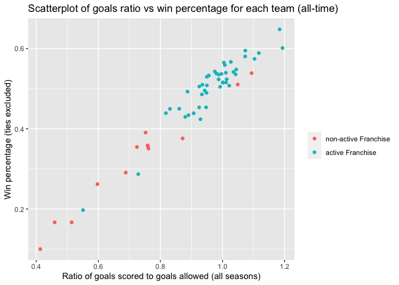
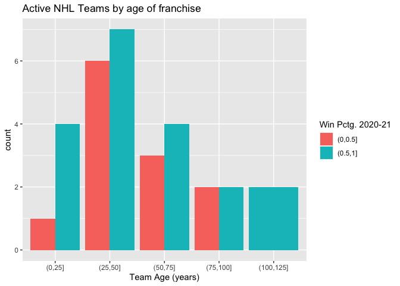
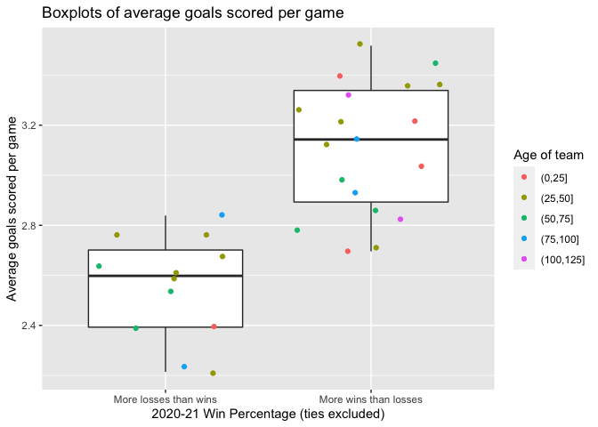
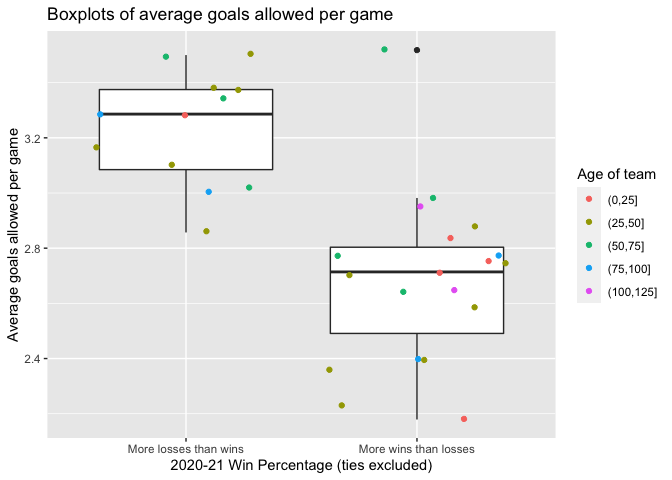
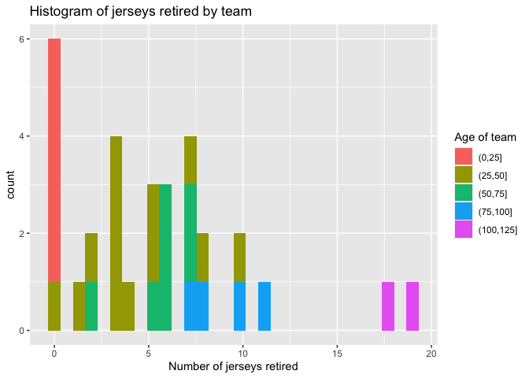
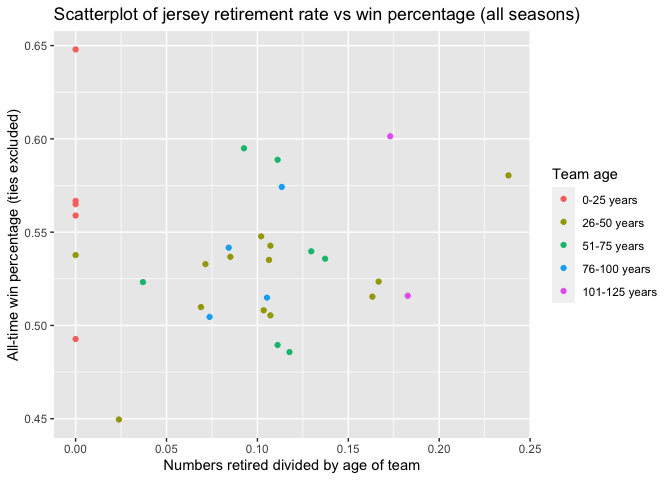

`getNHL()` API function
================
David Arthur
6/14/2021

-   [Introduction](#introduction)
-   [Necessary packages](#necessary-packages)
-   [How to use `getNHL()`](#how-to-use-getnhl)
-   [Exploratory Data Analysis](#exploratory-data-analysis)
    -   [Contingency tables and plots](#contingency-tables-and-plots)
    -   [Numeric summaries](#numeric-summaries)

## Introduction

This vignette illustrates how to use `getNHL()` to get and analyze
information about NHL teams and players from several API endpoints.

## Necessary packages

The following packages must be installed and loaded to use the functions
in this vignette.

``` r
library(hablar)
library(tidyverse)
library(httr)
library(jsonlite)
library(knitr)
library(DT)
library(XML)
library(xml2)
library(lubridate)
```

## How to use `getNHL()`

The `getNHL()` function demonstrated here retrieves data from several
different endpoints of the [NHL records
API](https://gitlab.com/dword4/nhlapi/-/blob/master/records-api.md) and
the [NHL stats
API](https://gitlab.com/dword4/nhlapi/-/blob/master/stats-api.md). For
each of the endpoints, you can retrieve information on all teams, or for
a specific team. The available endpoints are:  
\* franchise (for historic info on past/present NHL teams)  
\* totals (for all-time total statistics for each team)  
\* season (for each team’s season records)  
\* goalie (for goalie stats)  
\* skater (for skater stats)  
\* detail (for details about each franchise, such as coach/captain
history, retired jerseys, etc.)  
\* stats (for statistics from specific season)

As shown below, the syntax of the function is
`getNHL(endpoint, team = NULL)`. If you don’t request a specific team,
records for all teams will be returned. To specify a team, you can enter
all or part of the team name, or the team ID from the table below. If
your team name isn’t specific enough (e.g. “New York”), you will be
asked to try again.

|  id | Name                  |
|----:|:----------------------|
|   1 | Montréal Canadiens    |
|   2 | Montreal Wanderers    |
|   3 | St. Louis Eagles      |
|   4 | Hamilton Tigers       |
|   5 | Toronto Maple Leafs   |
|   6 | Boston Bruins         |
|   7 | Montreal Maroons      |
|   8 | Brooklyn Americans    |
|   9 | Philadelphia Quakers  |
|  10 | New York Rangers      |
|  11 | Chicago Blackhawks    |
|  12 | Detroit Red Wings     |
|  13 | Cleveland Barons      |
|  14 | Los Angeles Kings     |
|  15 | Dallas Stars          |
|  16 | Philadelphia Flyers   |
|  17 | Pittsburgh Penguins   |
|  18 | St. Louis Blues       |
|  19 | Buffalo Sabres        |
|  20 | Vancouver Canucks     |
|  21 | Calgary Flames        |
|  22 | New York Islanders    |
|  23 | New Jersey Devils     |
|  24 | Washington Capitals   |
|  25 | Edmonton Oilers       |
|  26 | Carolina Hurricanes   |
|  27 | Colorado Avalanche    |
|  28 | Arizona Coyotes       |
|  29 | San Jose Sharks       |
|  30 | Ottawa Senators       |
|  31 | Tampa Bay Lightning   |
|  32 | Anaheim Ducks         |
|  33 | Florida Panthers      |
|  34 | Nashville Predators   |
|  35 | Winnipeg Jets         |
|  36 | Columbus Blue Jackets |
|  37 | Minnesota Wild        |
|  38 | Vegas Golden Knights  |
|  39 | Seattle Kraken        |

You can enter the id or part/all of the team name

Examples of use of function with and without specific team request:

``` r
getNHL("franchise")
```

    ## # A tibble: 39 x 8
    ##       id firstSeasonId fullName  lastSeasonId
    ##    <int>         <int> <chr>            <int>
    ##  1     1      19171918 Montréal…           NA
    ##  2     2      19171918 Montreal…     19171918
    ##  3     3      19171918 St. Loui…     19341935
    ##  4     4      19191920 Hamilton…     19241925
    ##  5     5      19171918 Toronto …           NA
    ##  6     6      19241925 Boston B…           NA
    ##  7     7      19241925 Montreal…     19371938
    ##  8     8      19251926 Brooklyn…     19411942
    ##  9     9      19251926 Philadel…     19301931
    ## 10    10      19261927 New York…           NA
    ## # … with 29 more rows, and 4 more variables:
    ## #   mostRecentTeamId <int>,
    ## #   teamAbbrev <chr>, teamCommonName <chr>,
    ## #   teamPlaceName <chr>

``` r
getNHL("totals")
```

    ## # A tibble: 105 x 30
    ##    teamId teamName         id activeFranchise
    ##     <int> <chr>         <int> <fct>          
    ##  1      1 New Jersey D…     1 1              
    ##  2      1 New Jersey D…     2 1              
    ##  3      2 New York Isl…     3 1              
    ##  4      2 New York Isl…     4 1              
    ##  5      3 New York Ran…     5 1              
    ##  6      3 New York Ran…     6 1              
    ##  7      4 Philadelphia…     7 1              
    ##  8      4 Philadelphia…     8 1              
    ##  9      5 Pittsburgh P…     9 1              
    ## 10      5 Pittsburgh P…    10 1              
    ## # … with 95 more rows, and 26 more
    ## #   variables: firstSeasonId <int>,
    ## #   franchiseId <int>, gameTypeId <int>,
    ## #   gamesPlayed <int>, goalsAgainst <int>,
    ## #   goalsFor <int>, homeLosses <int>,
    ## #   homeOvertimeLosses <int>,
    ## #   homeTies <int>, homeWins <int>,
    ## #   lastSeasonId <int>, losses <int>,
    ## #   overtimeLosses <int>,
    ## #   penaltyMinutes <int>, pointPctg <dbl>,
    ## #   points <int>, roadLosses <int>,
    ## #   roadOvertimeLosses <int>,
    ## #   roadTies <int>, roadWins <int>,
    ## #   shootoutLosses <int>,
    ## #   shootoutWins <int>, shutouts <int>,
    ## #   ties <int>, triCode <chr>, wins <int>

``` r
getNHL("season", "Hurricanes")
```

    ## # A tibble: 1 x 57
    ##      id franchiseId franchiseName fewestGoals
    ##   <int>       <int> <chr>               <int>
    ## 1    12          26 Carolina Hur…         171
    ## # … with 53 more variables:
    ## #   fewestGoalsAgainst <int>,
    ## #   fewestGoalsAgainstSeasons <chr>,
    ## #   fewestGoalsSeasons <chr>,
    ## #   fewestLosses <int>,
    ## #   fewestLossesSeasons <chr>,
    ## #   fewestPoints <int>,
    ## #   fewestPointsSeasons <chr>,
    ## #   fewestTies <int>,
    ## #   fewestTiesSeasons <chr>,
    ## #   fewestWins <int>,
    ## #   fewestWinsSeasons <chr>,
    ## #   homeLossStreak <int>,
    ## #   homeLossStreakDates <chr>,
    ## #   homePointStreak <int>,
    ## #   homePointStreakDates <chr>,
    ## #   homeWinStreak <int>,
    ## #   homeWinStreakDates <chr>,
    ## #   homeWinlessStreak <int>,
    ## #   homeWinlessStreakDates <chr>,
    ## #   lossStreak <int>, lossStreakDates <chr>,
    ## #   mostGameGoals <int>,
    ## #   mostGameGoalsDates <chr>,
    ## #   mostGoals <int>, mostGoalsAgainst <int>,
    ## #   mostGoalsAgainstSeasons <chr>,
    ## #   mostGoalsSeasons <chr>,
    ## #   mostLosses <int>,
    ## #   mostLossesSeasons <chr>,
    ## #   mostPenaltyMinutes <int>,
    ## #   mostPenaltyMinutesSeasons <chr>,
    ## #   mostPoints <int>,
    ## #   mostPointsSeasons <chr>,
    ## #   mostShutouts <int>,
    ## #   mostShutoutsSeasons <chr>,
    ## #   mostTies <int>, mostTiesSeasons <chr>,
    ## #   mostWins <int>, mostWinsSeasons <chr>,
    ## #   pointStreak <int>,
    ## #   pointStreakDates <chr>,
    ## #   roadLossStreak <int>,
    ## #   roadLossStreakDates <chr>,
    ## #   roadPointStreak <int>,
    ## #   roadPointStreakDates <chr>,
    ## #   roadWinStreak <int>,
    ## #   roadWinStreakDates <chr>,
    ## #   roadWinlessStreak <int>,
    ## #   roadWinlessStreakDates <chr>,
    ## #   winStreak <int>, winStreakDates <chr>,
    ## #   winlessStreak <int>,
    ## #   winlessStreakDates <chr>

``` r
getNHL("goalie", 26)
```

    ## # A tibble: 38 x 29
    ##    firstName lastName       id activePlayer
    ##    <chr>     <chr>       <int> <lgl>       
    ##  1 Tom       Barrasso      336 FALSE       
    ##  2 Richard   Brodeur       363 FALSE       
    ##  3 Sean      Burke         369 FALSE       
    ##  4 Mark      Fitzpatrick   411 FALSE       
    ##  5 John      Garrett       425 FALSE       
    ##  6 Mario     Gosselin      430 FALSE       
    ##  7 Pat       Jablonski     470 FALSE       
    ##  8 Mike      Liut          490 FALSE       
    ##  9 Kirk      McLean        508 FALSE       
    ## 10 Greg      Millen        525 FALSE       
    ## # … with 28 more rows, and 25 more
    ## #   variables: franchiseId <int>,
    ## #   franchiseName <chr>, gameTypeId <int>,
    ## #   gamesPlayed <int>, losses <int>,
    ## #   mostGoalsAgainstDates <chr>,
    ## #   mostGoalsAgainstOneGame <int>,
    ## #   mostSavesDates <chr>,
    ## #   mostSavesOneGame <int>,
    ## #   mostShotsAgainstDates <chr>,
    ## #   mostShotsAgainstOneGame <int>,
    ## #   mostShutoutsOneSeason <int>,
    ## #   mostShutoutsSeasonIds <chr>,
    ## #   mostWinsOneSeason <int>,
    ## #   mostWinsSeasonIds <chr>,
    ## #   overtimeLosses <int>, playerId <int>,
    ## #   positionCode <chr>,
    ## #   rookieGamesPlayed <int>,
    ## #   rookieShutouts <int>, rookieWins <int>,
    ## #   seasons <int>, shutouts <int>,
    ## #   ties <int>, wins <int>

``` r
getNHL("skater", "Carolina")
```

    ## # A tibble: 487 x 31
    ##    firstName lastName        id activePlayer
    ##    <chr>     <chr>        <int> <lgl>       
    ##  1 Jim       Agnew        17239 FALSE       
    ##  2 Mike      Antonovich   17418 FALSE       
    ##  3 Fred      Arthur       17543 FALSE       
    ##  4 Jergus    Baca         17703 FALSE       
    ##  5 Reid      Bailey       17728 FALSE       
    ##  6 Bob       Bodak        18169 FALSE       
    ##  7 Charlie   Bourgeois    18233 FALSE       
    ##  8 Greg      Britz        18288 FALSE       
    ##  9 Jeff      Brownschidle 18328 FALSE       
    ## 10 Shane     Churla       18799 FALSE       
    ## # … with 477 more rows, and 27 more
    ## #   variables: assists <int>,
    ## #   franchiseId <int>, franchiseName <chr>,
    ## #   gameTypeId <int>, gamesPlayed <int>,
    ## #   goals <int>, mostAssistsGameDates <chr>,
    ## #   mostAssistsOneGame <int>,
    ## #   mostAssistsOneSeason <int>,
    ## #   mostAssistsSeasonIds <chr>,
    ## #   mostGoalsGameDates <chr>,
    ## #   mostGoalsOneGame <int>,
    ## #   mostGoalsOneSeason <int>,
    ## #   mostGoalsSeasonIds <chr>,
    ## #   mostPenaltyMinutesOneSeason <int>,
    ## #   mostPenaltyMinutesSeasonIds <chr>,
    ## #   mostPointsGameDates <chr>,
    ## #   mostPointsOneGame <int>,
    ## #   mostPointsOneSeason <int>,
    ## #   mostPointsSeasonIds <chr>,
    ## #   penaltyMinutes <int>, playerId <int>,
    ## #   points <int>, positionCode <chr>,
    ## #   rookieGamesPlayed <int>,
    ## #   rookiePoints <int>, seasons <int>

``` r
getNHL("detail")
```

    ## # A tibble: 39 x 13
    ##    teamFullName     id active captainHistory 
    ##    <chr>         <int> <lgl>  <chr>          
    ##  1 Montréal Can…     1 TRUE   Shea Weber: 20…
    ##  2 Montreal Wan…     2 FALSE  <NA>           
    ##  3 St. Louis Ea…     3 FALSE  <NA>           
    ##  4 Hamilton Tig…     4 FALSE  <NA>           
    ##  5 Toronto Mapl…     5 TRUE   John Tavares: …
    ##  6 Boston Bruins     6 TRUE   Patrice Berger…
    ##  7 Montreal Mar…     7 FALSE  <NA>           
    ##  8 Brooklyn Ame…     8 FALSE  <NA>           
    ##  9 Philadelphia…     9 FALSE  <NA>           
    ## 10 New York Ran…    10 TRUE   (No Captain): …
    ## # … with 29 more rows, and 9 more variables:
    ## #   coachingHistory <chr>,
    ## #   dateAwarded <date>, directoryUrl <chr>,
    ## #   firstSeasonId <int>,
    ## #   generalManagerHistory <chr>,
    ## #   heroImageUrl <chr>,
    ## #   mostRecentTeamId <int>,
    ## #   retiredNumbersSummary <chr>,
    ## #   teamAbbrev <chr>

``` r
getNHL("stats")
```

    ## # A tibble: 31 x 59
    ##       id name        wins winsRank evGGARatio
    ##    <int> <chr>      <dbl> <chr>         <dbl>
    ##  1     1 New Jerse…    19 28th          0.829
    ##  2     2 New York …    32 12th          1.24 
    ##  3     3 New York …    27 16th          1.09 
    ##  4     4 Philadelp…    25 18th          0.806
    ##  5     5 Pittsburg…    37 4th           1.27 
    ##  6     6 Boston Br…    33 11th          1.14 
    ##  7     7 Buffalo S…    15 31st          0.635
    ##  8     8 Montréal …    24 19th          1.03 
    ##  9     9 Ottawa Se…    23 23rd          0.803
    ## 10    10 Toronto M…    35 8th           1.38 
    ## # … with 21 more rows, and 54 more
    ## #   variables: evGGARatioRank <chr>,
    ## #   faceOffsLost <dbl>,
    ## #   faceOffsLostRank <chr>,
    ## #   faceOffsTaken <dbl>,
    ## #   faceOffsTakenRank <chr>,
    ## #   faceOffsWon <dbl>,
    ## #   faceOffsWonRank <chr>,
    ## #   faceOffWinPercentage <dbl>,
    ## #   faceOffWinPercentageRank <chr>,
    ## #   gamesPlayed <int>,
    ## #   goalsAgainstPerGame <dbl>,
    ## #   goalsAgainstPerGameRank <chr>,
    ## #   goalsPerGame <dbl>,
    ## #   goalsPerGameRank <chr>, losses <dbl>,
    ## #   lossesRank <chr>, ot <dbl>,
    ## #   otRank <chr>,
    ## #   penaltyKillOpportunitiesRank <chr>,
    ## #   penaltyKillPercentage <dbl>,
    ## #   penaltyKillPercentageRank <chr>,
    ## #   powerPlayGoals <dbl>,
    ## #   powerPlayGoalsRank <chr>,
    ## #   powerPlayGoalsAgainst <dbl>,
    ## #   powerPlayGoalsAgainstRank <chr>,
    ## #   powerPlayOpportunities <dbl>,
    ## #   powerPlayOpportunitiesRank <chr>,
    ## #   powerPlayPercentage <dbl>,
    ## #   powerPlayPercentageRank <chr>,
    ## #   ptPctg <dbl>, ptPctgRank <chr>,
    ## #   pts <dbl>, ptsRank <chr>,
    ## #   savePctg <dbl>, savePctRank <chr>,
    ## #   shootingPctg <dbl>,
    ## #   shootingPctRank <chr>,
    ## #   shotsAllowed <dbl>,
    ## #   shotsAllowedRank <chr>,
    ## #   shotsPerGame <dbl>,
    ## #   shotsPerGameRank <chr>,
    ## #   winLeadFirstPer <dbl>,
    ## #   winLeadFirstPerRank <chr>,
    ## #   winLeadSecondPer <dbl>,
    ## #   winLeadSecondPerRank <chr>,
    ## #   winOppScoreFirst <dbl>,
    ## #   winOppScoreFirstRank <chr>,
    ## #   winOutshootOpp <dbl>,
    ## #   winOutshootOppRank <chr>,
    ## #   winOutshotByOpp <dbl>,
    ## #   winOutshotByOppRank <chr>,
    ## #   winScoreFirst <dbl>,
    ## #   winScoreFirstRank <chr>, link <chr>

## Exploratory Data Analysis

We will now use the `getNHL()` function to retrieve and analyze data
from the NHL APIs.

Create new variables: Win percentage (regular season only, ties
excluded) and ratio of Goals For to Goals Against, and create
categorical versions of each:

``` r
totalsNew <- totals %>% filter(gameTypeId == 2) %>%
  mutate(WLPctg = wins/(wins + losses)) %>%
  mutate(WLPctgCat = cut(WLPctg, c(0, 0.5, 1.0))) %>%
  mutate(goalsRatio = goalsFor / goalsAgainst) %>%
  mutate(goalsRatioCat = cut(goalsRatio, c(0, 1.0, 20))) %>%
  select(teamName, franchiseId, starts_with("WLPctg"), starts_with("goalsRatio"), activeFranchise)  
```

### Contingency tables and plots

Create contingency table and scatter plot comparing win percentage to
goals ratio:

``` r
tableGoalsWL <- table(totalsNew$goalsRatioCat, totalsNew$WLPctgCat)
dimnames(tableGoalsWL)[[1]] <- c("Scored fewer total goals than gave up", "Scored more total goals than gave up")
kable(tableGoalsWL, col.names = c("Fewer wins than losses", "More wins than losses"), caption = "Count of teams with winning record vs. count of teams with losing record (all-time) by goals for/against ratio", row.names = TRUE)
```

|                                       | Fewer wins than losses | More wins than losses |
|:--------------------------------------|-----------------------:|----------------------:|
| Scored fewer total goals than gave up |                     26 |                    11 |
| Scored more total goals than gave up  |                      0 |                    20 |

Count of teams with winning record vs. count of teams with losing record
(all-time) by goals for/against ratio

``` r
gTotals <- ggplot(data = totalsNew)
gTotals + geom_point(aes(x = goalsRatio, y = WLPctg, col = activeFranchise)) +
  labs(title = "Scatterplot of goals ratio vs win percentage for each team (all-time)", x = "Ratio of goals scored to goals allowed (all seasons)", y = "Win percentage (ties excluded)") +
  scale_color_discrete(name = "", labels = c("non-active Franchise", "active Franchise"))
```

<!-- -->

Create variables for count of retired jerseys and age of team, plus rate
of jersey retirement (number retired / age of team). Also, categorical
versions of each:

``` r
detailReduced <- detail %>%
  select(id, teamFullName, retiredNumbersSummary, firstSeasonId) %>%
  mutate(numberRetiredJerseys = str_count(retiredNumbersSummary, "–")) %>%
  mutate(numberRetiredJerseys = ifelse(str_detect(retiredNumbersSummary, "In Honor of"), numberRetiredJerseys - 1, numberRetiredJerseys)) %>%
  mutate(numberRetiredJerseys = ifelse(is.na(numberRetiredJerseys), 0, numberRetiredJerseys)) %>%
  convert(chr(firstSeasonId)) %>%
  mutate(firstSeasonId = str_trunc(firstSeasonId, 4, ellipsis = "")) %>%
  convert(num(firstSeasonId)) %>%
  mutate(teamAge = 2021 - firstSeasonId) %>%
  mutate(jerseyRetirementRate = numberRetiredJerseys / teamAge) %>%
  mutate(jerseyRetirementRate = replace_na(jerseyRetirementRate, 0))
statsReduced <- stats %>%
  select(name, wins, losses, gamesPlayed, goalsPerGame, goalsAgainstPerGame) %>%
  mutate(seasonWLPctg = wins / (wins + losses)) %>%
  mutate(seasonWLPctgCat = cut(seasonWLPctg, c(0, 0.5, 1.0)))
totalsDetail <- left_join(totalsNew, detailReduced, by = c("teamName" = "teamFullName"))
totalsDetailStats <- inner_join(totalsDetail, statsReduced, by = c("teamName" = "name")) %>%
  mutate(ageCat = cut(teamAge, c(0, 25, 50, 75, 100, 125)))
```

``` r
tableAgeWL <- table(totalsDetailStats$ageCat, totalsDetailStats$seasonWLPctgCat)
dimnames(tableAgeWL)[[1]] <- c("0-25 years old", "26-50 years old", "51-75 years old", "76-100 years old", "101-125 years old")
names(dimnames(tableAgeWL)) <- c("Team Age", "")
kable(tableAgeWL, col.names = c("Fewer wins than losses", "More wins than losses"), caption = "Count of teams with winning record vs. count of teams with losing record for 2020-21 season by age of team", row.names = TRUE)
```

|                   | Fewer wins than losses | More wins than losses |
|:------------------|-----------------------:|----------------------:|
| 0-25 years old    |                      1 |                     4 |
| 26-50 years old   |                      6 |                     7 |
| 51-75 years old   |                      3 |                     4 |
| 76-100 years old  |                      2 |                     2 |
| 101-125 years old |                      0 |                     2 |

Count of teams with winning record vs. count of teams with losing record
for 2020-21 season by age of team

``` r
gWins <- ggplot(data = totalsDetailStats)
gWins + geom_bar(aes(x = ageCat, fill = seasonWLPctgCat), position = "dodge") +
  labs(title = "Active NHL Teams by age of franchise", x = "Team Age (years)", fill = "Win Pctg. 2020-21")
```

<!-- -->

``` r
gWins + geom_boxplot(aes(x = seasonWLPctgCat, y = goalsPerGame)) +
  geom_point(aes(x = seasonWLPctgCat, y = goalsPerGame, col = ageCat), position = "jitter") +
  labs(title = "Boxplots of average goals scored per game", x = "2020-21 Win Percentage (ties excluded)", y = "Average goals scored per game", col = "Age of team") +
  scale_x_discrete(labels = c("More losses than wins", "More wins than losses"))
```

<!-- -->

``` r
gWins + geom_boxplot(aes(x = seasonWLPctgCat, y = goalsAgainstPerGame)) +
  geom_point(aes(x = seasonWLPctgCat, y = goalsAgainstPerGame, col = ageCat), position = "jitter") +
  labs(title = "Boxplots of average goals allowed per game", x = "2020-21 Win Percentage (ties excluded)", y = "Average goals allowed per game", col = "Age of team") +
  scale_x_discrete(labels = c("More losses than wins", "More wins than losses"))
```

<!-- -->

``` r
gWins + geom_histogram(aes(x = numberRetiredJerseys, fill = ageCat)) +
  labs(title = "Histogram of jerseys retired by team", x  = "Number of jerseys retired", fill = "Age of team")
```

<!-- -->

``` r
gWins + geom_point(aes(x = jerseyRetirementRate, y = WLPctg, col = ageCat)) +
  labs(title = "Scatterplot of jersey retirement rate vs win percentage (all seasons)", x = "Numbers retired divided by age of team", y = "All-time win percentage (ties excluded)", col = "Age of team") +
  scale_color_discrete(name = "Team age", labels = c("0-25 years", "26-50 years", "51-75 years", "76-100 years", "101-125 years"))
```

<!-- -->

### Numeric summaries

``` r
winSummary <- totalsDetailStats %>%
  group_by(ageCat) %>%
  summarise(min = min(wins), med = median (wins), max = max(wins), sd = sd(wins))
kable(winSummary, col.names = c("Team age range (years)", "Minimum wins", "Median wins", "Maximum wins", "Standard deviation of wins"), caption = "Numeric summary of 2020-21 wins per team, grouped by team age", digits = 2)
```

| Team age range (years) | Minimum wins | Median wins | Maximum wins | Standard deviation of wins |
|:-----------------------|-------------:|------------:|-------------:|---------------------------:|
| (0,25\]                |           18 |        31.0 |           40 |                       8.17 |
| (25,50\]               |           17 |        32.0 |           39 |                       7.81 |
| (50,75\]               |           15 |        23.0 |           37 |                       6.70 |
| (75,100\]              |           19 |        25.5 |           33 |                       5.85 |
| (100,125\]             |           24 |        29.5 |           35 |                       7.78 |

Numeric summary of 2020-21 wins per team, grouped by team age

``` r
goalRatioSummary <- totalsDetailStats %>%
  group_by(WLPctgCat) %>%
  summarise(min = min(goalsRatio), med = median (goalsRatio), max = max(goalsRatio), sd = sd(goalsRatio))
kable(goalRatioSummary, col.names = c("Win percentage range (excluding ties)", "Minimum goal ratio", "Median goal ratio", "Maximum goal ratio", "Standard deviation of goal ratio"), caption = "Numeric summary of ratio of goals scored to goals allowed (all seasons), grouped by winning record vs losing record (all seasons)", digits = 2)
```

| Win percentage range (excluding ties) | Minimum goal ratio | Median goal ratio | Maximum goal ratio | Standard deviation of goal ratio |
|:--------------------------------------|-------------------:|------------------:|-------------------:|---------------------------------:|
| (0,0.5\]                              |               0.83 |              0.91 |               0.95 |                             0.05 |
| (0.5,1\]                              |               0.93 |              1.01 |               1.19 |                             0.07 |

Numeric summary of ratio of goals scored to goals allowed (all seasons),
grouped by winning record vs losing record (all seasons)
